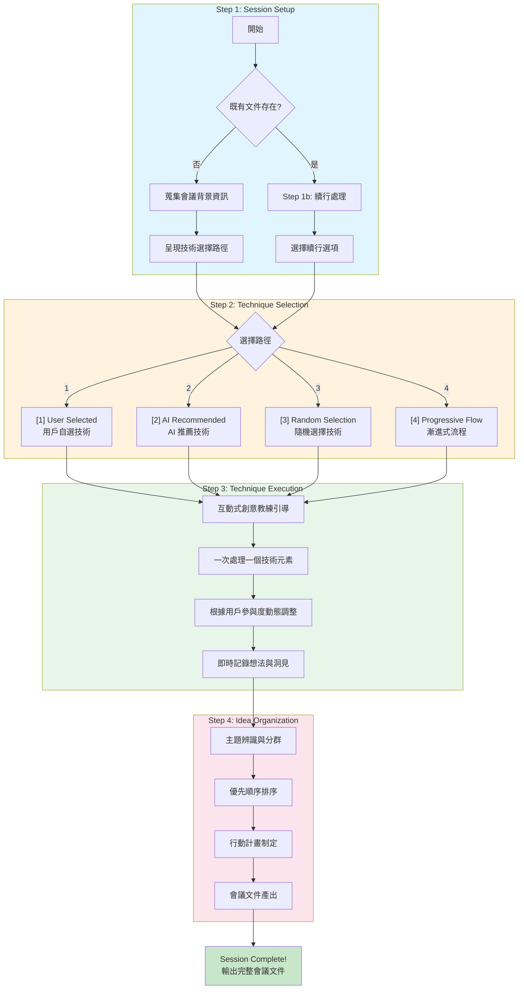
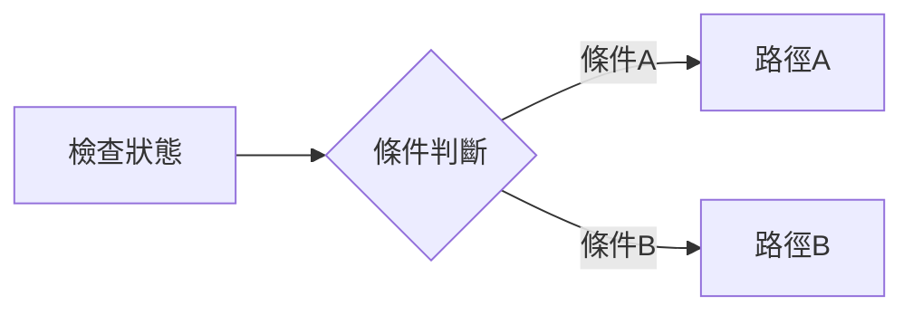
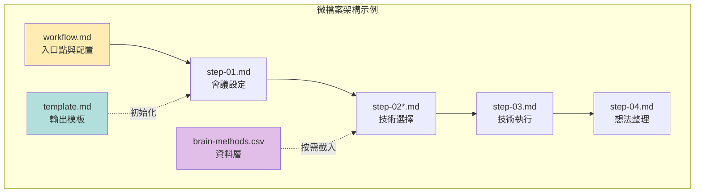
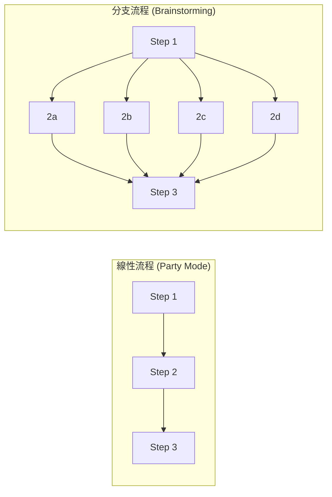
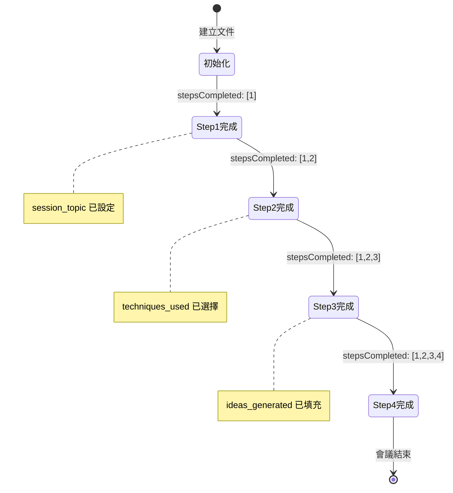
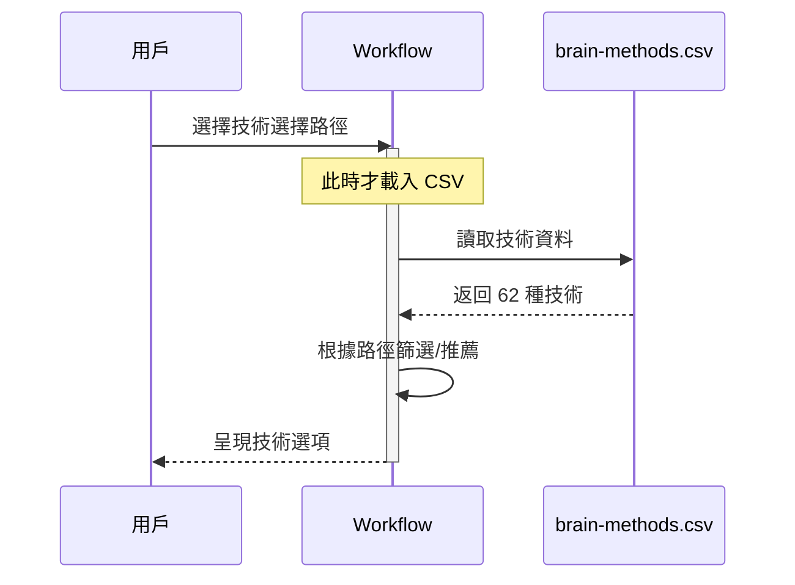
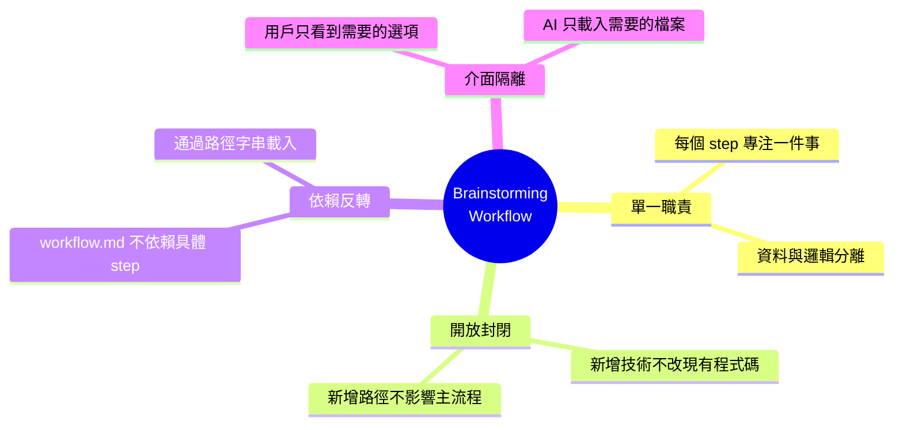

# Brainstorming Workflow 完整分析

> 📅 分析日期：2025-12-29
> 📦 專案：bmad-docs
> 👤 分析者：Paige (Technical Writer)

## 概述

Brainstorming Workflow 是 BMAD 框架中的互動式創意促進工作流程，提供結構化的腦力激盪會議引導。它結合了 36+ 種創意技術、多種選擇路徑、以及完整的會議文件產出機制，讓 AI 能夠作為專業的創意引導師協助用戶進行創新思維探索。

---

## 檔案結構總覽

```
_bmad/
└── core/
    └── workflows/brainstorming/
        ├── workflow.md                              # [主工作流程定義]
        ├── template.md                              # [輸出文件模板]
        ├── brain-methods.csv                        # [創意技術資料庫]
        └── steps/
            ├── step-01-session-setup.md             # [步驟1: 會議設定與初始化]
            ├── step-01b-continue.md                 # [步驟1b: 工作流程續行]
            ├── step-02a-user-selected.md            # [步驟2a: 用戶自選技術]
            ├── step-02b-ai-recommended.md           # [步驟2b: AI推薦技術]
            ├── step-02c-random-selection.md         # [步驟2c: 隨機選擇技術]
            ├── step-02d-progressive-flow.md         # [步驟2d: 漸進式流程]
            ├── step-03-technique-execution.md       # [步驟3: 技術執行與引導]
            └── step-04-idea-organization.md         # [步驟4: 想法整理與行動規劃]
```

---

## 深度分析文件索引

| 文件 | 職責 | 深度分析連結 |
|------|------|--------------|
| `workflow.md` | 主工作流程定義與架構 | [→ workflow-analysis.md](./workflow-analysis.md) |
| `step-01-session-setup.md` | 會議設定與續行偵測 | [→ step-01-analysis.md](./step-01-analysis.md) |
| `step-01b-continue.md` | 工作流程續行處理 | [→ step-01b-analysis.md](./step-01b-analysis.md) |
| `step-02a-user-selected.md` | 用戶自選技術路徑 | [→ step-02a-analysis.md](./step-02a-analysis.md) |
| `step-02b-ai-recommended.md` | AI 推薦技術路徑 | [→ step-02b-analysis.md](./step-02b-analysis.md) |
| `step-02c-random-selection.md` | 隨機選擇技術路徑 | [→ step-02c-analysis.md](./step-02c-analysis.md) |
| `step-02d-progressive-flow.md` | 漸進式流程路徑 | [→ step-02d-analysis.md](./step-02d-analysis.md) |
| `step-03-technique-execution.md` | 互動式技術執行 | [→ step-03-analysis.md](./step-03-analysis.md) |
| `step-04-idea-organization.md` | 想法整理與行動規劃 | [→ step-04-analysis.md](./step-04-analysis.md) |
| `brain-methods.csv` | 創意技術資料庫 | [→ brain-methods-analysis.md](./brain-methods-analysis.md) |
| `template.md` | 會議輸出文件模板 | [→ template-analysis.md](./template-analysis.md) |

---

## 整體流程圖



### 流程圖技術概念說明

上述 Mermaid 流程圖展示了 Brainstorming Workflow 的核心設計模式：

**1. 決策節點（Decision Nodes）**

菱形節點（如 `{既有文件存在?}`）代表條件分支，這是實現**續行機制**的關鍵：



**2. 子圖分組（Subgraph Grouping）**

使用 `subgraph` 將相關步驟視覺化分組，體現**微檔案架構**的職責分離原則。

**3. 匯流設計（Convergence Pattern）**

Step 2 的四條路徑最終匯流至 Step 3，這確保了無論選擇哪種技術選擇方式，後續流程都保持一致。

---

## 關鍵設計模式

### 1. Micro-file Architecture（微檔案架構）

每個步驟獨立成檔，遵循單一職責原則：

- 主工作流程 (`workflow.md`) 定義整體架構與初始化
- 各步驟檔案 (`step-*.md`) 專注於特定階段任務
- 資料檔案 (`brain-methods.csv`) 獨立於邏輯



**實際範例**：當 AI 需要執行 Step 2a（用戶自選技術）時，只載入 `step-02a-user-selected.md`，而不需要載入其他三個 Step 2 變體。這種設計減少了上下文負擔。

### 2. Branching Flow（分支流程）

與 Party Mode 的線性流程不同，Brainstorming 採用分支路徑設計：

- Step 2 提供四種技術選擇路徑
- 每種路徑最終匯流到 Step 3
- 允許用戶根據偏好選擇不同體驗



### 3. Frontmatter State Tracking（前置資料狀態追蹤）

使用 YAML frontmatter 追蹤完整會議狀態：

```yaml
stepsCompleted: [1, 2, 3]
session_topic: '產品創新'
session_goals: '發掘新功能點子'
selected_approach: 'ai-recommended'
techniques_used: ['SCAMPER', 'What If Scenarios']
ideas_generated: []
```

**狀態演進範例**：



### 4. Continuation Detection（續行偵測）

智慧偵測既有工作流程狀態：

- 檢查輸出文件是否存在
- 分析 frontmatter 中的 `stepsCompleted`
- 自動路由至 `step-01b-continue.md` 處理續行邏輯

**偵測邏輯範例**：

```
if 文件存在:
    讀取 frontmatter
    if stepsCompleted 包含 [1,2,3,4]:
        → 會議已完成，提供檢視/新會議選項
    else if stepsCompleted 包含 [1,2,3]:
        → 從 Step 4 繼續
    else if stepsCompleted 包含 [1,2]:
        → 從 Step 3 繼續
    else:
        → 從 Step 2 繼續
else:
    → 新會議流程
```

### 5. On-Demand Resource Loading（按需資源載入）

創意技術 CSV 僅在需要時載入：

- 避免初始化時的大量資源消耗
- 根據選擇路徑載入相關技術
- 支援分類瀏覽與隨機選擇



### 6. Interactive Coaching Pattern（互動教練模式）

Step 3 採用真正的對話式引導：

- 一次處理一個技術元素
- 根據用戶回應動態調整
- 建立在用戶想法之上深化探索
- 支援隨時跳到下一個技術

**教練互動範例**：

```
AI: "讓我們用 SCAMPER 的 'Substitute' 來探索。
     在你的產品中，有什麼元素可以被替換？"

User: "也許可以把實體按鈕換成語音控制"

AI: "很棒的想法！語音控制確實能提升便利性。
     讓我們深入探索：如果所有操作都改為語音，
     會帶來什麼新的可能性？"

     [建立在用戶想法之上，而非跳到下一個問題]
```

---

## 創意技術資料庫概覽

Brain Methods CSV 包含 62 種創意技術，分為 9 個類別：

| 類別 | 技術數量 | 代表技術 | 適用場景 |
|------|----------|----------|----------|
| Collaborative | 5 | Yes And Building, Brain Writing | 團隊協作、多元觀點 |
| Creative | 11 | What If, Analogical Thinking | 創新思維、打破框架 |
| Deep | 8 | Five Whys, Morphological Analysis | 深度分析、根因探索 |
| Introspective Delight | 6 | Inner Child, Values Archaeology | 內在探索、價值澄清 |
| Structured | 7 | SCAMPER, Six Thinking Hats | 系統化思考、結構分析 |
| Theatrical | 6 | Time Travel Talk Show, Alien Anthropologist | 創意角色扮演 |
| Wild | 8 | Chaos Engineering, Pirate Code | 極端思維、突破邊界 |
| Biomimetic | 3 | Nature's Solutions, Ecosystem Thinking | 仿生思維 |
| Quantum | 3 | Observer Effect, Entanglement Thinking | 量子啟發思維 |
| Cultural | 4 | Indigenous Wisdom, Fusion Cuisine | 文化跨界 |

---

## 與 Party Mode 的比較

| 特性 | Party Mode | Brainstorming |
|------|------------|---------------|
| **核心目的** | 多代理對話協調 | 創意技術引導 |
| **流程結構** | 線性（3步驟） | 分支（4主步驟+4選擇路徑） |
| **人格角色** | 10個專業代理 | 單一引導師角色 |
| **資料來源** | agent-manifest.csv | brain-methods.csv |
| **互動模式** | 多代理輪流發言 | 一對一教練引導 |
| **輸出產物** | 無特定輸出 | 完整會議文件 |
| **續行機制** | 無 | step-01b-continue.md |

---

## 原始檔案路徑對照

| 分析文件 | 原始檔案相對路徑 |
|----------|------------------|
| workflow-analysis.md | `_bmad/core/workflows/brainstorming/workflow.md` |
| step-01-analysis.md | `_bmad/core/workflows/brainstorming/steps/step-01-session-setup.md` |
| step-01b-analysis.md | `_bmad/core/workflows/brainstorming/steps/step-01b-continue.md` |
| step-02a-analysis.md | `_bmad/core/workflows/brainstorming/steps/step-02a-user-selected.md` |
| step-02b-analysis.md | `_bmad/core/workflows/brainstorming/steps/step-02b-ai-recommended.md` |
| step-02c-analysis.md | `_bmad/core/workflows/brainstorming/steps/step-02c-random-selection.md` |
| step-02d-analysis.md | `_bmad/core/workflows/brainstorming/steps/step-02d-progressive-flow.md` |
| step-03-analysis.md | `_bmad/core/workflows/brainstorming/steps/step-03-technique-execution.md` |
| step-04-analysis.md | `_bmad/core/workflows/brainstorming/steps/step-04-idea-organization.md` |
| brain-methods-analysis.md | `_bmad/core/workflows/brainstorming/brain-methods.csv` |
| template-analysis.md | `_bmad/core/workflows/brainstorming/template.md` |

---

## 技術概念總結

### 核心架構概念

| 概念 | 定義 | 在本工作流程的應用 |
|------|------|-------------------|
| **微檔案架構** | 將系統分解為小型、專注、自包含的檔案 | 每個步驟獨立成檔，降低耦合度 |
| **狀態機設計** | 使用狀態追蹤系統進度與轉換 | frontmatter 追蹤 `stepsCompleted` |
| **命令模式** | 封裝請求為獨立物件 | 每個 step 檔案是一個獨立命令 |
| **策略模式** | 定義一族演算法，使其可互換 | Step 2 的四種技術選擇路徑 |

### 設計原則實踐



### 實際應用範例

**範例 1：新增第五種技術選擇路徑**

```markdown
1. 建立 steps/step-02e-expert-mode.md
2. 在 step-01-session-setup.md 加入選項 [5]
3. 無需修改 workflow.md 或其他 step
4. 系統自動支援新路徑
```

**範例 2：新增創意技術到資料庫**

```csv
# 直接在 brain-methods.csv 新增一列
creative,"Design Sprint","Google 的五天設計流程..."
```

無需修改任何程式碼，所有步驟都會自動看到新技術。

---

## 下一步

點擊上方的深度分析連結，深入了解每個檔案的詳細運作機制：

1. **[workflow-analysis.md](./workflow-analysis.md)** - 了解入口點設計
2. **[step-01-analysis.md](./step-01-analysis.md)** - 了解會議設定與續行機制
3. **[brain-methods-analysis.md](./brain-methods-analysis.md)** - 探索 62 種創意技術
