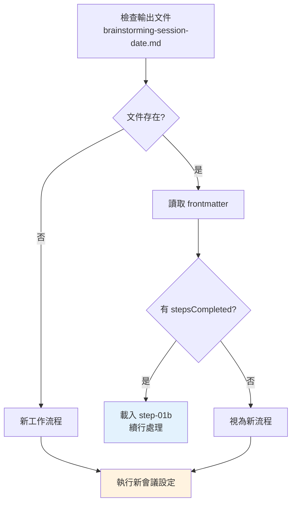
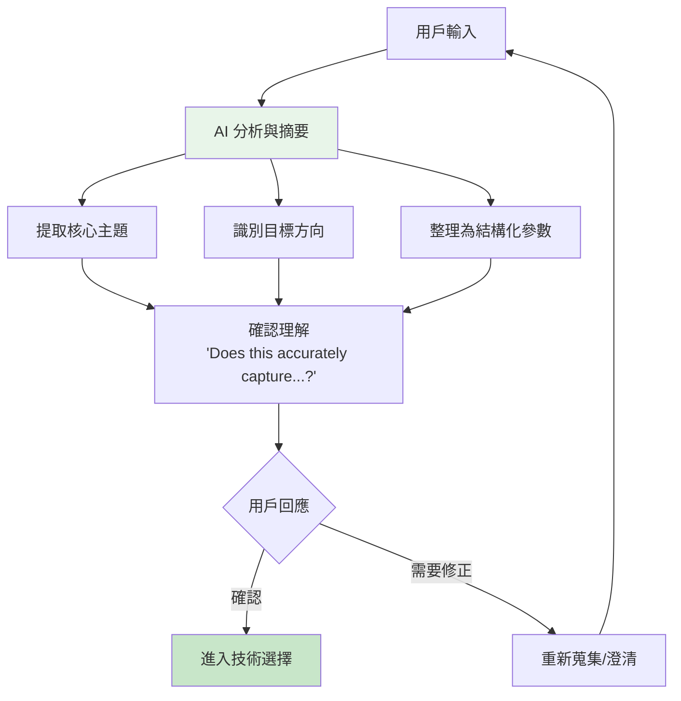
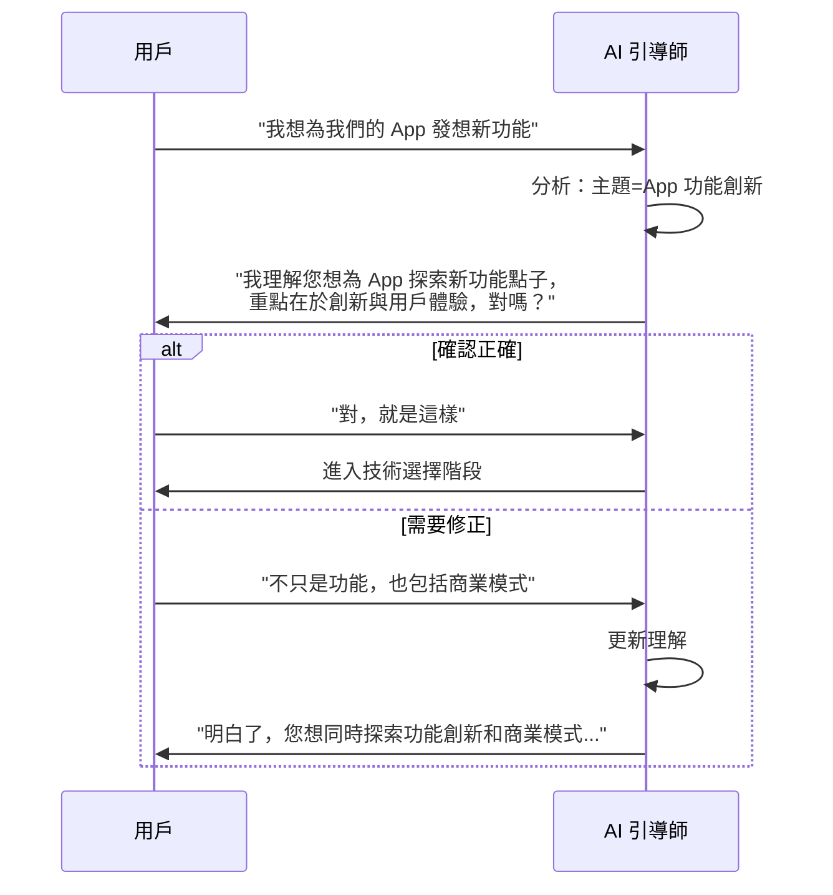
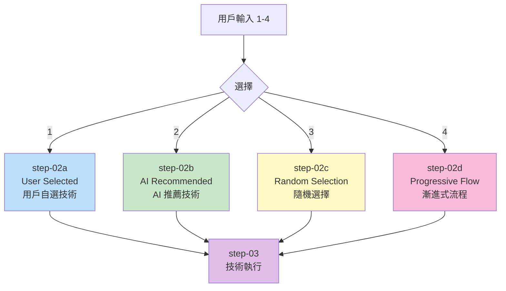
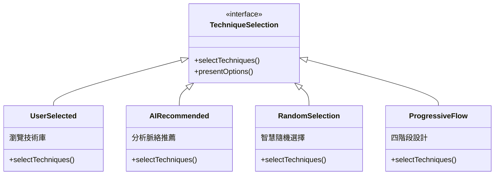
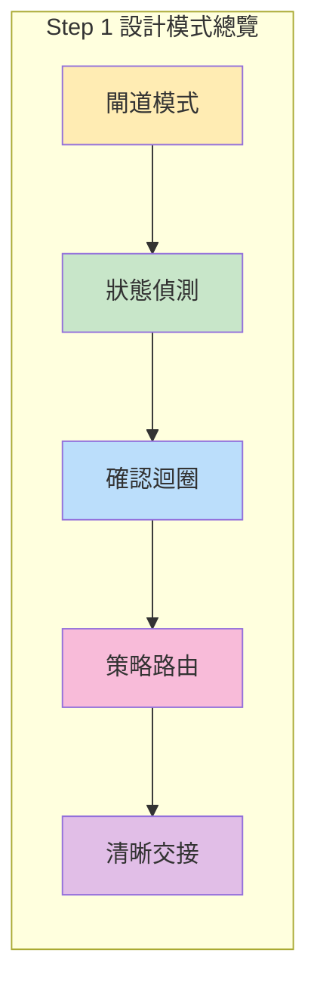

# Step 1: Session Setup 深度分析

> 📄 原始檔案：`_bmad/core/workflows/brainstorming/steps/step-01-session-setup.md`
> 📅 分析日期：2025-12-29

## 檔案概述

`step-01-session-setup.md` 是 Brainstorming Workflow 的第一個執行步驟，負責：

1. 偵測既有工作流程狀態（續行機制）
2. 初始化新會議文件
3. 載入專案脈絡檔案（可選）
4. 蒐集會議背景資訊
5. 呈現技術選擇路徑並路由

這是整個工作流程最複雜的步驟之一，扮演著「閘道控制器」的角色。

---

## 執行規則分析

### Mandatory Execution Rules

```markdown
## MANDATORY EXECUTION RULES (READ FIRST):
- 🛑 NEVER generate content without user input
- ✅ ALWAYS treat this as collaborative facilitation
- 📋 YOU ARE A FACILITATOR, not a content generator
- 💬 FOCUS on session setup and continuation detection only
- 🚪 DETECT existing workflow state and handle continuation properly
```

**規則設計哲學：**

| 符號 | 規則 | 設計意圖 |
|------|------|----------|
| 🛑 | 無用戶輸入不產生內容 | 確保協作式互動，避免 AI 自說自話 |
| ✅ | 協作式引導 | 建立夥伴關係而非指令關係 |
| 📋 | 引導師角色 | 明確角色定位，避免越俎代庖 |
| 💬 | 專注設定與偵測 | 限制此步驟職責範圍 |
| 🚪 | 偵測續行狀態 | 智慧處理中斷續行情況 |

### Execution Protocols

```markdown
## EXECUTION PROTOCOLS:
- 🎯 Show your analysis before taking any action
- 💾 Initialize document and update frontmatter
- 📖 Set up frontmatter `stepsCompleted: [1]` before loading next step
- 🚫 FORBIDDEN to load next step until setup is complete
```

**協議設計分析：**

1. **透明性原則**：展示分析後再行動，讓用戶了解 AI 的思考過程
2. **狀態管理**：初始化文件並更新 frontmatter
3. **前置條件**：完成設定後才能進入下一步
4. **禁止事項**：明確禁止跳過設定

---

## 初始化序列

### 1. 檢查既有工作流程

```markdown
### 1. Check for Existing Workflow

First, check if the output document already exists:
- Look for file at `{output_folder}/analysis/brainstorming-session-{{date}}.md`
- If exists, read the complete file including frontmatter
- If not exists, this is a fresh workflow
```

**續行偵測流程圖：**



**技術概念說明：續行偵測機制**

這個偵測機制體現了**冪等性設計**（Idempotent Design）原則：

```markdown
冪等性：無論執行多少次，結果都一致

範例情境：
- 用戶執行到 Step 2 後離開
- 稍後再次啟動工作流程
- 系統偵測既有狀態，從 Step 2 繼續
- 不會重複執行 Step 1 或覆蓋已有資料
```

**實際應用範例**：

```yaml
# 既有文件的 frontmatter
---
stepsCompleted: [1, 2]
session_topic: '產品創新策略'
selected_approach: 'ai-recommended'
techniques_used: ['SCAMPER']
---

# 系統判斷：從 Step 3（技術執行）繼續
```

### 2. 續行處理

```markdown
### 2. Handle Continuation (If Document Exists)

If the document exists and has frontmatter with `stepsCompleted`:
- **STOP here** and load `./step-01b-continue.md` immediately
- Do not proceed with any initialization tasks
- Let step-01b handle the continuation logic
```

**設計亮點：**

- **即時中斷**：偵測到續行狀態立即停止當前流程
- **職責分離**：續行邏輯委派給專門的 `step-01b-continue.md`
- **防止重複**：避免重複初始化覆蓋既有工作

### 3. 新工作流程設定

```markdown
### 3. Fresh Workflow Setup (If No Document)

If no document exists or no `stepsCompleted` in frontmatter:

#### A. Initialize Document
Create the brainstorming session document:
```bash
mkdir -p "$(dirname "{output_folder}/analysis/brainstorming-session-{{date}}.md")"
cp "{template_path}" "{output_folder}/analysis/brainstorming-session-{{date}}.md"
```
```

**初始化步驟：**

1. 確保目錄存在（`mkdir -p`）
2. 從模板複製基礎文件結構
3. 後續會填充會議特定內容

---

## Context File 機制

```markdown
#### B. Context File Check and Loading

**Check for Context File:**
- Check if `context_file` is provided in workflow invocation
- If context file exists and is readable, load it
- Parse context content for project-specific guidance
- Use context to inform session setup and approach recommendations
```

**Context File 功能分析：**

| 功能 | 說明 |
|------|------|
| 專案脈絡注入 | 載入專案特定的背景資訊 |
| 智慧引導 | 根據脈絡調整建議方向 |
| 可選機制 | 不提供時仍可正常運作 |

**使用場景：**

```
場景1: 獨立腦力激盪
├── context_file: ''  (空)
└── 結果: 開放式創意探索

場景2: 專案導向創意發想
├── context_file: 'docs/project-brief.md'
└── 結果: 結合專案背景的聚焦創意
```

---

## 會議背景蒐集

```markdown
#### C. Session Context Gathering

"Welcome {{user_name}}! I'm excited to facilitate your brainstorming session...

**Session Discovery Questions:**
1. **What are we brainstorming about?** (The central topic or challenge)
2. **What specific outcomes are you hoping for?** (Types of ideas, solutions, or insights)"
```

**問題設計分析：**

| 問題 | 目的 | 收集資訊 |
|------|------|----------|
| 腦力激盪主題是什麼？ | 確定核心焦點 | `session_topic` |
| 期望什麼具體成果？ | 明確目標方向 | `session_goals` |

**設計哲學：**

1. **精簡問題**：只問兩個核心問題，避免用戶疲勞
2. **開放式設計**：允許用戶自由表達
3. **即時個人化**：使用 `{{user_name}}` 建立親和力

---

## 用戶回應處理

```markdown
#### D. Process User Responses

Wait for user responses, then:

**Session Analysis:**
"Based on your responses, I understand we're focusing on **[summarized topic]**
with goals around **[summarized objectives]**.

**Session Parameters:**
- **Topic Focus:** [Clear topic articulation]
- **Primary Goals:** [Specific outcome objectives]

**Does this accurately capture what you want to achieve?**"
```

**回應處理流程：**



**技術概念說明：確認迴圈模式（Confirmation Loop Pattern）**

這個模式確保 AI 正確理解用戶意圖，是**人機協作**的關鍵設計：



**為什麼這很重要？**

- **避免方向錯誤**：如果一開始理解錯誤，整個會議都會偏離目標
- **建立信任**：用戶感覺被理解，更願意投入創意過程
- **節省時間**：早期澄清比後期返工更有效率

---

## Frontmatter 更新

```markdown
#### E. Update Frontmatter and Document

Update the document frontmatter:

```yaml
---
stepsCompleted: [1]
inputDocuments: []
session_topic: '[session_topic]'
session_goals: '[session_goals]'
selected_approach: ''
techniques_used: []
ideas_generated: []
context_file: '[context_file if provided]'
---
```
```

**Frontmatter 欄位分析：**

| 欄位 | 類型 | 初始值 | 用途 |
|------|------|--------|------|
| `stepsCompleted` | Array | `[1]` | 追蹤完成的步驟 |
| `inputDocuments` | Array | `[]` | 參考文件列表 |
| `session_topic` | String | 用戶輸入 | 會議主題 |
| `session_goals` | String | 用戶輸入 | 會議目標 |
| `selected_approach` | String | `''` | 選擇的路徑（稍後填充） |
| `techniques_used` | Array | `[]` | 使用的技術（稍後填充） |
| `ideas_generated` | Array | `[]` | 產生的想法（稍後填充） |
| `context_file` | String | 可選 | 專案脈絡檔案路徑 |

---

## 技術選擇呈現

```markdown
### E. Continue to Technique Selection

"**Session setup complete!** I have a clear understanding of your goals...

**Ready to explore technique approaches?**
[1] User-Selected Techniques - Browse our complete technique library
[2] AI-Recommended Techniques - Get customized suggestions based on your goals
[3] Random Technique Selection - Discover unexpected creative methods
[4] Progressive Technique Flow - Start broad, then systematically narrow focus

Which approach appeals to you most? (Enter 1-4)"
```

**四種路徑分析：**

| 選項 | 名稱 | 檔案 | 適用場景 |
|------|------|------|----------|
| [1] | User-Selected | step-02a | 用戶有明確偏好或想探索 |
| [2] | AI-Recommended | step-02b | 信任 AI 專業判斷 |
| [3] | Random Selection | step-02c | 尋求意外驚喜與突破 |
| [4] | Progressive Flow | step-02d | 需要系統化的完整流程 |

**路徑設計哲學：**

```
                    ┌─────────────────┐
                    │ 用戶控制程度   │
                    └────────┬────────┘
                             │
    ┌──────────────────────────────────────────────┐
    │                                               │
    ▼                                               ▼
 高控制                                          低控制
    │                                               │
    ├── [1] User-Selected                           │
    │        完全用戶主導選擇                       │
    │                                               │
    ├── [4] Progressive Flow                        │
    │        用戶選擇框架，AI 推薦細節              │
    │                                               │
    ├── [2] AI-Recommended                          │
    │        AI 主導推薦，用戶確認                  │
    │                                               │
    └── [3] Random Selection  ◀─────────────────────┘
             完全隨機，擁抱意外
```

---

## 路由邏輯

```markdown
### 5. Handle User Selection

After user selects approach number:

- **If 1:** Load `./step-02a-user-selected.md`
- **If 2:** Load `./step-02b-ai-recommended.md`
- **If 3:** Load `./step-02c-random-selection.md`
- **If 4:** Load `./step-02d-progressive-flow.md`
```

**路由流程圖：**



**技術概念說明：策略模式（Strategy Pattern）**

Step 2 的四種路徑是**策略模式**的典型應用：



**為什麼使用策略模式？**

| 優點 | 說明 |
|------|------|
| **開放封閉原則** | 新增路徑不需修改現有程式碼 |
| **單一職責** | 每種策略專注於一種選擇方式 |
| **可測試性** | 每種策略可獨立測試 |
| **靈活性** | 用戶可根據需求選擇最適合的策略 |

---

## 成功與失敗指標

### Success Metrics

```markdown
## SUCCESS METRICS:
✅ Existing workflow detected and continuation handled properly
✅ Fresh workflow initialized with correct document structure
✅ Session context gathered and understood clearly
✅ User's approach selection captured and routed correctly
✅ Frontmatter properly updated with session state
✅ Document initialized with session overview section
```

### Failure Modes

```markdown
## FAILURE MODES:
❌ Not checking for existing document before creating new one
❌ Missing continuation detection leading to duplicate work
❌ Insufficient session context gathering
❌ Not properly routing user's approach selection
❌ Frontmatter not updated with session parameters
```

---

## 設計模式總結

### 1. Gateway Pattern（閘道模式）

Step 1 扮演整個工作流程的閘道：
- 決定是新流程還是續行
- 路由到四個不同的 Step 2 變體
- 確保所有必要資訊都已蒐集

### 2. State Detection Pattern（狀態偵測模式）

透過檔案存在性與 frontmatter 內容偵測狀態：
- 無侵入式偵測
- 基於文件的狀態持久化
- 支援跨會話續行

### 3. Confirmation Loop Pattern（確認迴圈模式）

蒐集資訊後必須確認理解：
- 避免誤解導致的方向錯誤
- 給用戶修正機會
- 建立協作信任

### 4. Clean Handoff Pattern（清晰交接模式）

完成設定後清晰交接到下一步：
- 更新 frontmatter 狀態
- 記錄文件內容
- 明確路由到目標步驟

---

## 小結

`step-01-session-setup.md` 是整個 Brainstorming Workflow 的「大腦」，處理了：

1. **智慧續行偵測**：避免重複工作
2. **會議初始化**：建立文件結構
3. **脈絡載入**：支援專案導向創意
4. **背景蒐集**：理解用戶需求
5. **路徑路由**：引導到適合的技術選擇路徑

這個步驟體現了 BMAD 框架「用戶控制」與「AI 引導」的平衡設計。

---

## 技術概念快速參考

| 設計模式 | 應用位置 | 核心價值 |
|----------|----------|----------|
| **閘道模式** | 整體步驟設計 | 控制進入後續流程的條件 |
| **狀態偵測模式** | 續行機制 | 無侵入式檢查既有狀態 |
| **確認迴圈模式** | 背景蒐集 | 確保正確理解用戶意圖 |
| **策略模式** | 路徑路由 | 支援多種可互換的選擇方式 |
| **清晰交接模式** | 步驟結束 | 完整更新狀態後交接 |


