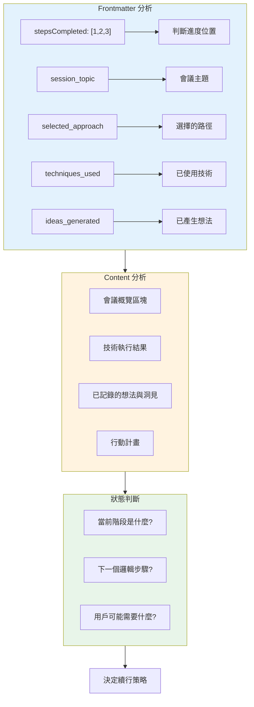
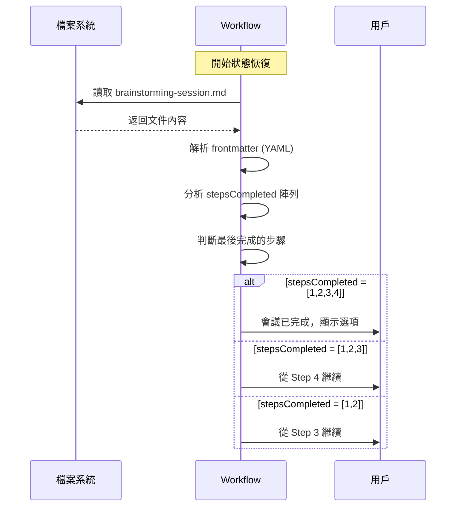
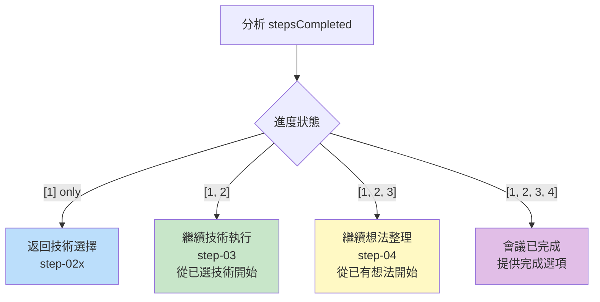
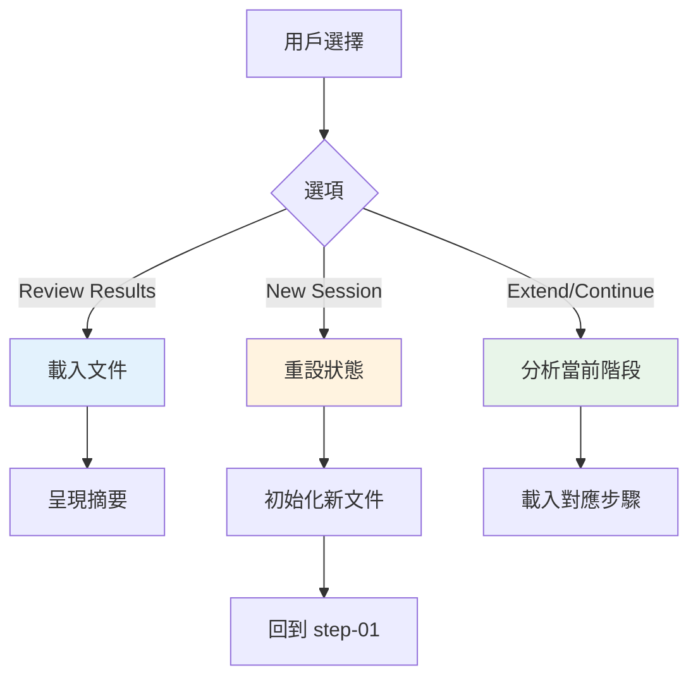
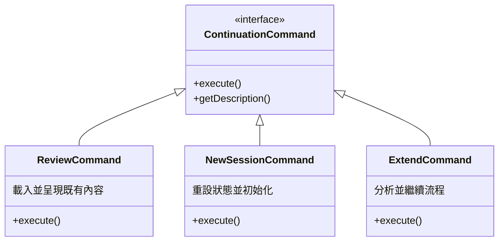
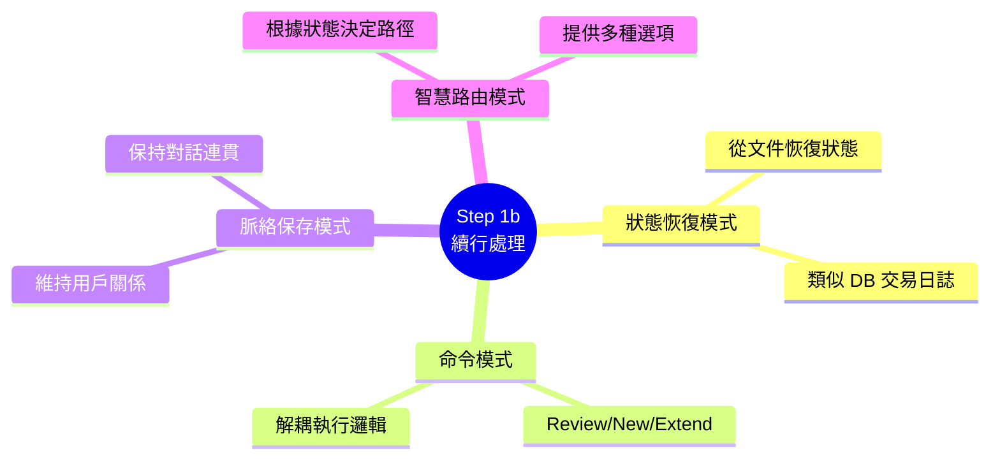

# Step 1b: Workflow Continuation 深度分析

> 📄 原始檔案：`_bmad/core/workflows/brainstorming/steps/step-01b-continue.md`
> 📅 分析日期：2025-12-29

## 檔案概述

`step-01b-continue.md` 是專門處理工作流程續行的步驟，當系統偵測到既有會議文件時被載入。這是 Brainstorming Workflow 獨有的機制，Party Mode 沒有對應的續行處理。

**核心職責：**

1. 分析既有會議狀態
2. 呈現進度摘要
3. 提供續行選項
4. 無縫銜接到適當的下一步

---

## 執行規則分析

### Mandatory Execution Rules

```markdown
## MANDATORY EXECUTION RULES (READ FIRST):
- ✅ YOU ARE A CONTINUATION FACILITATOR, not a fresh starter
- 🎯 RESPECT EXISTING WORKFLOW state and progress
- 📋 UNDERSTAND PREVIOUS SESSION context and outcomes
- 🔍 SEAMLESSLY RESUME from where user left off
- 💬 MAINTAIN CONTINUITY in session flow and rapport
```

**規則設計哲學：**

| 符號 | 規則 | 設計意圖 |
|------|------|----------|
| ✅ | 續行引導師，非新手引導 | 明確角色區隔 |
| 🎯 | 尊重既有狀態與進度 | 避免覆蓋用戶已完成的工作 |
| 📋 | 理解先前會議脈絡 | 建立在既有成果之上 |
| 🔍 | 無縫銜接 | 用戶體驗連續性 |
| 💬 | 維持對話連貫性 | 保持已建立的協作關係 |

### Execution Protocols

```markdown
## EXECUTION PROTOCOLS:
- 🎯 Load and analyze existing document thoroughly
- 💾 Update frontmatter with continuation state
- 📖 Present current status and next options clearly
- 🚫 FORBIDDEN repeating completed work or asking same questions
```

**關鍵禁止事項：**

「禁止重複已完成的工作或詢問相同問題」是續行處理的核心原則，體現了對用戶時間的尊重。

---

## 續行處理序列

### 1. 分析既有會議

```markdown
### 1. Analyze Existing Session

Load existing document and analyze current state:

**Document Analysis:**
- Read existing `{output_folder}/analysis/brainstorming-session-{{date}}.md`
- Examine frontmatter for `stepsCompleted`, `session_topic`, `session_goals`
- Review content to understand session progress and outcomes
- Identify current stage and next logical steps
```

**分析維度：**



**技術概念說明：狀態恢復模式（State Recovery Pattern）**

這個分析過程是**狀態恢復模式**的實現，類似於資料庫的交易日誌回復：



**實際範例**：

| 既有狀態 | 系統判斷 | 用戶看到的選項 |
|----------|----------|----------------|
| `stepsCompleted: [1]` | 在技術選擇前中斷 | 「繼續選擇技術」 |
| `stepsCompleted: [1,2]` | 在技術執行前中斷 | 「開始技術執行」 |
| `stepsCompleted: [1,2,3]` | 在想法整理前中斷 | 「整理您的想法」 |
| `stepsCompleted: [1,2,3,4]` | 會議已完成 | 「檢視/新會議/延伸」 |

### 會議狀態評估

```markdown
**Session Status Assessment:**
"Welcome back {{user_name}}! I can see your brainstorming session on
**[session_topic]** from **[date]**.

**Current Session Status:**
- **Steps Completed:** [List completed steps]
- **Techniques Used:** [List techniques from frontmatter]
- **Ideas Generated:** [Number from frontmatter]
- **Current Stage:** [Assess where they left off]

**Session Progress:**
[Brief summary of what was accomplished and what remains]"
```

**評估輸出結構：**

| 項目 | 來源 | 呈現方式 |
|------|------|----------|
| Steps Completed | frontmatter | 列表形式 |
| Techniques Used | frontmatter | 列表形式 |
| Ideas Generated | frontmatter | 數量統計 |
| Current Stage | 分析推斷 | 文字描述 |
| Session Progress | 綜合分析 | 摘要說明 |

---

## 續行選項設計

### 會議已完成情況

```markdown
**If Session Completed:**
"Your brainstorming session appears to be complete!

**Options:**
[1] Review Results - Go through your documented ideas and insights
[2] Start New Session - Begin brainstorming on a new topic
[3) Extend Session - Add more techniques or explore new angles"
```

**完成狀態選項分析：**

| 選項 | 功能 | 適用場景 |
|------|------|----------|
| [1] Review Results | 回顧已記錄的想法 | 需要複習或分享成果 |
| [2] Start New Session | 全新會議 | 有新主題要探索 |
| [3] Extend Session | 延伸現有會議 | 想深入探索更多角度 |

### 會議進行中情況

```markdown
**If Session In Progress:**
"Let's continue where we left off!

**Current Progress:**
[Description of current stage and accomplishments]

**Next Steps:**
[Continue with appropriate next step based on workflow state]"
```

**進行中狀態處理：**



**技術概念說明：漸進式恢復（Incremental Recovery）**

這種設計確保用戶永遠不會遺失工作進度：

```markdown
傳統方式：            漸進式恢復：
┌────────────┐       ┌────────────┐
│ 中斷       │       │ 中斷       │
└──────┬─────┘       └──────┬─────┘
       ▼                    ▼
┌────────────┐       ┌────────────┐
│ 重新開始   │       │ 從中斷點   │
│ 全部遺失   │       │ 繼續       │
└────────────┘       │ 保留進度   │
                     └────────────┘
```

---

## 用戶選擇處理

```markdown
### 3. Handle User Choice

Route to appropriate next step based on selection:

**Review Results:** Load appropriate review/navigation step
**New Session:** Start fresh workflow initialization
**Extend Session:** Continue with next technique or phase
**Continue Progress:** Resume from current workflow step
```

**路由邏輯圖：**



**技術概念說明：命令模式（Command Pattern）**

每個選項封裝為獨立的命令物件：



**為什麼使用命令模式？**

| 優點 | 說明 |
|------|------|
| **可撤銷** | 每個命令可以記錄執行前狀態 |
| **可排隊** | 命令可以延遲執行 |
| **可記錄** | 支援操作歷史追蹤 |
| **解耦合** | 調用者不需知道執行細節 |

---

## 狀態更新

```markdown
### 4. Update Session State

Update frontmatter to reflect continuation:

```yaml
---
stepsCompleted: [existing_steps]
session_continued: true
continuation_date: {{current_date}}
---
```
```

**新增欄位：**

| 欄位 | 類型 | 用途 |
|------|------|------|
| `session_continued` | Boolean | 標記這是續行的會議 |
| `continuation_date` | DateTime | 記錄續行時間 |

這些欄位提供了完整的會議歷史追蹤。

---

## 成功與失敗指標

### Success Metrics

```markdown
## SUCCESS METRICS:
✅ Existing session state accurately analyzed and understood
✅ Seamless continuation without loss of context or rapport
✅ Appropriate continuation options presented based on progress
✅ User choice properly routed to next workflow step
✅ Session continuity maintained throughout interaction
```

### Failure Modes

```markdown
## FAILURE MODES:
❌ Not properly analyzing existing document state
❌ Asking user to repeat information already provided
❌ Losing continuity in session flow or context
❌ Not providing appropriate continuation options
```

---

## 設計模式分析

### 1. State Recovery Pattern（狀態恢復模式）

從持久化的文件中恢復會話狀態：
- 文件作為狀態儲存媒介
- Frontmatter 作為結構化狀態
- 內容作為非結構化脈絡

### 2. Context Preservation Pattern（脈絡保存模式）

維持用戶與 AI 之間建立的「關係」：
- 記住會議主題與目標
- 延續已確立的引導風格
- 保持對話的連貫性

### 3. Smart Routing Pattern（智慧路由模式）

根據狀態智慧決定下一步：
- 不是簡單的「從頭開始」或「繼續」
- 提供多種續行選項
- 考慮用戶可能的不同需求

### 4. Time-Aware Design（時間感知設計）

記錄續行時間，支援：
- 會議歷史追蹤
- 多次續行的時間線重建
- 用戶行為分析（如有需要）

---

## 與其他框架的比較

### BMAD Party Mode

Party Mode 沒有續行機制：
- 每次都是新對話
- 沒有輸出文件產出
- 沒有狀態持久化

### 典型 AI 對話

大多數 AI 對話沒有內建續行：
- 依賴對話歷史記憶
- 沒有結構化狀態追蹤
- 無法跨會話延續

### Brainstorming 續行優勢

- **結構化狀態**：frontmatter 提供可靠的狀態資訊
- **用戶控制**：多種續行選項滿足不同需求
- **資料保存**：所有進度都持久化到文件

---

## 實作考量

### 邊界情況處理

```
1. 文件損壞
   └── 偵測 frontmatter 解析錯誤
       └── 提供修復或重新開始選項

2. 版本不符
   └── workflow 版本更新可能導致格式變化
       └── 需要版本遷移邏輯

3. 部分完成狀態
   └── stepsCompleted 與實際內容不符
       └── 以實際內容為準重建狀態
```

### 建議增強

1. **版本追蹤**：在 frontmatter 中加入 `workflow_version`
2. **自動備份**：續行前備份既有文件
3. **合併支援**：支援多個中斷點的合併續行

---

## 小結

`step-01b-continue.md` 是 Brainstorming Workflow 中體貼用戶體驗的關鍵設計：

1. **智慧狀態分析**：深度理解既有會議狀態
2. **無縫續行體驗**：避免重複工作的挫折
3. **靈活選項提供**：滿足不同續行需求
4. **脈絡連貫維持**：保持協作關係的延續

這個步驟體現了 BMAD 框架對用戶時間與工作成果的尊重，是提升整體使用體驗的重要組件。

---

## 技術概念快速參考



### 設計模式對照表

| 模式名稱 | 問題 | 解決方案 | 應用 |
|----------|------|----------|------|
| **State Recovery** | 用戶中斷後如何恢復？ | 從 frontmatter 讀取狀態 | 判斷進度位置 |
| **Command** | 如何處理不同續行選項？ | 封裝為獨立命令 | Review/New/Extend |
| **Context Preservation** | 如何維持協作關係？ | 記住會議主題與目標 | 問候語個人化 |
| **Smart Routing** | 如何決定下一步？ | 根據狀態智慧路由 | 載入對應步驟 |
