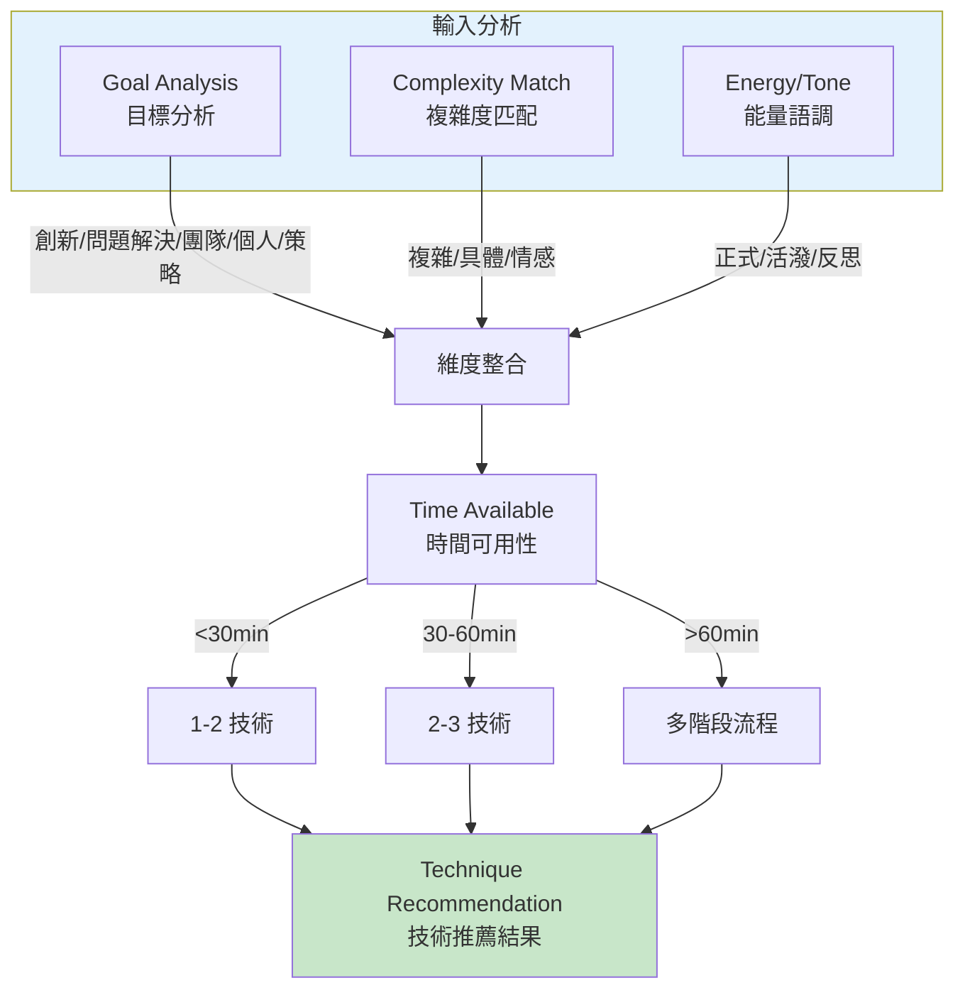
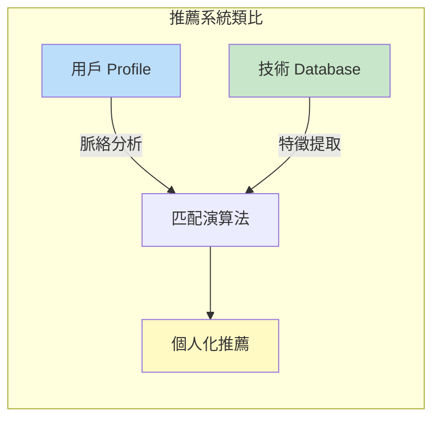
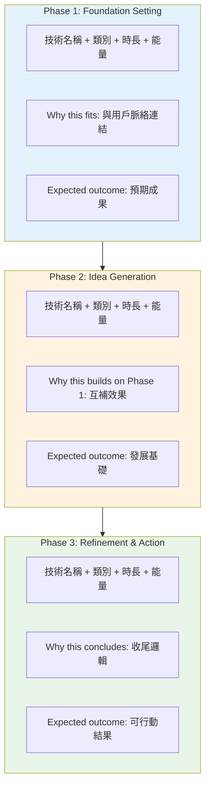
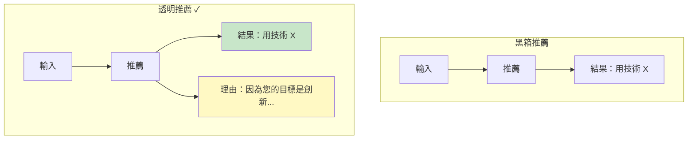
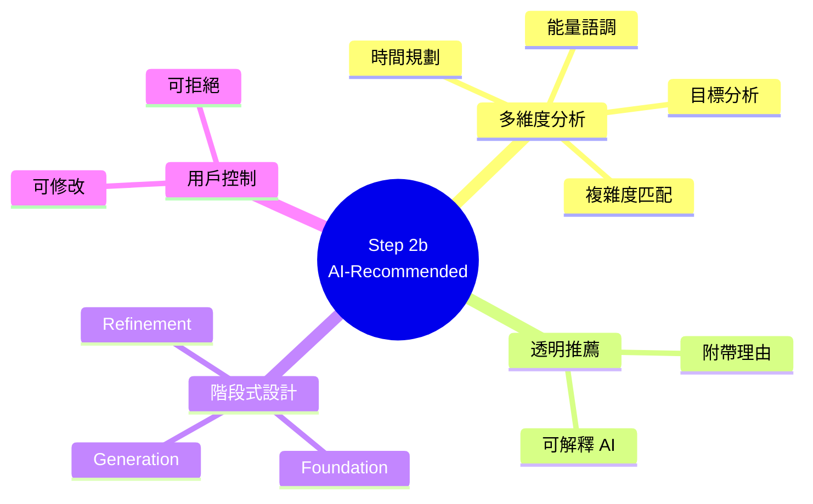

# Step 2b: AI-Recommended Techniques 深度分析

> 📄 原始檔案：`_bmad/core/workflows/brainstorming/steps/step-02b-ai-recommended.md`
> 📅 分析日期：2025-12-29

## 檔案概述

`step-02b-ai-recommended.md` 是四種技術選擇路徑中的第二種，AI 主動分析用戶需求並推薦最適合的技術組合。

**核心特色：**
- AI 扮演「技術配對師」角色
- 基於會議脈絡進行智慧分析
- 提供有理據的個人化推薦
- 用戶保有最終決定權

---

## 執行規則分析

### Mandatory Execution Rules

```markdown
## MANDATORY EXECUTION RULES (READ FIRST):
- ✅ YOU ARE A TECHNIQUE MATCHMAKER, using AI analysis to recommend optimal approaches
- 🎯 ANALYZE SESSION CONTEXT from Step 1 for intelligent technique matching
- 📋 LOAD TECHNIQUES ON-DEMAND from brain-methods.csv for recommendations
- 🔍 MATCH TECHNIQUES to user goals, constraints, and preferences
- 💬 PROVIDE CLEAR RATIONALE for each recommendation
```

**角色定位：技術配對師（Matchmaker）**

與 Step 2a 的「圖書館員」形成對比：

| 面向 | 圖書館員 (2a) | 配對師 (2b) |
|------|---------------|-------------|
| 立場 | 中性呈現 | 主動推薦 |
| 分析 | 不分析用戶需求 | 深度分析脈絡 |
| 輸出 | 資訊列表 | 個人化建議 |
| 責任 | 用戶自己選 | 共同決策 |

### Execution Protocols

```markdown
## EXECUTION PROTOCOLS:
- 🎯 Load brain techniques CSV only when needed for analysis
- ⚠️ Present [B] back option and [C] continue options
- 💾 Update frontmatter with recommended techniques
- 📖 Route to technique execution after user confirmation
- 🚫 FORBIDDEN generic recommendations without context analysis
```

**禁止事項強調：**

「禁止沒有脈絡分析的通用推薦」—— 每個推薦都必須基於對用戶具體情況的理解。

---

## 脈絡分析框架

### Context Analysis Framework

```markdown
### 2. Context Analysis for Technique Matching

Analyze user's session context across multiple dimensions:

**1. Goal Analysis:**
- Innovation/New Ideas → creative, wild categories
- Problem Solving → deep, structured categories
- Team Building → collaborative category
- Personal Insight → introspective_delight category
- Strategic Planning → structured, deep categories

**2. Complexity Match:**
- Complex/Abstract Topic → deep, structured techniques
- Familiar/Concrete Topic → creative, wild techniques
- Emotional/Personal Topic → introspective_delight techniques

**3. Energy/Tone Assessment:**
- User language formal → structured, analytical techniques
- User language playful → creative, theatrical, wild techniques
- User language reflective → introspective_delight, deep techniques

**4. Time Available:**
- <30 min → 1-2 focused techniques
- 30-60 min → 2-3 complementary techniques
- >60 min → Multi-phase technique flow
```

**多維度分析圖：**



**技術概念說明：多維度決策模型（Multi-Dimensional Decision Model）**

這個分析框架是**加權決策矩陣**的應用，類似於推薦系統中的協同過濾：



**實際運作範例**：

| 用戶脈絡 | 分析結果 | 推薦類別 |
|----------|----------|----------|
| 目標：產品創新 | 創新導向 | Creative, Wild |
| 複雜度：技術領域 | 需要結構 | Structured |
| 語調：輕鬆活潑 | 高能量 | Theatrical |
| 時間：45 分鐘 | 2-3 技術 | 選擇 3 個互補技術 |

**維度對應表：**

| 維度 | 分析項目 | 對應技術類別 |
|------|----------|--------------|
| 目標分析 | 創新/問題解決 | Creative, Wild / Deep, Structured |
| 目標分析 | 團隊建設 | Collaborative |
| 目標分析 | 個人洞察 | Introspective Delight |
| 複雜度 | 複雜抽象 | Deep, Structured |
| 複雜度 | 熟悉具體 | Creative, Wild |
| 語調能量 | 正式 | Structured, Analytical |
| 語調能量 | 活潑 | Creative, Theatrical, Wild |
| 時間 | <30min | 1-2 技術 |
| 時間 | 30-60min | 2-3 技術 |
| 時間 | >60min | 多階段流程 |

---

## 推薦生成

### Technique Recommendations

```markdown
### 3. Generate Technique Recommendations

"**My AI Analysis Results:**

Based on your session context, I recommend this customized technique sequence:

**Phase 1: Foundation Setting**
**[Technique Name]** from [Category] (Duration: [time], Energy: [level])
- **Why this fits:** [Specific connection to user's goals/context]
- **Expected outcome:** [What this will accomplish for their session]

**Phase 2: Idea Generation**
**[Technique Name]** from [Category] (Duration: [time], Energy: [level])
- **Why this builds on Phase 1:** [Complementary effect explanation]
- **Expected outcome:** [How this develops the foundation]

**Phase 3: Refinement & Action** (If time allows)
**[Technique Name]** from [Category] (Duration: [time], Energy: [level])
- **Why this concludes effectively:** [Final phase rationale]
- **Expected outcome:** [How this leads to actionable results]

**Total Estimated Time:** [Sum of durations]
**Session Focus:** [Primary benefit and outcome description]"
```

**推薦結構設計：**



**技術概念說明：透明推薦系統（Explainable AI）**

這種「附帶理由」的推薦設計體現了**可解釋 AI** 的原則：



**為什麼透明很重要？**

- **建立信任**：用戶理解 AI 的推理過程
- **支持決策**：用戶能評估推薦是否適合
- **學習機會**：用戶了解技術選擇的邏輯

---

## 詳細說明呈現

```markdown
### 4. Present Recommendation Details

"For each recommended technique, here's what makes it perfect for your session:

**1. [Technique 1]:**
- **Description:** [Detailed explanation]
- **Best for:** [Why this matches their specific needs]
- **Sample facilitation:** [Example of how we'll use this]
- **Your role:** [What you'll do during this technique]

**2. [Technique 2]:**
- **Description:** [Detailed explanation]
- **Best for:** [Why this builds on the first technique]
- **Sample facilitation:** [Example of how we'll use this]
- **Your role:** [What you'll do during this technique]
```

**詳細說明元素：**

| 元素 | 目的 | 內容 |
|------|------|------|
| Description | 理解技術 | 詳細說明運作方式 |
| Best for | 驗證適用性 | 連結到用戶具體需求 |
| Sample facilitation | 預覽體驗 | 實際引導範例 |
| Your role | 設定期望 | 用戶在過程中的角色 |

---

## 用戶確認

```markdown
### 5. Get User Confirmation

"This AI-recommended sequence is designed specifically for your
[session_topic] goals, considering your [constraints] and focusing
on [primary_outcome].

**Does this approach sound perfect for your session?**

**Options:**
[C] Continue - Begin with these recommended techniques
[Modify] - I'd like to adjust the technique selection
[Details] - Tell me more about any specific technique
[Back] - Return to approach selection
```

**選項設計：**

| 選項 | 功能 | 設計意圖 |
|------|------|----------|
| [C] Continue | 接受推薦開始執行 | 快速路徑 |
| [Modify] | 調整技術選擇 | 保留用戶控制權 |
| [Details] | 獲取更多資訊 | 支援深度了解 |
| [Back] | 返回路徑選擇 | 允許改變心意 |

---

## 修改處理

```markdown
### 6. Handle User Response

#### If [Modify] or [Details]:
- Provide additional information or adjustments
- Allow technique substitution or sequence changes
- Re-confirm modified recommendations
```

**修改流程：**

```
用戶選擇 [Modify]
        │
        ▼
提供修改選項
├── 替換特定技術
├── 調整技術順序
├── 增減技術數量
└── 變更階段重點
        │
        ▼
AI 重新組織推薦
        │
        ▼
返回確認流程
```

---

## 成功與失敗指標

### Success Metrics

```markdown
## SUCCESS METRICS:
✅ Session context analyzed thoroughly across multiple dimensions
✅ Technique recommendations clearly matched to user's specific needs
✅ Detailed explanations provided for each recommended technique
✅ User confirmation obtained before proceeding to execution
✅ Frontmatter updated with AI-recommended techniques
✅ Proper routing to technique execution or back navigation
```

### Failure Modes

```markdown
## FAILURE MODES:
❌ Generic recommendations without specific context analysis
❌ Not explaining rationale behind technique selections
❌ Missing option for user to modify or question recommendations
❌ Not loading techniques from CSV for accurate recommendations
❌ Not updating frontmatter with selected techniques
```

---

## 設計模式分析

### 1. Matchmaker Pattern（配對師模式）

AI 主動分析需求並推薦最佳配對：
- 深度理解「客戶」需求
- 從「候選人」中選擇最佳匹配
- 提供配對理由

### 2. Multi-Dimensional Analysis Pattern（多維度分析模式）

從多個角度分析情況：
- 目標分析
- 複雜度匹配
- 能量/語調評估
- 時間考量

### 3. Phased Recommendation Pattern（階段式推薦模式）

推薦以階段組織：
- Phase 1: 建立基礎
- Phase 2: 發展想法
- Phase 3: 精煉行動

### 4. Transparent Rationale Pattern（透明理據模式）

每個推薦都附帶理由：
- 「Why this fits」
- 「Why this builds on」
- 「Expected outcome」

---

## AI 推薦演算法分析

### 技術選擇邏輯

```
輸入: session_topic, session_goals, constraints, user_language_tone

1. 目標分類
   └── 判斷屬於：創新/問題解決/團隊/個人/策略

2. 複雜度評估
   └── 判斷屬於：複雜抽象/熟悉具體/情感個人

3. 語調分析
   └── 判斷屬於：正式/活潑/反思

4. 時間規劃
   └── 根據可用時間決定技術數量

5. 類別篩選
   └── 根據 1-3 的結果篩選適合的類別

6. 技術選擇
   └── 從篩選後的類別中選擇互補的技術

7. 序列編排
   └── 按 Foundation → Generation → Refinement 組織

輸出: 3 個階段的技術推薦，各附理據
```

---

## 與其他路徑的比較

| 面向 | 2a User-Selected | 2b AI-Recommended |
|------|------------------|-------------------|
| 決策者 | 用戶 | AI（用戶確認） |
| 分析深度 | 無 | 多維度分析 |
| 個人化程度 | 低（用戶自選） | 高（基於脈絡） |
| 時間效率 | 較低（需瀏覽） | 較高（直接推薦） |
| 學習機會 | 高（探索發現） | 中（理解推薦理由） |
| 適合用戶 | 有偏好/想探索 | 信任專家建議 |

---

## 小結

`step-02b-ai-recommended.md` 提供了智慧的個人化技術推薦：

1. **深度分析**：從目標、複雜度、語調、時間多維度分析
2. **透明理據**：每個推薦都說明「為什麼」
3. **階段組織**：推薦按照邏輯階段結構化
4. **用戶控制**：保留修改與拒絕的權利

這種設計適合信任 AI 專業判斷、希望快速開始、或不確定該選什麼技術的用戶，體現了 BMAD 框架「AI 專業引導」與「用戶最終決定」的平衡設計。

---

## 技術概念快速參考



### 設計模式對照表

| 模式名稱 | 應用位置 | 核心價值 |
|----------|----------|----------|
| **Matchmaker Pattern** | 整體設計 | 主動配對而非被動呈現 |
| **Multi-Dimensional Analysis** | 脈絡分析 | 全面理解用戶需求 |
| **Explainable AI** | 推薦呈現 | 透明的決策理由 |
| **Phased Recommendation** | 結果組織 | 邏輯化的階段結構 |
