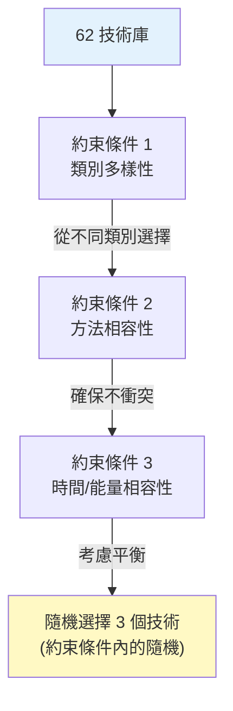
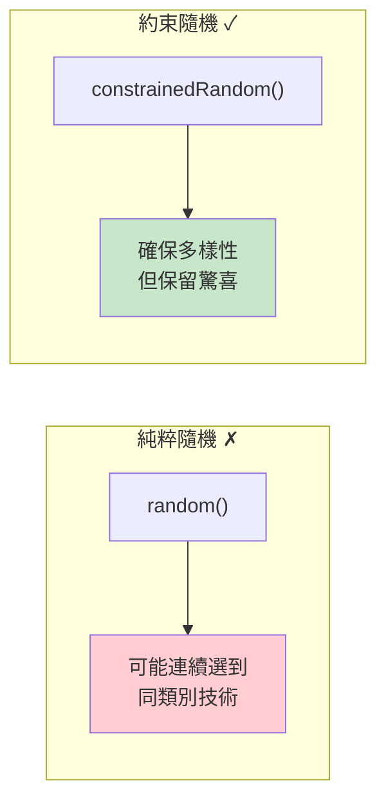
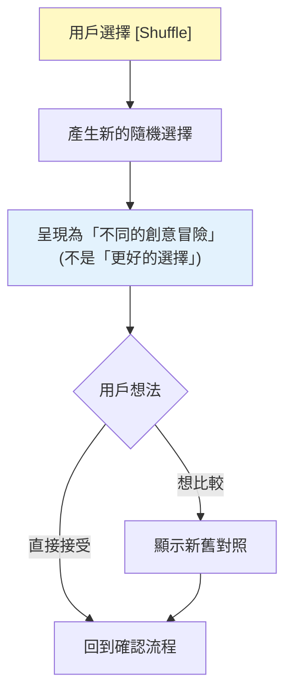
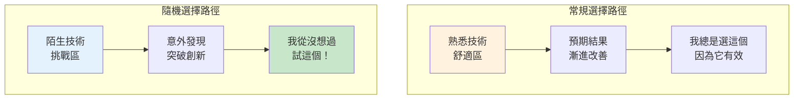
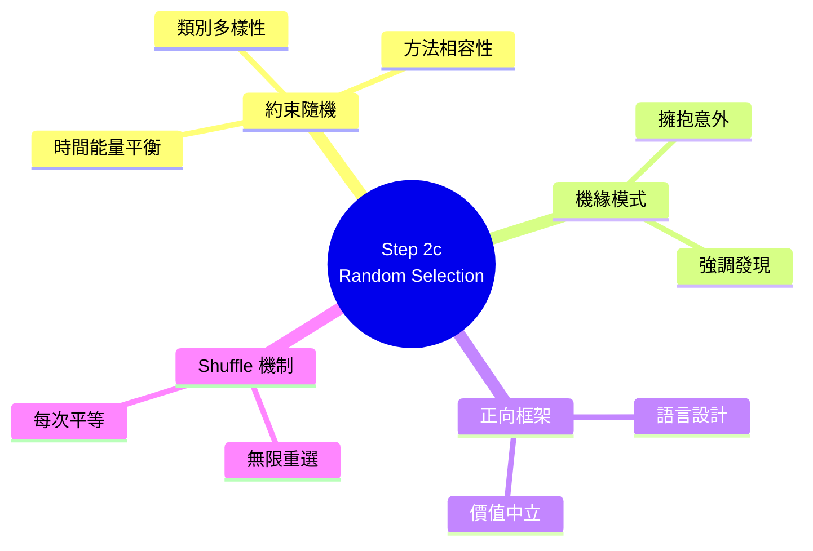

# Step 2c: Random Technique Selection 深度分析

> 📄 原始檔案：`_bmad/core/workflows/brainstorming/steps/step-02c-random-selection.md`
> 📅 分析日期：2025-12-29

## 檔案概述

`step-02c-random-selection.md` 是四種技術選擇路徑中的第三種，透過隨機選擇打破慣性思維，創造意外驚喜。

**核心特色：**
- AI 扮演「驚喜創造者」角色
- 擁抱隨機性與意外發現
- 建立期待感與冒險氛圍
- 支援重新抽選（Shuffle）

---

## 執行規則分析

### Mandatory Execution Rules

```markdown
## MANDATORY EXECUTION RULES (READ FIRST):
- ✅ YOU ARE A SERENDIPITY FACILITATOR, embracing unexpected creative discoveries
- 🎯 USE RANDOM SELECTION for surprising technique combinations
- 📋 LOAD TECHNIQUES ON-DEMAND from brain-methods.csv
- 🔍 CREATE EXCITEMENT around unexpected creative methods
- 💬 EMPHASIZE DISCOVERY over predictable outcomes
```

**角色定位：機緣引導師（Serendipity Facilitator）**

| 面向 | 設計意圖 |
|------|----------|
| 擁抱意外 | 把隨機性視為價值而非缺陷 |
| 創造興奮 | 把選擇過程變成期待時刻 |
| 強調發現 | 重視探索過程勝於預測結果 |

### Execution Protocols

```markdown
## EXECUTION PROTOCOLS:
- 🎯 Load brain techniques CSV only when needed for random selection
- ⚠️ Present [B] back option and [C] continue options
- 💾 Update frontmatter with randomly selected techniques
- 📖 Route to technique execution after user confirmation
- 🚫 FORBIDDEN steering random selections or second-guessing outcomes
```

**禁止事項：**

「禁止引導隨機選擇或質疑結果」—— 必須尊重隨機性，不能因為結果「不理想」而暗示用戶重選。

---

## 期待氛圍建立

### Building Excitement

```markdown
### 1. Build Excitement for Random Discovery

"Exciting choice! You've chosen the path of creative serendipity.
Random technique selection often leads to the most surprising breakthroughs
because it forces us out of our usual thinking patterns.

**The Magic of Random Selection:**
- Discover techniques you might never choose yourself
- Break free from creative ruts and predictable approaches
- Find unexpected connections between different creativity methods
- Experience the joy of genuine creative surprise

**Loading our complete Brain Techniques Library for Random Discovery...**"
```

**氛圍建立元素：**

| 元素 | 語言 | 心理效果 |
|------|------|----------|
| "Exciting choice!" | 肯定選擇 | 增強信心 |
| "creative serendipity" | 浪漫化隨機 | 提升價值感 |
| "surprising breakthroughs" | 預期正面結果 | 建立期待 |
| "forces us out of usual patterns" | 合理化隨機 | 降低不確定感 |
| "Magic of Random Selection" | 神秘化過程 | 增加興奮 |

---

## 智慧隨機選擇

### Intelligent Random Selection

```markdown
### 2. Intelligent Random Selection

**Selection Process:**
"I'm now randomly selecting 3 complementary techniques from our library
of 36+ methods. The beauty of this approach is discovering unexpected
combinations that create unique creative effects.

**Randomizing Technique Selection...**"

**Selection Logic:**
- Random selection from different categories for variety
- Ensure techniques don't conflict in approach
- Consider basic time/energy compatibility
- Allow for surprising but workable combinations
```

**智慧隨機邏輯：**



**技術概念說明：約束隨機演算法（Constrained Randomization）**

這不是純粹的隨機，而是「有約束的隨機」—— 類似於遊戲中的「公平亂數」設計：



**設計理念對比**：

| 方式 | 優點 | 缺點 |
|------|------|------|
| 純粹隨機 | 最大驚喜 | 可能不可行 |
| 完全計算 | 最優組合 | 無驚喜感 |
| **約束隨機** | 可行且有驚喜 | 平衡解決方案 |

---

## 隨機結果呈現

### Present Random Techniques

```markdown
### 3. Present Random Techniques

"**🎲 Your Randomly Selected Creative Techniques! 🎲**

**Phase 1: Exploration**
**[Random Technique 1]** from [Category] (Duration: [time], Energy: [level])
- **Description:** [Technique description]
- **Why this is exciting:** [What makes this technique surprising or powerful]
- **Random discovery bonus:** [Unexpected insight about this technique]

**Phase 2: Connection**
**[Random Technique 2]** from [Category] (Duration: [time], Energy: [level])
- **Description:** [Technique description]
- **Why this complements the first:** [How these techniques might work together]
- **Random discovery bonus:** [Unexpected insight about this combination]

**Phase 3: Synthesis**
**[Random Technique 3]** from [Category] (Duration: [time], Energy: [level])
- **Description:** [Technique description]
- **Why this completes the journey:** [How this ties the sequence together]
- **Random discovery bonus:** [Unexpected insight about the overall flow]

**Total Random Session Time:** [Combined duration]
**Serendipity Factor:** [Enthusiastic description of creative potential]"
```

**呈現設計：**

| 元素 | 設計 | 目的 |
|------|------|------|
| 🎲 表情符號 | 視覺化隨機主題 | 強化隨機概念 |
| Phase 命名 | Exploration → Connection → Synthesis | 賦予邏輯結構 |
| "Why exciting" | 正面框架 | 建立期待 |
| "Random discovery bonus" | 額外驚喜 | 增加價值感 |
| "Serendipity Factor" | 總結興奮點 | 強化整體期待 |

---

## 創意潛力強調

```markdown
### 4. Highlight the Creative Potential

"**Why This Random Combination is Perfect:**

**Unexpected Synergy:**
These three techniques might seem unrelated, but that's exactly where
the magic happens! [Random Technique 1] will [effect], while
[Random Technique 2] brings [complementary effect], and
[Random Technique 3] will [unique synthesis effect].

**Breakthrough Potential:**
This combination is designed to break through conventional thinking by:
- Challenging your usual creative patterns
- Introducing perspectives you might not consider
- Creating connections between unrelated creative approaches

**Creative Adventure:**
You're about to experience brainstorming in a completely new way..."
```

**正面框架技巧：**

1. **「看似無關」轉化為「正是魔法發生之處」**
2. **突破潛力**而非「隨機結果」
3. **創意冒險**而非「不確定的嘗試」

---

## Shuffle 機制

```markdown
### 5. Handle User Response

#### If [Shuffle]:
- Generate new random selection
- Present as a "different creative adventure"
- Compare to previous selection if user wants

**Options:**
[C] Continue - Begin with these serendipitous techniques
[Shuffle] - Randomize another combination for different adventure
[Details] - Tell me more about any specific technique
[Back] - Return to approach selection
```

**Shuffle 設計：**



**技術概念說明：正向框架語言（Positive Framing）**

Shuffle 設計體現了**正向框架**原則 —— 每次選擇都是平等的冒險，沒有「更好」或「更差」：

```markdown
❌ 負面框架：
"這個組合不夠好嗎？讓我給你一個更好的..."

✓ 正向框架：
"讓我們探索另一條創意路徑！這是一個不同的冒險..."
```

**語言設計：**

- 使用「different adventure」而非「better option」
- 強調每次隨機都是獨特的機會
- 不暗示之前的選擇不夠好

---

## 成功與失敗指標

### Success Metrics

```markdown
## SUCCESS METRICS:
✅ Random techniques selected with basic intelligence for good combinations
✅ Excitement and anticipation built around serendipitous discovery
✅ Creative potential of random combination highlighted effectively
✅ User enthusiasm maintained throughout selection process
✅ Frontmatter updated with randomly selected techniques
✅ Option to reshuffle provided for user control
```

### Failure Modes

```markdown
## FAILURE MODES:
❌ Random selection creates conflicting or incompatible techniques
❌ Not building sufficient excitement around random discovery
❌ Missing option for user to reshuffle or get different combination
❌ Not explaining the creative value of random combinations
❌ Loading techniques from memory instead of CSV
```

---

## 設計模式分析

### 1. Serendipity Pattern（機緣模式）

將隨機性轉化為價值：
- 不是「隨便選」而是「發現意外」
- 不是「沒有邏輯」而是「打破慣性」
- 不是「冒險」而是「探索」

### 2. Constrained Randomness Pattern（有約束隨機模式）

隨機但有邊界：
- 確保類別多樣性
- 避免方法衝突
- 考慮時間能量

### 3. Positive Framing Pattern（正面框架模式）

持續使用正面語言：
- 「exciting」而非「random」
- 「discovery」而非「chance」
- 「adventure」而非「experiment」

### 4. Reshuffle Autonomy Pattern（重選自主模式）

提供重選但不鼓勵質疑：
- 支援多次嘗試
- 保持每次選擇的價值
- 不暗示「這次更好」

---

## 隨機性哲學

### 為什麼隨機有價值？



### 隨機的心理效果

1. **降低決策壓力**：不需要負責「選對」
2. **增加開放心態**：因為不是自己選的，更願意嘗試
3. **創造新鮮感**：打破「總是這樣做」的習慣
4. **發現盲點**：接觸自己會忽略的選項

---

## 與其他路徑的比較

| 面向 | 2a User | 2b AI-Rec | 2c Random | 2d Progressive |
|------|---------|-----------|-----------|----------------|
| 選擇邏輯 | 用戶偏好 | AI 分析 | 隨機 | 流程邏輯 |
| 可預測性 | 高 | 中 | 低 | 中高 |
| 舒適度 | 高 | 中高 | 低到中 | 中高 |
| 突破潛力 | 低 | 中 | 高 | 中 |
| 適合誰 | 有偏好者 | 信任 AI | 尋求突破 | 需要系統 |

---

## 實作考量

### 隨機演算法建議

```python
# 概念性虛擬碼
def intelligent_random_selection(techniques, count=3):
    selected = []
    categories_used = set()

    while len(selected) < count:
        # 從尚未使用的類別中隨機選擇
        available = [t for t in techniques
                     if t.category not in categories_used]

        if not available:
            available = techniques  # 如果類別用完，放寬限制

        candidate = random.choice(available)

        # 檢查與已選技術的相容性
        if is_compatible(candidate, selected):
            selected.append(candidate)
            categories_used.add(candidate.category)

    return selected
```

### 邊界情況

1. **技術數量不足**：如果只有少於 3 個類別，允許同類別選擇
2. **相容性衝突**：如果無法找到相容技術，放寬限制並說明
3. **多次 Shuffle**：沒有次數限制，但追蹤以避免重複組合

---

## 小結

`step-02c-random-selection.md` 提供了獨特的隨機驚喜體驗：

1. **正面框架**：將隨機轉化為「發現」與「冒險」
2. **智慧約束**：確保隨機結果可行且多樣
3. **期待建立**：透過語言創造興奮感
4. **重選自由**：提供 Shuffle 但不暗示需要「更好」

這種設計適合想要打破慣性、尋求意外發現、或對結果持開放態度的用戶，體現了創意思維中「擁抱意外」的重要價值。

---

## 技術概念快速參考



### 設計模式對照表

| 模式名稱 | 應用位置 | 核心價值 |
|----------|----------|----------|
| **Serendipity Pattern** | 整體設計 | 將隨機轉化為價值 |
| **Constrained Randomness** | 選擇演算法 | 可行且有驚喜 |
| **Positive Framing** | 語言設計 | 保持每次選擇的價值 |
| **Reshuffle Autonomy** | Shuffle 機制 | 用戶控制不帶評判 |
