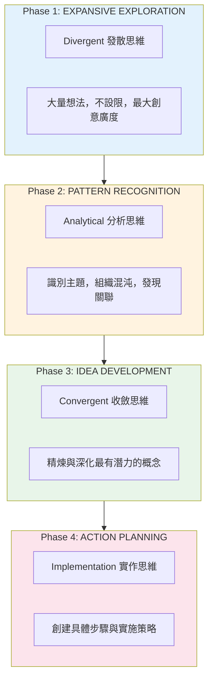
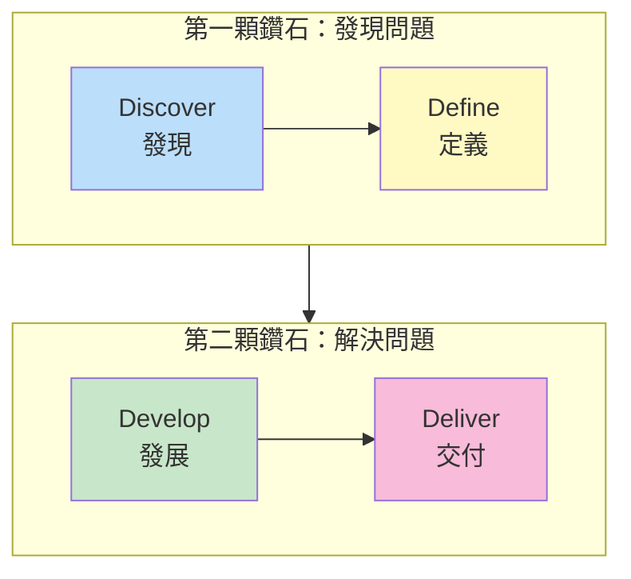
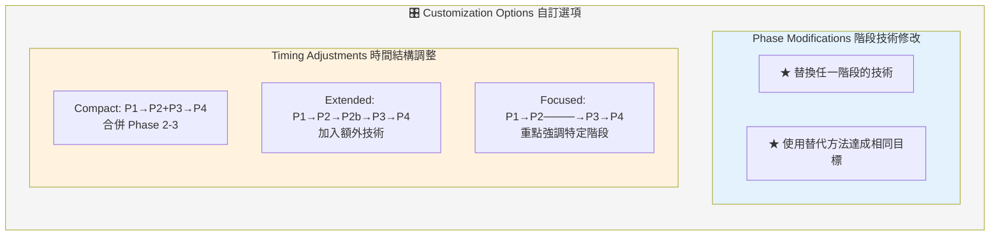
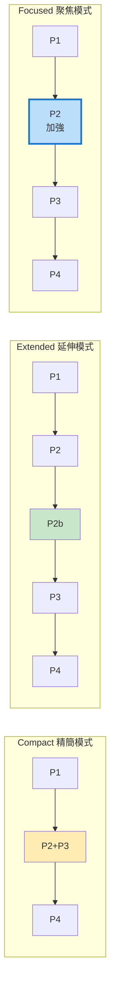
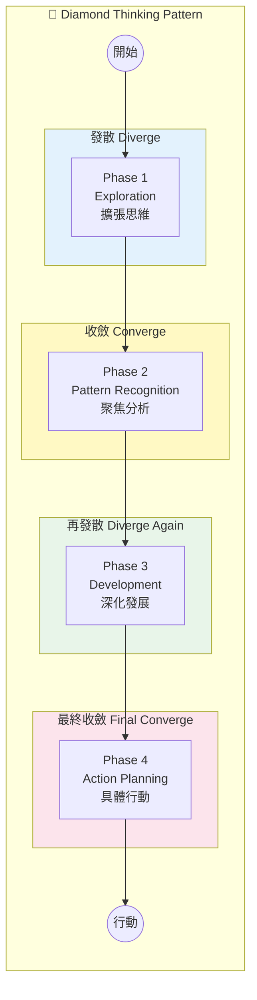
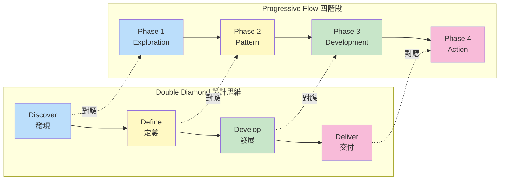
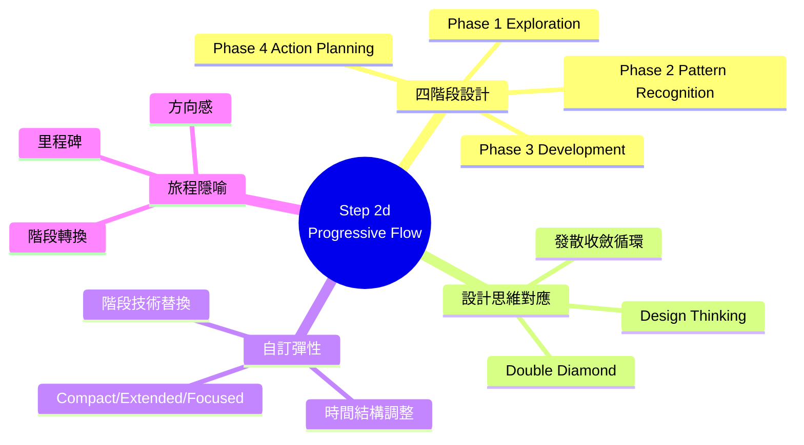
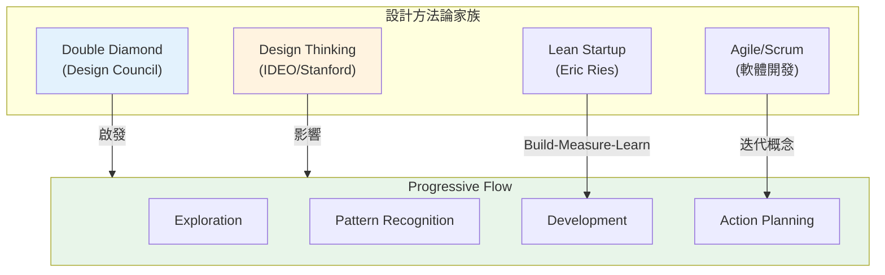

# Step 2d: Progressive Technique Flow 深度分析

> 📄 原始檔案：`_bmad/core/workflows/brainstorming/steps/step-02d-progressive-flow.md`
> 📅 分析日期：2025-12-29

## 檔案概述

`step-02d-progressive-flow.md` 是四種技術選擇路徑中的第四種，提供系統化的四階段創意旅程，從發散到收斂，從想法到行動。

**核心特色：**
- AI 扮演「創意旅程設計師」角色
- 四階段漸進式結構
- 模擬自然創意過程
- 支援階段自訂

---

## 執行規則分析

### Mandatory Execution Rules

```markdown
## MANDATORY EXECUTION RULES (READ FIRST):
- ✅ YOU ARE A CREATIVE JOURNEY GUIDE, orchestrating systematic idea development
- 🎯 DESIGN PROGRESSIVE FLOW from broad exploration to focused action
- 📋 LOAD TECHNIQUES ON-DEMAND from brain-methods.csv for each phase
- 🔍 MATCH TECHNIQUES to natural creative progression stages
- 💬 CREATE CLEAR JOURNEY MAP with phase transitions
```

**角色定位：創意旅程設計師**

| 面向 | 設計意圖 |
|------|----------|
| 系統化 | 提供完整的創意發展路徑 |
| 漸進式 | 從廣到窄、從想法到行動 |
| 旅程概念 | 讓過程有方向感與階段感 |

### Execution Protocols

```markdown
## EXECUTION PROTOCOLS:
- 🎯 Load brain techniques CSV only when needed for each phase
- ⚠️ Present [B] back option and [C] continue options
- 💾 Update frontmatter with progressive technique sequence
- 📖 Route to technique execution after journey confirmation
- 🚫 FORBIDDEN jumping ahead to later phases without proper foundation
```

**禁止事項：**

「禁止跳過基礎階段直接進入後續階段」—— 強調階段間的依賴關係。

---

## 四階段創意旅程

### Journey Concept Introduction

```markdown
### 1. Introduce Progressive Journey Concept

"**The Creative Journey We'll Take:**

**Phase 1: EXPANSIVE EXPLORATION** (Divergent Thinking)
- Generate abundant ideas without judgment
- Explore wild possibilities and unconventional approaches
- Create maximum creative breadth and options

**Phase 2: PATTERN RECOGNITION** (Analytical Thinking)
- Identify themes, connections, and emerging patterns
- Organize the creative chaos into meaningful groups
- Discover insights and relationships between ideas

**Phase 3: IDEA DEVELOPMENT** (Convergent Thinking)
- Refine and elaborate the most promising concepts
- Build upon strong foundations with detail and depth
- Transform raw ideas into well-developed solutions

**Phase 4: ACTION PLANNING** (Implementation Focus)
- Create concrete next steps and implementation strategies
- Identify resources, timelines, and success metrics
- Transform ideas into actionable plans"
```

**四階段設計分析：**



**技術概念說明：Double Diamond 設計思維**

這個四階段流程與 **Double Diamond** 設計方法論高度對應：



| Progressive Flow | Double Diamond | 思維模式 |
|------------------|----------------|----------|
| Phase 1: Exploration | Discover | 發散 |
| Phase 2: Pattern Recognition | Define | 收斂 |
| Phase 3: Development | Develop | 發散 |
| Phase 4: Action | Deliver | 收斂 |

---

## 階段技術配對

### Phase-Specific Technique Selection

```markdown
### 2. Design Phase-Specific Technique Selection

**Phase 1: Expansive Exploration Techniques**
"For **Expansive Exploration**, I'm selecting techniques that maximize
creative breadth and wild thinking:

**Recommended Technique: [Exploration Technique]**
- **Category:** Creative/Innovative techniques
- **Why for Phase 1:** Perfect for generating maximum idea quantity
- **Expected Outcome:** [Number]+ raw ideas across diverse categories
- **Creative Energy:** High energy, expansive thinking

**Phase 2: Pattern Recognition Techniques**
"For **Pattern Recognition**, we need techniques that help organize
and find meaning in the creative abundance:

**Recommended Technique: [Analysis Technique]**
- **Category:** Deep/Structured techniques
- **Why for Phase 2:** Ideal for identifying themes and connections
- **Expected Outcome:** Clear patterns and priority insights

**Phase 3: Idea Development Techniques**
**Recommended Technique: [Development Technique]**
- **Category:** Structured/Collaborative techniques
- **Why for Phase 3:** Perfect for building depth and detail

**Phase 4: Action Planning Techniques**
**Recommended Technique: [Planning Technique]**
- **Category:** Structured/Analytical techniques
- **Why for Phase 4:** Ideal for transforming ideas into actionable steps"
```

**階段與技術類別對應：**

| 階段 | 思維模式 | 適合類別 | 能量等級 |
|------|----------|----------|----------|
| Phase 1 | Divergent | Creative, Wild, Theatrical | High |
| Phase 2 | Analytical | Deep, Structured | Medium |
| Phase 3 | Convergent | Structured, Collaborative | Medium |
| Phase 4 | Implementation | Structured, Analytical | Low-Medium |

---

## 旅程地圖呈現

```markdown
### 3. Present Complete Journey Map

"**Your Complete Creative Journey Map:**

**⏰ Total Journey Time:** [Combined duration]
**🎯 Session Focus:** Systematic development from ideas to action

**Phase 1: Expansive Exploration** ([duration])
- **Technique:** [Selected technique]
- **Goal:** Generate [number]+ diverse ideas without limits
- **Energy:** High, wild, boundary-breaking creativity

**→ Phase Transition:** We'll review and cluster ideas before moving deeper

**Phase 2: Pattern Recognition** ([duration])
- **Technique:** [Selected technique]
- **Goal:** Identify themes and prioritize most promising directions
- **Energy:** Focused, analytical, insight-seeking

**→ Phase Transition:** Select top concepts for detailed development

**Phase 3: Idea Development** ([duration])
- **Technique:** [Selected technique]
- **Goal:** Refine priority ideas with depth and practicality
- **Energy:** Building, enhancing, feasibility-focused

**→ Phase Transition:** Choose final concepts for implementation planning

**Phase 4: Action Planning** ([duration])
- **Technique:** [Selected technique]
- **Goal:** Create concrete implementation plans and next steps
- **Energy:** Practical, action-oriented, milestone-setting"
```

**旅程地圖設計元素：**

| 元素 | 用途 |
|------|------|
| 總時間 | 設定整體期望 |
| 階段時長 | 規劃節奏 |
| 技術名稱 | 明確工具 |
| 目標 | 明確產出 |
| 能量描述 | 設定心理準備 |
| 轉換點 | 說明階段間的銜接 |

---

## 自訂選項

```markdown
### 4. Handle Customization Requests

"**Customization Options:**

**Phase Modifications:**
- **Phase 1:** Switch to [alternative exploration technique] for [benefit]
- **Phase 2:** Use [alternative analysis technique] for [different approach]
- **Phase 3:** Replace with [alternative development technique]
- **Phase 4:** Change to [alternative planning technique]

**Timing Adjustments:**
- **Compact Journey:** Combine phases 2-3 for faster progression
- **Extended Journey:** Add bonus technique at any phase for deeper exploration
- **Focused Journey:** Emphasize specific phases based on your goals

**Which customization would you like to make?**"
```

**自訂維度：**



**時間調整模式視覺化：**



---

## 漸進式好處說明

```markdown
**Progressive Benefits:**
- Natural creative flow from wild ideas to actionable plans
- Comprehensive coverage of the full innovation cycle
- Built-in decision points and refinement stages
- Clear progression with measurable outcomes
```

**價值主張：**

| 好處 | 說明 |
|------|------|
| 自然創意流程 | 模擬真實創意發展過程 |
| 完整創新週期 | 從想法到行動全覆蓋 |
| 內建決策點 | 階段間有明確的選擇時刻 |
| 可衡量進度 | 每階段有明確產出 |

---

## 成功與失敗指標

### Success Metrics

```markdown
## SUCCESS METRICS:
✅ Progressive flow designed with natural creative progression
✅ Each phase matched to appropriate technique type and purpose
✅ Clear journey map with timing and transition points
✅ Customization options provided for user control
✅ Systematic benefits explained clearly
✅ Frontmatter updated with complete technique sequence
```

### Failure Modes

```markdown
## FAILURE MODES:
❌ Techniques not properly matched to phase purposes
❌ Missing clear transitions between journey phases
❌ Not explaining the value of systematic progression
❌ No customization options for user preferences
❌ Techniques don't create natural flow from divergent to convergent
```

---

## 設計模式分析

### 1. Journey Metaphor Pattern（旅程隱喻模式）

使用「旅程」框架：
- 有起點（Exploration）和終點（Action）
- 有階段和里程碑
- 有方向感和進度感

### 2. Diamond Thinking Pattern（鑽石思維模式）



**技術概念說明：Double Diamond 與 Progressive Flow 對照**



### 3. Scaffold Customization Pattern（架構自訂模式）

提供框架但允許調整：
- 保持四階段基本結構
- 允許技術替換
- 支援時間調整

### 4. Transition Design Pattern（轉換設計模式）

明確的階段轉換：
- 說明每次轉換的目的
- 預告下階段的變化
- 創造心理準備

---

## 與創意理論的連結

### Design Thinking 對照

| Progressive Flow | Design Thinking |
|------------------|-----------------|
| Phase 1: Exploration | Ideate |
| Phase 2: Pattern Recognition | Define + Synthesize |
| Phase 3: Development | Prototype |
| Phase 4: Action Planning | Test + Implement |

### Double Diamond 對照

```
         Progressive Flow              Double Diamond

Phase 1: Exploration      ───────►   Discover (發現)
                                           │
Phase 2: Pattern          ───────►   Define (定義)
         Recognition                       │
                                           │
Phase 3: Development      ───────►   Develop (發展)
                                           │
Phase 4: Action           ───────►   Deliver (交付)
         Planning
```

---

## 與其他路徑的比較

| 面向 | 2a User | 2b AI-Rec | 2c Random | 2d Progressive |
|------|---------|-----------|-----------|----------------|
| 結構程度 | 低 | 中 | 低 | 高 |
| 階段數量 | 用戶決定 | 3 階段 | 3 階段 | 4 階段 |
| 設計理念 | 自由選擇 | 智慧配對 | 意外發現 | 系統流程 |
| 適合對象 | 知道要什麼 | 信任專家 | 尋求突破 | 需要系統 |
| 時間需求 | 可變 | 中等 | 中等 | 較長 |

---

## 使用場景建議

### 最適合

1. **重要專案**：需要系統化創意開發
2. **複雜問題**：需要從多角度探索
3. **團隊工作**：需要清晰的流程框架
4. **新手用戶**：需要完整引導

### 可能不適合

1. **時間緊迫**：四階段需要較多時間
2. **已有方向**：不需要廣泛探索
3. **偏好自由**：結構可能感到限制

---

## 小結

`step-02d-progressive-flow.md` 提供了最系統化的創意發展路徑：

1. **四階段設計**：發散 → 分析 → 收斂 → 行動
2. **技術配對**：每階段匹配最適合的技術類型
3. **旅程概念**：創造方向感與階段感
4. **彈性自訂**：在框架內允許調整

這種設計適合需要完整創意開發流程、重視系統性、或處理複雜問題的用戶，體現了 BMAD 框架對專業創意方法論的整合。

---

## 技術概念快速參考



### 設計模式對照表

| 模式名稱 | 應用位置 | 核心價值 |
|----------|----------|----------|
| **Journey Metaphor Pattern** | 整體框架 | 提供方向感與進度感 |
| **Diamond Thinking Pattern** | 四階段結構 | 發散收斂的循環設計 |
| **Scaffold Customization Pattern** | 自訂選項 | 在框架內提供彈性 |
| **Transition Design Pattern** | 階段間銜接 | 明確的階段轉換設計 |
| **Phase-Technique Matching** | 技術配對 | 每階段對應最適技術類型 |

### 與設計方法論的連結



**核心洞察**：Progressive Flow 整合了多種設計方法論的精華，創造出適合 AI 引導的系統化創意流程。
