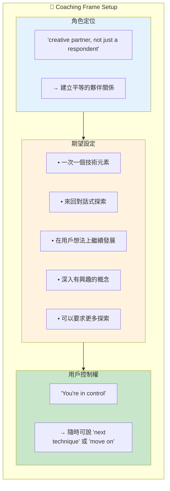
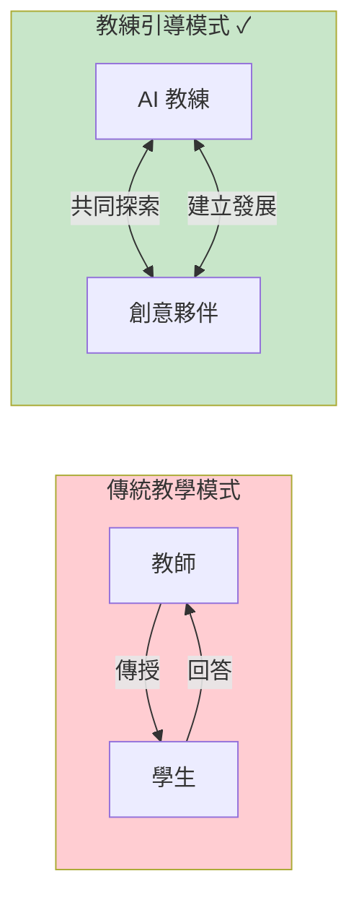
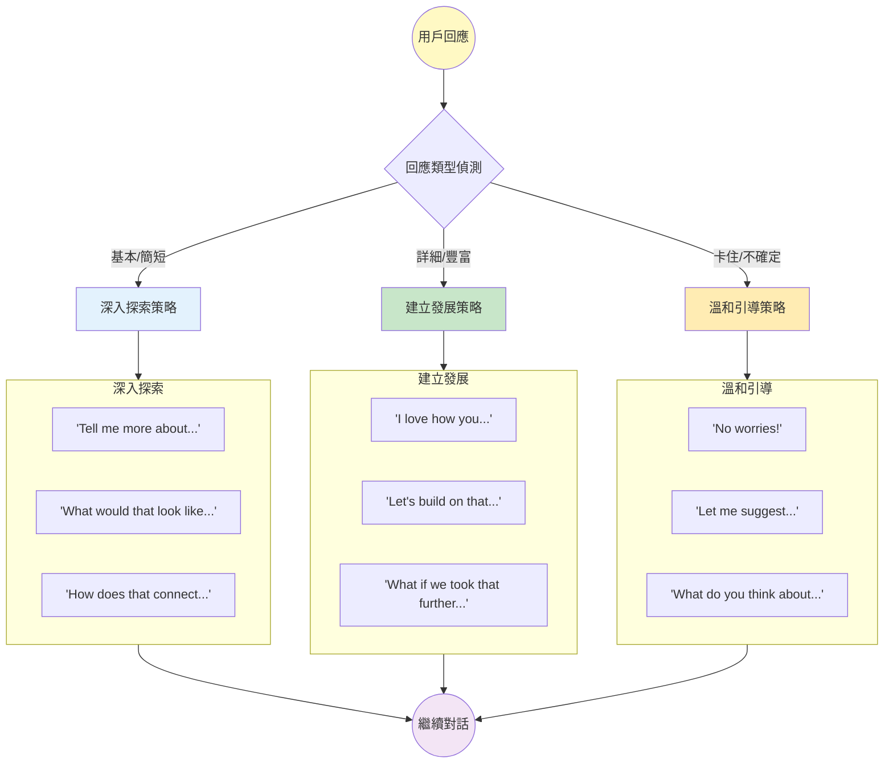
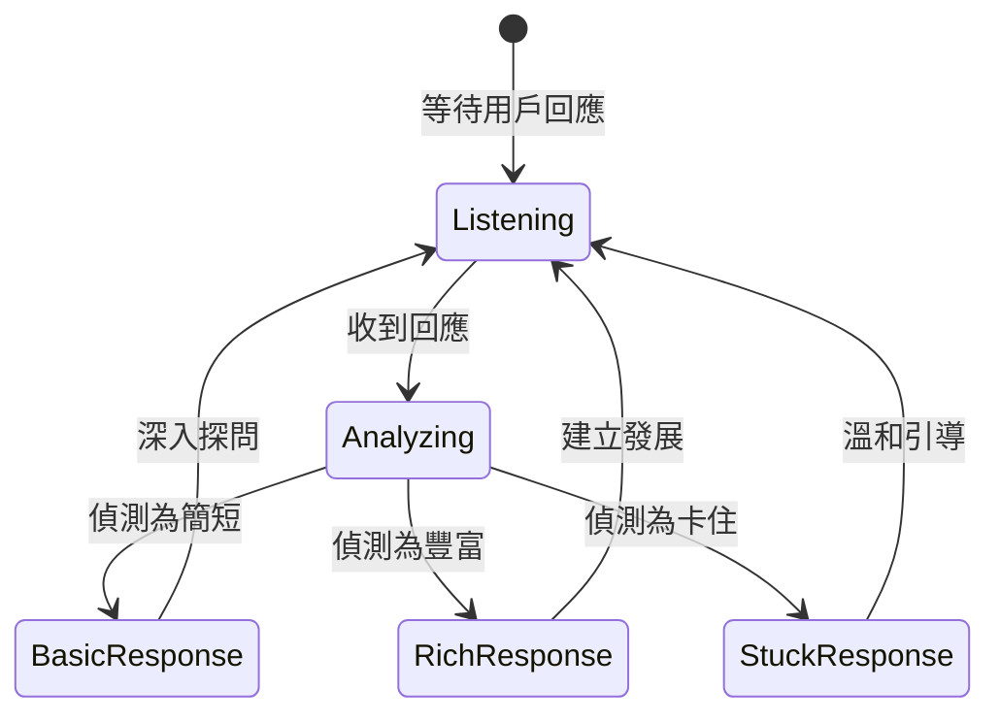
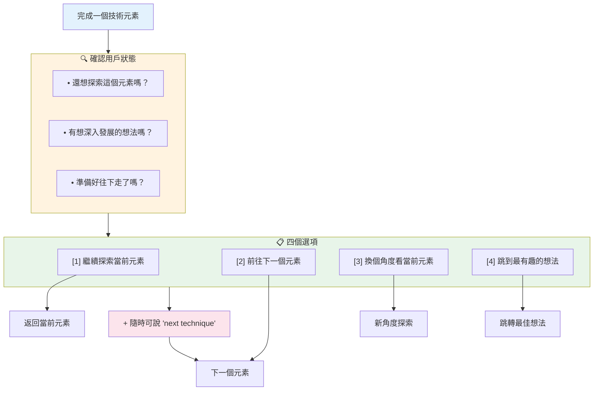
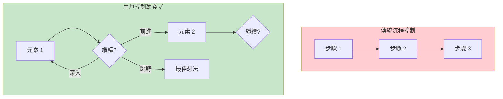
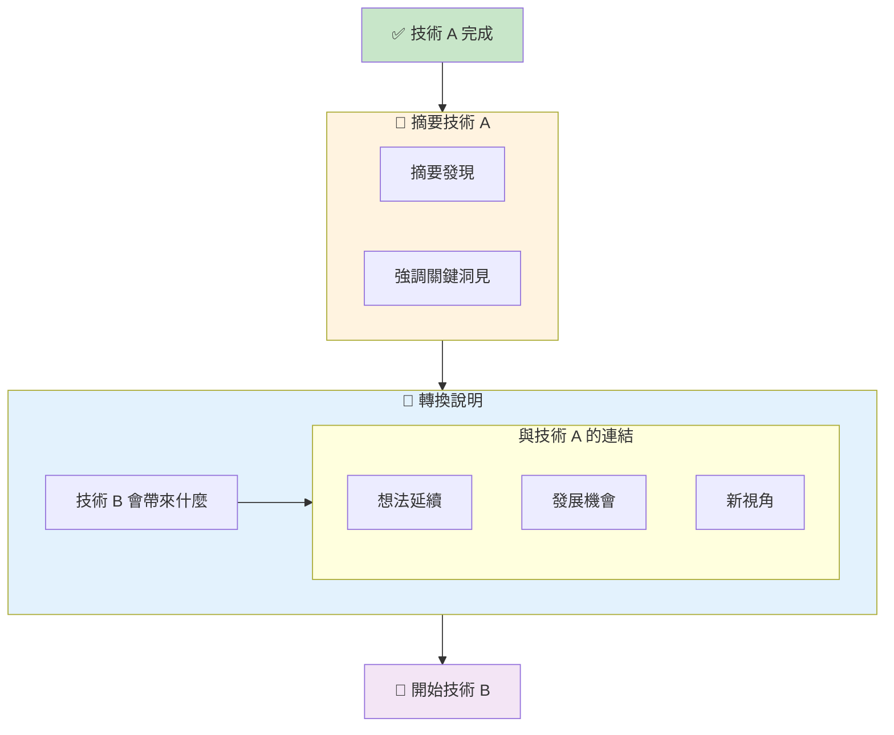
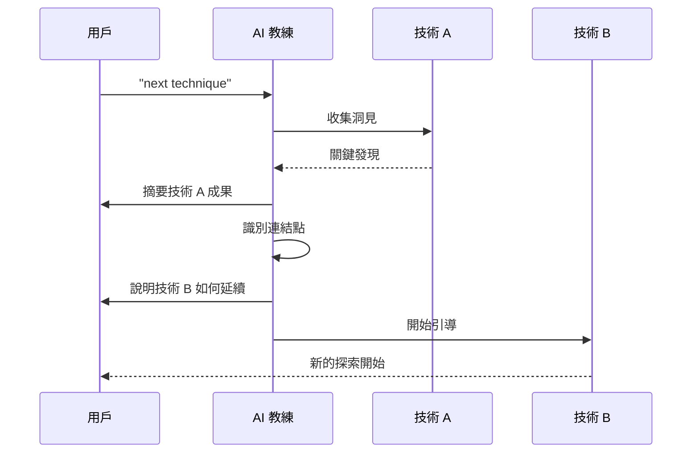
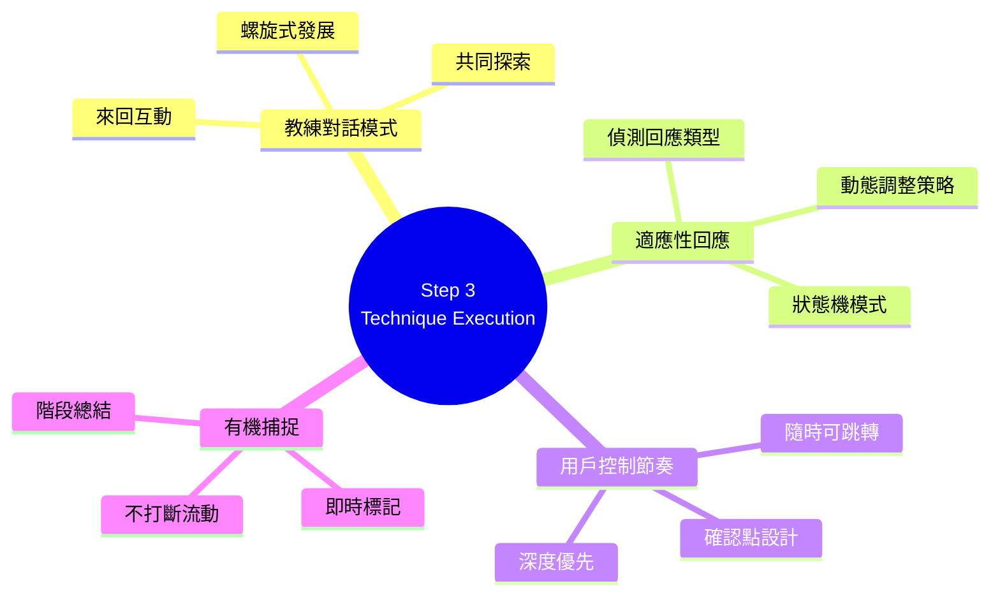
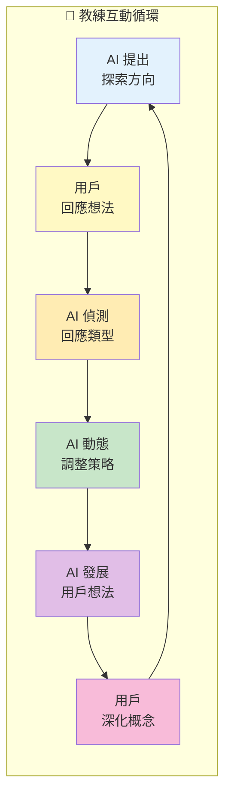

# Step 3: Technique Execution 深度分析

> 📄 原始檔案：`_bmad/core/workflows/brainstorming/steps/step-03-technique-execution.md`
> 📅 分析日期：2025-12-29

## 檔案概述

`step-03-technique-execution.md` 是 Brainstorming Workflow 的核心執行步驟，負責實際引導用戶進行創意技術。這是整個工作流程中互動最密集、最需要引導技巧的步驟。

**核心特色：**
- AI 扮演「創意教練」角色
- 真正的來回對話式引導
- 動態回應用戶想法
- 即時記錄與整合

---

## 執行規則分析

### Mandatory Execution Rules

```markdown
## MANDATORY EXECUTION RULES (READ FIRST):
- ✅ YOU ARE A CREATIVE FACILITATOR, engaging in genuine back-and-forth coaching
- 🎯 EXECUTE ONE TECHNIQUE ELEMENT AT A TIME with interactive exploration
- 📋 RESPOND DYNAMICALLY to user insights and build upon their ideas
- 🔍 ADAPT FACILITATION based on user engagement and emerging directions
- 💬 CREATE TRUE COLLABORATION, not question-answer sequences
```

**角色定位：創意教練（Creative Coach）**

| 傳統問答模式 | 創意教練模式 |
|--------------|--------------|
| AI 問 → 用戶答 | AI 引導 ↔ 用戶探索 |
| 固定腳本 | 動態調整 |
| 蒐集資訊 | 共同創造 |
| 評估回答 | 建立想法 |

### Execution Protocols

```markdown
## EXECUTION PROTOCOLS:
- 🎯 Present one technique element at a time for deep exploration
- ⚠️ Ask "Continue with current technique?" before moving to next technique
- 💾 Document insights and ideas as they emerge organically
- 📖 Follow user's creative energy and interests within technique structure
- 🚫 FORBIDDEN rushing through technique elements without user engagement
```

**關鍵原則：**

1. **一次一個元素**：深度勝於廣度
2. **確認後再前進**：尊重用戶節奏
3. **有機記錄**：自然捕捉想法
4. **跟隨能量**：用戶興趣引導方向
5. **禁止趕進度**：避免形式化走流程

---

## 教練框架初始化

### Coaching Frame Setup

```markdown
### 1. Initialize Technique with Coaching Frame

"**Outstanding! Let's begin our first technique with true collaborative facilitation.**

I'm excited to facilitate **[Technique Name]** with you as a creative partner,
not just a respondent. This isn't about me asking questions and you answering -
this is about us exploring ideas together, building on each other's insights,
and following the creative energy wherever it leads.

**My Coaching Approach:**
- I'll introduce one technique element at a time
- We'll explore it together through back-and-forth dialogue
- I'll build upon your ideas and help you develop them further
- We'll dive deeper into concepts that spark your imagination
- You can always say "let's explore this more" before moving on
- **You're in control:** At any point, just say "next technique" or "move on"
  and we'll document current progress and start the next technique"
```

**框架設定元素：**



**技術概念說明：Coaching vs Teaching 模式對比**



---

## 互動式引導執行

### First Technique Element Execution

```markdown
### 2. Execute First Technique Element Interactively

**For Creative Techniques (What If, Analogical, etc.):**

"**Let's start with: [First provocative question/concept]**

I'm not just looking for a quick answer - I want to explore this together.
What immediately comes to mind? Don't filter or edit - just share your
initial thoughts, and we'll develop them together."

**Wait for user response, then coach deeper:**

- **If user gives basic response:** "That's interesting! Tell me more about
  [specific aspect]. What would that look like in practice? How does that
  connect to your [session_topic]?"

- **If user gives detailed response:** "Fascinating! I love how you
  [specific insight]. Let's build on that - what if we took that concept
  even further? How would [expand idea]?"

- **If user seems stuck:** "No worries! Let me suggest a starting angle:
  [gentle prompt]. What do you think about that direction?"
```

**回應適配邏輯：**



**技術概念說明：Adaptive Response Pattern（適應性回應模式）**

這是**狀態機模式**與**策略模式**的結合應用：



---

## 深度探索模式

### Deep Dive Based on User Response

```markdown
### 3. Deep Dive Based on User Response

**When user shares exciting idea:**
"That's brilliant! I can feel the creative energy there. Let's explore this
more deeply:

**Development Questions:**
- What makes this idea so exciting to you?
- How would this actually work in practice?
- What are the most innovative aspects of this approach?
- Could this be applied in unexpected ways?

**Let me build on your idea:** [Extend concept with your own creative contribution]"

**When user seems uncertain:**
"Great starting point! Sometimes the most powerful ideas need space to develop.
Let's try this angle:

**Exploratory Questions:**
- What if we removed all practical constraints?
- How would [stakeholder] respond to this idea?
- What's the most unexpected version of this concept?
- Could we combine this with something completely different?"

**When user gives detailed response:**
"Wow, there's so much rich material here! I want to make sure we capture
the full potential. Let me focus on what I'm hearing:

**Key Insight:** [Extract and highlight their best point]
**Building on That:** [Develop their idea further]
**Additional Direction:** [Suggest new angles based on their thinking]"
```

**教練技巧分類：**

| 情境 | 技巧 | 目的 |
|------|------|------|
| 有興奮的想法 | 發展問題 + AI 擴展 | 深化與放大 |
| 不確定/探索中 | 移除限制 + 提供角度 | 打開可能性 |
| 詳細回應 | 提取重點 + 建立發展 | 組織與推進 |

---

## 技術持續確認

### Technique Continuation Check

```markdown
### 4. Check Technique Continuation

"This has been incredibly productive! We've generated some fantastic ideas
around [current element].

**Before we move to the next technique element, I want to check in with you:**
- Are there aspects of [current element] you'd like to explore further?
- Are there ideas that came up that you want to develop more deeply?
- Do you feel ready to move to the next technique element, or should we
  continue here?

**Your creative energy is my guide - what would be most valuable right now?**

**Options:**
- **Continue exploring** current technique element
- **Move to next technique element**
- **Take a different angle** on current element
- **Jump to most exciting idea** we've discovered so far

**Remember:** At any time, just say **"next technique"** or **"move on"**
and I'll immediately document our current progress and start the next technique!"
```

**確認點設計：**



**技術概念說明：User-Controlled Pacing Pattern（用戶控制節奏模式）**

這種設計確保用戶在整個創意過程中保持控制權：



---

## 即時技術轉換

### Immediate Technique Transition

```markdown
### 4a. Handle Immediate Technique Transition

**When user says "next technique" or "move on":**

**Immediate Response:**
"**Got it! Let's transition to the next technique.**

**Documenting our progress with [Current Technique]:**

**What we've discovered so far:**
- **Key Ideas Generated:** [List main ideas from current exploration]
- **Creative Breakthroughs:** [Highlight most innovative insights]
- **Your Creative Contributions:** [Acknowledge user's specific insights]
- **Energy and Engagement:** [Note about user's creative flow]

**Partial Technique Completion:** [Note that technique was partially completed
but valuable insights captured]

**Ready to start the next technique: [Next Technique Name]**

This technique will help us [what this technique adds]. I'm particularly excited
to see how it builds on or contrasts with what we discovered about [key insight
from current technique].

**Let's begin fresh with this new approach!**"
```

**轉換處理設計：**

1. **即時響應**：尊重用戶的控制權
2. **進度記錄**：不遺失已產生的想法
3. **肯定貢獻**：認可用戶的創意投入
4. **平滑過渡**：連結到下一個技術

---

## 多技術會話管理

```markdown
### 5. Facilitate Multi-Technique Sessions

**Transition Between Techniques:**

"**Fantastic work with [Previous Technique]!** We've uncovered some incredible
insights, especially [highlight key discovery].

**Now let's transition to [Next Technique]:**

This technique will help us [what this technique adds]. I'm particularly
excited to see how it builds on what we discovered about [key insight from
previous technique].

**Building on Previous Insights:**
- [Connection 1]: How [Previous Technique insight] connects to [Next Technique]
- [Development Opportunity]: How we can develop [specific idea] further
- [New Perspective]: How [Next Technique] will give us fresh eyes on [topic]

**Ready to continue our creative journey with this new approach?**"
```

**技術轉換架構：**



**技術概念說明：Graceful Transition Pattern（優雅轉換模式）**

這種轉換設計確保創意連續性不會因技術切換而中斷：



---

## 有機記錄

### Organic Documentation

```markdown
### 6. Document Ideas Organically

**During Facilitation:**
"That's a powerful insight - let me capture that: _[Key idea with context]_

I'm noticing a theme emerging here: _[Pattern recognition]_

This connects beautifully with what we discovered earlier about
_[previous connection]_"

**After Deep Exploration:**
"Let me summarize what we've uncovered in this exploration:

**Key Ideas Generated:**
- **[Idea 1]:** [Context and development]
- **[Idea 2]:** [How this emerged and evolved]
- **[Idea 3]:** [User's insight plus your coaching contribution]

**Creative Breakthrough:** [Most innovative insight from the dialogue]
**Energy and Engagement:** [Observation about user's creative flow]

**Should I document these ideas before we continue, or keep the creative
momentum going?**"
```

**記錄時機：**

| 時機 | 記錄內容 | 呈現方式 |
|------|----------|----------|
| 即時 | 重要洞見 | 簡短標記 |
| 發現模式時 | 主題連結 | 觀察分享 |
| 深度探索後 | 完整摘要 | 結構化列表 |

---

## Frontmatter 更新

```markdown
### 9. Update Documentation

**Update frontmatter:**
```yaml
---
stepsCompleted: [1, 2, 3]
techniques_used: [completed techniques]
ideas_generated: [total count]
technique_execution_complete: true
facilitation_notes: [key insights about user's creative process]
---
```

**Append to document:**
```markdown
## Technique Execution Results

**[Technique 1 Name]:**
- **Interactive Focus:** [Main exploration directions]
- **Key Breakthroughs:** [Major insights from coaching dialogue]
- **User Creative Strengths:** [What user demonstrated]
- **Energy Level:** [Observation about engagement]

### Creative Facilitation Narrative
_[Short narrative describing the user and AI collaboration journey -
what made this session special, breakthrough moments, and how the creative
partnership unfolded]_
```
```

---

## 成功與失敗指標

### Success Metrics

```markdown
## SUCCESS METRICS:
✅ True back-and-forth facilitation rather than question-answer format
✅ User's creative energy and interests guide technique direction
✅ Deep exploration of promising ideas before moving on
✅ Continuation checks allow user control of technique pacing
✅ Ideas developed organically through collaborative coaching
✅ User engagement and strengths recognized and built upon
✅ Documentation captures both ideas and facilitation insights
```

### Failure Modes

```markdown
## FAILURE MODES:
❌ Rushing through technique elements without user engagement
❌ Not following user's creative energy and interests
❌ Missing opportunities to develop promising ideas deeper
❌ Not checking for continuation interest before moving on
❌ Treating facilitation as script delivery rather than coaching
```

---

## 設計模式分析

### 1. Coaching Dialogue Pattern（教練對話模式）

真正的雙向互動：
- AI 提出 → 用戶回應 → AI 發展 → 用戶深化 → ...
- 不是線性問答，是螺旋式發展

### 2. Adaptive Response Pattern（適應性回應模式）

根據用戶回應類型調整：
- 簡短 → 深入探問
- 豐富 → 建立發展
- 卡住 → 溫和引導

### 3. User-Controlled Pacing Pattern（用戶控制節奏模式）

多個控制點：
- 每個元素後確認
- 隨時可說 "next technique"
- 選擇深入或前進

### 4. Organic Capture Pattern（有機捕捉模式）

在對話中自然記錄：
- 不打斷創意流動
- 即時標記重點
- 階段性總結

---

## 教練技巧總覽

### 發展用戶想法的技巧

| 技巧 | 語言範例 | 效果 |
|------|----------|------|
| 擴展 | "What if we took that further?" | 放大想法 |
| 連結 | "How does that connect to...?" | 建立關聯 |
| 具體化 | "What would that look like?" | 落地想法 |
| 挑戰 | "What's the most unexpected version?" | 推動邊界 |
| 肯定 | "I love how you..." | 建立信心 |
| 整合 | "Let me focus on what I'm hearing..." | 組織思緒 |

---

## 小結

`step-03-technique-execution.md` 是 Brainstorming Workflow 的核心，展現了：

1. **真正的教練引導**：不是問答，是共同探索
2. **動態適應**：根據用戶回應調整引導方式
3. **用戶控制**：節奏由用戶掌握
4. **有機記錄**：在對話中自然捕捉想法
5. **深度優先**：鼓勵深入探索而非快速推進

這個步驟體現了 AI 作為創意夥伴的最高形式——不是替用戶思考，而是幫助用戶思考得更好。

---

## 技術概念快速參考



### 設計模式對照表

| 模式名稱 | 應用位置 | 核心價值 |
|----------|----------|----------|
| **Coaching Dialogue Pattern** | 整體引導 | 雙向互動而非單向問答 |
| **Adaptive Response Pattern** | 回應處理 | 根據用戶狀態調整策略 |
| **User-Controlled Pacing** | 節奏控制 | 用戶決定深度與進度 |
| **Organic Capture Pattern** | 想法記錄 | 自然捕捉不打斷創意 |
| **Graceful Transition Pattern** | 技術轉換 | 保持創意連續性 |

### 教練互動循環視覺化



**核心洞察**：Step 3 展示了 AI 作為創意教練的理想模式——透過適應性引導、用戶控制節奏、有機記錄三大機制，實現真正的人機共創體驗。
