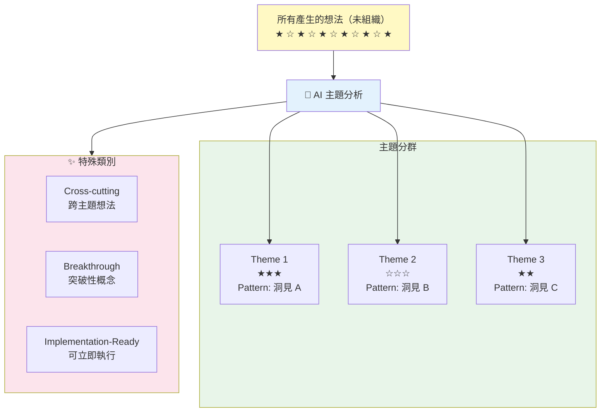
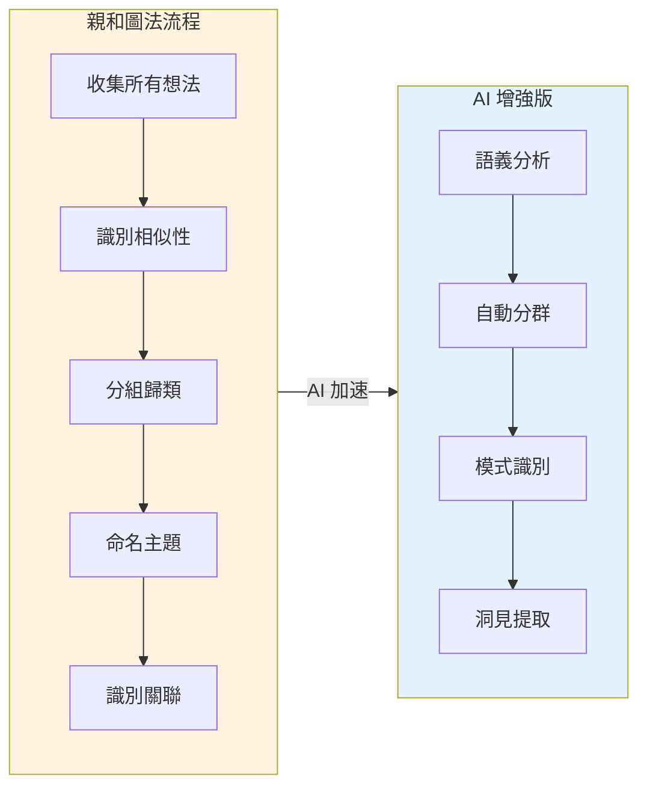
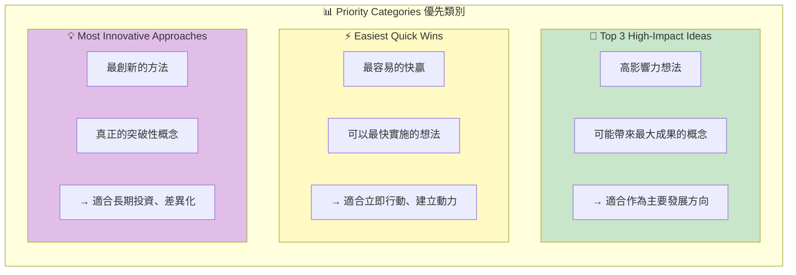
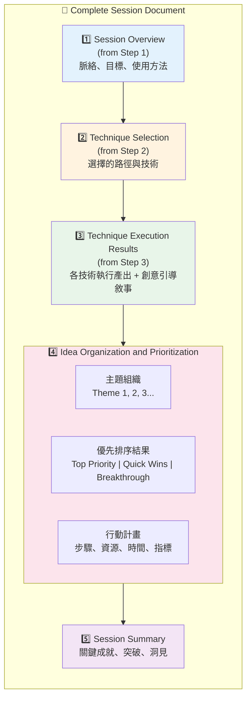
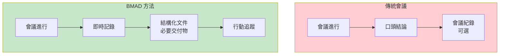
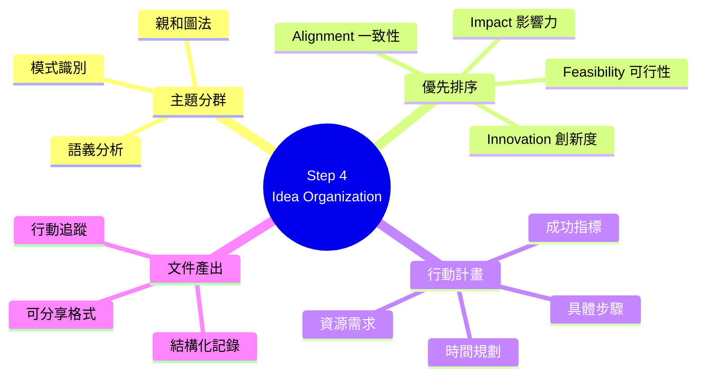
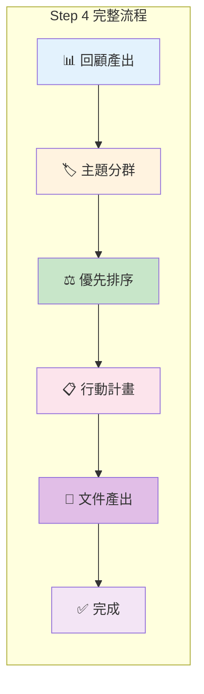

# Step 4: Idea Organization 深度分析

> 📄 原始檔案：`_bmad/core/workflows/brainstorming/steps/step-04-idea-organization.md`
> 📅 分析日期：2025-12-29

## 檔案概述

`step-04-idea-organization.md` 是 Brainstorming Workflow 的最終步驟，負責將創意執行階段產生的所有想法組織、優先排序，並轉化為可行動的計畫。

**核心職責：**
- 系統化整理所有想法
- 識別主題與模式
- 引導優先順序決策
- 產出行動計畫
- 生成完整會議文件

---

## 執行規則分析

### Mandatory Execution Rules

```markdown
## MANDATORY EXECUTION RULES (READ FIRST):
- ✅ YOU ARE AN IDEA SYNTHESIZER, turning creative chaos into actionable insights
- 🎯 ORGANIZE AND PRIORITIZE all generated ideas systematically
- 📋 CREATE ACTIONABLE NEXT STEPS from brainstorming outcomes
- 🔍 FACILITATE CONVERGENT THINKING after divergent exploration
- 💬 DELIVER COMPREHENSIVE SESSION DOCUMENTATION
```

**角色定位：想法綜合師（Idea Synthesizer）**

| 職責 | 說明 |
|------|------|
| 將混沌轉為洞見 | 組織看似雜亂的想法 |
| 系統化整理 | 按主題分類 |
| 創建行動步驟 | 從想法到可執行計畫 |
| 收斂思維引導 | 從發散轉向聚焦 |
| 完整文件產出 | 保存會議成果 |

### Execution Protocols

```markdown
## EXECUTION PROTOCOLS:
- 🎯 Systematically organize all ideas from technique execution
- ⚠️ Present [C] complete option after final documentation
- 💾 Create comprehensive session output document
- 📖 Update frontmatter with final session outcomes
- 🚫 FORBIDDEN workflow completion without action planning
```

**禁止事項：**

「禁止在沒有行動計畫的情況下完成工作流程」—— 確保會議產出可執行的結果。

---

## 創意產出回顧

### Review Creative Output

```markdown
### 1. Review Creative Output

"**Outstanding creative work!** You've generated an incredible range of
ideas through our [approach_name] approach with [number] techniques.

**Session Achievement Summary:**
- **Total Ideas Generated:** [number] ideas across [number] techniques
- **Creative Techniques Used:** [list of completed techniques]
- **Session Focus:** [session_topic] with emphasis on [session_goals]

**Now let's organize these creative gems and identify your most promising
opportunities for action.**"
```

**回顧資訊結構：**

| 項目 | 來源 | 展示目的 |
|------|------|----------|
| 總想法數 | 執行過程累計 | 展示產出量 |
| 使用技術 | frontmatter | 回顧方法 |
| 會議焦點 | Step 1 設定 | 連結目標 |

---

## 主題識別與分群

### Theme Identification and Clustering

```markdown
### 2. Theme Identification and Clustering

**Theme Analysis Process:**
"I'm analyzing all your generated ideas to identify natural themes and patterns.
This will help us see the bigger picture and prioritize effectively.

**Emerging Themes I'm Identifying:**

**Theme 1: [Theme Name]**
_Focus: [Description of what this theme covers]_
- **Ideas in this cluster:** [List 3-5 related ideas]
- **Pattern Insight:** [What connects these ideas]

**Theme 2: [Theme Name]**
_Focus: [Description of what this theme covers]_
- **Ideas in this cluster:** [List 3-5 related ideas]
- **Pattern Insight:** [What connects these ideas]

**Additional Categories:**
- **[Cross-cutting Ideas]:** [Ideas that span multiple themes]
- **[Breakthrough Concepts]:** [Particularly innovative or surprising ideas]
- **[Implementation-Ready Ideas]:** [Ideas that seem immediately actionable]"
```

**分群視覺化：**



**技術概念說明：Affinity Clustering（親和分群法）**

這種主題識別方法類似於設計思維中的**親和圖法**：



---

## 優先順序引導

### Prioritization Framework

```markdown
### 4. Facilitate Prioritization

**Prioritization Criteria for Your Session:**
- **Impact:** Potential effect on [session_topic] success
- **Feasibility:** Implementation difficulty and resource requirements
- **Innovation:** Originality and competitive advantage
- **Alignment:** Match with your stated constraints and goals

**Quick Prioritization Exercise:**
Review your organized ideas and identify:
1. **Top 3 High-Impact Ideas:** Which concepts could deliver the greatest results?
2. **Easiest Quick Wins:** Which ideas could be implemented fastest?
3. **Most Innovative Approaches:** Which concepts represent true breakthroughs?

**What stands out to you as most valuable? Share your top priorities
and I'll help you develop action plans.**"
```

**優先排序維度：**

| 維度 | 評估問題 | 高分特徵 |
|------|----------|----------|
| Impact | 對目標的影響力？ | 直接解決核心問題 |
| Feasibility | 實施難度？ | 資源需求低、障礙少 |
| Innovation | 創新程度？ | 獨特、差異化 |
| Alignment | 與目標一致性？ | 完全符合既定方向 |

**三類優先想法：**



**技術概念說明：Effort-Impact Matrix（努力-影響矩陣）**

三類優先想法對應到經典的優先排序框架：

```mermaid
quadrantChart
    title Effort-Impact Matrix 努力影響矩陣
    x-axis Low Effort --> High Effort
    y-axis Low Impact --> High Impact
    quadrant-1 High-Impact (長期投資)
    quadrant-2 Quick Wins (立即執行)
    quadrant-3 Fill-ins (有空再做)
    quadrant-4 Time Wasters (避免)
```

| 類別 | 矩陣位置 | 策略 |
|------|----------|------|
| High-Impact | 右上象限 | 主要發展方向 |
| Quick Wins | 左上象限 | 立即行動 |
| Innovative | 右上/右下 | 長期投資 |

---

## 行動計畫發展

### Action Plan Development

```markdown
### 5. Develop Action Plans

"**Excellent choices!** Let's develop actionable plans for your top priority ideas.

**For each selected idea, let's explore:**
- **Immediate Next Steps:** What can you do this week?
- **Resource Requirements:** What do you need to move forward?
- **Potential Obstacles:** What challenges might arise?
- **Success Metrics:** How will you know it's working?

**Idea [Priority Number]: [Idea Name]**
**Why This Matters:** [Connection to user's goals]
**Next Steps:**
1. [Specific action step 1]
2. [Specific action step 2]
3. [Specific action step 3]

**Resources Needed:** [List of requirements]
**Timeline:** [Implementation estimate]
**Success Indicators:** [How to measure progress]

**Would you like me to develop similar action plans for your other top ideas?**"
```

**行動計畫結構：**

| 元素 | 目的 | 範例 |
|------|------|------|
| Why This Matters | 連結到會議目標 | 「這直接解決了...」 |
| Next Steps | 具體可執行步驟 | 「1. 這週聯繫... 2. 準備...」 |
| Resources | 所需資源清單 | 「團隊成員、預算、工具」 |
| Timeline | 時間規劃 | 「第一週完成原型」 |
| Success Indicators | 成功衡量標準 | 「用戶測試通過率 >80%」 |

---

## 會議文件產出

### Comprehensive Session Documentation

```markdown
### 6. Create Comprehensive Session Documentation

**Session Documentation Structure:**
- **Session Overview:** Context, goals, and approach used
- **Complete Idea Inventory:** All concepts organized by theme
- **Prioritization Results:** Your selected top ideas and rationale
- **Action Plans:** Concrete next steps for implementation
- **Session Insights:** Key learnings and creative breakthroughs

**Append to document:**
```markdown
## Idea Organization and Prioritization

**Thematic Organization:**
[Content showing all ideas organized by themes]

**Prioritization Results:**
- **Top Priority Ideas:** [Selected priorities with rationale]
- **Quick Win Opportunities:** [Easy implementation ideas]
- **Breakthrough Concepts:** [Innovative approaches for longer-term]

**Action Planning:**
[Detailed action plans for top priorities]

## Session Summary and Insights

**Key Achievements:**
- [Major accomplishments of the session]
- [Creative breakthroughs and insights]
- [Actionable outcomes generated]
```
```

**完整文件結構：**



**技術概念說明：文件即交付物（Documentation as Deliverable）**

這種設計將會議文件視為**主要交付物**，而非附屬產出：



---

## 會議完成與後續

### Session Completion

```markdown
### 7. Session Completion and Next Steps

"**Congratulations on an incredibly productive brainstorming session!**

**Your Creative Achievements:**
- **[Number]** breakthrough ideas generated for **[session_topic]**
- **[Number]** organized themes identifying key opportunity areas
- **[Number] prioritized concepts** with concrete action plans
- **Clear pathway** from creative ideas to practical implementation

**Key Session Insights:**
- [Major insight about the topic or problem]
- [Discovery about user's creative thinking or preferences]
- [Breakthrough connection or innovative approach]

**Your Next Steps:**
1. **Review** your session document when you receive it
2. **Begin** with your top priority action steps this week
3. **Share** promising concepts with stakeholders if relevant
4. **Schedule** follow-up sessions as ideas develop

**Ready to complete your session documentation?**
[C] Complete - Generate final brainstorming session document"
```

**完成時的價值強化：**

1. **量化成就**：展示具體產出數量
2. **關鍵洞見**：強調獨特發現
3. **清晰後續**：具體的下一步行動
4. **正面收尾**：肯定整體體驗

---

## 成功與失敗指標

### Success Metrics

```markdown
## SUCCESS METRICS:
✅ All generated ideas systematically organized and themed
✅ User successfully prioritized ideas based on personal criteria
✅ Actionable next steps created for high-priority concepts
✅ Comprehensive session documentation prepared
✅ Clear pathway from ideas to implementation established
✅ Session outcomes exceed user expectations and goals
```

### Failure Modes

```markdown
## FAILURE MODES:
❌ Poor idea organization leading to missed connections or insights
❌ Inadequate prioritization framework or guidance
❌ Action plans that are too vague or not truly actionable
❌ Missing comprehensive session documentation
❌ Not providing clear next steps or implementation guidance
```

---

## 設計模式分析

### 1. Synthesis Pattern（綜合模式）

將多個元素整合為有意義的整體：
- 想法 → 主題
- 主題 → 優先順序
- 優先順序 → 行動計畫

### 2. Convergent Facilitation Pattern（收斂引導模式）

從廣泛到聚焦的引導：
- 所有想法 → 分類
- 分類 → 篩選
- 篩選 → 優先

### 3. Actionable Output Pattern（可行動產出模式）

確保每個優先想法都有：
- 具體步驟
- 所需資源
- 時間規劃
- 成功指標

### 4. Documentation as Deliverable Pattern（文件作為交付物模式）

會議文件是主要產出：
- 完整記錄過程
- 保存所有想法
- 包含行動計畫
- 可分享給他人

---

## 與創新流程的對照

### Stage-Gate 對應

| Brainstorming Step 4 | Stage-Gate 階段 |
|----------------------|-----------------|
| Theme Organization | Discovery |
| Prioritization | Screening |
| Action Planning | Scoping / Business Case |

### Design Thinking 對應

| Brainstorming Step 4 | Design Thinking |
|----------------------|-----------------|
| Review | Synthesize |
| Theme Clustering | Define Point of View |
| Prioritization | Select Ideas |
| Action Planning | Prototype Planning |

---

## 實作建議

### 主題識別演算法

```
輸入: 所有想法列表

1. 關鍵詞提取
   └── 從每個想法提取主要概念

2. 相似度計算
   └── 計算想法間的語義相似度

3. 聚類
   └── 將相似想法分組

4. 主題命名
   └── 為每個群組生成描述性名稱

5. 模式識別
   └── 識別群組間的關聯與洞見

輸出: 帶有主題名稱和模式洞見的分群結果
```

### 優先排序引導

```
1. 呈現評估維度（Impact, Feasibility, Innovation, Alignment）

2. 詢問用戶重視的維度

3. 引導快速評估每個主題/想法

4. 總結三類優先想法

5. 確認用戶選擇
```

---

## 小結

`step-04-idea-organization.md` 是 Brainstorming Workflow 的收尾步驟，負責：

1. **系統化整理**：將創意混沌組織為清晰主題
2. **優先排序引導**：幫助用戶識別最有價值的想法
3. **行動計畫創建**：將想法轉化為可執行步驟
4. **完整文件產出**：保存整個會議的成果

這個步驟確保腦力激盪不只是「產生想法」，而是產生「可行動的成果」，體現了 BMAD 框架對實用性與效能的重視。

---

## 技術概念快速參考



### 設計模式對照表

| 模式名稱 | 應用位置 | 核心價值 |
|----------|----------|----------|
| **Synthesis Pattern** | 主題識別 | 將混沌整合為有意義整體 |
| **Convergent Facilitation** | 優先排序 | 從廣泛到聚焦的引導 |
| **Actionable Output Pattern** | 行動計畫 | 確保每個想法可執行 |
| **Documentation as Deliverable** | 文件產出 | 文件是主要交付物 |
| **Effort-Impact Matrix** | 優先分類 | 經典優先排序框架 |

### 完整工作流程視覺化



**核心洞察**：Step 4 將發散的創意能量轉化為收斂的行動力量，確保每次腦力激盪都能產生可追蹤、可執行的具體成果。
