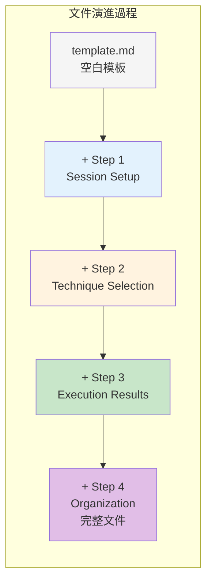
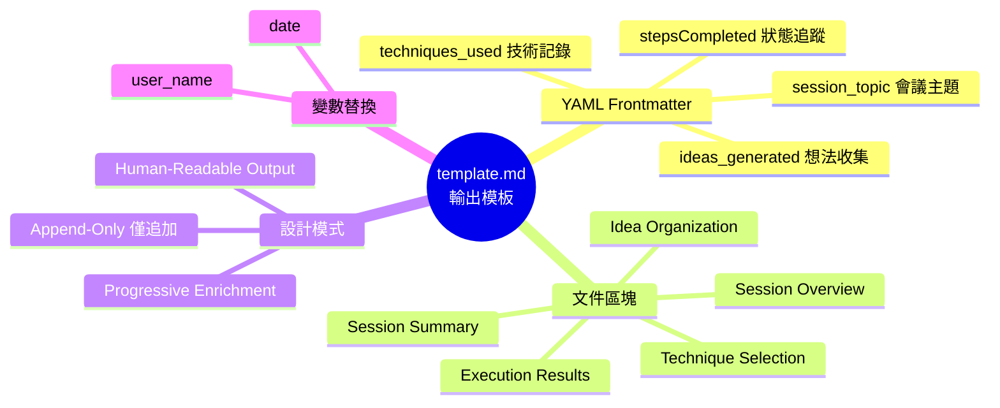
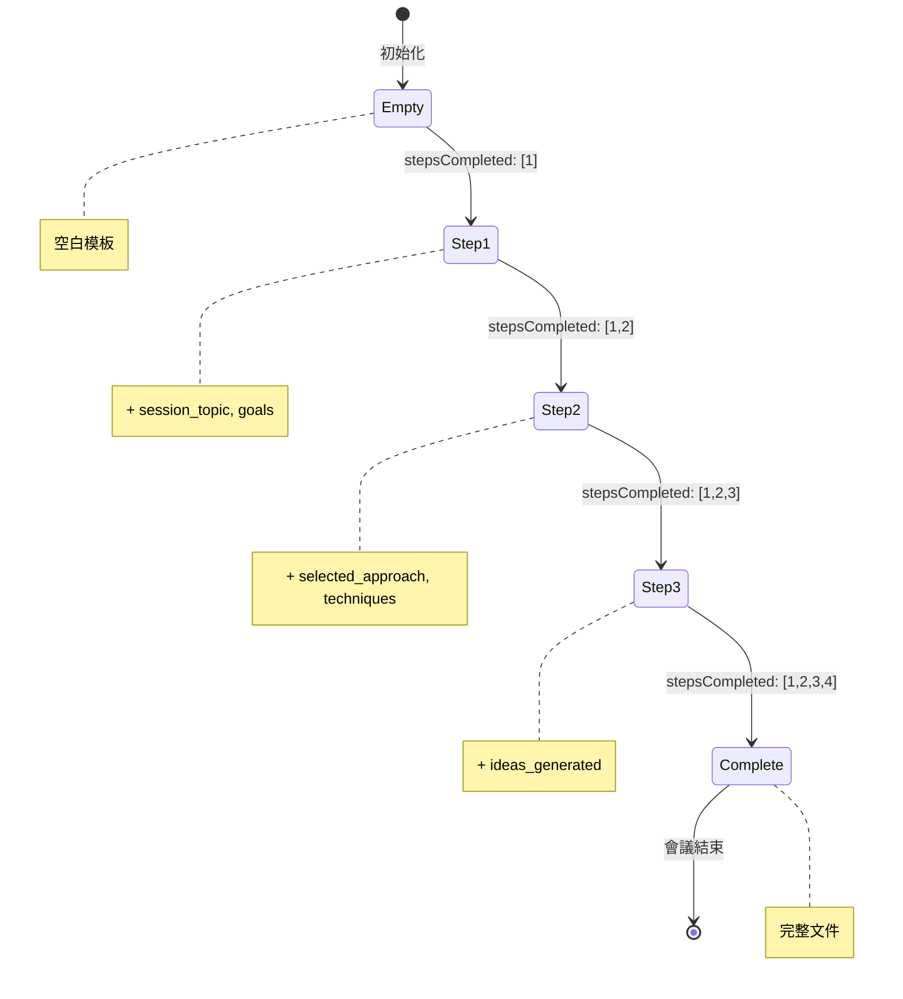

# Template.md 深度分析

> 📄 原始檔案：`_bmad/core/workflows/brainstorming/template.md`
> 📅 分析日期：2025-12-29

## 檔案概述

`template.md` 是 Brainstorming Workflow 的輸出文件模板，用於初始化新的腦力激盪會議文件。

**檔案內容：**

```markdown
---
stepsCompleted: []
inputDocuments: []
session_topic: ''
session_goals: ''
selected_approach: ''
techniques_used: []
ideas_generated: []
context_file: ''
---

# Brainstorming Session Results

**Facilitator:** {{user_name}}
**Date:** {{date}}
```

---

## 結構剖析

### Frontmatter 區塊

**欄位定義：**

| 欄位 | 類型 | 初始值 | 用途 |
|------|------|--------|------|
| `stepsCompleted` | Array | `[]` | 追蹤已完成的步驟 |
| `inputDocuments` | Array | `[]` | 會議參考文件 |
| `session_topic` | String | `''` | 會議主題 |
| `session_goals` | String | `''` | 會議目標 |
| `selected_approach` | String | `''` | 選擇的技術路徑 |
| `techniques_used` | Array | `[]` | 使用的創意技術 |
| `ideas_generated` | Array | `[]` | 產生的想法 |
| `context_file` | String | `''` | 專案脈絡檔案 |

### 狀態追蹤機制

**stepsCompleted 演進：**

```
初始化:     []
Step 1:     [1]
Step 2:     [1, 2]
Step 3:     [1, 2, 3]
Step 4:     [1, 2, 3, 4]
```

**techniques_used 演進：**

```
初始化:     []
Step 2:     ['SCAMPER', 'What If Scenarios']
Step 3:     ['SCAMPER', 'What If Scenarios']  // 不變
Step 4:     ['SCAMPER', 'What If Scenarios']  // 不變
```

---

## 文件內容區塊

### 標題與元資料

```markdown
# Brainstorming Session Results

**Facilitator:** {{user_name}}
**Date:** {{date}}
```

**變數替換：**

| 變數 | 來源 | 範例值 |
|------|------|--------|
| `{{user_name}}` | config.yaml | Pi |
| `{{date}}` | 系統產生 | 2025-12-29 |

---

## 文件演進過程

### 完整文件結構（會議結束時）

```markdown
---
stepsCompleted: [1, 2, 3, 4]
inputDocuments: []
session_topic: '產品創新策略'
session_goals: '發掘新功能點子與市場機會'
selected_approach: 'ai-recommended'
techniques_used: ['SCAMPER', 'What If Scenarios', 'Five Whys']
ideas_generated: ['想法1', '想法2', '想法3', ...]
context_file: ''
---

# Brainstorming Session Results

**Facilitator:** Pi
**Date:** 2025-12-29

## Session Overview

**Topic:** 產品創新策略
**Goals:** 發掘新功能點子與市場機會

### Context Guidance

_[如有 context_file，此處會有專案脈絡摘要]_

### Session Setup

_[會議設定過程的記錄]_

## Technique Selection

**Approach:** AI-Recommended Techniques
**Analysis Context:** 產品創新策略 with focus on 發掘新功能點子

**Recommended Techniques:**
- **SCAMPER:** [推薦理由與預期結果]
- **What If Scenarios:** [如何建立在第一技術之上]
- **Five Whys:** [如何完成序列]

**AI Rationale:** [基於脈絡分析的匹配邏輯]

## Technique Execution Results

**SCAMPER Method:**
- **Interactive Focus:** [主要探索方向]
- **Key Breakthroughs:** [教練對話中的重大洞見]
- **User Creative Strengths:** [用戶展示的創意能力]
- **Energy Level:** [參與度觀察]

**What If Scenarios:**
- **Building on Previous:** [技術間的連結]
- **New Insights:** [新發現]
- **Developed Ideas:** [透過教練發展的概念]

### Creative Facilitation Narrative

_[描述用戶與 AI 協作旅程的簡短敘事——
是什麼讓這次會議特別、突破時刻、
以及創意夥伴關係如何展開]_

### Session Highlights

**User Creative Strengths:** [用戶在技術中展示的能力]
**AI Facilitation Approach:** [教練如何適應用戶風格]
**Breakthrough Moments:** [發生的具體創意突破]
**Energy Flow:** [創意動力與參與度描述]

## Idea Organization and Prioritization

**Thematic Organization:**

### Theme 1: [主題名稱]
_Focus: [主題覆蓋範圍描述]_
- [想法1]: [脈絡與發展]
- [想法2]: [脈絡與發展]

### Theme 2: [主題名稱]
_Focus: [主題覆蓋範圍描述]_
- [想法1]: [脈絡與發展]
- [想法2]: [脈絡與發展]

**Prioritization Results:**
- **Top Priority Ideas:** [選擇的優先項目與理由]
- **Quick Win Opportunities:** [容易實施的想法]
- **Breakthrough Concepts:** [長期創新方法]

**Action Planning:**

### Priority 1: [想法名稱]
**Why This Matters:** [與用戶目標的連結]
**Next Steps:**
1. [具體行動步驟 1]
2. [具體行動步驟 2]
3. [具體行動步驟 3]

**Resources Needed:** [需求列表]
**Timeline:** [實施估計]
**Success Indicators:** [如何衡量進度]

## Session Summary and Insights

**Key Achievements:**
- [會議的主要成就]
- [創意突破與洞見]
- [產生的可行動成果]

**Session Reflections:**
[關於什麼有效與關鍵學習的內容]
```

---

## 設計模式分析

### 1. Append-Only Pattern（僅追加模式）

文件只增加內容，不修改已有部分：
- 每個步驟追加新區塊
- 保留完整過程記錄
- 支援中斷續行

### 2. Frontmatter as State Pattern（前置資料作為狀態）

YAML frontmatter 作為結構化狀態存儲：
- 機器可讀
- 易於解析
- 支援狀態恢復

### 3. Progressive Enrichment Pattern（漸進豐富模式）

文件隨會議進行逐漸豐富：

```
模板 → Step 1 內容 → Step 2 內容 → Step 3 內容 → Step 4 內容
```

### 4. Human-Readable Output Pattern（人類可讀輸出模式）

最終文件是完整的 Markdown 文件：
- 可以直接閱讀
- 可以分享給他人
- 可以匯出為 PDF/HTML

---

## 與 Party Mode 的比較

| 面向 | Brainstorming Template | Party Mode |
|------|------------------------|------------|
| 輸出文件 | 有（template.md） | 無 |
| 狀態持久化 | YAML frontmatter | 無 |
| 續行支援 | 是 | 否 |
| 最終產出 | 完整會議文件 | 對話記錄（僅限對話介面） |

---

## 使用流程

```mermaid
flowchart TD
    subgraph FLOW["📄 Template Usage Flow"]
        direction TB

        subgraph S1["Step 1: Session Setup"]
            S1a["1. 複製 template.md 到輸出目錄"]
            S1b["2. 替換變數 &#123;&#123;user_name&#125;&#125;, &#123;&#123;date&#125;&#125;"]
            S1c["3. 更新 frontmatter: stepsCompleted: [1]"]
            S1d["4. 追加 Session Overview 區塊"]
        end

        subgraph S2["Step 2: Technique Selection"]
            S2a["1. 更新 frontmatter: stepsCompleted: [1, 2]"]
            S2b["2. 更新 selected_approach, techniques"]
            S2c["3. 追加 Technique Selection 區塊"]
        end

        subgraph S3["Step 3: Technique Execution"]
            S3a["1. 更新 frontmatter: stepsCompleted: [1, 2, 3]"]
            S3b["2. 更新 frontmatter: ideas_generated"]
            S3c["3. 追加 Technique Execution Results 區塊"]
        end

        subgraph S4["Step 4: Idea Organization"]
            S4a["1. 更新 stepsCompleted: [1, 2, 3, 4]"]
            S4b["2. 追加 Idea Organization 區塊"]
            S4c["3. 追加 Session Summary 區塊"]
            S4d["4. 完成文件 ✅"]
        end

        S1 --> S2 --> S3 --> S4
    end

    style S1 fill:#e3f2fd
    style S2 fill:#fff3e0
    style S3 fill:#c8e6c9
    style S4 fill:#fce4ec
```



**技術概念說明：Append-Only Document Pattern（僅追加文件模式）**

這種文件演進模式確保完整的過程記錄：



---

## 擴展建議

### 增加版本資訊

```yaml
---
workflow_version: '1.0.0'
created_at: '2025-12-29T10:00:00Z'
last_modified: '2025-12-29T11:30:00Z'
stepsCompleted: []
...
---
```

### 增加協作資訊

```yaml
---
participants: ['Pi']
facilitator_model: 'claude-opus-4-5'
session_id: 'uuid-here'
...
---
```

### 增加匯出格式支援

可以根據 frontmatter 產生不同格式：
- PDF 摘要
- 簡報投影片
- 專案管理工具匯入格式

---

## 小結

`template.md` 是 Brainstorming Workflow 的輸出框架：

1. **結構化狀態**：YAML frontmatter 追蹤會議進度
2. **漸進豐富**：隨會議進行內容逐漸累積
3. **人類可讀**：最終產出是完整的 Markdown 文件
4. **支援續行**：狀態持久化支援中斷恢復

這個模板體現了 BMAD 框架對「產出導向」的設計理念——腦力激盪不只是對話，而是產生可保存、可分享、可執行的成果。

---

## 技術概念快速參考



### 設計模式對照表

| 模式名稱 | 應用位置 | 核心價值 |
|----------|----------|----------|
| **Append-Only Pattern** | 文件更新策略 | 保留完整過程記錄 |
| **Frontmatter as State** | YAML 區塊 | 結構化狀態存儲 |
| **Progressive Enrichment** | 內容累積 | 隨會議進行豐富內容 |
| **Human-Readable Output** | 最終格式 | 可直接閱讀分享 |
| **Template Variable** | 變數替換 | 動態個人化內容 |

### Frontmatter 狀態演進視覺化



**核心洞察**：template.md 不只是空白模板，而是一個精心設計的**狀態容器**與**輸出框架**，透過 YAML frontmatter 追蹤進度、透過 Markdown 區塊累積內容，最終產出可讀可分享的完整會議文件。
