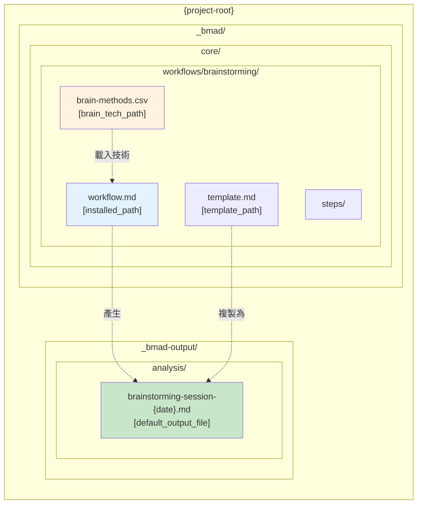
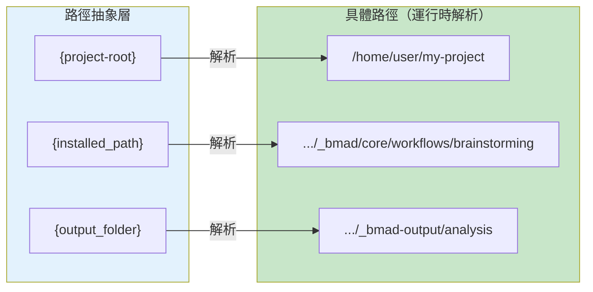
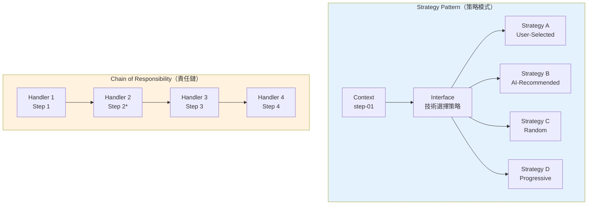
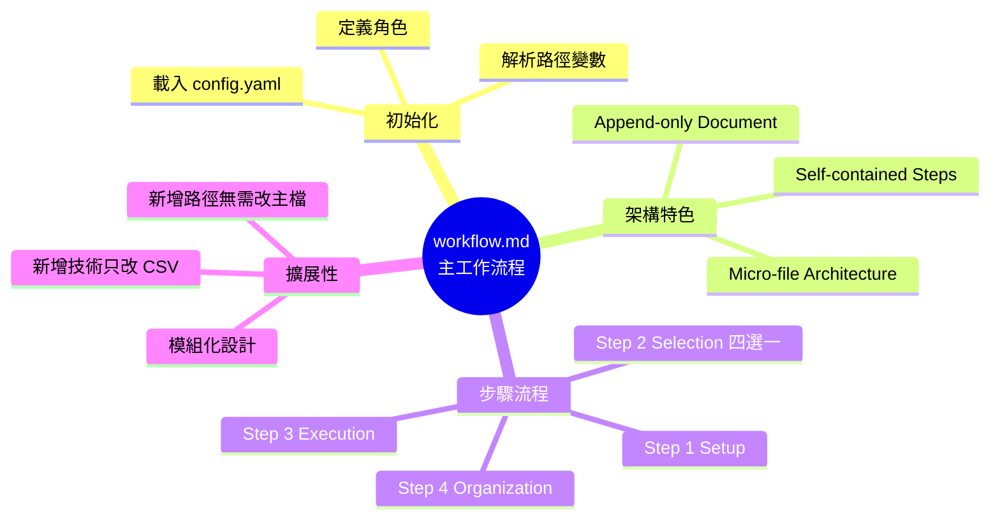
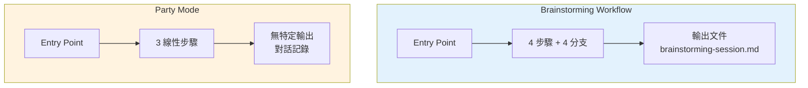

# Brainstorming Workflow 主工作流程分析

> 📄 原始檔案：`_bmad/core/workflows/brainstorming/workflow.md`
> 📅 分析日期：2025-12-29

## 檔案概述

`workflow.md` 是 Brainstorming Workflow 的入口點與核心架構定義，負責：

1. 定義工作流程元資料
2. 載入核心配置
3. 設定路徑變數
4. 啟動執行流程

---

## 檔案結構深度剖析

### Frontmatter 區塊

```yaml
---
name: brainstorming
description: Facilitate interactive brainstorming sessions using diverse creative techniques and ideation methods
context_file: '' # Optional context file path for project-specific guidance
---
```

**欄位分析：**

| 欄位 | 用途 | 設計考量 |
|------|------|----------|
| `name` | 工作流程識別名稱 | 用於系統內部識別與日誌記錄 |
| `description` | 工作流程描述 | 提供用戶可讀的功能說明 |
| `context_file` | 可選的專案脈絡檔案路徑 | 允許傳入專案特定的引導資訊 |

**設計亮點：**
- `context_file` 是**可選參數**，使工作流程既可獨立運作，也可整合專案脈絡
- 這種設計支援多種使用場景：獨立腦力激盪、專案導向創意發想

---

## 角色定義

```markdown
**Your Role:** You are a brainstorming facilitator and creative thinking guide.
```

**角色分析：**

與 Party Mode 的多代理協調不同，Brainstorming 定義了**單一引導師角色**：

| 角色面向 | 描述 |
|----------|------|
| 核心身份 | 腦力激盪引導師 + 創意思維指導 |
| 專業技能 | 結構化創意技術、引導專業知識 |
| 互動方式 | 引導用戶完成有效的創意發想流程 |
| 價值主張 | 產生創新想法與突破性解決方案 |

---

## 架構聲明

### Micro-file Architecture

```markdown
## WORKFLOW ARCHITECTURE

This uses **micro-file architecture** for disciplined execution:
- Each step is a self-contained file with embedded rules
- Sequential progression with user control at each step
- Document state tracked in frontmatter
- Append-only document building through conversation
- Brain techniques loaded on-demand from CSV
```

**架構設計原則：**

| 原則 | 說明 | 好處 |
|------|------|------|
| 自包含步驟 | 每個 step 檔案包含完整的執行規則 | 易於維護與擴展 |
| 循序進行 | 步驟間有明確的前後關係 | 清晰的執行流程 |
| 用戶控制 | 每個步驟用戶可決定方向 | 增強用戶參與感 |
| Frontmatter 狀態追蹤 | 使用 YAML 記錄工作流程狀態 | 支援中斷續行 |
| Append-only 文件建構 | 對話過程持續累積到輸出文件 | 完整記錄過程 |
| 按需載入技術 | CSV 資料僅在需要時載入 | 效能優化 |

---

## 初始化流程

### Configuration Loading

```markdown
Load config from `{project-root}/_bmad/core/config.yaml` and resolve:
- `project_name`, `output_folder`, `user_name`
- `communication_language`, `document_output_language`, `user_skill_level`
- `date` as system-generated current datetime
```

**配置項目對應表：**

| 配置項目 | 來源 | 用途 |
|----------|------|------|
| `project_name` | config.yaml | 輸出文件標題 |
| `output_folder` | config.yaml | 決定輸出文件存放位置 |
| `user_name` | config.yaml | 個人化問候語 |
| `communication_language` | config.yaml | 對話語言（如 Mandarin zh-TW） |
| `document_output_language` | config.yaml | 輸出文件語言 |
| `user_skill_level` | config.yaml | 調整說明深度 |
| `date` | 系統產生 | 會議日期標記 |

### Paths 設定

```markdown
### Paths
- `installed_path` = `{project-root}/_bmad/core/workflows/brainstorming`
- `template_path` = `{installed_path}/template.md`
- `brain_techniques_path` = `{installed_path}/brain-methods.csv`
- `default_output_file` = `{output_folder}/analysis/brainstorming-session-{{date}}.md`
- `context_file` = Optional context file path from workflow invocation
```

**路徑變數分析：**



**技術概念說明：路徑抽象化（Path Abstraction）**

這種設計使工作流程可在不同環境中運作：



**設計考量：**

1. **路徑抽象化**：使用變數而非硬編碼路徑，支援不同安裝位置
2. **輸出隔離**：輸出文件放在 `_bmad-output/analysis/` 下，與源碼分離
3. **日期標記**：輸出檔名包含日期，避免覆蓋並支援多次會議

---

## 執行入口

```markdown
## EXECUTION

Load and execute `steps/step-01-session-setup.md` to begin the workflow.

**Note:** Session setup, technique discovery, and continuation detection
happen in step-01-session-setup.md.
```

**執行流程分析：**

```mermaid
flowchart TD
    WF["workflow.md<br/>Load config | Set paths | Define role"] --> S1

    subgraph SETUP["Step 1: Session Setup"]
        S1["step-01-session-setup.md"]
        S1 --> CHECK{文件存在?}
        CHECK -->|是| S1B["step-01b-continue.md<br/>續行會議"]
        CHECK -->|否| FRESH["全新會議<br/>收集脈絡 | 呈現選項"]
    end

    FRESH --> SELECT{用戶選擇路徑}

    subgraph STEP2["Step 2: 技術選擇（四選一）"]
        SELECT -->|[1]| S2A["step-02a<br/>User-Selected"]
        SELECT -->|[2]| S2B["step-02b<br/>AI-Recommended"]
        SELECT -->|[3]| S2C["step-02c<br/>Random Selection"]
        SELECT -->|[4]| S2D["step-02d<br/>Progressive Flow"]
    end

    S1B --> S3
    S2A --> S3
    S2B --> S3
    S2C --> S3
    S2D --> S3

    subgraph EXEC["Step 3-4: 執行與組織"]
        S3["step-03-technique-execution.md<br/>技術執行"]
        S3 --> S4["step-04-idea-organization.md<br/>想法組織"]
    end

    S4 --> DONE["✅ Session Complete<br/>+ Output Document"]

    style WF fill:#e3f2fd
    style SETUP fill:#fff3e0
    style STEP2 fill:#e8f5e9
    style EXEC fill:#fce4ec
    style DONE fill:#c8e6c9
```

**技術概念說明：Strategy Pattern + Chain of Responsibility**

這個執行流程結合了兩種設計模式：



---

## 設計模式分析

### 1. Entry Point Pattern（入口點模式）

`workflow.md` 作為單一入口點：
- 集中配置載入
- 統一路徑解析
- 清晰的執行起點

### 2. Delegation Pattern（委派模式）

主工作流程不直接執行業務邏輯，而是：
- 完成初始化後立即委派給 `step-01`
- 各步驟檔案負責具體執行
- 保持主檔案簡潔

### 3. Configuration Injection（配置注入）

從 `config.yaml` 注入配置：
- 支援不同用戶偏好
- 允許多語言支援
- 輸出路徑可配置

---

## 與 Party Mode 工作流程比較

| 面向 | Party Mode workflow.md | Brainstorming workflow.md |
|------|------------------------|---------------------------|
| 步驟數量 | 3 個線性步驟 | 4 個主步驟 + 4 個選擇分支 |
| 角色定義 | 多代理協調者 | 單一引導師 |
| 資料來源 | agent-manifest.csv | brain-methods.csv |
| 可選參數 | 無 | context_file |
| 輸出文件 | 無特定輸出 | brainstorming-session-{date}.md |
| 續行機制 | 無 | step-01b-continue.md |

---

## 擴展性分析

### 新增技術選擇路徑

如需新增第五種技術選擇路徑（如 step-02e）：

1. 建立新檔案 `steps/step-02e-*.md`
2. 修改 `step-01-session-setup.md` 增加選項 `[5]`
3. 無需修改 `workflow.md`

### 新增創意技術

1. 直接在 `brain-methods.csv` 新增列
2. 無需修改任何步驟檔案
3. 系統會自動載入新技術

### 新增後處理步驟

如需在 step-04 後增加回顧步驟：

1. 建立 `step-05-retrospective.md`
2. 修改 `step-04` 的路由邏輯
3. 無需修改 `workflow.md`

---

## 小結

`workflow.md` 作為 Brainstorming 工作流程的入口點，採用了清晰的架構設計：

1. **簡潔明確**：僅 52 行，專注於初始化與委派
2. **配置驅動**：從 config.yaml 注入所有可變參數
3. **路徑抽象**：使用變數支援不同部署環境
4. **角色定義**：明確的引導師身份設定
5. **擴展友善**：新增功能無需修改主檔案

這種設計使得工作流程易於理解、維護與擴展，體現了 BMAD 框架「微檔案架構」的核心理念。

---

## 技術概念快速參考



### 設計模式對照表

| 模式名稱 | 應用位置 | 核心價值 |
|----------|----------|----------|
| **Entry Point Pattern** | workflow.md | 單一入口點，集中初始化 |
| **Delegation Pattern** | 步驟委派 | 主檔案簡潔，具體邏輯在步驟 |
| **Configuration Injection** | config.yaml | 支援多用戶、多環境 |
| **Strategy Pattern** | Step 2 分支 | 四種技術選擇策略 |
| **Chain of Responsibility** | 步驟流程 | 步驟間有序傳遞 |
| **Path Abstraction** | 路徑變數 | 支援不同部署環境 |

### 與其他 BMAD 工作流程比較



**核心洞察**：workflow.md 是 Brainstorming 工作流程的「大腦」，透過簡潔的初始化邏輯與明確的委派機制，協調整個創意會議的執行，體現了 BMAD 框架對**模組化**、**可擴展**、**可維護**的設計追求。
