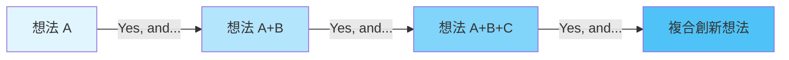
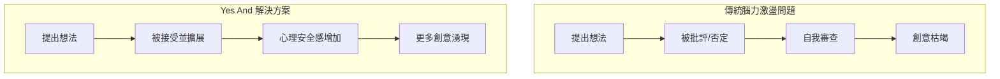
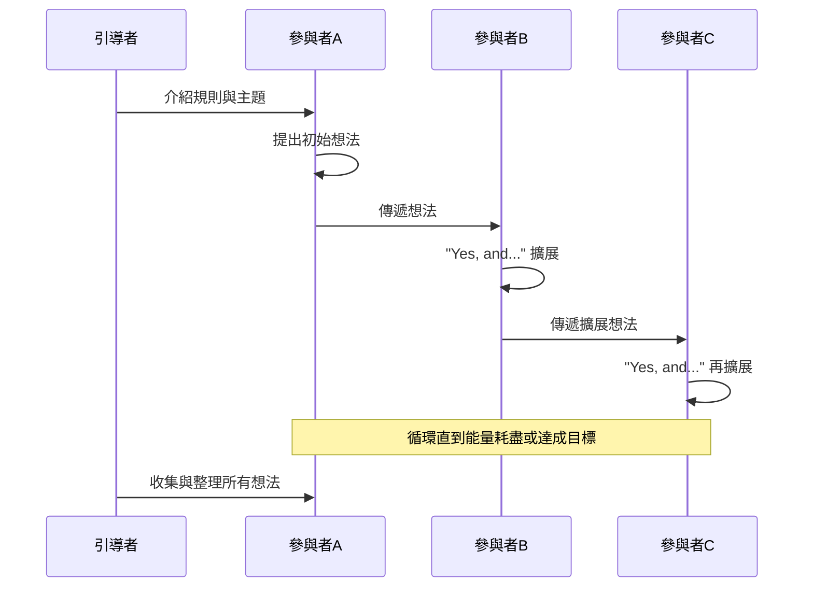
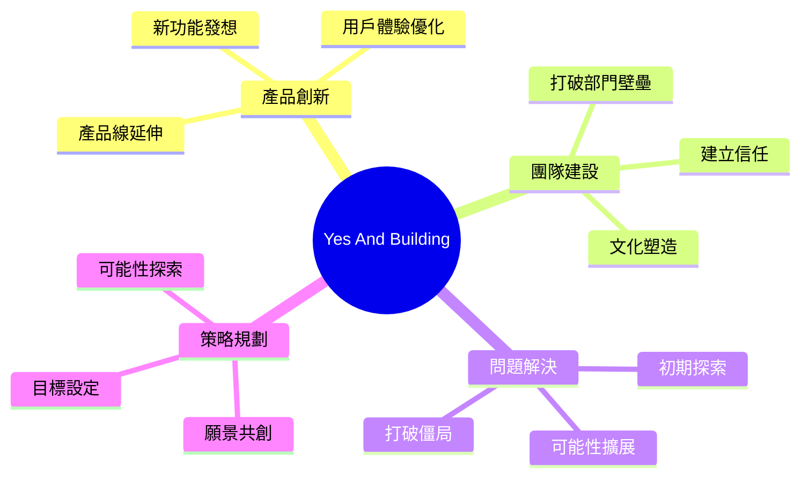
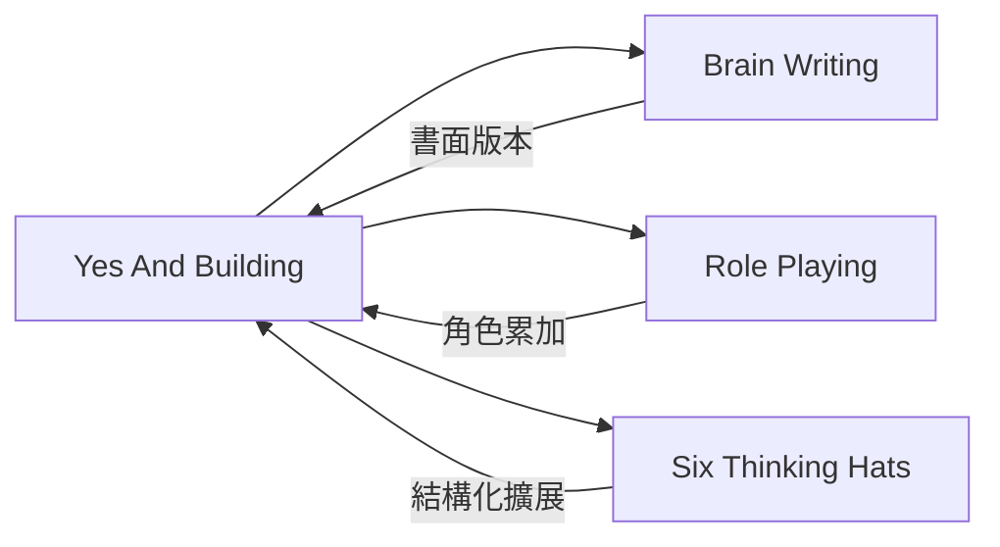

# Yes And Building

> 肯定式累加技術 - 源自即興喜劇的創意協作方法

## 基本資訊

| 屬性 | 值 |
|------|-----|
| 類別 | Collaborative |
| 能量等級 | 高 |
| 建議時長 | 15-30 分鐘 |
| 參與人數 | 3-12 人 |
| 難度 | 低 |

## 技術概述

**Yes And Building** 是源自即興喜劇（Improv Comedy）的創意思維技術。核心原則是：接受他人提出的想法（"Yes"），並在此基礎上擴展（"And"）。這種方法創造了一個心理安全的環境，讓參與者能夠自由分享想法而不怕被否定。

## 歷史背景

此技術由即興喜劇界發展，被認為是即興表演的黃金法則。後來被 Rick Griggs 等商業顧問引入企業創新領域，成為設計思維和腦力激盪的核心工具。

## 核心原理

### 心理機制

### 關鍵原則

1. **分離發散與收斂思維**
   - "Yes" = 純粹的發散接受
   - 接受想法時不評判、不批評

2. **建立而非否定**
   - 用 "Yes, and..." 取代 "Yes, but..."
   - 每個想法都是下一個想法的跳板

3. **累積式創新**
   - 想法層層疊加
   - 最終結果超越任何個人能獨自達成的

## 執行步驟

### 詳細步驟

1. **準備階段（5分鐘）**
   - 說明規則：只能說 "Yes, and..."
   - 禁止批評、評論、編輯
   - 設定主題或挑戰

2. **暖身（3分鐘）**
   - 用無關主題練習 "Yes, and..."
   - 例：計劃一場荒謬的派對

3. **正式進行（15-20分鐘）**
   - 一人提出初始想法
   - 下一人接續：「Yes, and 我們還可以...」
   - 可以圓圈進行或自由發言

4. **收斂（5分鐘）**
   - 回顧所有累積的想法
   - 找出最有潛力的方向

## 引導提示

使用以下句型開啟對話：

| 句型 | 用途 |
|------|------|
| "Yes, and we could also..." | 標準擴展 |
| "Building on that idea..." | 深化延伸 |
| "What I love about that is... and..." | 肯定+擴展 |
| "That makes me think of..." | 聯想連結 |

## 適用場景

## 注意事項

### 適合情境
- 需要大量創意點子時
- 團隊需要建立信任時
- 初期發散思考階段
- 打破 "Yes, but..." 文化

### 不適合情境
- 需要批判性評估時
- 時間極度有限時
- 參與者對主題完全陌生時

## 變體技術

### 1. 書面 Yes And
- 在便利貼上寫想法
- 傳遞並用 "Yes, and..." 擴展
- 適合遠端團隊

### 2. 沉默 Yes And
- 不說話，只用動作表達
- 適合打破語言障礙

### 3. 結構化 Yes And
- 設定特定角色或約束
- 例：從客戶、技術、商業角度

## 與其他技術的結合

## 成功案例

### IDEO 設計思維
IDEO 將 "Yes, And" 作為設計思維工作坊的核心原則，用於快速生成用戶體驗解決方案。

### Pixar 故事創作
Pixar 的創意團隊使用這種技術在早期故事發展階段快速探索敘事可能性。

## 參考資源

- [Wikipedia: Yes, and...](https://en.wikipedia.org/wiki/Yes,_and...)
- [Open Practice Library: Yes And](https://openpracticelibrary.com/practice/yes-and/)
- [Medium: Unlocking Creative Potential with Improv's Yes And Technique](https://medium.com/design-bootcamp/unlocking-creative-potential-igniting-brainstorming-with-improvs-yes-and-technique-cc2d3e9da799)
- [James Taylor: Brainstorming Technique - The Yes And Technique](https://www.jamestaylor.me/brainstorming-session-the-yes-and-technique/)

---

*返回 [Collaborative 類別](./index.md) | [技術總覽](../index.md)*
