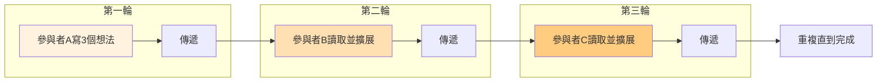
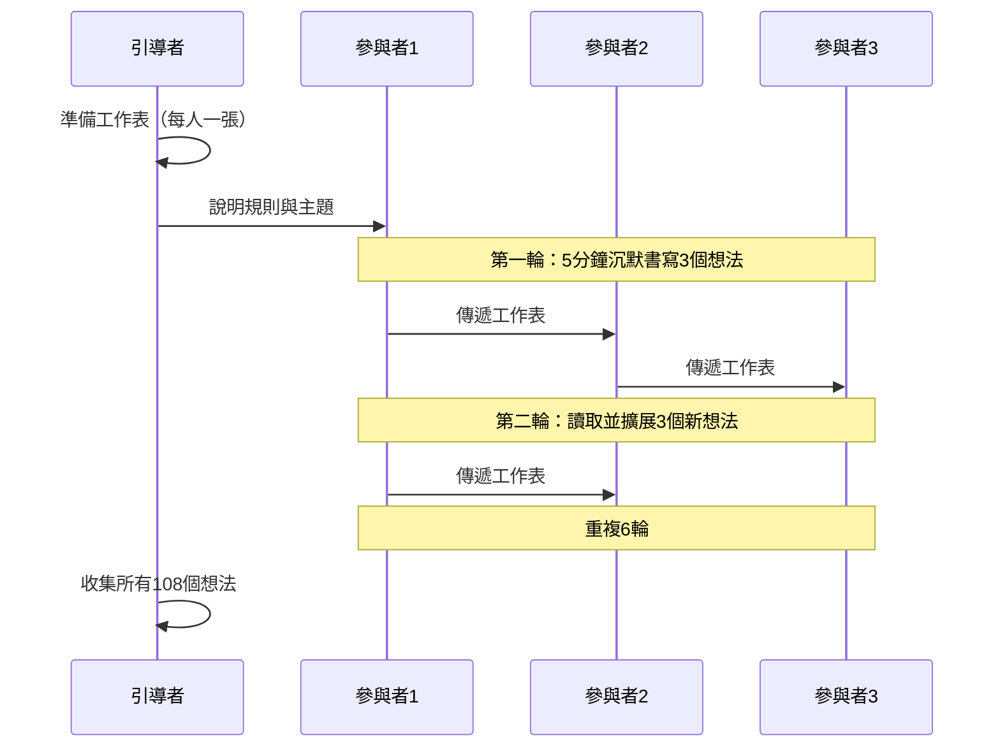
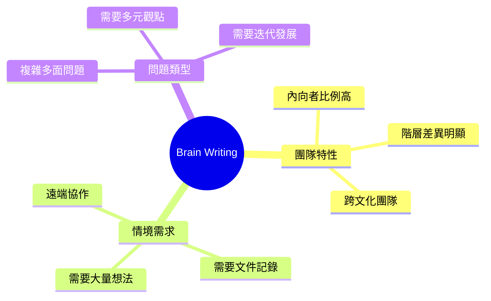
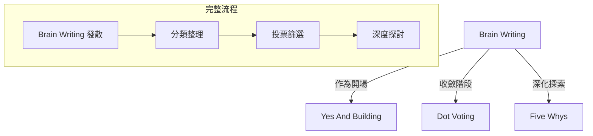

# Brain Writing Round Robin

> 沉默書寫輪轉技術 - 讓內向者的聲音被聽見

## 基本資訊

| 屬性 | 值 |
|------|-----|
| 類別 | Collaborative |
| 能量等級 | 低 |
| 建議時長 | 30-45 分鐘 |
| 參與人數 | 6 人（經典 6-3-5）|
| 難度 | 低 |

## 技術概述

**Brain Writing Round Robin** 結合了 Brainwriting（腦力書寫）和 Round Robin（輪轉）兩種技術。參與者在沉默中書寫想法，然後傳遞給下一人進行擴展，確保每個人都能平等貢獻，避免群體迷思（Groupthink）。



## 歷史背景

Brainwriting 由德國學者 Bernd Rohrbach 於 1969 年發明，他創建了著名的 **6-3-5 法**：6 位參與者，每人寫 3 個想法，5 分鐘一輪。這種方法被設計來解決傳統口頭腦力激盪中聲音不均等的問題。

## 核心原理

### 為什麼沉默更有效？


### 關鍵原則

1. **平等發言權**
   - 每個人都有相同的時間和空間
   - 沒有人可以主導對話

2. **想法建構**
   - 讀取他人想法後進行擴展
   - 想法像滾雪球一樣成長

3. **匿名性**
   - 減少社會壓力
   - 更願意提出大膽想法

## 執行步驟：6-3-5 經典法



### 詳細步驟

#### 準備階段
1. 準備 6 張工作表，每張有 6 行 × 3 列的格子
2. 說明主題和挑戰
3. 確保每人有筆和安靜環境

#### 執行階段

| 輪次 | 時間 | 動作 |
|------|------|------|
| 1 | 5分鐘 | 每人寫下3個原創想法 |
| 2 | 5分鐘 | 傳遞並擴展收到的想法 |
| 3 | 5分鐘 | 繼續傳遞和擴展 |
| 4 | 5分鐘 | 繼續傳遞和擴展 |
| 5 | 5分鐘 | 繼續傳遞和擴展 |
| 6 | 5分鐘 | 最後一輪擴展 |

#### 收尾階段
- 收集所有工作表
- 整理與分類想法
- 投票選出最佳方向

## 工作表範本

```
┌─────────────────────────────────────────────────────────────┐
│ 主題: _______________________________________________      │
├───────────────────┬───────────────────┬───────────────────┤
│      想法 1       │      想法 2       │      想法 3       │
├───────────────────┼───────────────────┼───────────────────┤
│ 輪次1:            │                   │                   │
│                   │                   │                   │
├───────────────────┼───────────────────┼───────────────────┤
│ 輪次2:            │                   │                   │
│                   │                   │                   │
├───────────────────┼───────────────────┼───────────────────┤
│ 輪次3:            │                   │                   │
│                   │                   │                   │
├───────────────────┼───────────────────┼───────────────────┤
│ 輪次4:            │                   │                   │
│                   │                   │                   │
├───────────────────┼───────────────────┼───────────────────┤
│ 輪次5:            │                   │                   │
│                   │                   │                   │
├───────────────────┼───────────────────┼───────────────────┤
│ 輪次6:            │                   │                   │
│                   │                   │                   │
└───────────────────┴───────────────────┴───────────────────┘
```

## 引導提示

### 擴展想法時可以問自己

| 問題 | 目的 |
|------|------|
| 這個想法如何更進一步？ | 深化 |
| 有什麼相反的做法？ | 反轉 |
| 如何與另一個想法結合？ | 融合 |
| 這在不同情境下會怎樣？ | 情境化 |

## 適用場景



## 注意事項

### 適合情境
- 團隊中有內向者或初級成員
- 需要避免 HIPPO（最高薪水者意見）效應
- 需要產生大量且多樣的想法
- 遠端或混合團隊

### 不適合情境
- 需要即時互動和能量
- 參與者寫作能力有限
- 時間極度緊迫

### 常見問題與解決

| 問題 | 解決方案 |
|------|----------|
| 想法重複 | 鼓勵不同角度思考 |
| 無法閱讀手寫 | 使用數位工具 |
| 擴展困難 | 提供引導問題 |
| 能量過低 | 搭配高能量技術 |

## 變體技術

### 1. 數位 Brainwriting
- 使用 Google Docs、Miro 等工具
- 即時同步，適合遠端團隊

### 2. 快速版（3-3-3）
- 3人、3想法、3分鐘
- 適合小型快速會議

### 3. 批判版 Round Robin
- 傳遞後指出弱點並改進
- 適合方案精煉階段

### 4. 畫圖版
- 用草圖代替文字
- 適合視覺化問題

## 與其他技術的結合



## 數據驅動的優勢

### 6-3-5 法的產出

| 指標 | 數值 |
|------|------|
| 參與者 | 6 人 |
| 每輪想法 | 18 個 |
| 總輪次 | 6 輪 |
| **總想法數** | **108 個** |
| 總時間 | 30 分鐘 |
| 每人貢獻 | 18 個想法 |

相比傳統腦力激盪，Brainwriting 通常能產生 **更多數量** 且 **更多樣性** 的想法。

## 研究支持

根據組織心理學研究，Brainwriting 相比傳統口頭腦力激盪：

- 產生的想法數量多 20-30%
- 想法多樣性更高
- 內向者參與度顯著提升
- 避免了「生產阻塞」(Production Blocking) 現象

## 參考資源

- [Smashing Magazine: Using Brainwriting for Rapid Idea Generation](https://www.smashingmagazine.com/2013/12/using-brainwriting-for-rapid-idea-generation/)
- [MindTools: Round-Robin Brainstorming](https://www.mindtools.com/a81qk8y/round-robin-brainstorming)
- [Grammarly: Round Robin Brainstorming](https://www.grammarly.com/blog/writing-process/round-robin-brainstorming/)
- [Remote Sparks: Brainwriting 6-3-5 Guide](https://www.remotesparks.com/brainwriting-6-3-5/)
- [Toolshero: Round Robin Brainstorming Method](https://www.toolshero.com/creativity/round-robin-brainstorming/)

---

## 設計模式對照

| 模式名稱 | 應用位置 | 核心價值 |
|----------|----------|----------|
| **Async Collaboration** | 沉默書寫 | 獨立思考，避免即時互動的干擾 |
| **Round Robin Pattern** | 輪轉傳遞 | 結構化平等，每人相同機會 |
| **6-3-5 Method** | 經典格式 | 量化產出（6人×3想法×6輪=108想法）|
| **Anti-Groupthink** | 匿名性 | 減少從眾壓力，保持獨立判斷 |

**核心洞察**：Brain Writing 揭示了一個反直覺的真相：沉默可以比喧嘩更有生產力。在傳統口頭腦力激盪中，「生產阻塞」（Production Blocking）現象——你必須等別人說完才能發言——浪費了大量潛在創意。6-3-5 法的數學很簡單：30 分鐘產出 108 個想法，平均每分鐘 3.6 個。這不是魔法，而是消除了等待、打斷和自我審查的系統設計。

---

*返回 [Collaborative 類別](./index.md) | [技術總覽](../index.md)*
