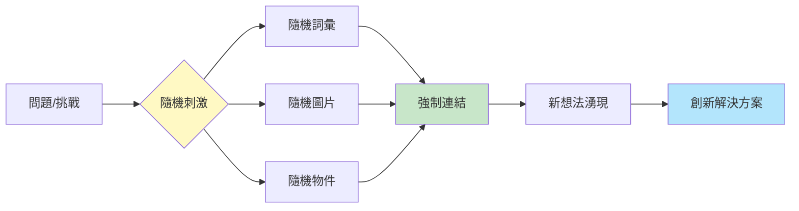
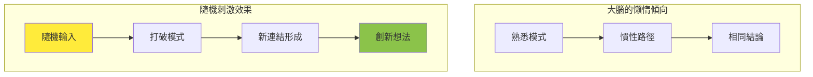
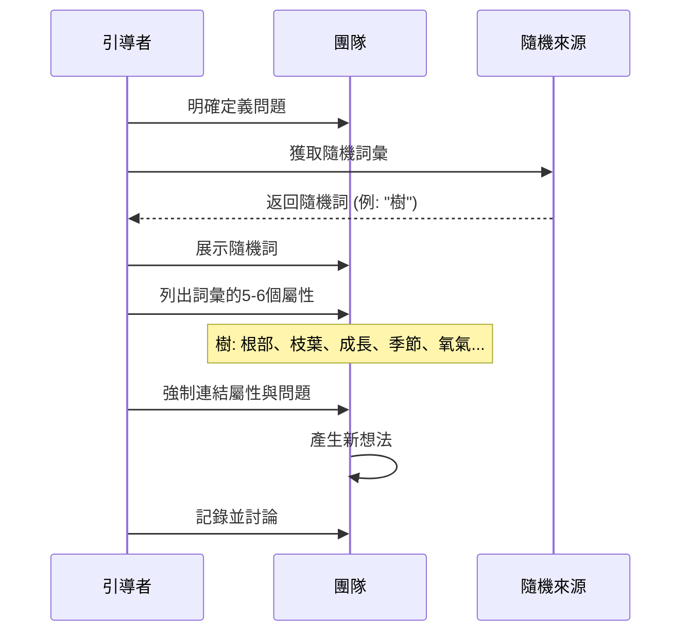
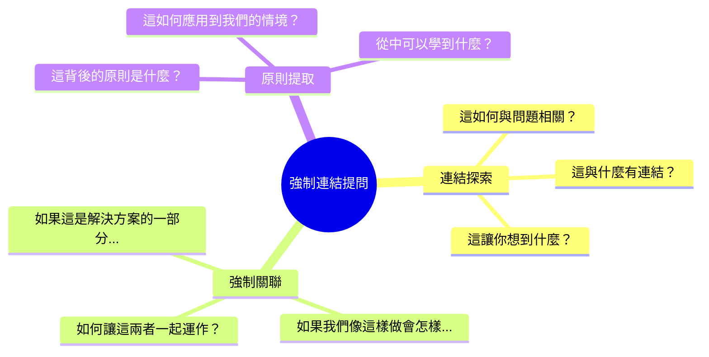
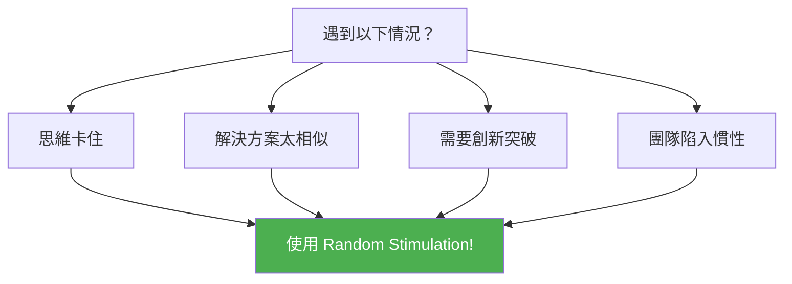
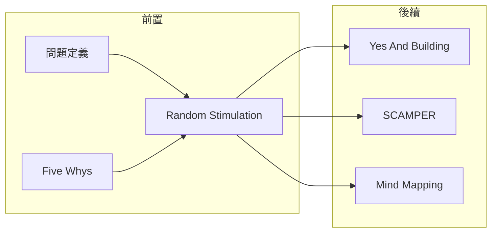

# Random Stimulation

> 隨機刺激技術 - 用意外元素打破思維僵局

## 基本資訊

| 屬性 | 值 |
|------|-----|
| 類別 | Collaborative |
| 能量等級 | 中 |
| 建議時長 | 20-30 分鐘 |
| 參與人數 | 1-10 人 |
| 難度 | 中 |

## 技術概述

**Random Stimulation**（隨機刺激）是一種水平思考技術，由 Edward de Bono 推廣。核心概念是引入完全隨機的元素（詞彙、圖片、物體）作為創意催化劑，強迫大腦在看似無關的概念之間建立連結，從而產生突破性想法。

## 歷史背景

Edward de Bono 在其「水平思考」（Lateral Thinking）理論中提出這一技術。他認為大腦是「自組織系統」，傾向於沿著既有的思維模式運作。隨機輸入強迫大腦從新的起點出發，打破慣性思維。

## 核心原理

### 為什麼隨機有效？

### 關鍵原則

1. **真正的隨機性**
   - 不要選擇「適合」的詞
   - 讓詞選擇你，而不是你選擇詞
   - 隨機性越高，效果越好

2. **強制連結**
   - 即使看似毫無關聯也要找連結
   - 大腦被迫尋找時會創造新路徑
   - 沒有「錯誤」的連結

3. **具體名詞優於抽象**
   - 「魚」「椅子」「窗戶」效果好
   - 「愛」「信仰」「悲傷」效果差
   - 具體詞彙觸發更豐富的聯想

## 執行步驟

### 詳細步驟

#### 步驟 1: 定義問題（5分鐘）
- 清楚陳述要解決的問題
- 確保所有人理解挑戰

#### 步驟 2: 獲取隨機刺激（2分鐘）
**方法選擇：**

| 方法 | 說明 | 適用情境 |
|------|------|----------|
| 隨機詞彙 | 閉眼翻開字典指一個詞 | 最常用 |
| 隨機圖片 | 隨機選擇雜誌/網路圖片 | 視覺導向團隊 |
| 隨機物件 | 從袋子抽取實物 | 實體會議 |
| 隨機網頁 | Wikipedia 隨機頁面 | 線上會議 |

#### 步驟 3: 列出屬性（5分鐘）
- 在白板上寫出隨機詞
- 列出 5-6 個相關屬性/特性
- 包括功能、外觀、關聯事物

#### 步驟 4: 強制連結（15分鐘）
- 逐一檢視每個屬性
- 問：「這如何與我們的問題相關？」
- 記錄所有想法，不評判

#### 步驟 5: 發展想法（10分鐘）
- 選擇最有潛力的連結
- 進一步發展成可行方案

## 範例演練

### 問題：如何改善客戶服務？

**隨機詞：樹**

| 樹的屬性 | 連結到客戶服務 |
|----------|----------------|
| 根部深入土壤 | 深入了解客戶需求的根源 |
| 枝葉延展 | 服務觸點擴展到多渠道 |
| 季節變化 | 服務隨季節/需求變化調整 |
| 提供氧氣 | 給客戶「呼吸空間」不過度打擾 |
| 年輪記錄成長 | 記錄客戶關係歷史 |
| 吸引鳥類築巢 | 創造讓客戶想「停留」的環境 |

## 引導提示

## 適用場景

### 最佳使用時機

### 場景匹配

| 場景 | 適合度 | 原因 |
|------|--------|------|
| 新產品發想 | ★★★★★ | 需要跳脫現有產品思維 |
| 品牌定位 | ★★★★☆ | 尋找獨特切入角度 |
| 流程改善 | ★★★☆☆ | 可用但需搭配結構化分析 |
| 危機處理 | ★★☆☆☆ | 時間緊迫時較難應用 |

## 注意事項

### Do's（應該做）
- 接受第一個隨機詞，不要換
- 給足夠時間探索連結
- 記錄所有想法，即使看似荒謬
- 保持開放心態

### Don'ts（不應該做）
- 選擇「看起來相關」的詞
- 太快放棄找不到連結
- 批評他人的連結想法
- 期望立即得到完美答案

## 變體技術

### 1. 多重隨機輸入
- 同時使用 2-3 個隨機詞
- 找出它們之間的交集連結

### 2. 隨機圖像拼貼
- 快速翻閱雜誌撕下吸引目光的圖片
- 用圖像而非文字激發創意

### 3. 隨機行走
- 在辦公室或戶外隨機走動
- 觀察遇到的事物並連結問題

### 4. 隨機網站跳轉
- 使用 Wikipedia 隨機頁面
- 從頁面內容中提取靈感

## 與其他技術的結合

## 線上工具推薦

| 工具 | 類型 | 連結說明 |
|------|------|----------|
| Random Word Generator | 隨機詞彙 | 線上隨機詞產生器 |
| Unsplash Random | 隨機圖片 | 高品質隨機圖片 |
| Wikipedia Random | 隨機頁面 | 維基百科隨機文章 |

## 科學基礎

隨機刺激技術的效果有認知科學支持：

1. **聯想記憶網絡**：大腦以網絡方式儲存資訊，隨機輸入激活不同節點
2. **遠距聯想**：創意往往來自遠距離概念的連結
3. **打破固著**：隨機性幫助逃離功能固著（Functional Fixedness）

## 參考資源

- [Big Bang Partnership: Random Stimulus Creativity Technique](https://bigbangpartnership.co.uk/random-stimulus/)
- [Chuck Frey: Brainstorming with Random Word Stimulation](https://chuckfrey.com/brainstorming-random-word-stimulation-with-random-word-stimulation/)
- [Innovation Management: Unleash Creativity with Random Word Stimulation](https://innovationmanagement.se/2009/02/11/unleash-your-creativity-with-random-word-stimulation/)
- [Think Jar Collective: Random Object Creativity Technique](https://thinkjarcollective.com/tools/random-object-creativity-technique)
- [Destination Innovation: The Random Word Technique](https://www.destination-innovation.com/try-this-lateral-brainstorm-technique-the-random-word/)

---

## 設計模式對照

| 模式名稱 | 應用位置 | 核心價值 |
|----------|----------|----------|
| **Lateral Thinking** | 全程 | Edward de Bono 的水平思考核心技術 |
| **Forced Connection Pattern** | 連結階段 | 強制在無關概念間建立橋樑 |
| **Pattern Interrupt** | 隨機輸入 | 打破大腦的慣性思維路徑 |
| **Serendipity Design** | 隨機選擇 | 設計「意外發現」的機會 |

**核心洞察**：Random Stimulation 的效果建立在認知科學的一個發現上：創意往往來自「遠距聯想」——連結兩個看似無關的概念。大腦是自組織系統，傾向於走最省力的路徑（也就是舊路徑）。隨機輸入就像在熟悉的路上放一塊石頭，迫使你繞道——而這條繞道可能通往你從未發現的風景。重點是：不要選擇「適合」的隨機詞，讓隨機性選擇你。

---

*返回 [Collaborative 類別](./index.md) | [技術總覽](../index.md)*
