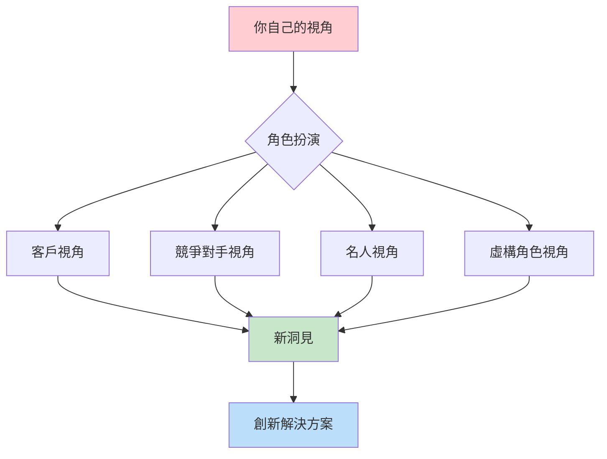
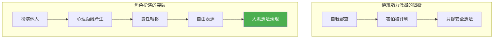
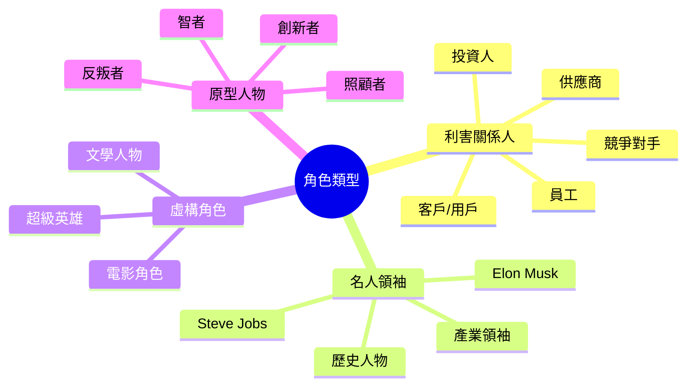
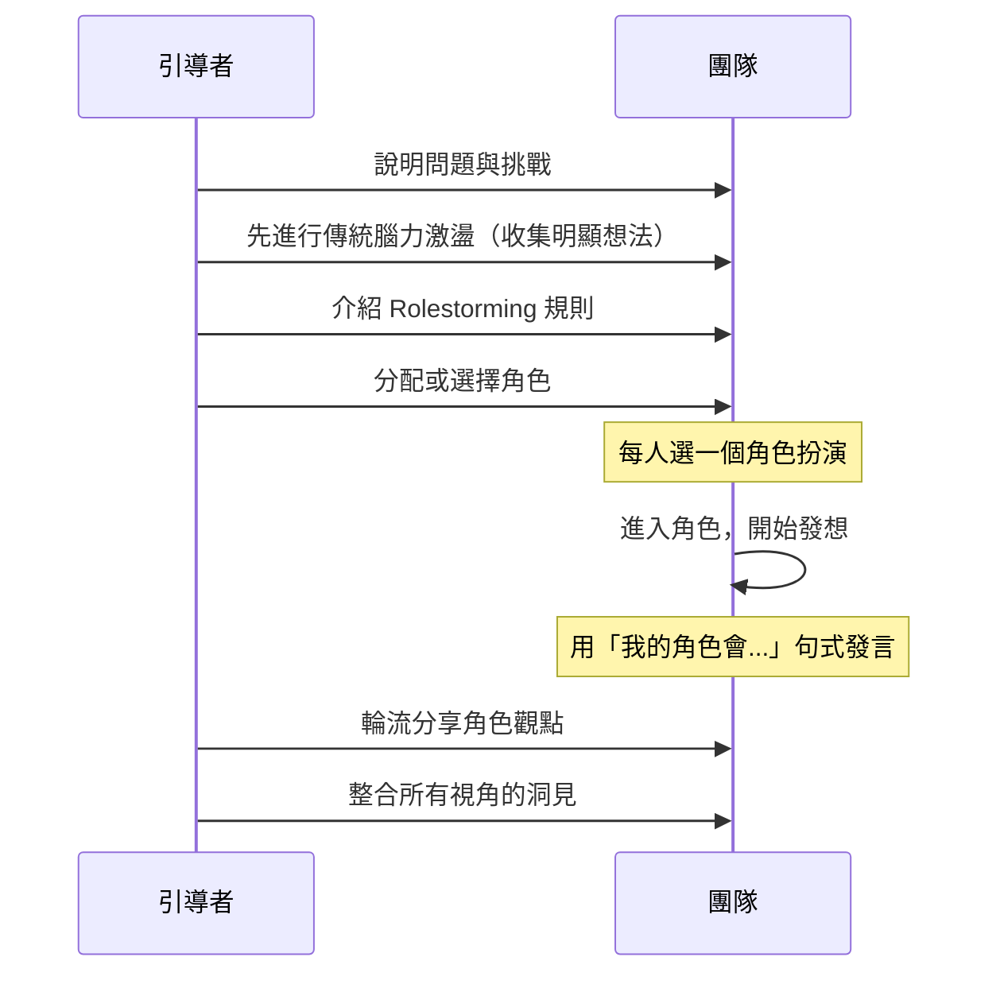
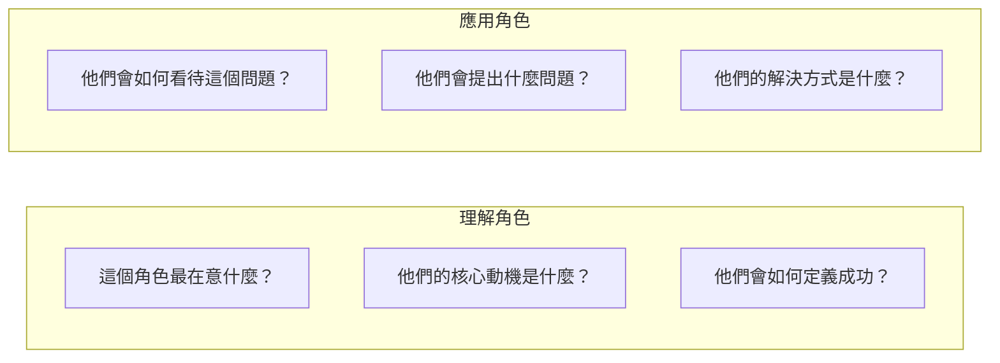
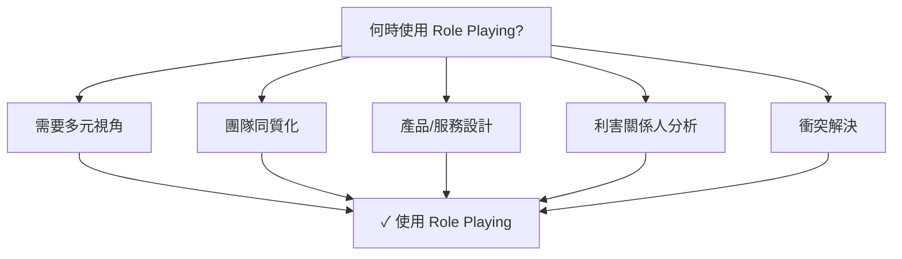
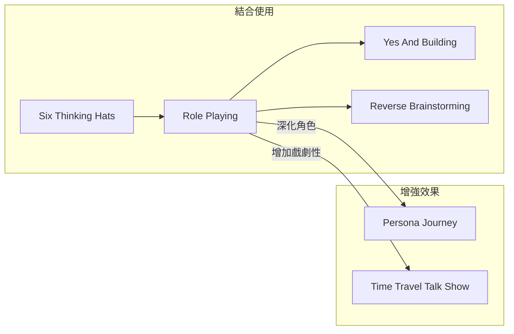

# Role Playing (Rolestorming)

> 角色扮演腦力激盪 - 穿上別人的鞋子看世界

## 基本資訊

| 屬性 | 值 |
|------|-----|
| 類別 | Collaborative |
| 能量等級 | 中-高 |
| 建議時長 | 30-45 分鐘 |
| 參與人數 | 4-12 人 |
| 難度 | 中 |

## 技術概述

**Role Playing**（角色扮演）或稱 **Rolestorming**，是由 Rick Griggs 發明的腦力激盪技術。參與者暫時「穿上別人的鞋子」，從不同利害關係人、名人、甚至虛構角色的視角來思考問題。這種方法幫助突破自我限制，產生更多元的觀點。



## 歷史背景

Rick Griggs 在 1980 年代開發 Rolestorming，目的是幫助人們克服在群體腦力激盪中的抑制感。當你「假裝是別人」時，你會更願意提出大膽想法，因為你不需要為這些想法負責——畢竟「那是蘋果的 Steve Jobs 會說的，不是我」。

## 核心原理

### 心理機制



### 關鍵原則

1. **角色距離**
   - 假裝是別人讓你與想法保持距離
   - 「這是我的角色會說的」減輕表達壓力

2. **視角轉換**
   - 強迫跳出自己的思維框架
   - 接觸到平時不會考慮的觀點

3. **同理心建立**
   - 透過扮演理解不同人的需求
   - 發現之前忽略的考量

## 可扮演的角色類型



## 執行步驟



### 詳細步驟

#### 第一階段：傳統腦力激盪（10分鐘）
- 先用一般方式收集想法
- 這會產出「明顯」的解決方案
- 為 Rolestorming 做準備

#### 第二階段：角色選擇（5分鐘）

**方法一：指定角色**
- 引導者準備角色卡片
- 隨機分配給參與者

**方法二：自選角色**
- 參與者選擇想扮演的角色
- 可以是認識的人或虛構角色

**方法三：情境角色**
- 根據問題選擇相關利害關係人
- 例：產品改善 → 用戶、客服、工程師

#### 第三階段：進入角色（20分鐘）

**建立角色連結**
1. 想像角色的背景和動機
2. 思考他們如何看待這個問題
3. 用第一人稱開始發言

**發言格式建議**

| 句式 | 範例 |
|------|------|
| 我的角色會... | 「我的角色 Steve Jobs 會說這太複雜了」|
| 作為[角色]，我認為... | 「作為客戶，我認為這流程太長」|
| [角色]會問... | 「Jeff Bezos 會問：這對客戶有什麼好處？」|

#### 第四階段：整合（10分鐘）
- 回到自己的身份
- 回顧所有角色的觀點
- 識別共同主題和獨特洞見

## 引導提示

### 幫助進入角色的問題



### 角色專屬提問範例

| 角色 | 可能問的問題 |
|------|--------------|
| Steve Jobs | 「這夠簡單嗎？能再減少什麼？」|
| 7歲小孩 | 「為什麼要這樣做？為什麼不能那樣？」|
| 競爭對手 | 「他們的弱點在哪？我如何打敗他們？」|
| 未來用戶 | 「10年後這還會有用嗎？」|

## 適用場景

### 最佳使用時機



### 場景匹配

| 場景 | 適合度 | 推薦角色 |
|------|--------|----------|
| 產品創新 | ★★★★★ | 用戶、競爭者、創新者 |
| 客戶體驗改善 | ★★★★★ | 各類客戶人物誌 |
| 策略規劃 | ★★★★☆ | 投資人、競爭對手、產業分析師 |
| 團隊衝突解決 | ★★★★☆ | 衝突各方 |
| 內部流程優化 | ★★★☆☆ | 流程參與者 |

## 注意事項

### Do's（應該做）
- 完全沉浸在角色中
- 使用「我的角色...」來保持距離
- 嘗試不同類型的角色
- 尊重所有角色的觀點

### Don'ts（不應該做）
- 諷刺或貶低某個角色
- 選擇太類似自己的角色
- 在角色間切換太快
- 忽略「不舒服」的觀點

## 變體技術

### 1. 利害關係人輪盤
- 快速輪換扮演多個利害關係人
- 每個角色只有 2-3 分鐘
- 產生快速多元觀點

### 2. 名人內閣
- 組建「顧問團」
- 每人持續扮演一位名人
- 模擬顧問會議

### 3. 時間旅行者
- 扮演過去和未來的自己
- 回顧和預見的視角

### 4. 對立角色
- 刻意扮演與自己相反的角色
- 挑戰既有假設

## 與其他技術的結合



## 角色卡片範例

```
┌─────────────────────────────────────┐
│           ROLE CARD                 │
├─────────────────────────────────────┤
│  角色: Steve Jobs                   │
│                                     │
│  核心信念:                          │
│  「設計不只是外觀，是運作方式」     │
│                                     │
│  會問的問題:                        │
│  • 這夠簡單嗎？                     │
│  • 用戶體驗夠好嗎？                 │
│  • 這是最好的解決方案嗎？           │
│                                     │
│  討厭什麼:                          │
│  • 複雜、妥協、平庸                 │
└─────────────────────────────────────┘
```

## 遠端協作調整

| 面對面 | 遠端調整 |
|--------|----------|
| 角色卡片 | 數位角色卡 |
| 肢體扮演 | 虛擬背景/頭像 |
| 圍圈討論 | 分組討論室 |
| 白板記錄 | Miro/Mural |

## 研究支持

Role Playing 的效果有心理學研究支持：

1. **認知靈活性**：扮演他人增強思維的靈活性
2. **同理心發展**：持續練習增強同理能力
3. **創意產出**：比傳統腦力激盪產生更多非常規想法
4. **群體動力**：減少社會抑制效應

## 參考資源

- [MindTools: Rolestorming](https://www.mindtools.com/alw95c5/rolestorming/)
- [Mural: How to Use the Rolestorming Brainstorming Method](https://www.mural.co/blog/rolestorming)
- [Lucidspark: Rolestorming Brainstorming Method](https://lucid.co/blog/rolestorming-brainstorming-method)
- [ModelThinkers: Rolestorming](https://modelthinkers.com/mental-model/rolestorming)
- [Brainstorming.co.uk: Role Play Tutorial](https://www.brainstorming.co.uk/tutorials/roleplaytutorial.html)

---

## 設計模式對照

| 模式名稱 | 應用位置 | 核心價值 |
|----------|----------|----------|
| **Persona Pattern** | 角色選擇 | 創建具體的思考框架 |
| **Psychological Distance** | 扮演機制 | 「不是我說的，是角色說的」|
| **Empathy Mapping** | 角色沉浸 | 深入理解他人需求和動機 |
| **Stakeholder Analysis** | 利害關係人視角 | 系統化考慮多方觀點 |

**核心洞察**：Role Playing 利用了一個心理學現象：「心理距離」（Psychological Distance）。當你說「Steve Jobs 會認為這太複雜」時，你不需要為這個想法負責——這給了你表達大膽想法的自由。更重要的是，扮演他人迫使你離開自己的思維框架。你不只是在「想像」客戶會怎麼想，你是在「成為」客戶。這種具身認知（Embodied Cognition）比任何調研報告都更能產生真正的同理心洞見。

---

*返回 [Collaborative 類別](./index.md) | [技術總覽](../index.md)*
