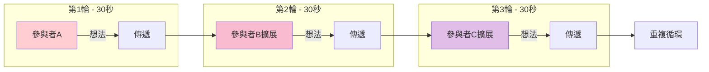
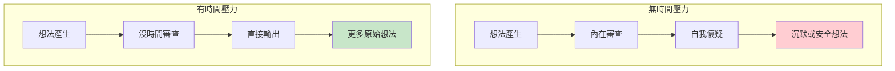
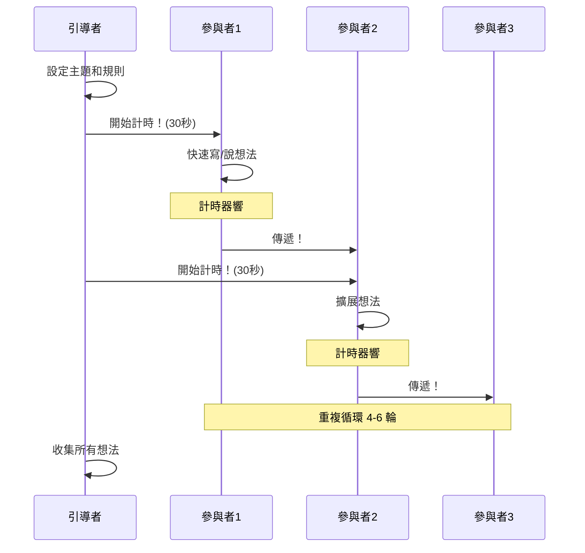
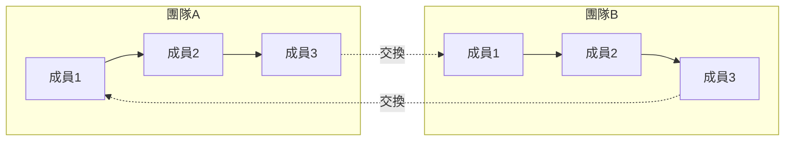
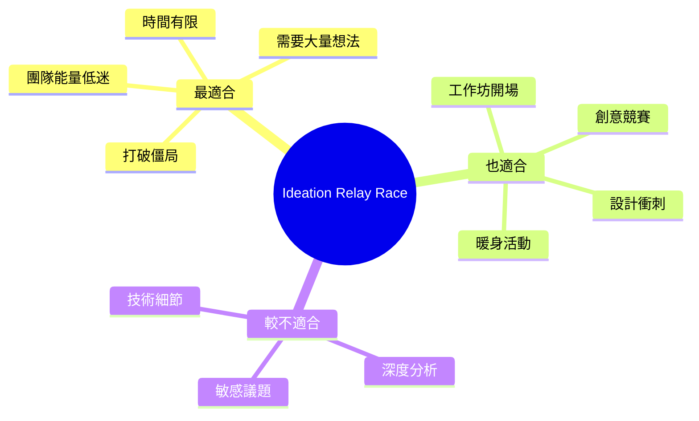
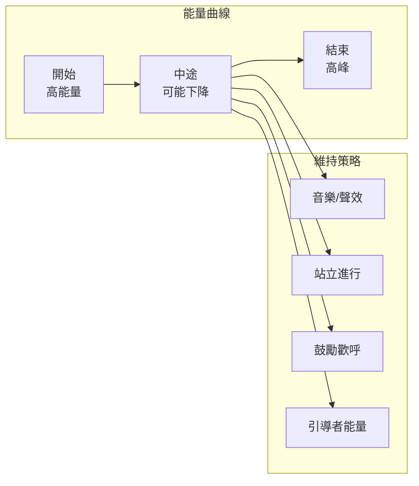
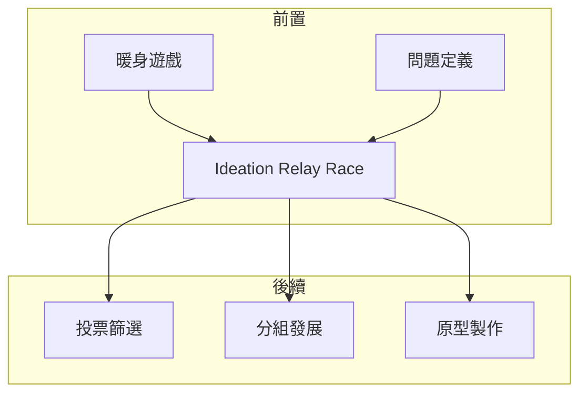

# Ideation Relay Race

> 創意接力賽 - 用時間壓力激發突破性想法

## 基本資訊

| 屬性 | 值 |
|------|-----|
| 類別 | Collaborative |
| 能量等級 | 極高 |
| 建議時長 | 15-25 分鐘 |
| 參與人數 | 4-8 人 |
| 難度 | 低 |

## 技術概述

**Ideation Relay Race**（創意接力賽）是一種高能量、快節奏的腦力激盪技術。參與者在嚴格的時間限制下（通常30秒到1分鐘）快速產生想法，然後立即傳遞給下一人進行擴展。這種「時間壓力 + 接力」的組合能夠：

- 繞過內在審查機制
- 產生更多數量的想法
- 創造高度能量的協作氛圍



## 歷史背景

此技術結合了多種快速構思方法的元素：
- **Rapid Ideation**：由 IDEO 等設計公司推廣
- **Crazy 8s**：Google Ventures 設計衝刺中的核心練習
- **Time-boxed Brainstorming**：敏捷方法論中的時間限制實踐

## 核心原理

### 時間壓力的魔力



### 關鍵原則

1. **短路內在編輯器**
   - 30秒內沒時間判斷想法好壞
   - 直接輸出，之後再評估

2. **數量優先**
   - 追求想法數量而非品質
   - 好想法會從大量想法中浮現

3. **接力動能**
   - 每次傳遞增加能量
   - 想法在傳遞中進化

4. **快速迭代**
   - 不完美沒關係
   - 下一輪可以修正和擴展

## 執行步驟



### 詳細步驟

#### 準備階段（3分鐘）

1. **設定環境**
   - 準備計時器（手機或線上工具）
   - 每人發便利貼和筆
   - 確保空間允許快速傳遞

2. **說明規則**
   - 每輪 30 秒（可調整為 45 秒或 1 分鐘）
   - 計時器響時必須停止並傳遞
   - 不評判、不討論、只輸出

#### 執行階段（15分鐘）

| 輪次 | 時間 | 動作 |
|------|------|------|
| 1 | 30秒 | 寫下原始想法 |
| 2 | 30秒 | 讀取並擴展收到的想法 |
| 3 | 30秒 | 繼續擴展或添加新想法 |
| 4 | 30秒 | 挑戰或反轉想法 |
| 5 | 30秒 | 結合多個想法 |
| 6 | 30秒 | 最瘋狂的版本 |

#### 收尾階段（5分鐘）
- 所有人回到座位
- 快速輪流分享最喜歡的想法
- 整理和分類

## 變體模式

### 1. Crazy 8s 模式

```
┌─────┬─────┬─────┬─────┐
│  1  │  2  │  3  │  4  │
│     │     │     │     │
├─────┼─────┼─────┼─────┤
│  5  │  6  │  7  │  8  │
│     │     │     │     │
└─────┴─────┴─────┴─────┘

8個想法 × 8分鐘 = 每格1分鐘
```

### 2. 團隊接力模式



### 3. 主題接力模式
- 每輪切換不同主題或角度
- 例：第1輪-用戶視角、第2輪-技術視角、第3輪-商業視角

### 4. 挑戰接力模式
- 輪流對上一人的想法提出挑戰
- 然後提出解決挑戰的方案

## 引導提示

### 每輪可用的提示

| 輪次 | 提示 |
|------|------|
| 1 | 「寫下你想到的第一個點子」|
| 2 | 「這個想法如何更進一步？」|
| 3 | 「如果沒有限制會怎樣？」|
| 4 | 「相反的做法是什麼？」|
| 5 | 「結合兩個想法」|
| 6 | 「最瘋狂的版本！」|

### 能量維持語句
- 「不要想，直接寫！」
- 「沒有壞想法！」
- 「30秒足夠了！」
- 「相信你的直覺！」

## 適用場景



## 注意事項

### Do's（應該做）
- 嚴格執行計時
- 保持高能量
- 鼓勵「壞」想法
- 大聲計數倒數

### Don'ts（不應該做）
- 延長時間
- 中途討論
- 批評想法
- 允許沉默

## 能量管理



## 所需材料

### 實體會議

| 材料 | 數量 | 用途 |
|------|------|------|
| 便利貼 | 每人20張+ | 記錄想法 |
| 粗筆 | 每人1支 | 快速書寫 |
| 計時器 | 1個 | 嚴格計時 |
| 白板 | 1面 | 整理想法 |
| 背景音樂 | 選用 | 維持能量 |

### 線上會議

| 工具 | 用途 |
|------|------|
| Miro/Mural | 虛擬便利貼 |
| Online Timer | 共享計時器 |
| Spotify | 背景音樂 |
| Zoom 分組室 | 小組接力 |

## 時間變體

| 變體 | 每輪時間 | 總輪數 | 適用情境 |
|------|----------|--------|----------|
| 極速版 | 15秒 | 8輪 | 暖身、破冰 |
| 標準版 | 30秒 | 6輪 | 一般腦力激盪 |
| 擴展版 | 60秒 | 4輪 | 需要更多細節 |
| 深入版 | 2分鐘 | 3輪 | 接近 Brainwriting |

## 與其他技術的結合



## 計時器推薦

**線上工具**
- Timer Tab (timertab.com)
- Online Stopwatch (online-stopwatch.com)
- Toggl Timer

**音效建議**
- 開始：啟動音效
- 結束：清脆鈴聲
- 背景：節奏輕快的音樂

## 遠端協作調整

| 挑戰 | 解決方案 |
|------|----------|
| 傳遞困難 | 使用共享白板標記順序 |
| 能量感知難 | 開啟視訊，增加互動 |
| 時間同步 | 使用共享螢幕計時器 |
| 參與度 | 縮小團隊規模 (4-5人) |

## 參考資源

- [Mural: Rapid Ideation](https://www.mural.co/blog/rapid-ideation)
- [Grammarly: Rapid Ideation Techniques](https://www.grammarly.com/blog/writing-process/rapid-ideation/)
- [Krisp: How to Master Rapid Ideation](https://krisp.ai/blog/rapid-ideation/)
- [ThinkFWD: Rapid Ideation Toolkit](https://www.thinkfwd.co/toolkit/rapid-ideation)
- [Post-it: Rapid Ideation Tools](https://www.post-it.com/3M/en_US/post-it/ideas/articles/rapid-ideation/)

---

*返回 [Collaborative 類別](./index.md) | [技術總覽](../index.md)*
