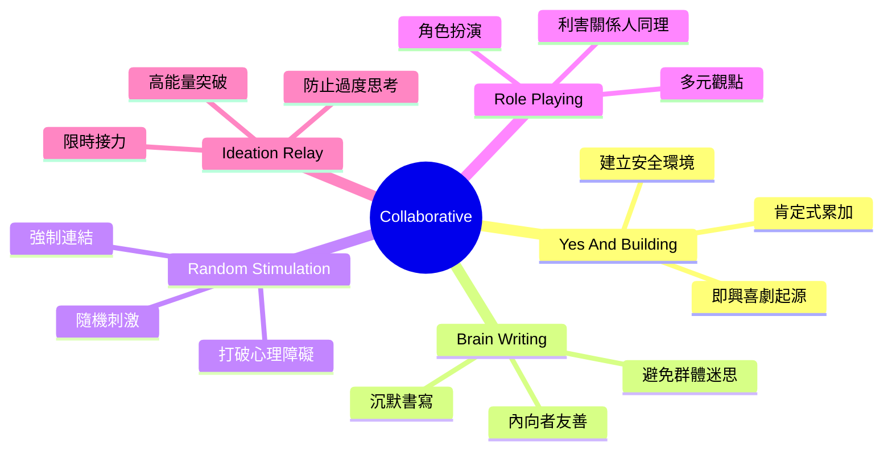
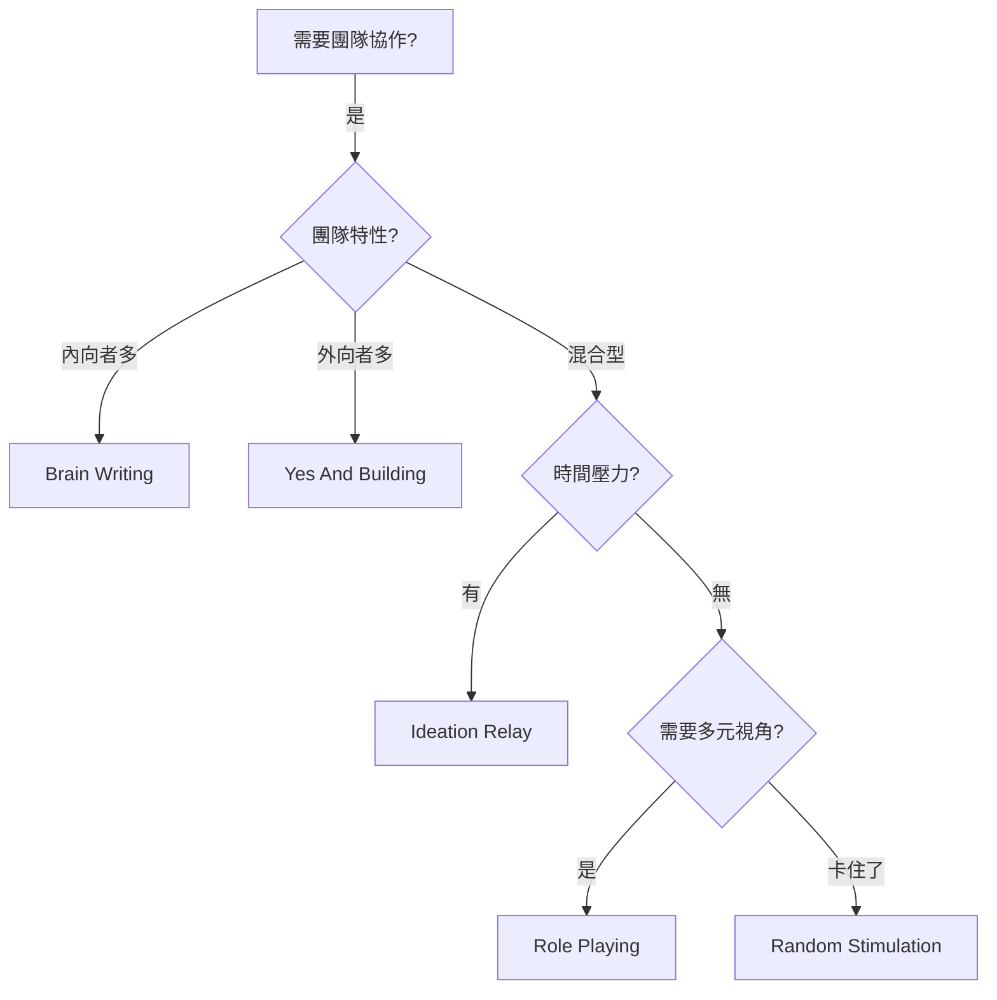

# Collaborative Brainstorming Techniques

> 協作類腦力激盪技術 - 強調團隊動力與多元聲音

## 類別概述

協作類技術專注於團隊互動，透過結構化的協作流程，確保每位成員都能貢獻想法，建立共識與活力。

## 核心特性

| 特性 | 說明 |
|------|------|
| 團隊動力 | 透過結構化流程激發集體智慧 |
| 多元聲音 | 確保內向者與外向者都能貢獻 |
| 共識建立 | 在創意過程中逐步建立團隊共識 |
| 心理安全 | 創造無批判的安全表達環境 |

## 技術列表

| # | 技術名稱 | 核心概念 | 適用情境 |
|---|----------|----------|----------|
| 1 | [Yes And Building](./01-yes-and-building.md) | 肯定式累加 | 團隊創意建構 |
| 2 | [Brain Writing Round Robin](./02-brainwriting-round-robin.md) | 沉默書寫輪流 | 內向者友善 |
| 3 | [Random Stimulation](./03-random-stimulation.md) | 隨機刺激連結 | 打破心理障礙 |
| 4 | [Role Playing](./04-role-playing.md) | 角色扮演觀點 | 利害關係人同理 |
| 5 | [Ideation Relay Race](./05-ideation-relay-race.md) | 限時接力創意 | 高能量突破 |

## 使用時機

## 能量等級

- **高能量**: Yes And Building, Ideation Relay Race
- **中等能量**: Role Playing, Random Stimulation
- **低能量**: Brain Writing Round Robin

---

*返回 [技術總覽](../index.md)*
