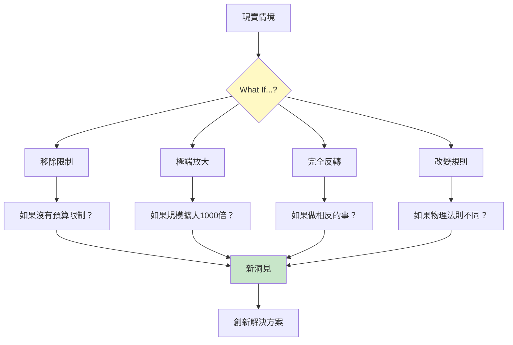
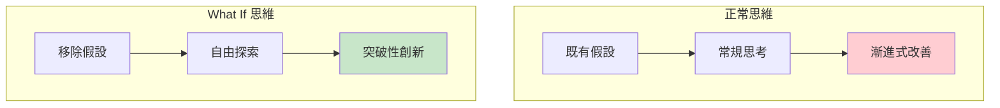
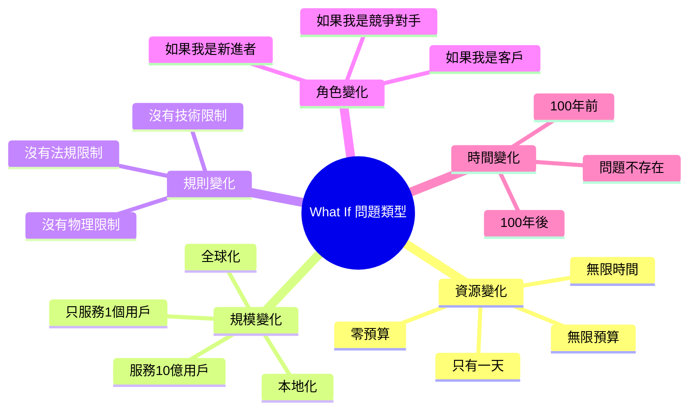
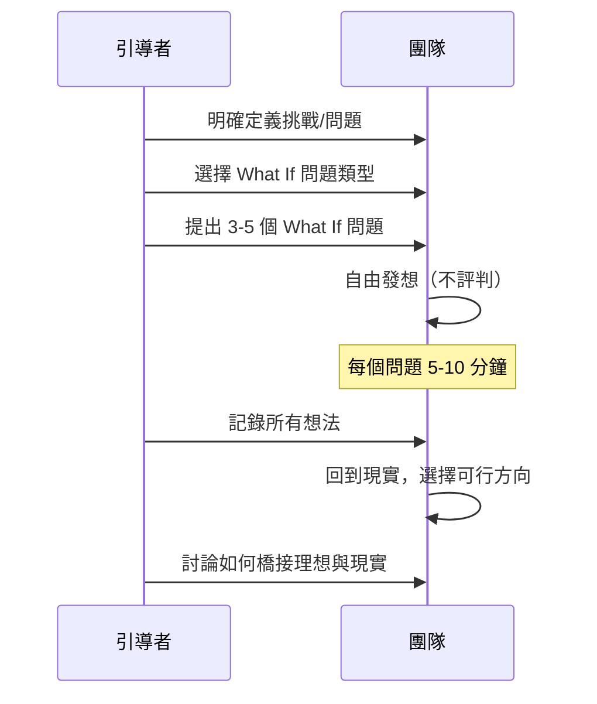
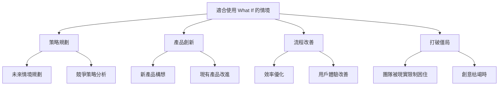
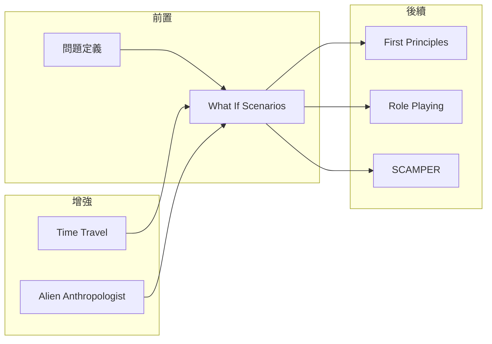

# What If Scenarios

> 假設情境探索 - 用「如果...會怎樣？」打破思維邊界

## 基本資訊

| 屬性 | 值 |
|------|-----|
| 類別 | Creative |
| 能量等級 | 高 |
| 建議時長 | 20-40 分鐘 |
| 參與人數 | 1-15 人 |
| 難度 | 低 |

## 技術概述

**What If Scenarios**（假設情境）是一種透過提出假設性問題來激發創意的技術。透過暫時移除或改變現實限制，參與者可以探索極端可能性，挑戰既有假設，並發現隱藏的創新機會。

## 歷史背景

「What If」問題是人類好奇心的自然表達，從科學假設到科幻小說都廣泛使用。在商業創新領域，這種技術被 IDEO、Google 等創新公司採用，作為設計思維和策略規劃的核心工具。

## 核心原理

### 為什麼假設情境有效？

### 關鍵原則

1. **暫時懸置限制**
   - 先假設限制不存在
   - 探索極端可能性
   - 之後再考慮如何實現

2. **約束即創意**
   - 極端約束反而激發創意
   - 「只有1美元」vs「無限預算」都有價值

3. **極端探索**
   - 走向兩個極端
   - 發現中間地帶的機會

## What If 問題類型

## 執行步驟

### 詳細步驟

#### 第一階段：問題準備（5分鐘）

1. **選擇焦點問題**
   - 例：「如何改善客戶體驗？」

2. **準備 What If 問題清單**
   - 準備 5-10 個假設性問題
   - 覆蓋不同維度（資源、規模、規則等）

#### 第二階段：What If 探索（20-30分鐘）

**每個問題進行：**
1. 朗讀 What If 問題
2. 給予 5-10 分鐘自由發想
3. 鼓勵極端、荒謬的想法
4. 記錄所有想法（不評判）

#### 第三階段：橋接現實（10分鐘）

1. **回顧所有想法**
2. **選擇最有啟發性的**
3. **問：「如何讓這部分可行？」**

## What If 問題範例

### 資源維度

| 問題 | 探索方向 |
|------|----------|
| 如果有無限預算？ | 什麼是真正重要的？ |
| 如果只有1美元？ | 核心價值是什麼？ |
| 如果有無限時間？ | 什麼值得做到完美？ |
| 如果只有1小時？ | 最小可行方案是什麼？ |

### 規模維度

| 問題 | 探索方向 |
|------|----------|
| 如果服務10億人？ | 如何規模化？ |
| 如果只服務1人？ | 如何個人化？ |
| 如果全球營運？ | 文化考量是什麼？ |
| 如果只在這棟樓？ | 本地優勢是什麼？ |

### 規則維度

| 問題 | 探索方向 |
|------|----------|
| 如果沒有法規？ | 理想狀態是什麼？ |
| 如果沒有競爭對手？ | 真正的障礙是什麼？ |
| 如果物理法則不同？ | 突破性思考 |
| 如果可以讀心？ | 客戶真正想要什麼？ |

### 對立維度

| 問題 | 探索方向 |
|------|----------|
| 如果做相反的事？ | 隱藏假設是什麼？ |
| 如果問題不存在？ | 這是真問題嗎？ |
| 如果這是個機會？ | 如何翻轉視角？ |

## 適用場景

## 注意事項

### Do's（應該做）
- 鼓勵荒謬的想法
- 記錄所有回應
- 給足夠時間探索
- 最後才評估可行性

### Don'ts（不應該做）
- 太快否定想法
- 只選「安全」的假設
- 跳過極端情境
- 忘記橋接回現實

## 變體技術

### 1. What If 階梯
- 從輕微假設開始
- 逐漸升級到極端
- 觀察突破點在哪裡

### 2. 雙極 What If
- 同時探索兩個極端
- 例：無限預算 vs 零預算
- 找出中間的智慧

### 3. 角色 What If
- 結合角色扮演
- 「如果我是 Steve Jobs 會怎麼做？」

### 4. 時間 What If
- 專注時間維度
- 過去、現在、未來的假設

## 與其他技術的結合

## 案例研究

### Amazon「逆向工作法」
Amazon 使用 What If 問題作為產品開發的起點：
- 「如果我們能次日送達？」→ Prime 會員
- 「如果任何書都能買到？」→ 市場平台模式
- 「如果開發者可以租用伺服器？」→ AWS

### 愛彼迎 Airbnb
- 「如果人們願意讓陌生人住在家裡？」
- 挑戰了「人們不會信任陌生人」的假設

## 工具推薦

### What If 問題產生器

| 維度 | 問題模板 |
|------|----------|
| 資源 | 如果有無限的 [資源]... |
| 限制 | 如果不存在 [限制]... |
| 規模 | 如果規模變成 [X倍]... |
| 對象 | 如果服務的是 [對象]... |
| 時間 | 如果在 [時間點]... |

## 研究支持

心理學研究表明，假設性思考能夠：
- 激活大腦的預設模式網路（DMN）
- 促進發散思維
- 減少對失敗的恐懼
- 增加認知靈活性

## 參考資源

- [Julia Västrik: What If Brainstorming Technique](https://juliavastrik.com/facilitation/what-if-brainstorming-technique/)
- [Hatrabbits: What If - A Simple Question to Spark Creativity](https://hatrabbits.com/en/what-if/)
- [Asana: 29 Brainstorming Techniques](https://asana.com/resources/brainstorming-techniques)
- [Nudgrr: Creative Breakthroughs Through Constraints](https://nudgrr.com/blog/unlocking-creativity-breakthroughs-through-constraints-12)

---

*返回 [Creative 類別](./index.md) | [技術總覽](../index.md)*
