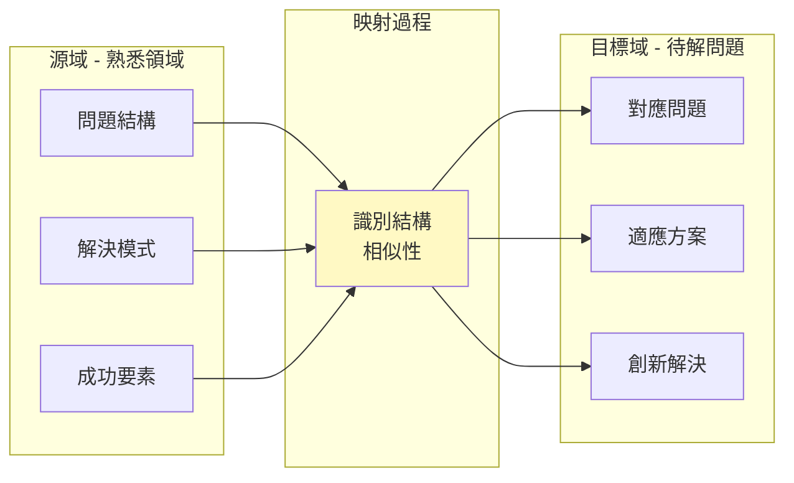
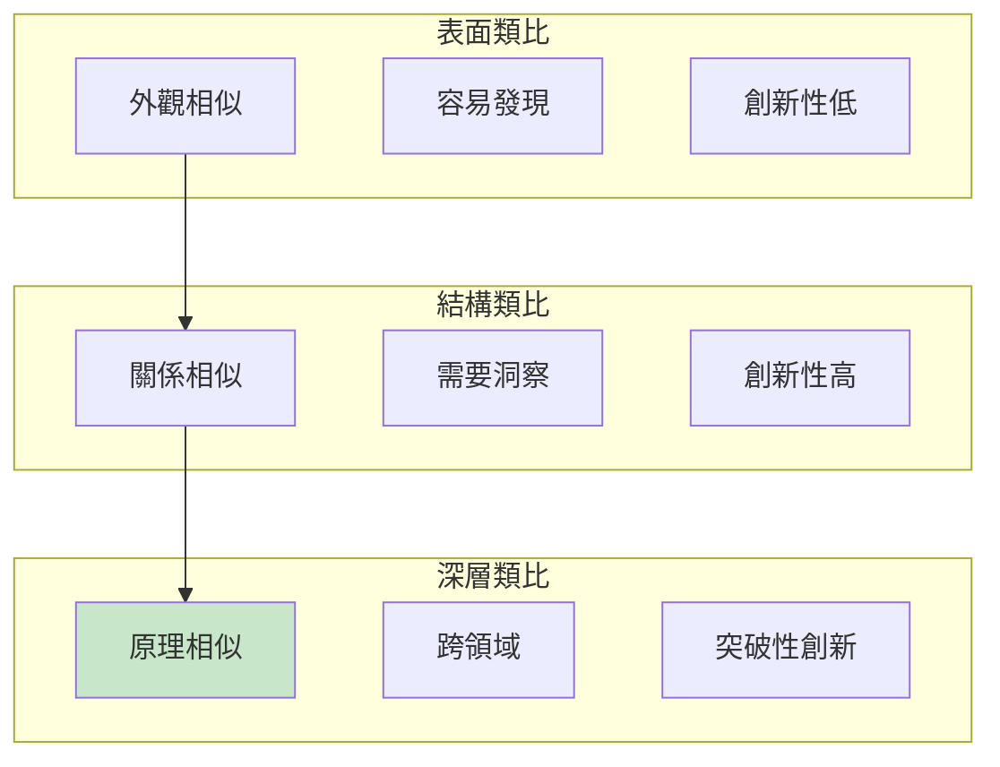
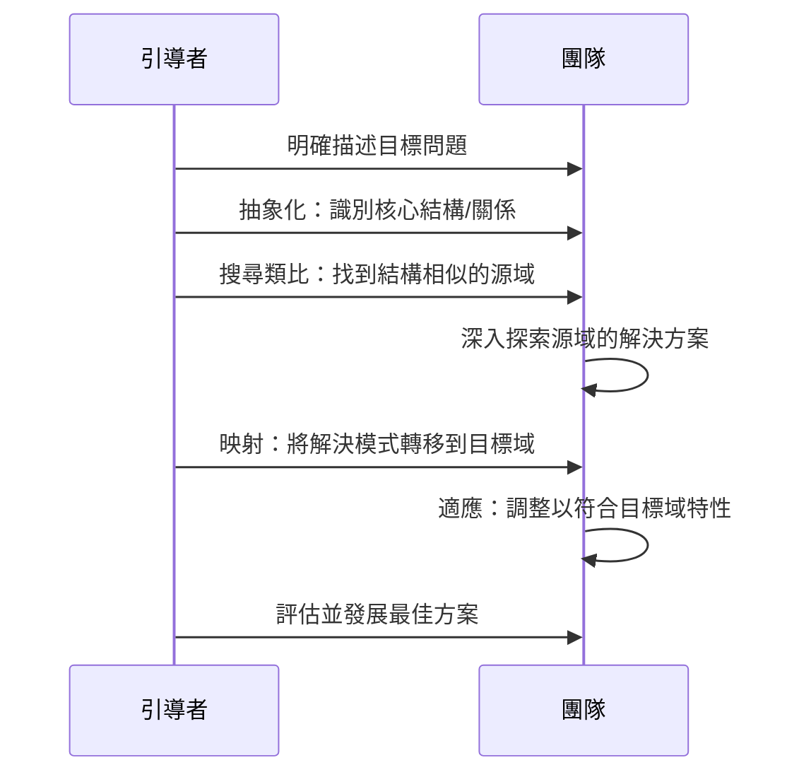
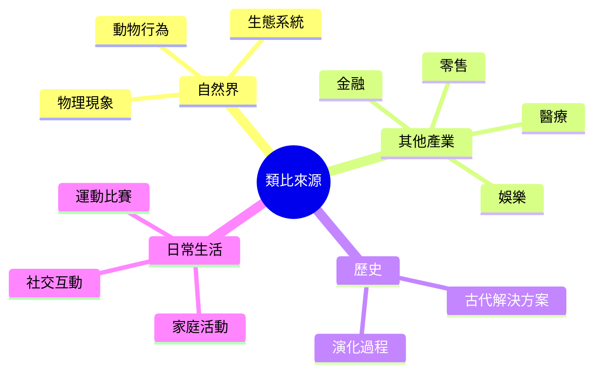
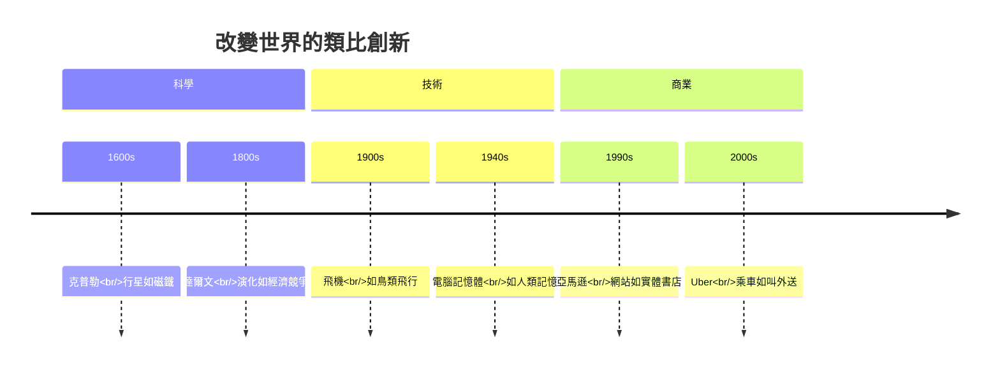
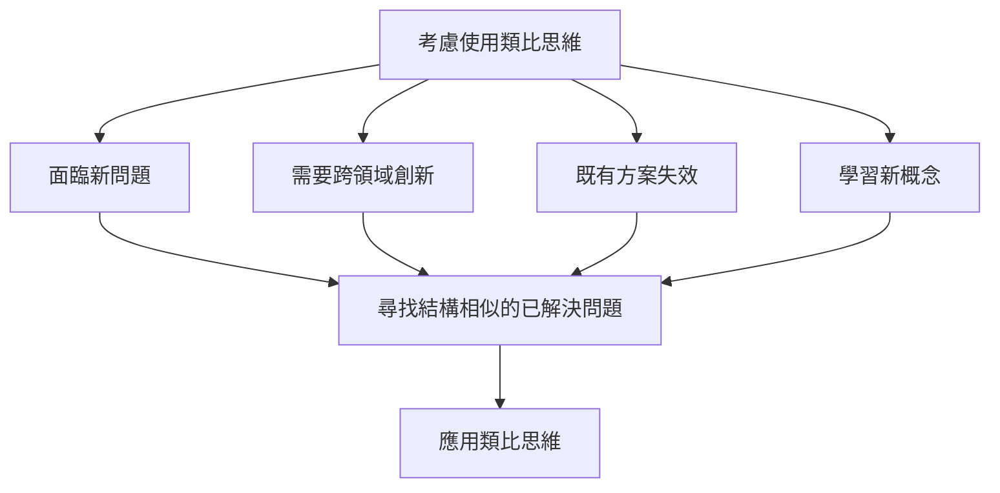
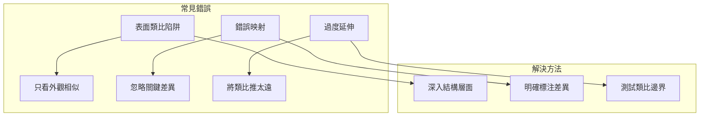
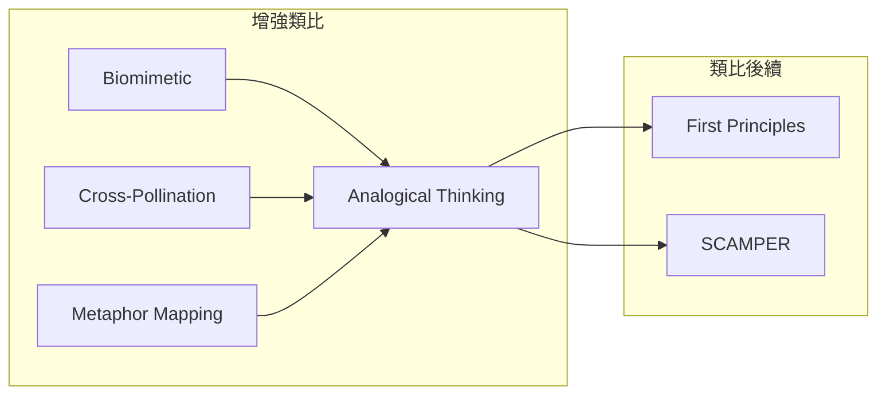

# Analogical Thinking

> 類比思維 - 從遠處借智慧，從熟悉解陌生

## 基本資訊

| 屬性 | 值 |
|------|-----|
| 類別 | Creative |
| 能量等級 | 中 |
| 建議時長 | 30-45 分鐘 |
| 參與人數 | 1-10 人 |
| 難度 | 中-高 |

## 技術概述

**Analogical Thinking**（類比思維）是一種透過識別不同領域間結構相似性來解決問題的技術。將一個領域（源域）的成功模式映射到另一個領域（目標域），產生創新解決方案。類比距離越遠，創新潛力越大。

## 歷史背景

類比思維在科學史上有重要地位：
- **克普勒**：用行星與磁鐵的類比發現行星運動定律
- **達爾文**：從馬爾薩斯人口論類比到物種演化
- **沃森與克里克**：DNA 雙螺旋結構的發現

認知科學家 Dedre Gentner 的「結構映射理論」(Structure-Mapping Theory) 為類比思維提供了系統性框架。

## 核心原理

### 類比的層次

### 類比距離與創新

| 類比距離 | 範例 | 創新潛力 |
|----------|------|----------|
| 近距離 | 同產業內的最佳實踐 | 低 - 漸進改善 |
| 中距離 | 相關產業的做法 | 中 - 有意義的創新 |
| 遠距離 | 完全不同領域的模式 | 高 - 突破性創新 |

## 執行步驟

### 詳細步驟

#### 步驟 1：問題抽象化（10分鐘）

1. **描述具體問題**
   - 例：「如何讓用戶更快找到想要的產品？」

2. **抽取核心結構**
   - 關鍵要素：搜尋者、大量選項、匹配需求
   - 核心關係：導航、篩選、推薦

3. **形成抽象描述**
   - 「在大量選項中快速找到最佳匹配」

#### 步驟 2：搜尋類比（15分鐘）

**提問引導：**
- 「還有什麼領域需要解決類似問題？」
- 「自然界如何解決這個問題？」
- 「其他產業如何處理這種情況？」

**類比來源：**

#### 步驟 3：深入探索源域（10分鐘）

- 了解源域解決方案的細節
- 識別成功的關鍵因素
- 理解背後的原理

#### 步驟 4：映射與適應（15分鐘）

1. **直接映射**
   - 源域的 A → 目標域的 A'
   - 源域的 B → 目標域的 B'

2. **適應調整**
   - 考慮目標域的特殊約束
   - 修改以符合實際情況

## 類比範例

### 案例：電商搜尋優化

**目標問題**：用戶在電商網站找不到想要的產品

**類比探索**：

| 源域 | 解決模式 | 映射到電商 |
|------|----------|------------|
| 圖書館員 | 詢問需求後推薦 | 對話式搜尋助手 |
| 約會 App | 雙向匹配算法 | 產品與用戶雙向匹配 |
| 超市貨架 | 視覺分區引導 | 視覺化分類導航 |
| 蜜蜂採蜜 | 舞蹈溝通位置 | 社群分享發現 |
| GPS 導航 | 即時路線規劃 | 個人化購物路徑 |

### 歷史性類比創新

## 引導提示

### 尋找類比的問題

| 問題類型 | 提問 |
|----------|------|
| 自然類比 | 「自然界如何解決這個問題？」|
| 產業類比 | 「哪個產業已經解決了類似問題？」|
| 歷史類比 | 「歷史上有類似的挑戰嗎？」|
| 系統類比 | 「什麼系統有相似的結構？」|

### 深化類比的問題

| 問題 | 目的 |
|------|------|
| 這個類比的核心原理是什麼？ | 提取可遷移的原則 |
| 這在源域為什麼有效？ | 理解成功因素 |
| 目標域有什麼不同？ | 識別需要調整的地方 |

## 適用場景

### 最佳使用時機

## 注意事項

### 類比的陷阱

### Do's & Don'ts

**Do's（應該做）**
- 尋找結構相似而非表面相似
- 明確類比的邊界
- 測試映射的有效性
- 嘗試遠距離類比

**Don'ts（不應該做）**
- 停留在表面類比
- 忽略領域差異
- 強行套用不適合的類比
- 只用熟悉領域的類比

## 變體技術

### 1. 強制類比
- 隨機選擇一個領域
- 強制尋找與問題的連結
- 類似 Random Stimulation

### 2. 類比頭腦風暴
- 快速產生多個類比
- 不評判，只記錄
- 之後選擇最有潛力的深入

### 3. 逆向類比
- 思考你的解決方案可以用在哪裡
- 從目標域反推源域

## 與其他技術的結合

## 培養類比能力的方法

1. **廣泛閱讀**
   - 閱讀不同領域的書籍
   - 關注科普和跨領域內容

2. **保持好奇**
   - 問「這是怎麼運作的？」
   - 觀察日常事物的結構

3. **練習轉換**
   - 嘗試用不同方式解釋同一件事
   - 為複雜概念找簡單類比

4. **建立類比庫**
   - 收集有啟發性的類比
   - 記錄跨領域的成功案例

## 參考資源

- [MIT Sloan: Unlock Creativity Through Analogical Thinking](https://sloanreview.mit.edu/article/unlock-creativity-through-analogical-thinking/)
- [Cambridge: Analogical Thinking in Problem-Solving and Creativity](https://www.cambridge.org/core/books/abs/rethinking-creativity/analogical-thinking-in-problemsolving-and-creativity/0B0E49277F5608EEA7FBF7185C057B86)
- [LearningMole: Harnessing the Power of Comparative Reasoning](https://learningmole.com/analogical-thinking-comparisons-solutions/)
- [ScienceDirect: Cross-domain Analogical Reasoning](https://www.sciencedirect.com/science/article/abs/pii/S1871187125000574)

---

*返回 [Creative 類別](./index.md) | [技術總覽](../index.md)*
