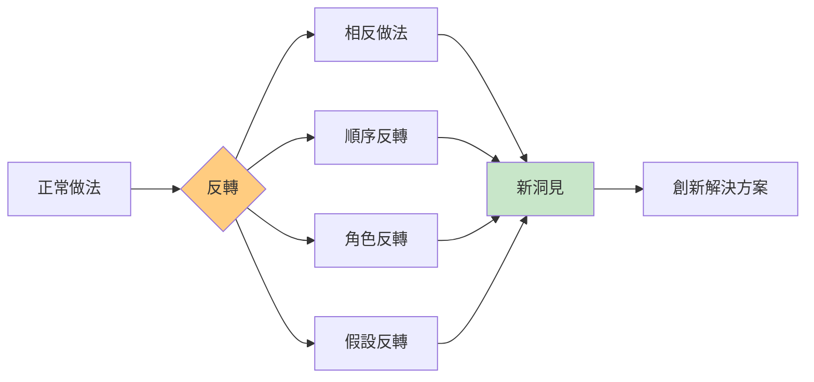
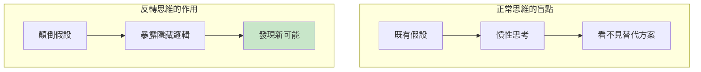
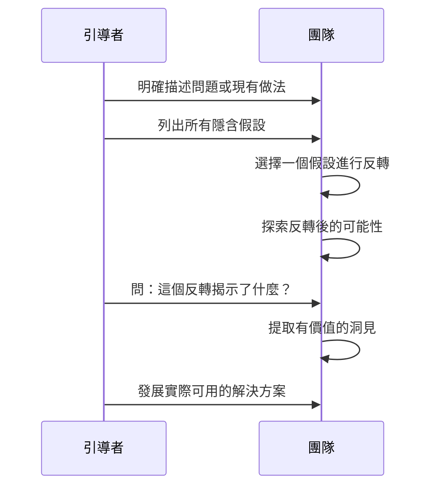
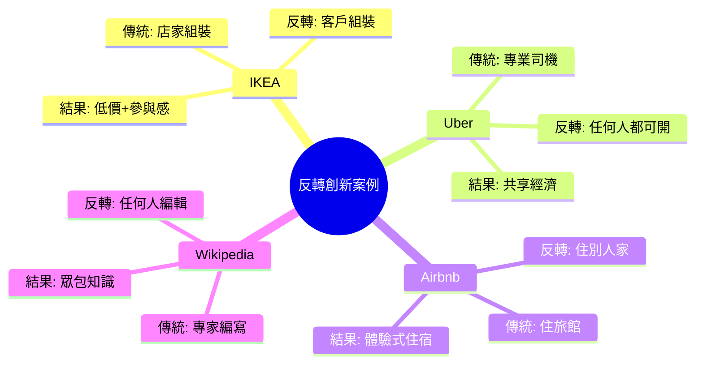
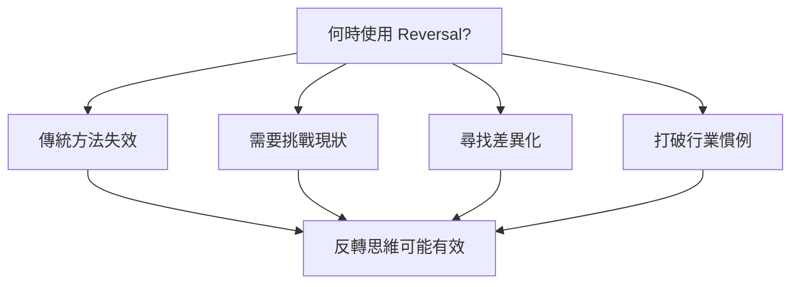
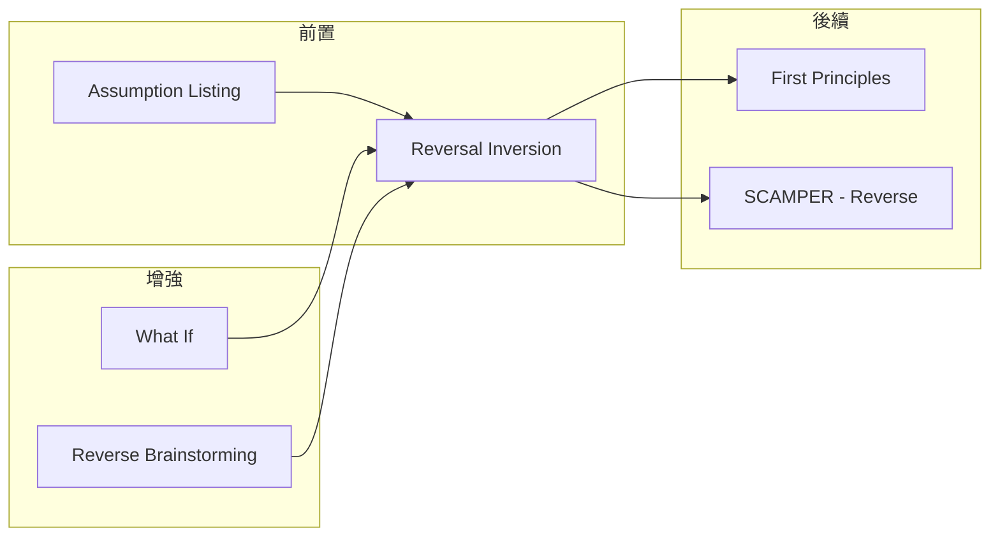

# Reversal Inversion

> 反轉思維 - 把問題翻過來，看見隱藏的假設

## 基本資訊

| 屬性 | 值 |
|------|-----|
| 類別 | Creative |
| 能量等級 | 中-低 |
| 建議時長 | 20-30 分鐘 |
| 參與人數 | 1-8 人 |
| 難度 | 中 |

## 技術概述

**Reversal Inversion**（反轉思維）是透過刻意將問題、假設或做法翻轉來揭示隱藏假設並發現新視角的技術。當傳統方法失效時，反向思考往往能帶來突破。



## 核心原理

### 為什麼反轉有效？



### 反轉類型

| 反轉類型 | 說明 | 範例 |
|----------|------|------|
| 方向反轉 | 做相反的事 | 推→拉 |
| 順序反轉 | 顛倒步驟順序 | 先賣後造 |
| 角色反轉 | 交換角色 | 讓客戶成為供應商 |
| 假設反轉 | 質疑核心信念 | 如果品質不重要？ |
| 目標反轉 | 追求相反目標 | 如何讓它失敗？ |

## 執行步驟



### 詳細步驟

#### 步驟 1：識別假設（10分鐘）

1. 描述現有做法或問題
2. 問：「我們在假設什麼？」
3. 列出所有隱含假設

**假設識別問題：**
- 我們認為什麼是「必須」的？
- 什麼是「不可能」的？
- 什麼是「理所當然」的？

#### 步驟 2：選擇並反轉（5分鐘）

選擇一個假設，問：「如果相反的是真的呢？」

#### 步驟 3：探索反轉（15分鐘）

- 在反轉的世界中自由發想
- 不評判可行性
- 記錄所有想法

#### 步驟 4：提取洞見（10分鐘）

- 反轉揭示了什麼真相？
- 有什麼部分可以應用？
- 什麼「不可能」其實是可能的？

## 反轉範例

### 案例：餐廳服務

**現有假設與反轉：**

| 假設 | 反轉 | 可能創新 |
|------|------|----------|
| 客人點餐 | 廚師決定菜單 | Omakase 料理 |
| 服務生送餐 | 客人自取 | 自助餐/迴轉壽司 |
| 付錢吃飯 | 吃飯賺錢 | 試吃員/美食評論家 |
| 固定價格 | 隨意付費 | Pay What You Want |
| 餐廳等客人 | 餐廳找客人 | 外送服務 |

### 商業創新案例



## 引導提示

### 發現假設的問題

| 問題 | 目的 |
|------|------|
| 這個行業都這麼做嗎？ | 識別行業慣例 |
| 我們從未質疑什麼？ | 發現隱藏假設 |
| 什麼讓我們覺得「不可能」？ | 找出限制性信念 |
| 如果外星人來經營會怎麼做？ | 跳出文化假設 |

### 反轉探索的問題

| 問題 | 探索方向 |
|------|----------|
| 如果做相反的事會怎樣？ | 行動反轉 |
| 如果順序顛倒呢？ | 流程反轉 |
| 如果角色交換呢？ | 關係反轉 |
| 如果目標相反呢？ | 目的反轉 |

## 適用場景



## 注意事項

### Do's（應該做）
- 徹底探索反轉後的世界
- 暫時假設反轉是可行的
- 尋找部分可用的洞見
- 質疑「理所當然」的假設

### Don'ts（不應該做）
- 太快否定反轉的可能性
- 只反轉表面的東西
- 忽略反轉揭示的深層洞見
- 認為所有反轉都必須完全採用

## 變體技術

### 1. 假設攻擊
- 列出所有假設
- 系統性地挑戰每一個
- 記錄發現

### 2. 角色反轉
- 與利害關係人交換角色
- 從對方視角看問題
- 發現盲點

### 3. 時間反轉
- 從終點回推到起點
- 「如果已經解決了，我們是怎麼做到的？」

### 4. 極端反轉
- 不只是相反，而是極端相反
- 發現更大的可能性空間

## 與其他技術的結合



## 反轉思維工作表

```
┌─────────────────────────────────────────────────────────────┐
│               REVERSAL THINKING WORKSHEET                    │
├─────────────────────────────────────────────────────────────┤
│ 問題/情境: _____________________________________________     │
│                                                              │
│ 步驟 1: 列出假設                                            │
│ ┌─────────────────────────────────────────────────────────┐│
│ │ 假設 1: ______________________________________________ ││
│ │ 假設 2: ______________________________________________ ││
│ │ 假設 3: ______________________________________________ ││
│ │ 假設 4: ______________________________________________ ││
│ └─────────────────────────────────────────────────────────┘│
│                                                              │
│ 步驟 2: 選擇一個假設進行反轉                                │
│ 選擇的假設: ____________________________________________     │
│ 反轉後: ________________________________________________     │
│                                                              │
│ 步驟 3: 在反轉世界中發想                                    │
│ ┌─────────────────────────────────────────────────────────┐│
│ │ 想法 1: ______________________________________________ ││
│ │ 想法 2: ______________________________________________ ││
│ │ 想法 3: ______________________________________________ ││
│ └─────────────────────────────────────────────────────────┘│
│                                                              │
│ 步驟 4: 提取洞見                                            │
│ 這揭示了什麼？__________________________________________     │
│ 什麼可以應用？__________________________________________     │
└─────────────────────────────────────────────────────────────┘
```

## 參考資源

- Edward de Bono《水平思考法》
- TRIZ 原則 13: 反轉 (The Other Way Around)
- [IDEO Design Thinking](https://designthinking.ideo.com/)

---

*返回 [Creative 類別](./index.md) | [技術總覽](../index.md)*
