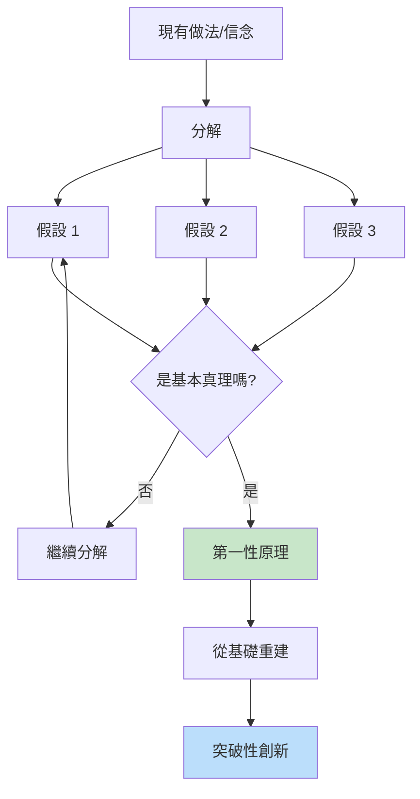
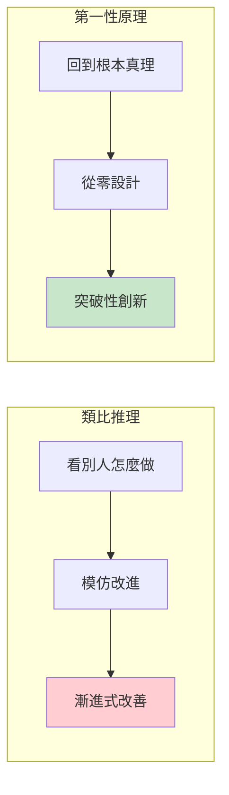
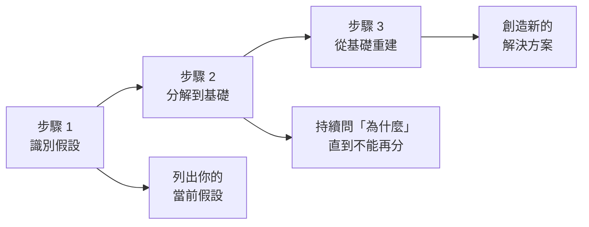
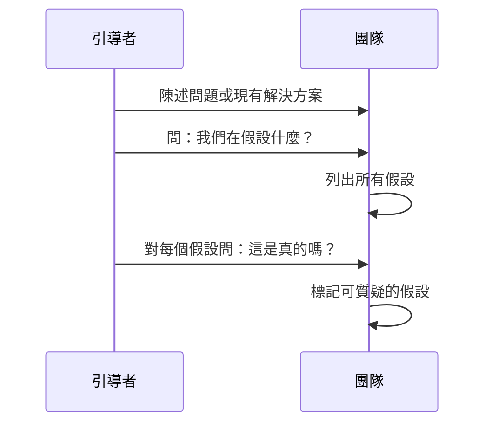
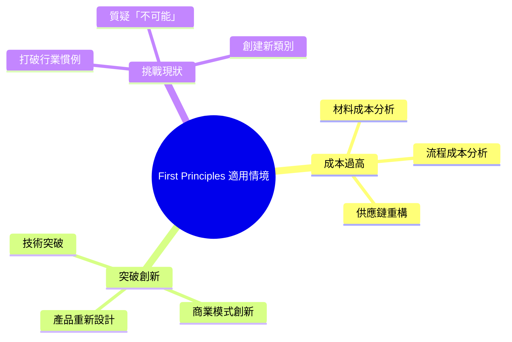
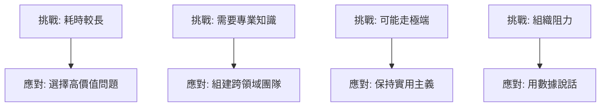
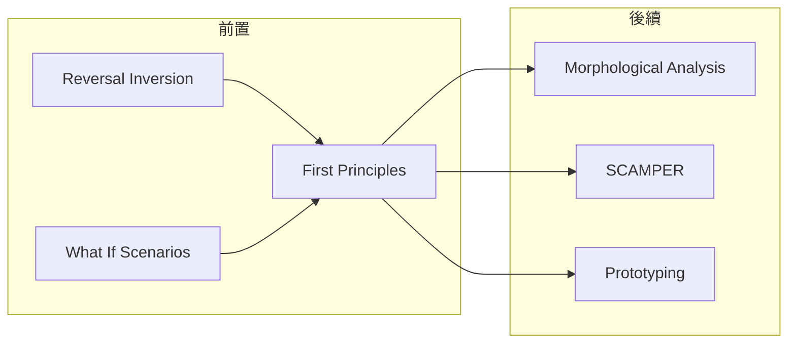

# First Principles Thinking

> 第一性原理思維 - 回歸根本，從零開始重建

## 基本資訊

| 屬性 | 值 |
|------|-----|
| 類別 | Creative |
| 能量等級 | 中 |
| 建議時長 | 45-90 分鐘 |
| 參與人數 | 1-6 人 |
| 難度 | 高 |

## 技術概述

**First Principles Thinking**（第一性原理思維）是一種將問題分解到最基本、不可再分的真理，然後從這些基礎重新建構解決方案的思維方法。這種方法避免了「類比推理」的局限，能夠產生真正突破性的創新。

## 歷史背景

第一性原理的概念源自古希臘哲學家亞里士多德，他將其定義為「認識事物的第一基礎」。現代商業界，Elon Musk 是這種思維方式最知名的實踐者，他用這種方法重新思考火箭製造、電動車電池等看似成本不可降低的領域。

## 核心原理

### 類比推理 vs 第一性原理

### Elon Musk 的三步驟方法

## 執行步驟

### 階段一：識別和質疑假設（20分鐘）

**提問範例：**
- 「為什麼我們認為必須這樣做？」
- 「這是事實還是觀點？」
- 「有什麼證據支持這個假設？」

### 階段二：分解到基礎（25分鐘）

**連續追問「為什麼」直到達到不可再分的真理：**

| 層級 | 問題 | 範例（電池成本） |
|------|------|------------------|
| 表面 | 為什麼電池貴？ | 因為電池組貴 |
| 深入 | 為什麼電池組貴？ | 因為材料和製造成本 |
| 更深 | 材料成本是多少？ | 鈷、鋰、碳等的市場價 |
| 基礎 | 這些材料的原料價格？ | 遠低於電池售價 |

### 階段三：從基礎重建（30分鐘）

1. **接受基礎真理**
   - 物理定律
   - 經過驗證的數據
   - 不可改變的約束

2. **拒絕人為慣例**
   - 「一直都這樣做」
   - 「行業標準」
   - 「別人都這麼做」

3. **重新設計**
   - 如果從零開始，最佳方案是什麼？
   - 什麼是達成目標的最基本路徑？

## 案例研究

### SpaceX 火箭

### Tesla 電池

**問題：電池太貴，電動車不可行**

| 思維方式 | 過程 | 結論 |
|----------|------|------|
| 類比推理 | 電池歷來很貴 | 等待技術進步 |
| 第一性原理 | 電池=鈷+鋰+碳+... | 自建電池工廠 |

**Musk 的原話：**
> 「電池組的市場價是每千瓦時600美元。如果我們在倫敦金屬交易所購買原材料，自己組裝，成本只有80美元。」

## 引導提示

### 識別假設階段

| 問題 | 目的 |
|------|------|
| 我們認為什麼是「必須」的？ | 發現隱藏假設 |
| 為什麼這個成本/時間是「固定」的？ | 質疑約束 |
| 如果外星人來做，他們會接受這些假設嗎？ | 跳出人類慣例 |

### 分解階段

| 問題 | 目的 |
|------|------|
| 這是物理限制還是人為限制？ | 區分真約束和假約束 |
| 如果這是真的，證據是什麼？ | 驗證假設 |
| 最基本的元素是什麼？ | 達到第一性原理 |

### 重建階段

| 問題 | 目的 |
|------|------|
| 如果只基於這些基本真理，最佳方案是什麼？ | 重新設計 |
| 什麼是達成目標的最短路徑？ | 去除冗餘 |
| 我們可以直接獲取這些元素嗎？ | 垂直整合思考 |

## 適用場景

### 適合度評估

| 情境 | 適合度 | 原因 |
|------|--------|------|
| 需要突破性創新 | ★★★★★ | 核心應用場景 |
| 成本優化 | ★★★★★ | 可找到根本解決方案 |
| 打破行業慣例 | ★★★★☆ | 質疑「一直都這樣」|
| 漸進式改善 | ★★☆☆☆ | 可能過度投入 |
| 快速解決問題 | ★☆☆☆☆ | 太耗時 |

## 注意事項

### 挑戰與應對

### Do's & Don'ts

**Do's（應該做）**
- 持續追問「為什麼」
- 尋找數據和證據
- 區分物理限制和人為慣例
- 願意從零開始思考

**Don'ts（不應該做）**
- 接受「一直都這樣」
- 被成本嚇退
- 停留在表面分析
- 忽視實施可行性

## 變體技術

### 1. 蘇格拉底式提問
- 不斷追問「為什麼」和「怎麼知道」
- 挑戰每一個陳述

### 2. 五個為什麼（簡化版）
- 連續問五次「為什麼」
- 更快速但較淺層

### 3. 逆向工程
- 從理想結果反推
- 識別必要的基礎元素

## 與其他技術的結合

## 練習建議

### 日常練習

1. **成本分解練習**
   - 選擇一個產品
   - 列出所有成本組成
   - 質疑每一項

2. **假設狩獵**
   - 在日常對話中識別假設
   - 問：這是真的嗎？

3. **逆向思考**
   - 如果從零開始，我會怎麼做？

## 參考資源

- [James Clear: First Principles - Elon Musk on the Power of Thinking for Yourself](https://jamesclear.com/first-principles)
- [CNBC: Why Elon Musk Wants Employees to Use First Principles](https://www.cnbc.com/2018/04/18/why-elon-musk-wants-his-employees-to-use-a-strategy-called-first-principles.html)
- [Medium: Elon Musk's 3-Step First Principles Thinking](https://medium.com/the-mission/elon-musks-3-step-first-principles-thinking-how-to-think-and-solve-difficult-problems-like-a-ba1e73a9f6c0)
- [First Principles Ventures](https://www.firstprinciples.ventures/insights/first-principles-the-foundations-of-innovation-and-growth)

---

*返回 [Creative 類別](./index.md) | [技術總覽](../index.md)*
