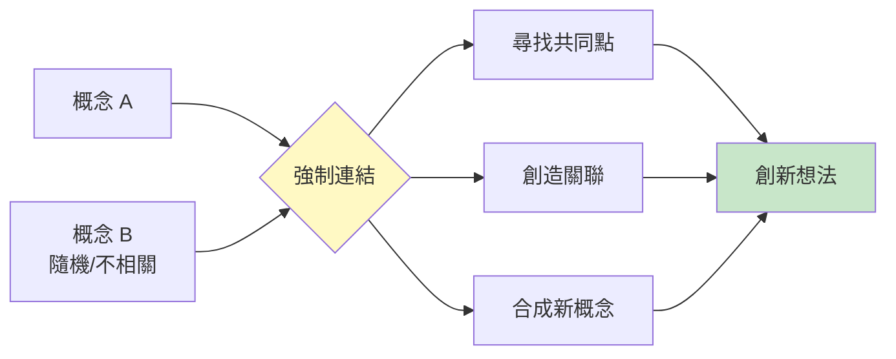
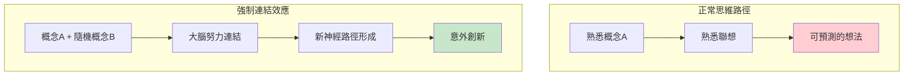
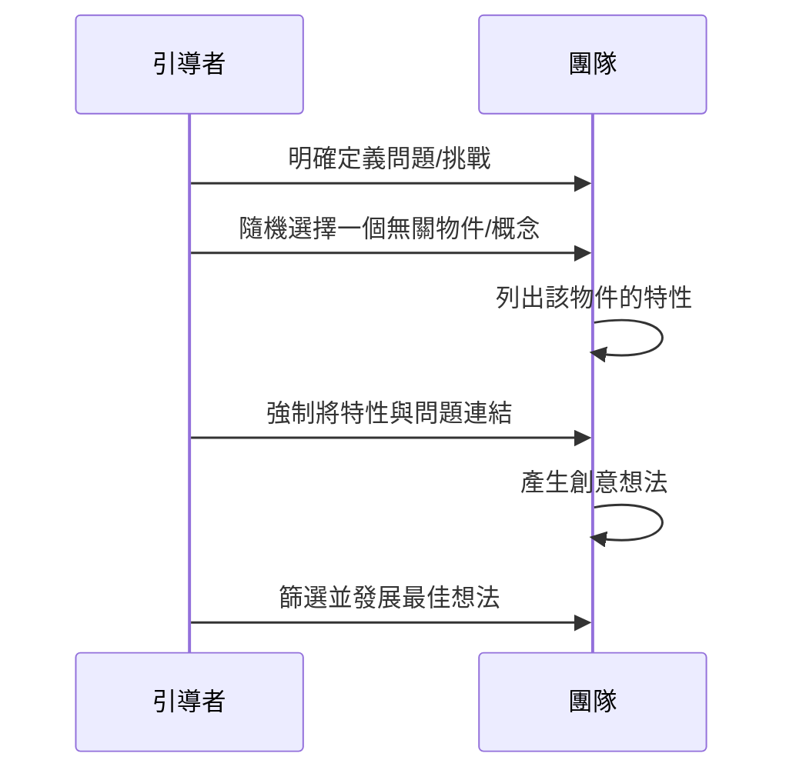
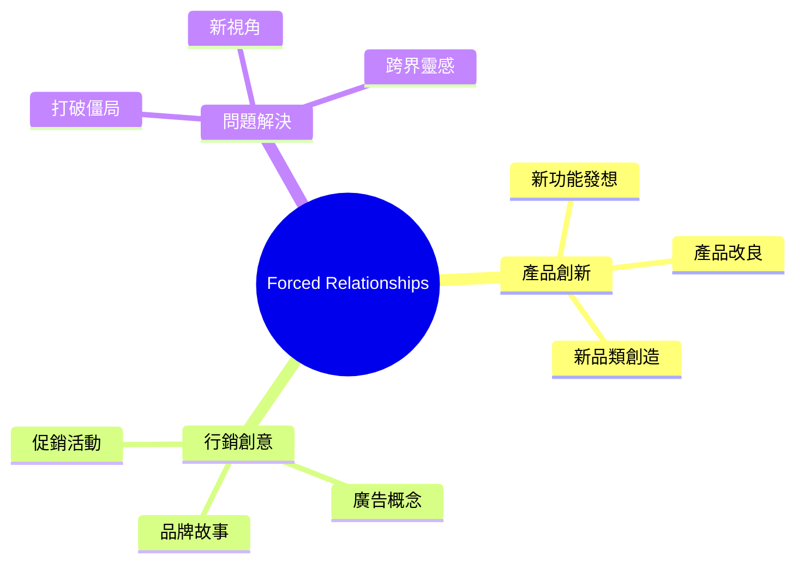
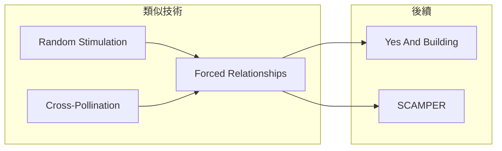

# Forced Relationships

> 強迫關聯技術 - 連接不相關的概念產生創新火花

## 基本資訊

| 屬性 | 值 |
|------|-----|
| 類別 | Creative |
| 能量等級 | 中-高 |
| 建議時長 | 20-30 分鐘 |
| 參與人數 | 1-10 人 |
| 難度 | 中 |

## 技術概述

**Forced Relationships**（強迫關聯）是一種透過強制連接兩個看似無關的概念來激發創意的技術。大腦被迫在不相關的事物之間尋找連結時，會產生意想不到的創新想法。

## 核心原理

### 為什麼強制連結有效？

### 認知科學基礎

- **遠距聯想**：創意往往來自遠距離概念的連結
- **概念融合**：兩個概念的交集產生新類別
- **打破固著**：強制連結突破功能固著

## 執行步驟

### 詳細步驟

#### 步驟 1：定義問題（3分鐘）
- 清楚陳述要解決的問題
- 例：「如何提高員工參與度？」

#### 步驟 2：選擇隨機元素（2分鐘）

**選擇方法：**
| 方法 | 說明 |
|------|------|
| 隨機物件 | 從袋子抽取實物 |
| 隨機詞彙 | 字典隨機頁面 |
| 隨機圖片 | 雜誌隨機翻頁 |
| 隨機產品 | 任選一個產品 |

#### 步驟 3：分析特性（5分鐘）
- 列出隨機元素的 5-8 個特性
- 包括功能、外觀、使用方式等

#### 步驟 4：強制連結（15分鐘）
- 逐一將每個特性與問題連結
- 問：「這個特性如何應用到我們的問題？」
- 記錄所有想法，不評判

#### 步驟 5：篩選發展（10分鐘）
- 選擇最有潛力的想法
- 發展成可行方案

## 範例演練

### 問題：如何提高員工參與度？

**隨機物件：腳踏車**

| 腳踏車特性 | 強制連結到員工參與度 |
|------------|----------------------|
| 兩個輪子 | 建立「夥伴制度」，兩人一組互相支持 |
| 需要踩踏才能前進 | 員工努力直接影響結果（貢獻可視化）|
| 有變速器 | 允許不同「速度」的工作節奏 |
| 需要平衡 | 工作生活平衡計畫 |
| 可以載人 | 資深員工「載著」新人成長 |
| 環保 | 綠色辦公室計畫增加認同感 |
| 可以比賽 | 遊戲化競賽元素 |
| 需要維護 | 定期「保養」對話/健康檢查 |

## 引導提示

### 特性分析問題

| 問題 | 目的 |
|------|------|
| 這個東西是什麼顏色/形狀？ | 外觀特性 |
| 它如何運作？ | 功能特性 |
| 人們如何使用它？ | 使用情境 |
| 它給人什麼感覺？ | 情感特性 |
| 它與什麼相關？ | 聯想網絡 |

### 強制連結問題

| 問題 | 目的 |
|------|------|
| 這個特性如何幫助解決問題？ | 直接應用 |
| 這讓你想到什麼解決方案？ | 觸發聯想 |
| 如果產品有這個特性會怎樣？ | 特性轉移 |
| 這個原理可以借用嗎？ | 原理提取 |

## 適用場景

## 注意事項

### Do's（應該做）
- 選擇真正隨機的元素（不要「挑選」）
- 深入分析所有特性
- 嘗試每個特性的連結
- 保持開放心態

### Don'ts（不應該做）
- 選擇「看起來相關」的元素
- 太快放棄連結
- 只選「容易連結」的特性
- 批評他人的連結想法

## 變體技術

### 1. 雙重強制
- 同時使用兩個隨機元素
- 尋找三方交集

### 2. 產品強制
- 隨機選擇一個成功產品
- 將其特性應用到問題

### 3. 角色強制
- 隨機選擇一個角色/職業
- 思考他們如何解決問題

### 4. 環境強制
- 隨機選擇一個地點
- 該地點的特性如何啟發解決方案

## 與其他技術的結合

## 參考資源

- Edward de Bono《Serious Creativity》
- [Big Bang Partnership: Random Stimulus](https://bigbangpartnership.co.uk/random-stimulus/)
- [Innovation Management: Creative Problem Solving](https://innovationmanagement.se/)

---

## 設計模式對照

| 模式名稱 | 應用位置 | 核心價值 |
|----------|----------|----------|
| **Morphological Analysis** | 結構基礎 | 系統化組合不同元素 |
| **Forced Connection** | 核心操作 | 強制在無關概念間建立橋樑 |
| **Bisociation** | 認知機制 | 兩個不相關框架的碰撞 |
| **Random Pairing** | 實施方式 | 隨機性增加意外發現機會 |

**核心洞察**：Forced Relationships 的「強迫」是關鍵——不是「找到相關的連結」，而是「在無關的事物間創造連結」。這種強迫讓大腦進入一種不舒服但高度創造性的狀態：它必須在兩個不相關的概念間找到意義。Arthur Koestler 稱這為「bisociation」——當兩個看似不相關的思維框架碰撞時，創意就誕生了。

---

*返回 [Creative 類別](./index.md) | [技術總覽](../index.md)*
