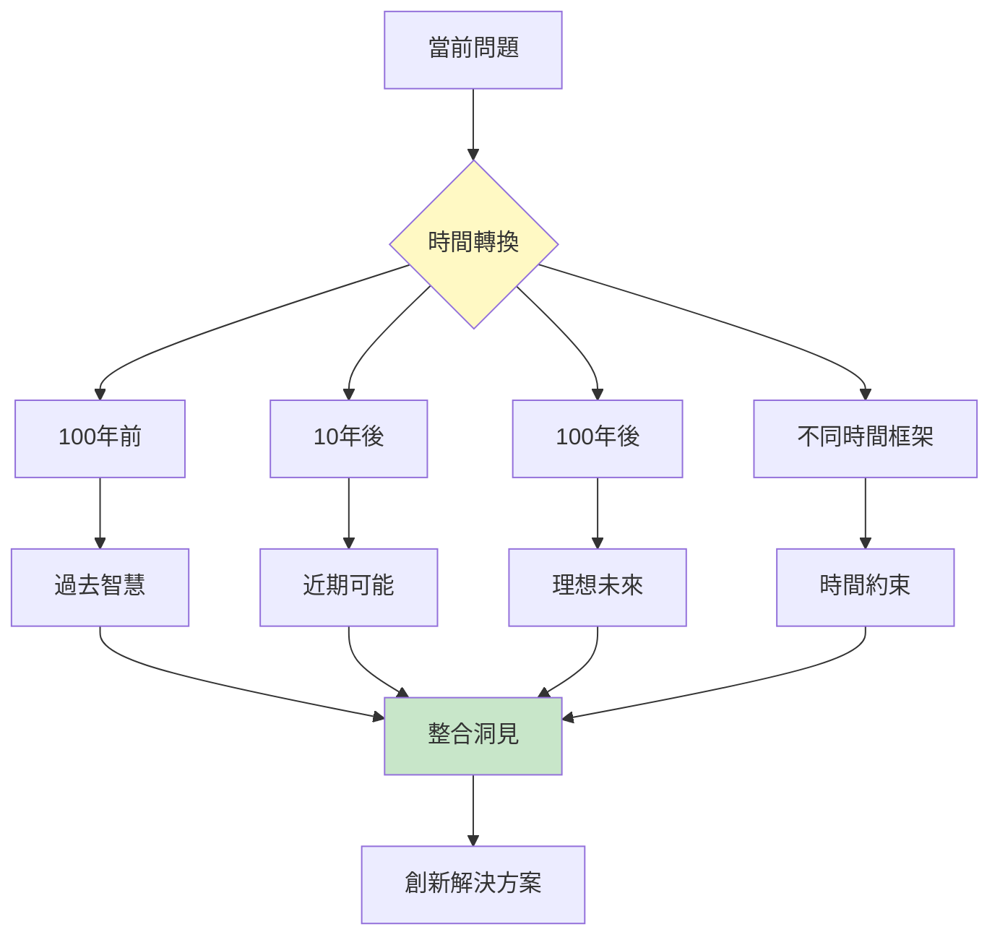
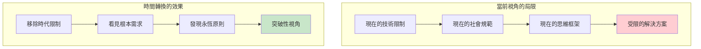
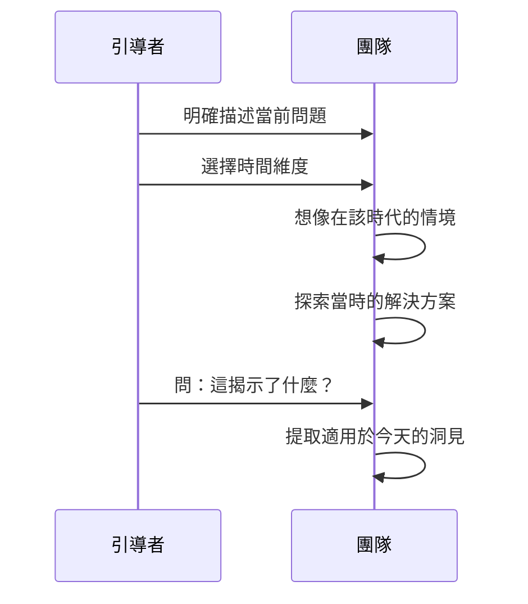
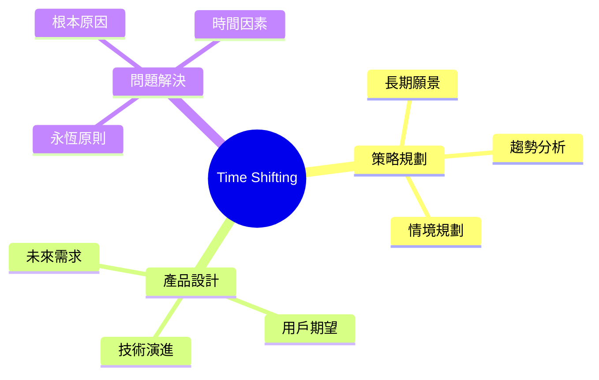
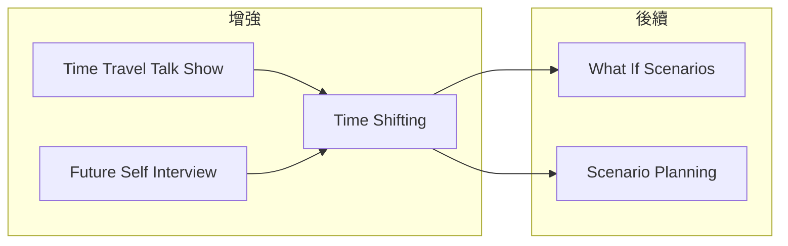

# Time Shifting

> 時間轉換技術 - 穿越時空尋找解決方案

## 基本資訊

| 屬性 | 值 |
|------|-----|
| 類別 | Creative |
| 能量等級 | 中-低 |
| 建議時長 | 20-30 分鐘 |
| 參與人數 | 1-10 人 |
| 難度 | 低-中 |

## 技術概述

**Time Shifting**（時間轉換）是透過將問題置於不同時間維度來獲得新視角的技術。探索過去、未來或不同時間框架下的解決方案，可以揭示當前思維的盲點和時代限制。

## 核心原理

### 為什麼時間轉換有效？

## 時間維度選擇

| 時間維度 | 探索問題 | 獲得洞見 |
|----------|----------|----------|
| 100年前 | 沒有現代技術時如何解決？ | 核心需求/古老智慧 |
| 10年前 | 那時如何處理？ | 演變過程/失敗教訓 |
| 10年後 | 未來會如何解決？ | 趨勢方向/可能性 |
| 100年後 | 理想狀態是什麼？ | 終極目標/願景 |
| 1天內 | 如果只有1天？ | 優先級/核心 |
| 無限時間 | 如果不趕時間？ | 最佳方案/完美主義 |

## 執行步驟

### 詳細步驟

#### 過去探索（10分鐘）

1. **選擇過去時間點**
   - 100年前 / 500年前 / 古代

2. **情境想像**
   - 沒有 [現代技術] 時如何解決？
   - 當時的人如何處理類似問題？

3. **提取智慧**
   - 什麼原則是永恆的？
   - 有什麼被遺忘的智慧？

#### 未來探索（10分鐘）

1. **選擇未來時間點**
   - 10年後 / 50年後 / 100年後

2. **情境想像**
   - 假設問題已完美解決
   - 使用了什麼方法？

3. **回推路徑**
   - 如何從現在到達那裡？
   - 第一步是什麼？

#### 時間框架探索（10分鐘）

1. **極端時間約束**
   - 只有1小時怎麼辦？
   - 如果有無限時間呢？

2. **識別優先級**
   - 什麼是真正重要的？
   - 什麼可以省略？

## 範例演練

### 問題：如何改善團隊溝通？

**過去視角（100年前）：**
| 觀察 | 洞見 |
|------|------|
| 面對面是唯一選項 | 面對面仍是最有效的 |
| 書信需要時間 | 異步溝通有其價值 |
| 重要事情才溝通 | 現在是否過度溝通？ |

**未來視角（50年後）：**
| 想像 | 應用 |
|------|------|
| 完美翻譯技術 | 現在就減少語言障礙 |
| 情感傳達技術 | 增加非語言表達機會 |
| 即時思維共享 | 更即時的同步工具 |

**時間約束視角：**
| 時間 | 洞見 |
|------|------|
| 只有5分鐘/天 | 什麼是最關鍵的訊息？ |
| 無限時間 | 理想的溝通節奏是什麼？ |

## 引導提示

### 過去探索問題

| 問題 | 目的 |
|------|------|
| 100年前的人如何解決這個問題？ | 發現永恆原則 |
| 什麼古老智慧可以借用？ | 歷史經驗 |
| 沒有[技術]時怎麼辦？ | 核心需求 |

### 未來探索問題

| 問題 | 目的 |
|------|------|
| 100年後這個問題還會存在嗎？ | 問題本質 |
| 未來人會如何解決？ | 可能性空間 |
| 如果已經解決了，是怎麼做到的？ | 倒推路徑 |

### 時間約束問題

| 問題 | 目的 |
|------|------|
| 如果只有1小時會怎麼做？ | 優先級 |
| 如果有無限時間呢？ | 理想狀態 |
| 最快的解決方案是什麼？ | 效率思考 |

## 適用場景

## 變體技術

### 1. 時間旅行訪談
- 想像訪問過去/未來的自己
- 尋求建議和視角

### 2. 歷史類比
- 尋找歷史上的類似情況
- 學習成功和失敗

### 3. 未來新聞稿
- 寫一篇來自未來的新聞
- 描述問題如何被解決

### 4. 時間線分析
- 繪製問題的時間演變
- 預測未來發展

## 與其他技術的結合

## 注意事項

### Do's（應該做）
- 充分想像不同時代的情境
- 提取跨時代的永恆原則
- 平衡過去和未來視角

### Don'ts（不應該做）
- 認為過去都是落後的
- 假設未來一定更好
- 忽略時代背景的重要差異

---

*返回 [Creative 類別](./index.md) | [技術總覽](../index.md)*
