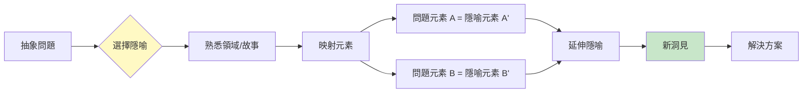
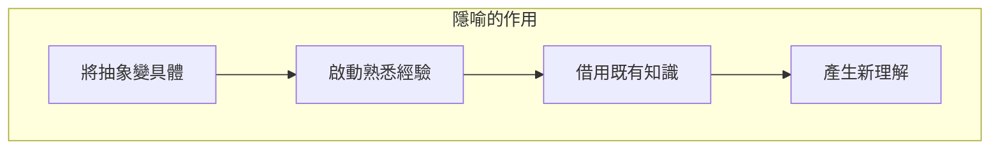
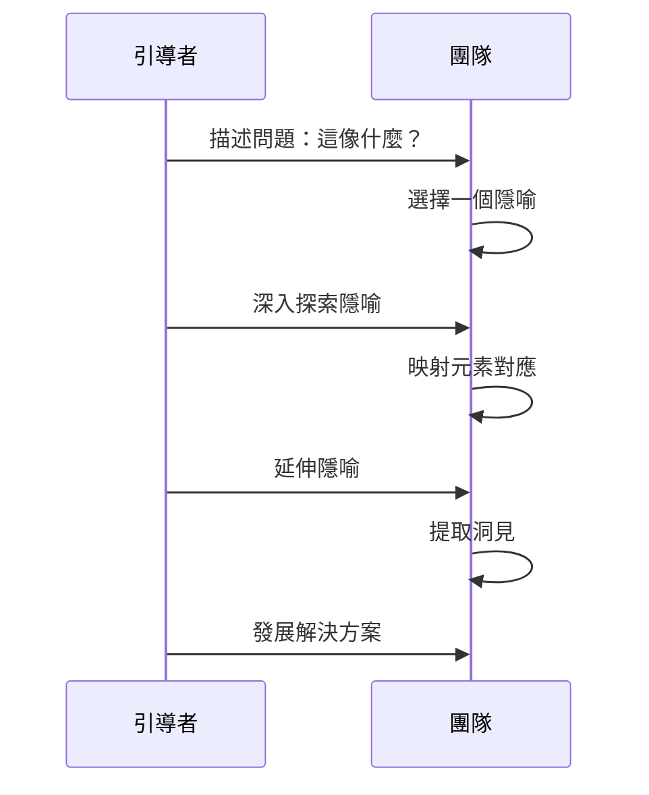
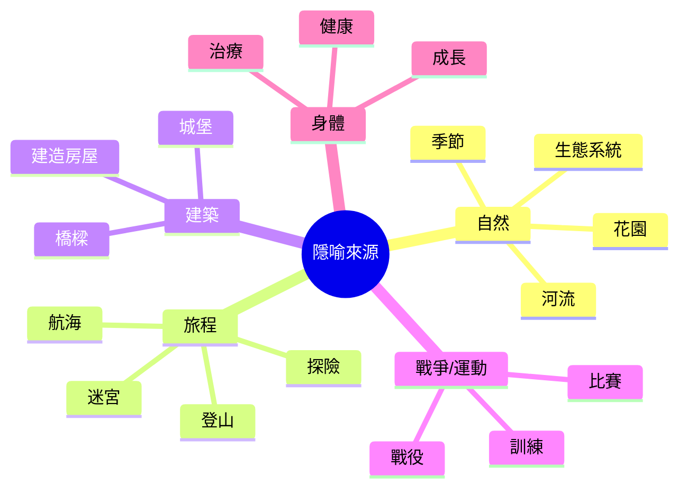
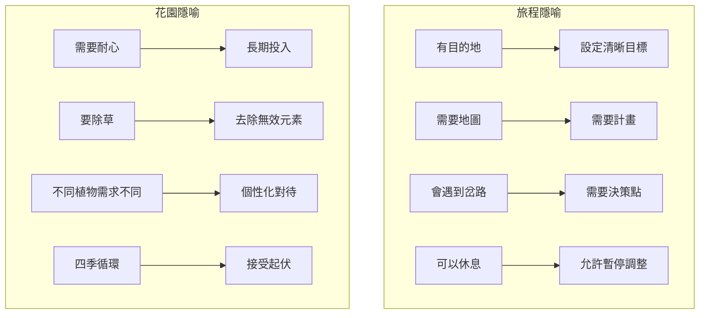
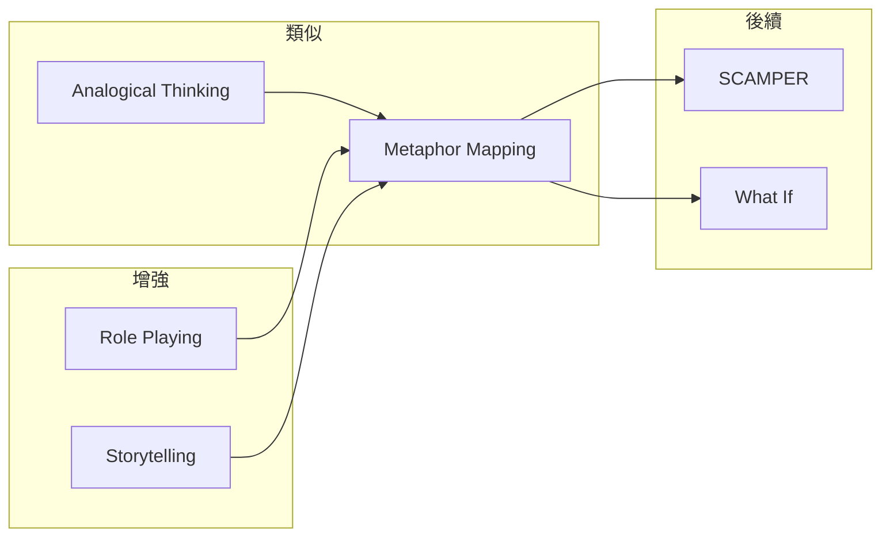

# Metaphor Mapping

> 隱喻映射技術 - 用熟悉的故事理解陌生的問題

## 基本資訊

| 屬性 | 值 |
|------|-----|
| 類別 | Creative |
| 能量等級 | 中 |
| 建議時長 | 25-40 分鐘 |
| 參與人數 | 1-8 人 |
| 難度 | 中 |

## 技術概述

**Metaphor Mapping**（隱喻映射）是使用延伸隱喻作為思考工具，將抽象或複雜的問題轉化為具體、熟悉的敘事，從而發現新的解決視角。隱喻不只是修辭手法，更是認知工具。

## 核心原理

### 隱喻的認知力量

### 結構映射理論

根據 Gentner 的結構映射理論：
- 隱喻是從源域到目標域的結構映射
- 關係的對應比表面特徵更重要
- 延伸隱喻能推導出新的洞見

## 執行步驟

### 詳細步驟

#### 步驟 1：選擇隱喻（5分鐘）

**提問：**
- 「這個問題像什麼？」
- 「這讓我想到什麼故事/情境？」

**常用隱喻來源：**

#### 步驟 2：建立映射（10分鐘）

創建對應表：

| 隱喻元素 | 問題元素 |
|----------|----------|
| 隱喻角色 A | 問題角色 X |
| 隱喻行動 B | 問題行動 Y |
| 隱喻結果 C | 問題目標 Z |

#### 步驟 3：延伸隱喻（15分鐘）

在隱喻世界中探索：
- 在隱喻中，接下來會發生什麼？
- 隱喻中如何解決類似問題？
- 隱喻中有什麼規則或智慧？

#### 步驟 4：提取洞見（10分鐘）

將隱喻洞見轉回問題：
- 這個隱喻教我們什麼？
- 如何應用這個洞見？

## 範例演練

### 問題：如何讓新產品成功上市？

**選擇隱喻：種植一棵樹**

| 種樹元素 | 產品上市映射 |
|----------|--------------|
| 選擇合適土壤 | 選擇正確市場 |
| 播種時機 | 發布時機 |
| 定期澆水 | 持續投入資源 |
| 陽光 | 市場關注/曝光 |
| 修剪枝葉 | 刪除無效功能 |
| 根深才能葉茂 | 先穩固核心用戶 |
| 需要時間成長 | 耐心培育 |
| 保護免受害蟲 | 防禦競爭對手 |

**延伸洞見：**
- 樹不能每天拔起來看根 → 不要過度追蹤早期數據
- 好土壤比好種子重要 → 市場選擇比產品完美重要
- 樹會適應環境 → 產品需要根據市場反饋調整

## 常用隱喻及其洞見

## 引導提示

### 隱喻選擇

| 問題 | 目的 |
|------|------|
| 這像什麼？ | 觸發直覺隱喻 |
| 如果要講一個故事... | 敘事化思考 |
| 這讓你想到什麼電影/書？ | 文化隱喻 |

### 隱喻延伸

| 問題 | 目的 |
|------|------|
| 在這個隱喻中，接下來會發生什麼？ | 預測發展 |
| 隱喻中的智者會說什麼？ | 提取智慧 |
| 隱喻中最大的風險是什麼？ | 識別問題 |

## 適用場景

| 場景 | 適合度 | 推薦隱喻 |
|------|--------|----------|
| 組織變革 | ★★★★★ | 航海、季節更替 |
| 產品開發 | ★★★★☆ | 烹飪、建築 |
| 團隊建設 | ★★★★☆ | 交響樂團、運動隊 |
| 策略規劃 | ★★★★☆ | 戰爭、棋局 |
| 個人成長 | ★★★★★ | 旅程、蛻變 |

## 注意事項

### Do's（應該做）
- 選擇豐富、可延伸的隱喻
- 深入探索隱喻的各個面向
- 明確標注隱喻的邊界
- 使用多個隱喻獲得不同視角

### Don'ts（不應該做）
- 選擇太表面的隱喻
- 強迫每個元素都對應
- 忽略隱喻的限制
- 混淆隱喻與現實

## 變體技術

### 1. 多重隱喻
- 同時使用2-3個隱喻
- 比較不同隱喻的洞見

### 2. 對立隱喻
- 選擇相反的隱喻
- 揭示不同視角

### 3. 動態隱喻
- 隱喻隨時間演變
- 例：種子→樹苗→大樹

### 4. 共創隱喻
- 團隊共同發展一個隱喻
- 增加參與感

## 與其他技術的結合

## 參考資源

- George Lakoff《Metaphors We Live By》
- [ScienceDirect: Metaphors and Creativity](https://www.sciencedirect.com/science/article/abs/pii/S1057740813000946)
- [Thinking Directions: Using Analogies for Creative Problem Solving](https://www.thinkingdirections.com/using-analogies-creative-problem-solving/)

---

*返回 [Creative 類別](./index.md) | [技術總覽](../index.md)*
