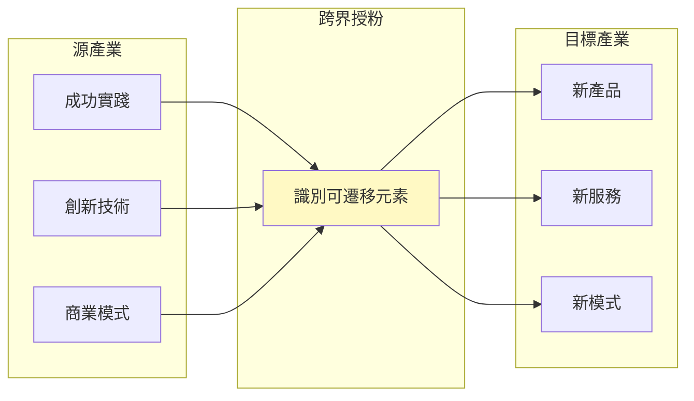
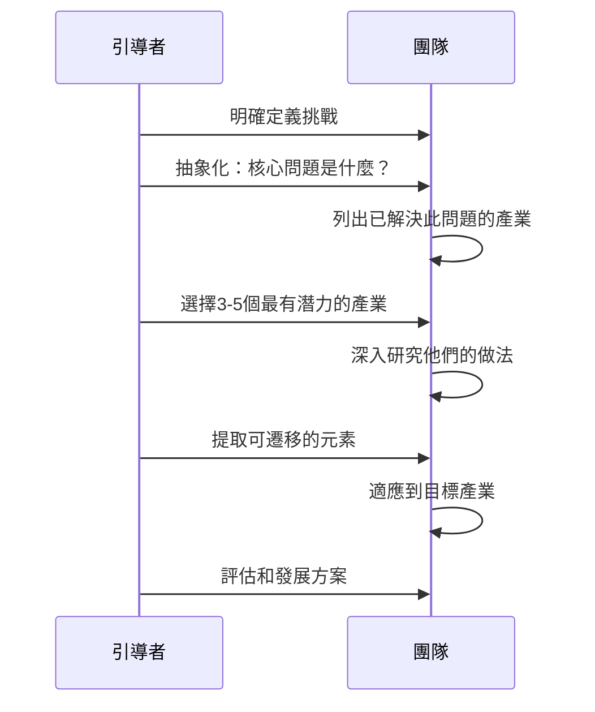
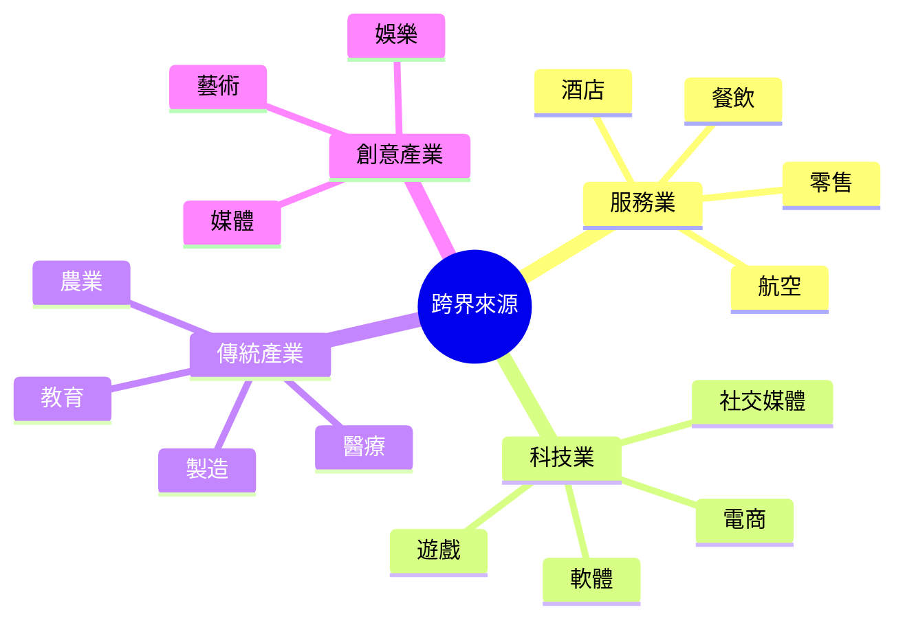
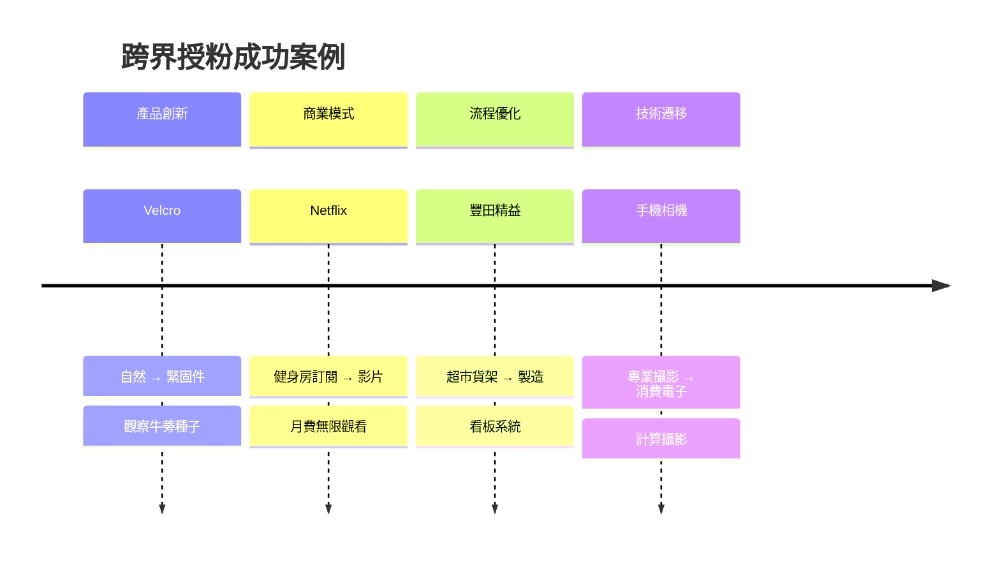
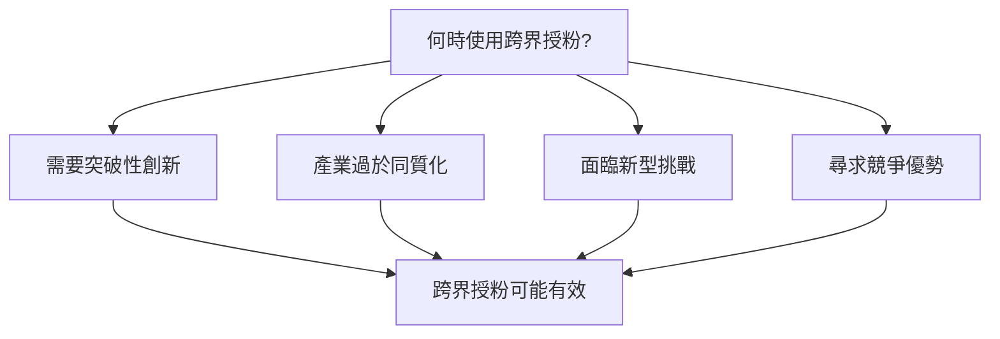

# Cross-Pollination

> 跨界授粉技術 - 從其他產業借來創新種子

## 基本資訊

| 屬性 | 值 |
|------|-----|
| 類別 | Creative |
| 能量等級 | 中-高 |
| 建議時長 | 30-45 分鐘 |
| 參與人數 | 3-12 人 |
| 難度 | 中 |

## 技術概述

**Cross-Pollination**（跨界授粉）是將一個產業或領域的成功做法、技術或商業模式遷移到另一個產業的創新技術。就像花粉從一朵花傳到另一朵花產生新品種，跨產業的想法遷移能產生突破性創新。

## 歷史背景

Frans Johansson 在《美第奇效應》中提出：創新發生在不同領域交會的「交叉點」。矽谷的成功部分歸功於密集的跨產業交流。生物學中的仿生學（Biomimicry）也是跨界授粉的一種形式。

## 核心原理

### 為什麼跨界有效？

### 關鍵原則

1. **已驗證的解決方案**
   - 源產業已經驗證有效
   - 降低創新風險

2. **新穎性來自組合**
   - 在目標產業是全新的
   - 創造競爭優勢

3. **結構相似性**
   - 尋找問題結構相似的產業
   - 而非表面相似

## 執行步驟

### 詳細步驟

#### 步驟 1：問題抽象化（10分鐘）

將具體問題抽象為普遍挑戰：

| 具體問題 | 抽象挑戰 |
|----------|----------|
| 如何減少客戶等待時間 | 如何優化隊列管理 |
| 如何增加用戶黏性 | 如何創造習慣迴路 |
| 如何降低退貨率 | 如何提高匹配準確性 |

#### 步驟 2：搜尋源產業（15分鐘）

**提問：**
- 「哪些產業已經解決了類似問題？」
- 「誰是這個問題的專家？」
- 「哪裡的解決方案最成熟？」

**常見源產業：**

#### 步驟 3：深入研究（15分鐘）

對每個選定的產業：
1. 他們如何解決這個問題？
2. 成功的關鍵因素是什麼？
3. 有什麼可遷移的元素？

#### 步驟 4：遷移與適應（15分鐘）

1. 識別可遷移的核心原則
2. 調整以適應目標產業
3. 評估可行性和挑戰

## 跨界創新案例

### 詳細案例

| 創新 | 源產業 | 目標產業 | 遷移元素 |
|------|--------|----------|----------|
| Airbnb | 青年旅社 | 住宿 | 共享經濟 |
| Uber | 叫車服務 | 交通 | 隨選媒合 |
| Spotify | 廣播 | 音樂 | 串流模式 |
| Dollar Shave Club | 訂閱服務 | 消費品 | 訂閱經濟 |

## 引導提示

### 搜尋源產業

| 問題 | 目的 |
|------|------|
| 誰最擅長處理這種情況？ | 找到專家產業 |
| 哪個產業最需要解決這個問題？ | 找到成熟解決方案 |
| 自然界如何解決？ | 仿生靈感 |
| 軍事/航空如何解決？ | 極端環境解決方案 |

### 遷移評估

| 問題 | 目的 |
|------|------|
| 核心原則是什麼？ | 識別可遷移元素 |
| 我們的產業有什麼不同？ | 識別調整需求 |
| 需要什麼才能讓它運作？ | 評估可行性 |

## 適用場景

## 促進跨界的方法

### 組織層面

1. **Renaissance Teams**
   - 鼓勵團隊成員發展多元興趣
   - 將不同背景的人組合在一起

2. **產業沉浸**
   - 定期參訪其他產業
   - 邀請外部專家分享

3. **What If 工作坊**
   - 「如果 [產業X] 來做我們的業務會怎樣？」

### 個人層面

1. 廣泛閱讀不同領域
2. 參加跨產業活動
3. 建立多元人脈網絡
4. 保持對「無關」事物的好奇

## 注意事項

### Do's（應該做）
- 深入理解源產業的成功因素
- 適應而非直接複製
- 尋找結構相似而非表面相似
- 考慮文化和監管差異

### Don'ts（不應該做）
- 只看表面做法
- 忽略產業差異
- 低估實施難度
- 假設可以直接套用

## 挑戰與應對

| 挑戰 | 應對策略 |
|------|----------|
| 部門封閉 | 建立跨部門專案 |
| 語言障礙 | 使用通用術語和類比 |
| 時間壓力 | 建立定期的創新時間 |
| 抵制外來想法 | 強調成功案例 |

## 推薦閱讀

- Frans Johansson《美第奇效應》(The Medici Effect)
- Steven Johnson《好點子從哪來》(Where Good Ideas Come From)
- [HBR: Perfecting Cross-Pollination](https://hbr.org/2004/09/perfecting-cross-pollination)
- [Fast Company: 5 Ways to Innovate by Cross-Pollinating Ideas](https://www.fastcompany.com/1672519/5-ways-to-innovate-by-cross-pollinating-ideas)

---

*返回 [Creative 類別](./index.md) | [技術總覽](../index.md)*
