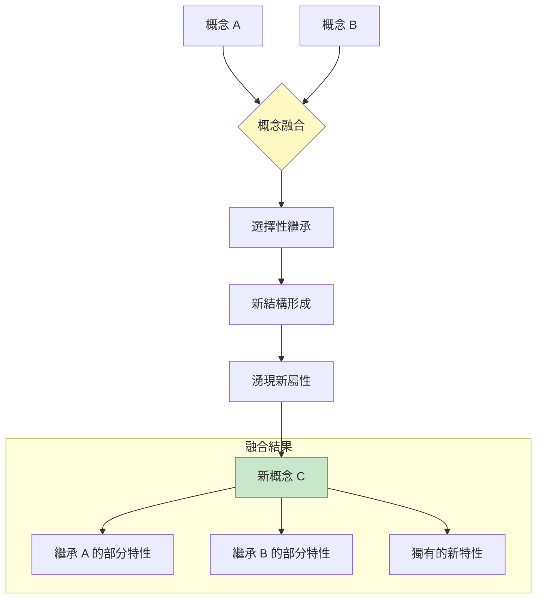
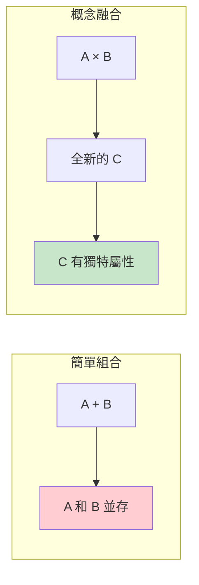
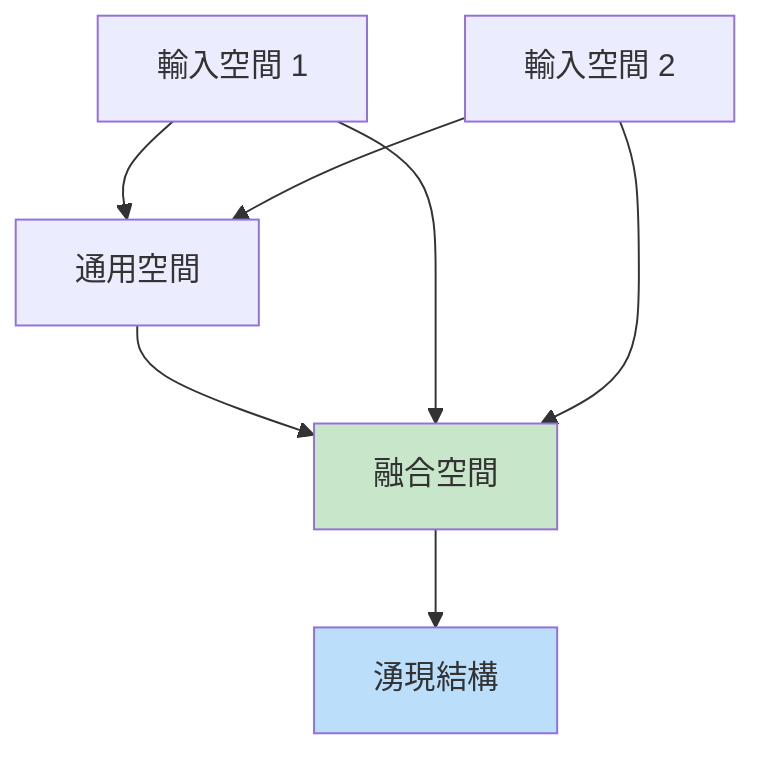
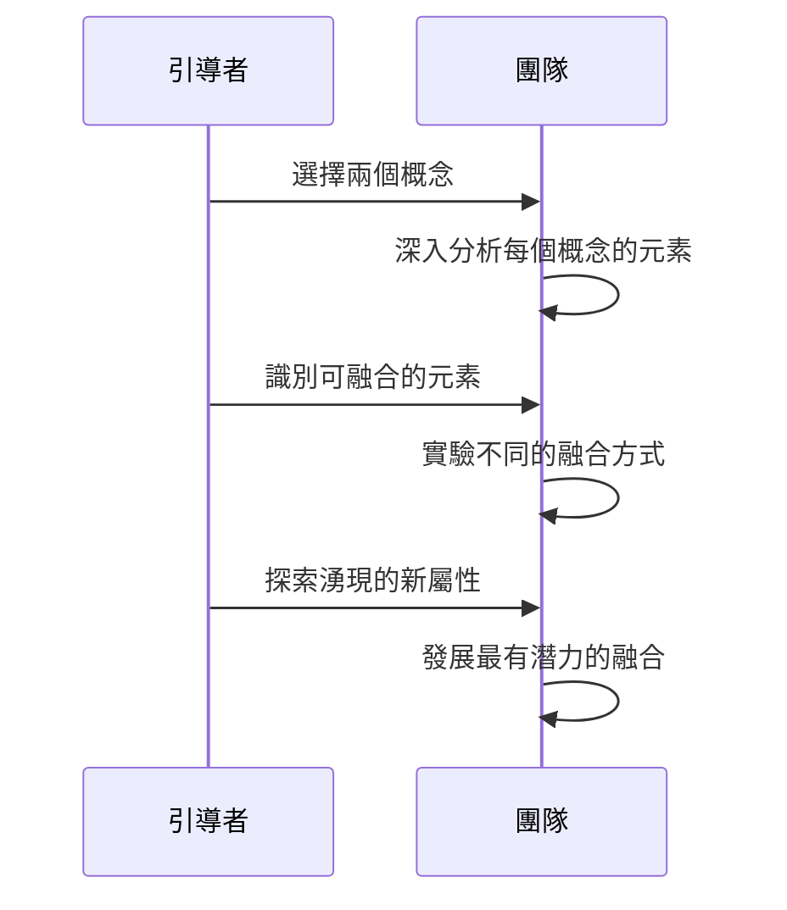
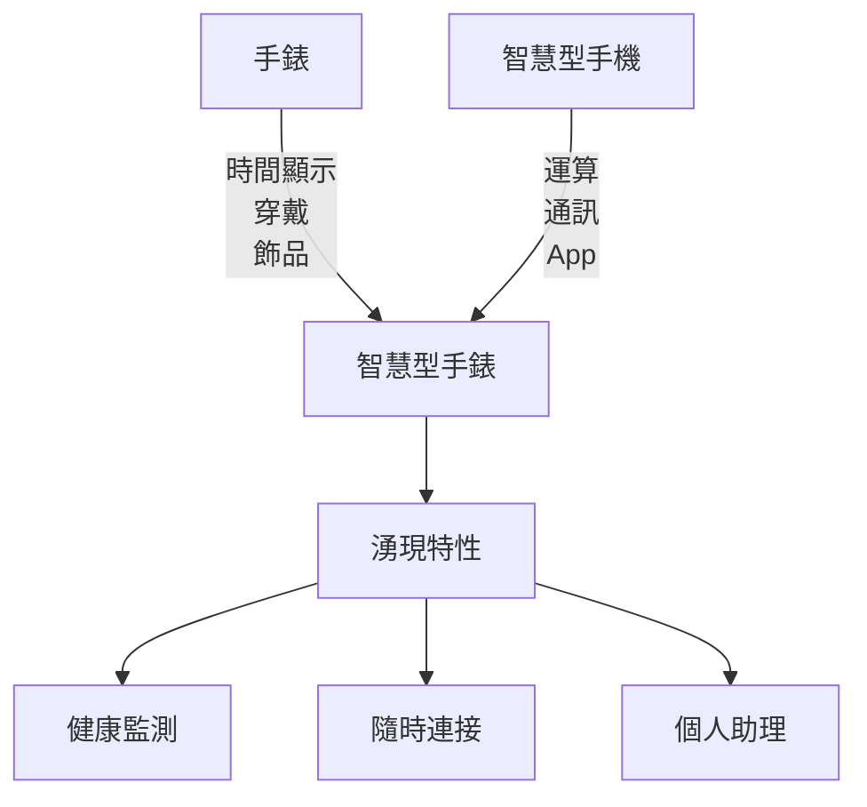
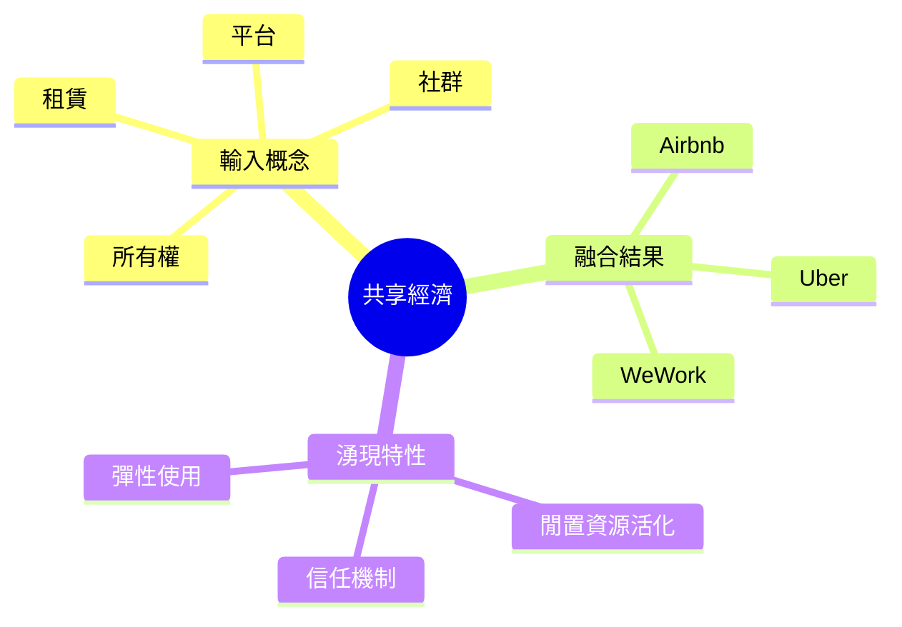
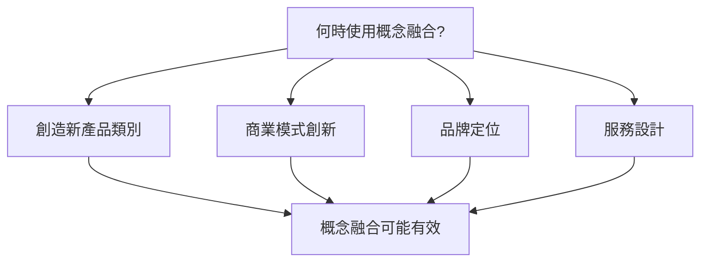
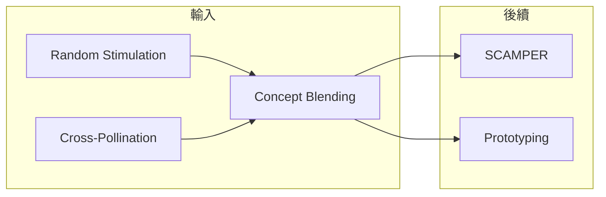

# Concept Blending

> 概念融合技術 - 合二為一，創造新類別

## 基本資訊

| 屬性 | 值 |
|------|-----|
| 類別 | Creative |
| 能量等級 | 高 |
| 建議時長 | 30-45 分鐘 |
| 參與人數 | 2-8 人 |
| 難度 | 中-高 |

## 技術概述

**Concept Blending**（概念融合）是將兩個或多個現有概念融合創造出全新類別的創意技術。不同於簡單的組合，真正的概念融合產生的結果會超越原有概念，具有「湧現性」—整體大於部分之和。



## 歷史背景

認知語言學家 Gilles Fauconnier 和 Mark Turner 在 1990 年代發展了「概念融合理論」（Conceptual Blending Theory）。Arthur Koestler 在《創造的行為》中稱類似過程為「雙聯」（Bisociation）—兩個獨立思維矩陣的碰撞產生創意。

## 核心原理

### 融合 vs 組合



**範例對比：**
| 類型 | 範例 | 結果 |
|------|------|------|
| 組合 | 手機 + 相機 | 有相機的手機 |
| 融合 | 手機 × 相機 | 計算攝影（新類別）|

### 融合的四個空間



## 執行步驟



### 詳細步驟

#### 步驟 1：選擇概念（5分鐘）

**選擇標準：**
- 足夠不同，能產生張力
- 足夠相關，能找到連結點
- 都有豐富的內部結構

**來源選擇：**

| 來源類型 | 範例 |
|----------|------|
| 隨機選擇 | 從詞庫抽兩個詞 |
| 刻意對比 | 選擇對立概念 |
| 問題導向 | 問題相關的概念 |
| 趨勢融合 | 新興趨勢 + 既有領域 |

#### 步驟 2：分析概念（10分鐘）

列出每個概念的：
- 核心元素
- 結構關係
- 典型特徵
- 關聯概念

#### 步驟 3：尋找融合點（15分鐘）

**提問：**
- 這兩個概念有什麼共同點？
- 如果它們融合，會是什麼？
- 融合後會有什麼新特性？

#### 步驟 4：探索湧現（15分鐘）

融合後：
- 產生了什麼新的可能？
- 有什麼意外的特性？
- 這個新概念能做什麼？

## 概念融合範例

### 範例 1：智慧型手錶



### 範例 2：Podcast

| 輸入 1 | 輸入 2 | 融合結果 |
|--------|--------|----------|
| 廣播 | 部落格 | Podcast |
| 隨選 | 語音 | 音頻隨選 |
| 訂閱 | 節目 | 個人化廣播 |

**湧現特性**：長尾內容、親密感、多任務收聽

### 範例 3：共享經濟



## 引導提示

### 概念選擇階段

| 問題 | 目的 |
|------|------|
| 如果把 X 和 Y 放在一起會怎樣？ | 觸發融合思考 |
| 這兩個領域的交集是什麼？ | 找到融合點 |
| 什麼概念能補充現有的？ | 增強式融合 |

### 融合探索階段

| 問題 | 目的 |
|------|------|
| 融合後會叫什麼名字？ | 具體化新概念 |
| 這個新東西能做什麼？ | 探索功能 |
| 它有什麼獨特之處？ | 識別湧現特性 |

## 適用場景



### 場景匹配

| 場景 | 適合度 | 範例融合 |
|------|--------|----------|
| 新產品開發 | ★★★★★ | 功能 × 設計 |
| 服務創新 | ★★★★☆ | 線上 × 線下 |
| 品牌塑造 | ★★★★☆ | 傳統 × 現代 |
| 內容創作 | ★★★★☆ | 類型 × 類型 |

## 注意事項

### Do's（應該做）
- 選擇有豐富結構的概念
- 探索多種融合方式
- 關注湧現的新特性
- 給融合結果命名

### Don'ts（不應該做）
- 只是表面組合
- 忽略兩個概念的內部結構
- 太快評判融合結果
- 限制在既有範疇內

## 變體技術

### 1. 三重融合
- 同時融合三個概念
- 更複雜但可能更創新

### 2. 漸進融合
- 先融合兩個，再加入第三個
- 更可控的過程

### 3. 對立融合
- 刻意選擇對立概念
- 產生有張力的創新

### 4. 層次融合
- 在不同抽象層次融合
- 功能層、體驗層、意義層

## 與其他技術的結合



## 創意融合矩陣

```
┌─────────────┬────────────────────────────────────────┐
│             │           概念 B 元素                   │
│             ├──────────┬──────────┬──────────────────┤
│             │ 元素 B1  │ 元素 B2  │ 元素 B3          │
├─────────────┼──────────┼──────────┼──────────────────┤
│ 元素 A1     │ 融合 1   │ 融合 2   │ 融合 3           │
├─────────────┼──────────┼──────────┼──────────────────┤
│ 元素 A2     │ 融合 4   │ 融合 5   │ 融合 6           │
├─────────────┼──────────┼──────────┼──────────────────┤
│ 元素 A3     │ 融合 7   │ 融合 8   │ 融合 9           │
└─────────────┴──────────┴──────────┴──────────────────┘
```

## 參考資源

- [Wikipedia: Conceptual Blending](https://en.wikipedia.org/wiki/Conceptual_blending)
- [Ness Labs: Combinational Creativity](https://nesslabs.com/combinational-creativity)
- [ScienceDirect: A Computational Framework for Conceptual Blending](https://www.sciencedirect.com/science/article/pii/S000437021730142X)
- Gilles Fauconnier & Mark Turner《The Way We Think》

---

## 設計模式對照

| 模式名稱 | 應用位置 | 核心價值 |
|----------|----------|----------|
| **Conceptual Integration** | Fauconnier-Turner 理論 | 系統化的概念融合框架 |
| **Emergent Properties** | 融合結果 | 新特性從融合中湧現 |
| **Input Space Mapping** | 結構分析 | 識別兩個概念的結構元素 |
| **Generic Space** | 共享結構 | 找出兩個概念的共同框架 |

**核心洞察**：Concept Blending 不是簡單的「A+B」，而是創造一個新的「C」——這個 C 擁有 A 和 B 都沒有的「湧現特性」（Emergent Properties）。當你把「咖啡店」和「辦公室」融合，你不只是得到「有咖啡的辦公室」，你得到了一種新的工作文化、新的社交模式、新的空間概念。這個新概念有自己的邏輯和價值。

---

*返回 [Creative 類別](./index.md) | [技術總覽](../index.md)*
