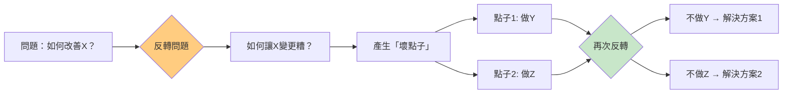
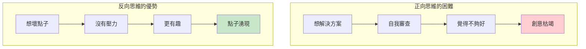
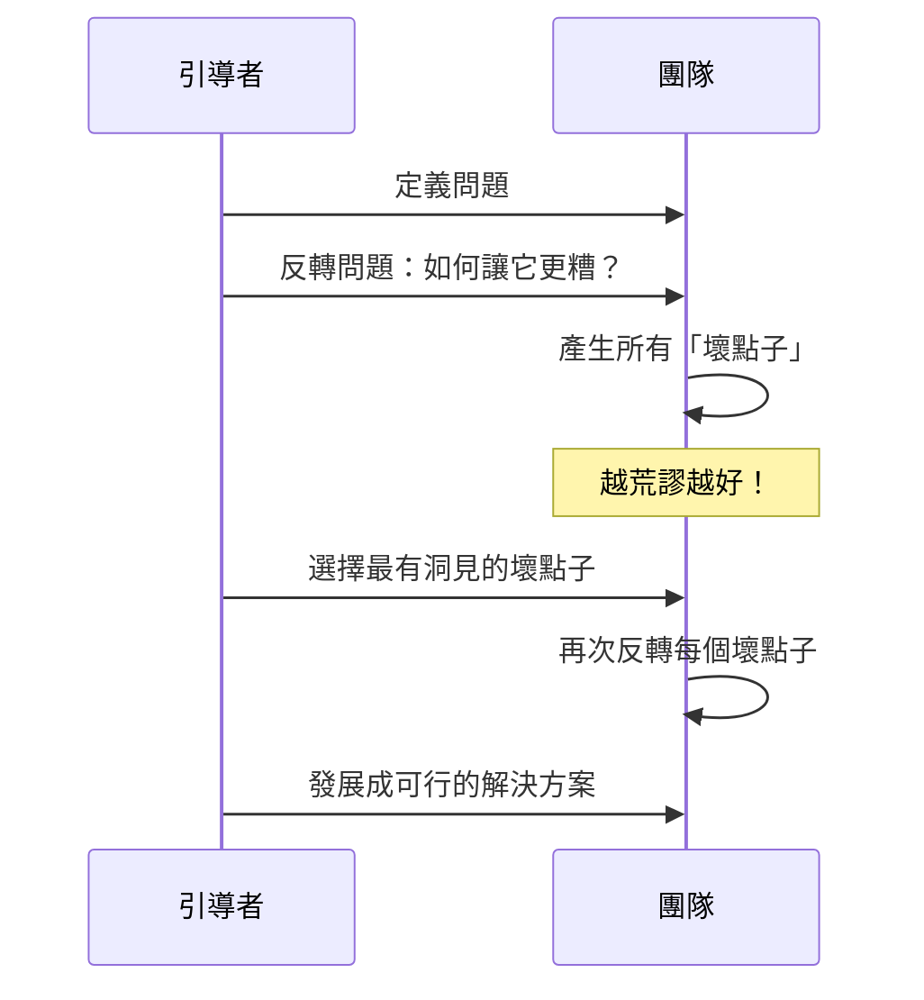
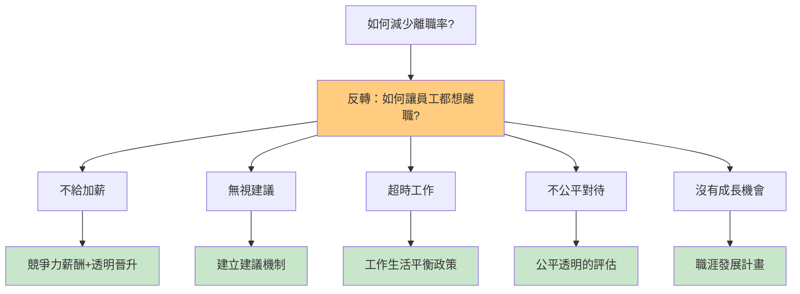
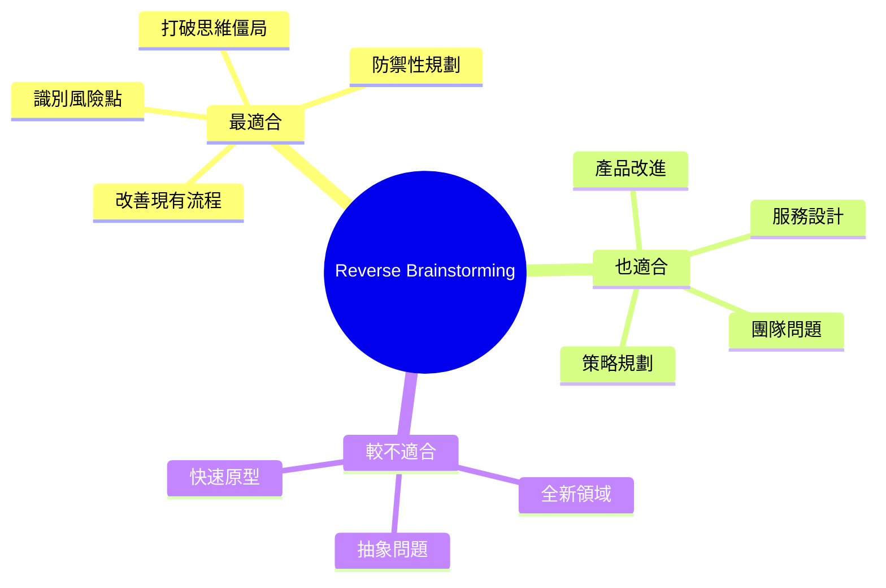
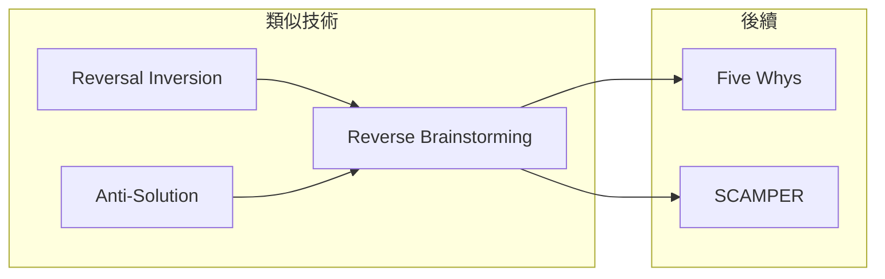

# Reverse Brainstorming

> 反向腦力激盪 - 先問如何讓問題變糟

## 基本資訊

| 屬性 | 值 |
|------|-----|
| 類別 | Creative |
| 能量等級 | 低-中 |
| 建議時長 | 25-40 分鐘 |
| 參與人數 | 3-12 人 |
| 難度 | 低 |

## 技術概述

**Reverse Brainstorming**（反向腦力激盪）是一種逆向思考技術：不是問「如何解決問題」，而是問「如何讓問題變得更糟」。透過識別所有可能讓情況惡化的方式，再反轉這些「反解決方案」，往往能發現隱藏的解決路徑。



## 歷史背景

反向腦力激盪源自 Edward de Bono 的「水平思考」理論，他稱此類策略為「中間的不可能」（Intermediate Impossible）。這種方法利用人類天生更容易想到問題和障礙的傾向，將其轉化為創意優勢。

## 核心原理

### 為什麼反向更容易？



### 關鍵原則

1. **心理安全**
   - 想「壞點子」沒有風險
   - 更容易開口

2. **揭示隱藏問題**
   - 發現沒注意到的風險
   - 識別潛在的失敗點

3. **轉換視角**
   - 從破壞者角度看問題
   - 發現新的可能性

## 執行步驟



### 詳細步驟

#### 步驟 1：定義問題（5分鐘）

清楚陳述要解決的問題：
- 例：「如何提高客戶滿意度？」

#### 步驟 2：反轉問題（2分鐘）

將問題轉換為反面：
- 例：「如何讓客戶非常不滿意？」

#### 步驟 3：產生壞點子（15分鐘）

**鼓勵極端、荒謬的想法：**

| 問題 | 壞點子 |
|------|--------|
| 如何讓客戶不滿意？ | 永遠不接電話 |
| | 增加等待時間 |
| | 讓員工態度惡劣 |
| | 複雜化流程 |
| | 隱藏聯繫方式 |
| | 不解決問題 |

#### 步驟 4：反轉壞點子（10分鐘）

| 壞點子 | 反轉後的解決方案 |
|--------|------------------|
| 永遠不接電話 | 確保 30 秒內接聽 |
| 增加等待時間 | 提供等待時間估計 |
| 態度惡劣 | 客服培訓計畫 |
| 複雜化流程 | 簡化自助服務 |
| 隱藏聯繫方式 | 明顯的幫助按鈕 |
| 不解決問題 | 首次解決率目標 |

#### 步驟 5：發展解決方案（10分鐘）

選擇最有潛力的解決方案進一步發展

## 範例演練

### 問題：如何減少員工離職率？



## 引導提示

### 反轉階段

| 問題 | 目的 |
|------|------|
| 如何確保這會失敗？ | 識別失敗模式 |
| 客戶最討厭什麼？ | 發現痛點 |
| 如何讓這更複雜？ | 識別簡化機會 |
| 如何浪費最多資源？ | 發現效率問題 |

### 解決方案階段

| 問題 | 目的 |
|------|------|
| 這個壞點子揭示了什麼？ | 提取洞見 |
| 如何確保相反的事發生？ | 轉化為行動 |
| 這個領域還有什麼可以做？ | 擴展思考 |

## 適用場景



## 注意事項

### Do's（應該做）
- 鼓勵越荒謬越好
- 記錄所有壞點子
- 認真對待每個反轉
- 保持幽默氛圍

### Don'ts（不應該做）
- 批評壞點子（這正是目的！）
- 太快跳到解決方案
- 忽略看似太極端的想法
- 把它當作抱怨會議

## 變體技術

### 1. 雙重反轉
- 壞點子 → 解決方案 → 再次反轉 → 更深入的洞見

### 2. 角色反轉
- 「如果我是競爭對手，我會如何破壞這個產品？」

### 3. 時間反轉
- 「1年後，如果這個專案失敗了，是什麼原因？」（Pre-mortem）

### 4. 利害關係人反轉
- 從不同利害關係人角度思考最糟情況

## 與其他技術的結合



## 反向腦力激盪工作表

```
┌─────────────────────────────────────────────────────────────┐
│           REVERSE BRAINSTORMING WORKSHEET                    │
├─────────────────────────────────────────────────────────────┤
│ 原始問題: _____________________________________________      │
│                                                              │
│ 反轉問題: _____________________________________________      │
│                                                              │
│ 壞點子列表:                                                  │
│ ┌─────────────────────────────────────────────────────────┐│
│ │ 1. __________________________________________________ ││
│ │ 2. __________________________________________________ ││
│ │ 3. __________________________________________________ ││
│ │ 4. __________________________________________________ ││
│ │ 5. __________________________________________________ ││
│ └─────────────────────────────────────────────────────────┘│
│                                                              │
│ 反轉後的解決方案:                                            │
│ ┌─────────────────────────────────────────────────────────┐│
│ │ 1. __________________________________________________ ││
│ │ 2. __________________________________________________ ││
│ │ 3. __________________________________________________ ││
│ │ 4. __________________________________________________ ││
│ │ 5. __________________________________________________ ││
│ └─────────────────────────────────────────────────────────┘│
│                                                              │
│ 最有潛力的解決方案: ______________________________________   │
└─────────────────────────────────────────────────────────────┘
```

## 參考資源

- [Chris Griffiths: Reverse Brainstorming](https://chrisgriffiths.com/reverse-brainstorming-making-problems-worse-to-gain-better-insight/)
- [Mural: How to Use Reverse Brainstorming](https://www.mural.co/blog/reverse-brainstorming)
- [Krisp: How to Use Reverse Brainstorming Effectively](https://krisp.ai/blog/reverse-brainstorming/)
- [Innovation Training: Reverse Brainstorming](https://www.innovationtraining.org/reverse-brainstorming-training/)

---

## 設計模式對照

| 模式名稱 | 應用位置 | 核心價值 |
|----------|----------|----------|
| **Anti-Pattern Thinking** | 問題發現 | 通過找問題來找解決方案 |
| **Pre-mortem Analysis** | 風險管理 | 假設已失敗來找原因 |
| **Negative Brainstorming** | 變體名稱 | 正面問題的負面探索 |
| **Murphy's Law Design** | 設計原則 | 假設會出錯來設計防錯 |

**核心洞察**：Reverse Brainstorming 利用了一個心理學現象：人類更擅長發現問題而非想像解決方案。當你問「如何讓顧客滿意」，大腦會搜索抽象的「好」；當你問「如何讓顧客憤怒離開」，大腦會立即生成具體的場景。這種具體性讓問題浮出水面，然後只需要反轉它們。

---

*返回 [Creative 類別](./index.md) | [技術總覽](../index.md)*
