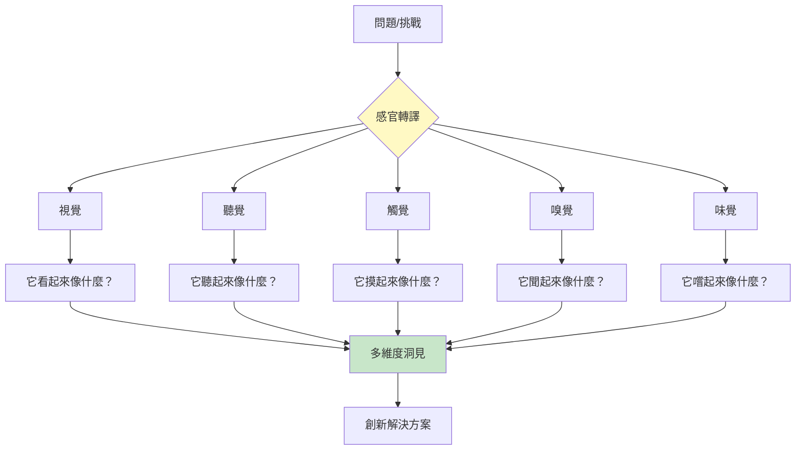
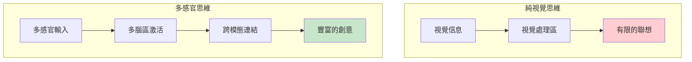
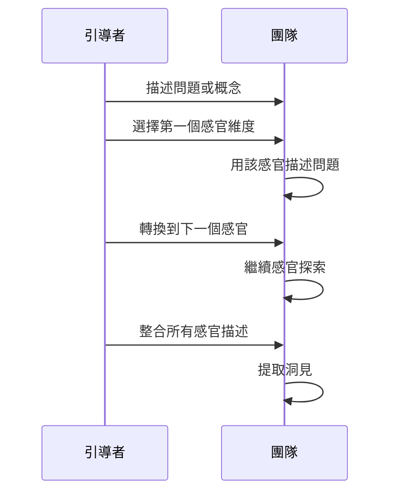
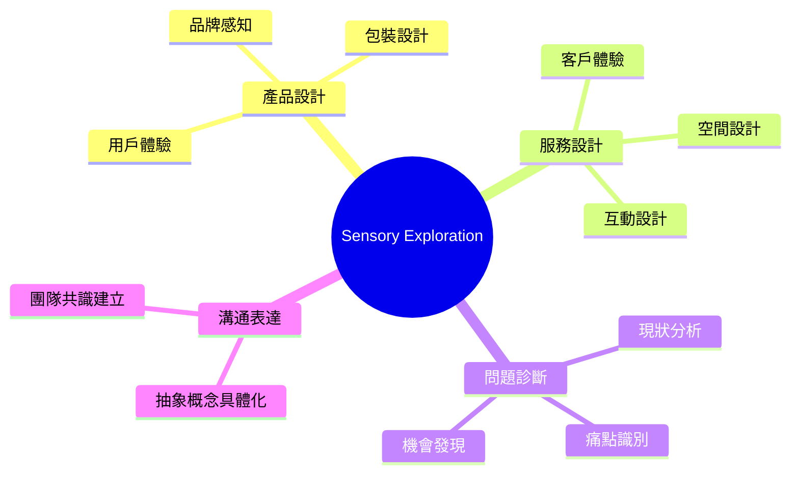
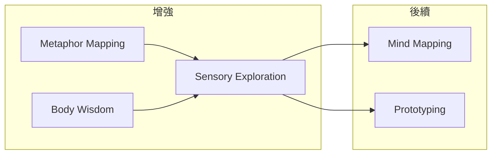

# Sensory Exploration

> 感官探索技術 - 用五感打開創意維度

## 基本資訊

| 屬性 | 值 |
|------|-----|
| 類別 | Creative |
| 能量等級 | 中-低 |
| 建議時長 | 20-35 分鐘 |
| 參與人數 | 1-10 人 |
| 難度 | 低-中 |

## 技術概述

**Sensory Exploration**（感官探索）是透過調動視覺以外的其他感官（聽覺、觸覺、嗅覺、味覺）來激發創意的技術。當問題被「翻譯」成不同感官語言時，會激活不同的神經路徑，產生意想不到的洞見。



## 核心原理

### 為什麼多感官有效？



### 認知科學基礎

- **聯覺效應**：感官之間存在天然連結
- **具身認知**：思維與身體感覺緊密相連
- **跨模態映射**：不同感官間可以進行隱喻轉換

## 執行步驟



### 詳細步驟

#### 步驟 1：問題準備（5分鐘）

明確要探索的問題、產品或概念

#### 步驟 2：逐一感官探索（20分鐘）

每個感官約 4 分鐘：

**視覺探索**
- 如果這個問題是一幅畫，它是什麼樣的？
- 什麼顏色、形狀、構圖？

**聽覺探索**
- 如果這個問題是一首歌，是什麼類型？
- 什麼節奏、音調、旋律？

**觸覺探索**
- 如果可以觸摸這個問題，它是什麼質感？
- 溫度、重量、紋理？

**嗅覺探索**
- 如果這個問題有氣味，是什麼味道？
- 強烈還是淡雅？令人愉快還是不適？

**味覺探索**
- 如果可以嚐到這個問題，是什麼味道？
- 甜、酸、苦、鹹、鮮？

#### 步驟 3：整合與洞見（10分鐘）

- 比較不同感官描述的共同點
- 識別意外的連結
- 提取創意洞見

## 範例演練

### 問題：當前的用戶體驗問題

| 感官 | 問題 | 描述 | 洞見 |
|------|------|------|------|
| 視覺 | 看起來像什麼？ | 擁擠的停車場，找不到出口 | 需要更好的導航 |
| 聽覺 | 聽起來像什麼？ | 嘈雜的市場，太多聲音 | 需要降低資訊噪音 |
| 觸覺 | 摸起來像什麼？ | 粗糙的砂紙 | 需要更順滑的流程 |
| 嗅覺 | 聞起來像什麼？ | 過期的牛奶 | 內容需要更新 |
| 味覺 | 嚐起來像什麼？ | 沒調味的食物 | 缺乏個人化 |

**整合洞見**：用戶體驗雜亂、粗糙、陳舊、無趣，需要簡化、更新、個人化。

## 感官問題庫

### 視覺維度

| 問題 | 探索方向 |
|------|----------|
| 什麼顏色？ | 情感基調 |
| 什麼形狀？ | 結構特性 |
| 明亮還是黑暗？ | 氛圍感受 |
| 靜態還是動態？ | 動態特性 |

### 聽覺維度

| 問題 | 探索方向 |
|------|----------|
| 什麼音樂類型？ | 整體風格 |
| 響亮還是安靜？ | 強度 |
| 和諧還是刺耳？ | 協調性 |
| 什麼節奏？ | 速度和流動 |

### 觸覺維度

| 問題 | 探索方向 |
|------|----------|
| 光滑還是粗糙？ | 易用性 |
| 軟還是硬？ | 彈性 |
| 冷還是熱？ | 情感距離 |
| 輕還是重？ | 負擔感 |

### 嗅覺/味覺維度

| 問題 | 探索方向 |
|------|----------|
| 新鮮還是陳舊？ | 時效性 |
| 自然還是人工？ | 真實性 |
| 濃烈還是清淡？ | 強度 |
| 複雜還是簡單？ | 層次感 |

## 適用場景



## 注意事項

### Do's（應該做）
- 放下「這很奇怪」的心理
- 快速直覺反應，不要過度思考
- 記錄所有描述，即使看似無關
- 尋找跨感官的共同主題

### Don'ts（不應該做）
- 評判感官描述的「正確性」
- 只停留在一個感官
- 忽略不舒服的感官描述
- 太快進入解決方案

## 變體技術

### 1. 單一感官深潛
- 選擇一個感官深入探索
- 例：純聽覺探索

### 2. 感官對比
- 比較「現在」和「理想」的感官描述
- 識別差距

### 3. 感官旅程
- 按時間線描述感官體驗變化
- 例：客戶旅程的感官版本

### 4. 群體感官拼圖
- 每人負責一個感官
- 最後拼合成完整圖像

## 與其他技術的結合



## 感官探索工作表

```
┌─────────────────────────────────────────────────────────────┐
│              SENSORY EXPLORATION WORKSHEET                   │
├─────────────────────────────────────────────────────────────┤
│ 探索主題: _____________________________________________      │
│                                                              │
│ 👁 視覺：它看起來像什麼？                                    │
│ ________________________________________________________     │
│                                                              │
│ 👂 聽覺：它聽起來像什麼？                                    │
│ ________________________________________________________     │
│                                                              │
│ ✋ 觸覺：它摸起來像什麼？                                    │
│ ________________________________________________________     │
│                                                              │
│ 👃 嗅覺：它聞起來像什麼？                                    │
│ ________________________________________________________     │
│                                                              │
│ 👅 味覺：它嚐起來像什麼？                                    │
│ ________________________________________________________     │
│                                                              │
│ 💡 整合洞見：                                                │
│ ________________________________________________________     │
└─────────────────────────────────────────────────────────────┘
```

## 參考資源

- [Embodied Cognition Research](https://www.sciencedirect.com/)
- [Synesthesia and Creativity](https://www.frontiersin.org/)
- Design Thinking Sensory Methods

---

## 設計模式對照

| 模式名稱 | 應用位置 | 核心價值 |
|----------|----------|----------|
| **Multi-Sensory Design** | 整體方法 | 超越視覺的全感官思考 |
| **Synesthesia Thinking** | 感官轉換 | 用一種感官描述另一種 |
| **Embodied Cognition** | 認知基礎 | 身體感官是思維的基礎 |
| **Concrete to Abstract** | 思維方向 | 從感官體驗提取抽象洞見 |

**核心洞察**：我們的語言和思維高度視覺化（「看看這個想法」「顯而易見」），這讓我們忽略了其他感官的智慧。Sensory Exploration 強迫我們問：「這聽起來像什麼？」「這摸起來像什麼？」「這聞起來像什麼？」這些問題看似奇怪，但它們激活了大腦的不同區域，產生了純邏輯思維無法觸及的洞見。

---

*返回 [Creative 類別](./index.md) | [技術總覽](../index.md)*
