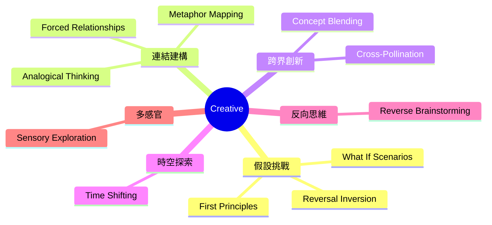
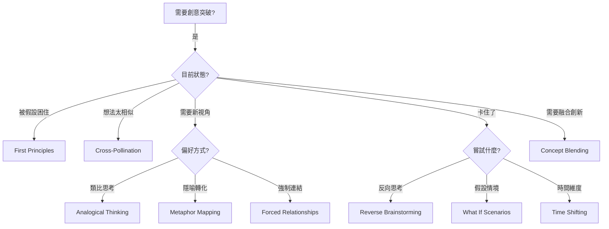
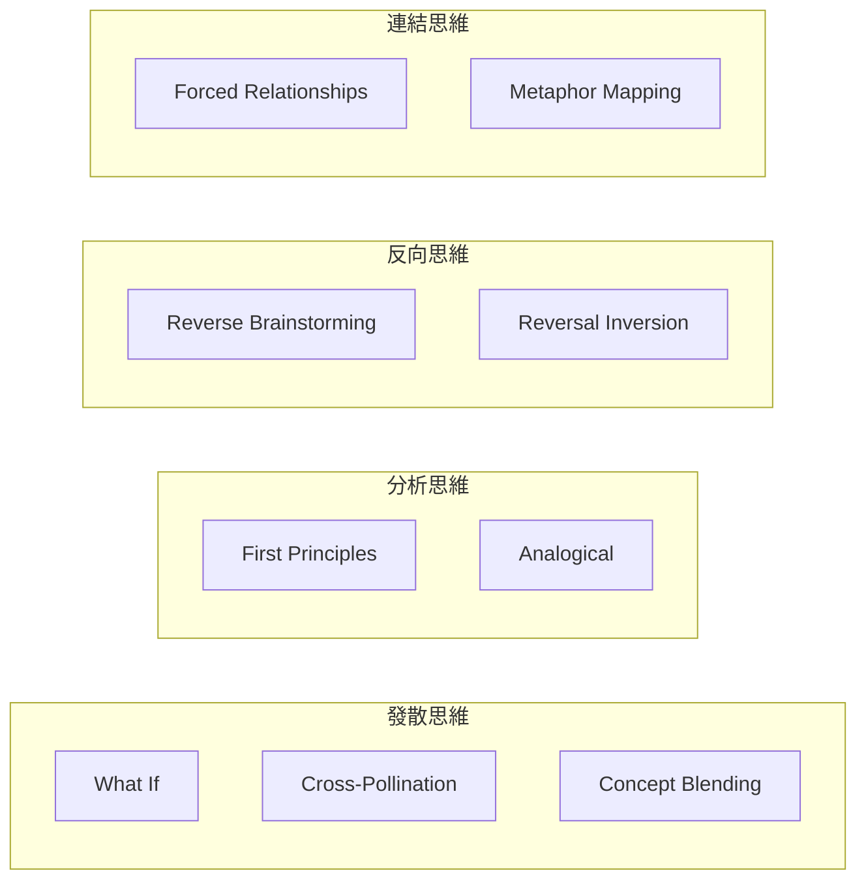

# Creative Brainstorming Techniques

> 創意類腦力激盪技術 - 突破框架、激發創新

## 類別概述

創意類技術是最大的技術類別，包含 11 種技術，專注於打破既有思維模式、挑戰假設、建立意想不到的連結。這些技術特別適合需要突破性創新的情境。

## 核心特性

| 特性 | 說明 |
|------|------|
| 假設挑戰 | 質疑既有信念和限制 |
| 連結建構 | 在看似無關的概念間建立橋樑 |
| 跨界遷移 | 從其他領域借用成功模式 |
| 發散思維 | 最大化想法多樣性 |

## 技術列表

| # | 技術名稱 | 核心概念 | 適用情境 |
|---|----------|----------|----------|
| 1 | [What If Scenarios](./01-what-if-scenarios.md) | 假設情境探索 | 打破既有假設 |
| 2 | [Analogical Thinking](./02-analogical-thinking.md) | 類比思維 | 跨領域遷移 |
| 3 | [Reversal Inversion](./03-reversal-inversion.md) | 反轉思維 | 揭示隱藏假設 |
| 4 | [First Principles Thinking](./04-first-principles-thinking.md) | 第一性原理 | 根本創新 |
| 5 | [Forced Relationships](./05-forced-relationships.md) | 強迫關聯 | 意外連結 |
| 6 | [Time Shifting](./06-time-shifting.md) | 時間轉換 | 時間維度探索 |
| 7 | [Metaphor Mapping](./07-metaphor-mapping.md) | 隱喻映射 | 抽象具體化 |
| 8 | [Cross-Pollination](./08-cross-pollination.md) | 跨界授粉 | 產業遷移 |
| 9 | [Concept Blending](./09-concept-blending.md) | 概念融合 | 創造新類別 |
| 10 | [Reverse Brainstorming](./10-reverse-brainstorming.md) | 反向腦力激盪 | 問題發現 |
| 11 | [Sensory Exploration](./11-sensory-exploration.md) | 感官探索 | 多感官思維 |

## 技術選擇流程

## 能量等級

| 能量 | 技術 |
|------|------|
| 高 | What If Scenarios, Concept Blending |
| 中-高 | Cross-Pollination, Forced Relationships |
| 中 | Analogical Thinking, First Principles, Metaphor Mapping |
| 中-低 | Reversal Inversion, Time Shifting, Sensory Exploration |
| 低 | Reverse Brainstorming |

## 思維模式對照

## 與其他類別的搭配

| 創意技術 | 搭配類別 | 搭配效果 |
|----------|----------|----------|
| First Principles | Deep | 深度+突破 |
| What If | Theatrical | 戲劇性探索 |
| Analogical | Biomimetic | 自然啟發 |
| Concept Blending | Cultural | 文化融合 |

---

*返回 [技術總覽](../index.md)*
