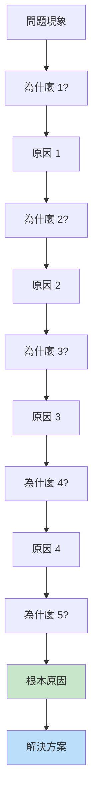
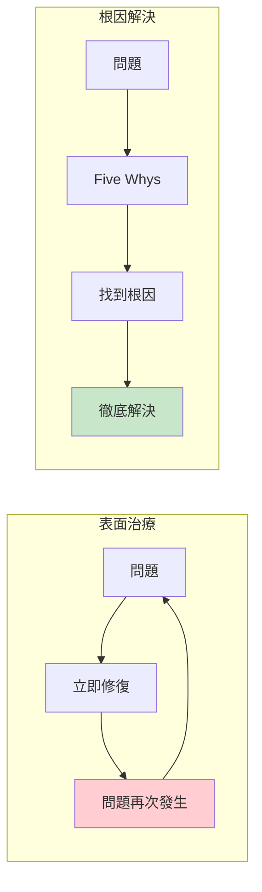
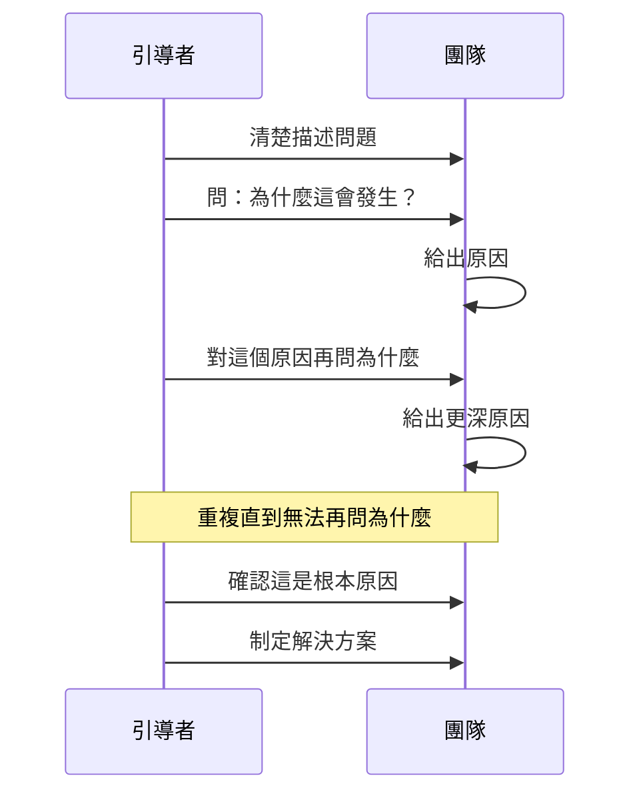
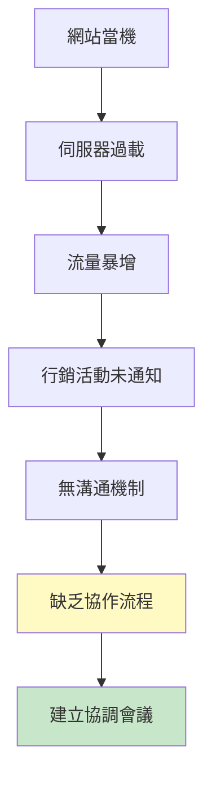
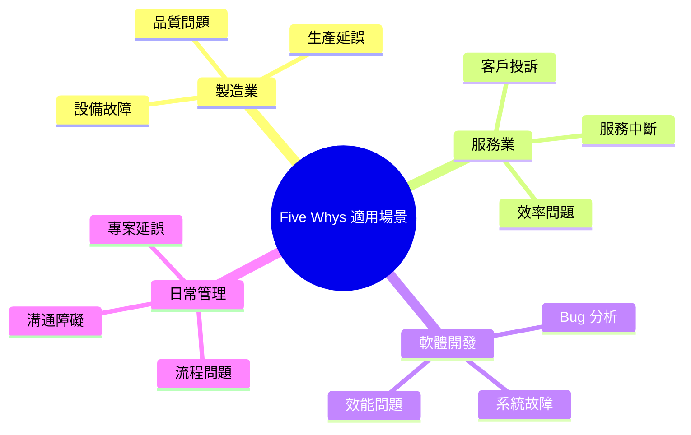
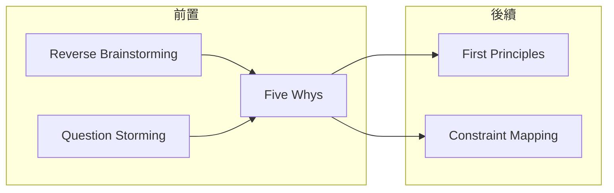

# Five Whys

> 五個為什麼 - 連續追問直到觸及根源

## 基本資訊

| 屬性 | 值 |
|------|-----|
| 類別 | Deep |
| 能量等級 | 中-低 |
| 建議時長 | 15-30 分鐘 |
| 參與人數 | 1-8 人 |
| 難度 | 低 |

## 技術概述

**Five Whys**（五個為什麼）是一種根因分析技術，透過連續問「為什麼」來層層深入問題的核心。起源於豐田生產系統，由豐田佐吉（Sakichi Toyoda）於1930年代開發，後成為精益製造的核心工具。



## 歷史背景

豐田佐吉相信真正的問題解決需要找到根本原因，而非症狀治療。他的兒子豐田喜一郎和工程師大野耐一在二戰後將此方法完善，成為豐田生產系統（TPS）和精益製造的基石。

## 核心原理

### 表面治療 vs 根因解決



### 為什麼是「5」次？

「5」是經驗觀察：通常問 5 次「為什麼」足以到達根本原因。有時可能需要更多或更少，這取決於問題的深度。

## 執行步驟



### 詳細步驟

#### 步驟 1：定義問題（5分鐘）
- 清楚、具體地描述問題
- 避免模糊的描述

#### 步驟 2：連續追問（15-20分鐘）

每次追問：
1. 針對上一個答案問「為什麼？」
2. 基於事實和數據回答
3. 記錄每層答案

#### 步驟 3：驗證根因（5分鐘）
- 問：「如果解決這個，問題會消失嗎？」
- 確認因果關係

#### 步驟 4：制定對策（5分鐘）
- 針對根因設計解決方案
- 確保可執行

## 範例演練

### 案例：網站當機

| 層級 | 問題/原因 |
|------|-----------|
| 問題 | 網站當機了 |
| 為什麼 1? | 伺服器過載 |
| 為什麼 2? | 流量突然暴增 |
| 為什麼 3? | 行銷活動未通知技術團隊 |
| 為什麼 4? | 沒有跨部門溝通機制 |
| 為什麼 5? | 組織缺乏協作流程 |
| **根因** | **組織缺乏跨部門協作機制** |
| **解決方案** | **建立行銷-技術協調會議** |

### 視覺化分析



## 引導提示

### 追問技巧

| 問法 | 效果 |
|------|------|
| 為什麼會這樣？ | 基本追問 |
| 是什麼導致這個？ | 因果導向 |
| 什麼因素造成這個情況？ | 多因素思考 |
| 這是因為什麼？ | 直接因果 |

### 驗證技巧

| 問題 | 目的 |
|------|------|
| 如果解決這個，問題會消失嗎？ | 驗證根因 |
| 還有其他原因嗎？ | 避免遺漏 |
| 這是事實還是假設？ | 確保基於數據 |

## 適用場景



## 注意事項

### Do's（應該做）
- 基於事實和數據回答
- 一次只追一條因果鏈
- 驗證每個答案的因果關係
- 到達可行動的根因

### Don'ts（不應該做）
- 停在表面原因
- 假設而非驗證
- 責怪個人（找系統原因）
- 同時追多條線

### 常見陷阱

| 陷阱 | 解決方法 |
|------|----------|
| 停得太早 | 繼續追問直到無法再問 |
| 答案太籠統 | 要求具體化 |
| 責怪個人 | 轉向系統和流程 |
| 多條線混淆 | 一次只追一條 |

## 變體技術

### 1. 魚骨圖結合
- 先用魚骨圖列出可能原因
- 對每條分支進行 Five Whys

### 2. 多因素 Five Whys
- 在每層識別多個原因
- 形成原因樹狀圖

### 3. 逆向 Five Whys
- 從期望結果反推
- 問「為什麼這還沒發生？」

## 與其他技術的結合



## Five Whys 工作表

```
┌─────────────────────────────────────────────────────────────┐
│                    FIVE WHYS WORKSHEET                       │
├─────────────────────────────────────────────────────────────┤
│ 問題描述: _____________________________________________      │
│                                                              │
│ 為什麼 1? _______________________________________________    │
│ ➔ 因為: ________________________________________________    │
│                                                              │
│ 為什麼 2? _______________________________________________    │
│ ➔ 因為: ________________________________________________    │
│                                                              │
│ 為什麼 3? _______________________________________________    │
│ ➔ 因為: ________________________________________________    │
│                                                              │
│ 為什麼 4? _______________________________________________    │
│ ➔ 因為: ________________________________________________    │
│                                                              │
│ 為什麼 5? _______________________________________________    │
│ ➔ 因為: ________________________________________________    │
│                                                              │
│ 根本原因: _______________________________________________    │
│ 解決方案: _______________________________________________    │
└─────────────────────────────────────────────────────────────┘
```

## 參考資源

- [Wikipedia: Five Whys](https://en.wikipedia.org/wiki/Five_whys)
- [Tulip: What are the Five Whys?](https://tulip.co/glossary/five-whys/)
- [Orcalean: How Toyota Uses the 5 Whys Method](https://www.orcalean.com/article/how-toyota-is-using-5-whys-method)
- [IHI: 5 Whys Finding the Root Cause](https://www.ihi.org/library/tools/5-whys-finding-root-cause)
- [Toolshero: 5 Whys Root Cause Analysis](https://www.toolshero.com/problem-solving/5-whys-analysis/)

---

## 設計模式對照

| 模式名稱 | 應用位置 | 核心價值 |
|----------|----------|----------|
| **Root Cause Analysis** | 整體方法 | 追溯到真正的根源 |
| **Toyota Production System** | 起源 | 持續改善文化的核心工具 |
| **Causal Chain** | 思維結構 | 因果鏈條的追蹤 |
| **Countermeasure vs Fix** | 解決方式 | 針對根因而非症狀 |

**核心洞察**：Five Whys 看似簡單，但它挑戰了我們「快速解決問題」的本能。當網站當機時，我們想重啟伺服器；Five Whys 要我們問為什麼會當機、為什麼那個元件會失敗、為什麼沒有被監控、為什麼監控機制會失效、為什麼團隊沒有維護它。到第五個「為什麼」，你可能發現真正的問題是組織文化，而不是技術。

---

*返回 [Deep 類別](./index.md) | [技術總覽](../index.md)*
