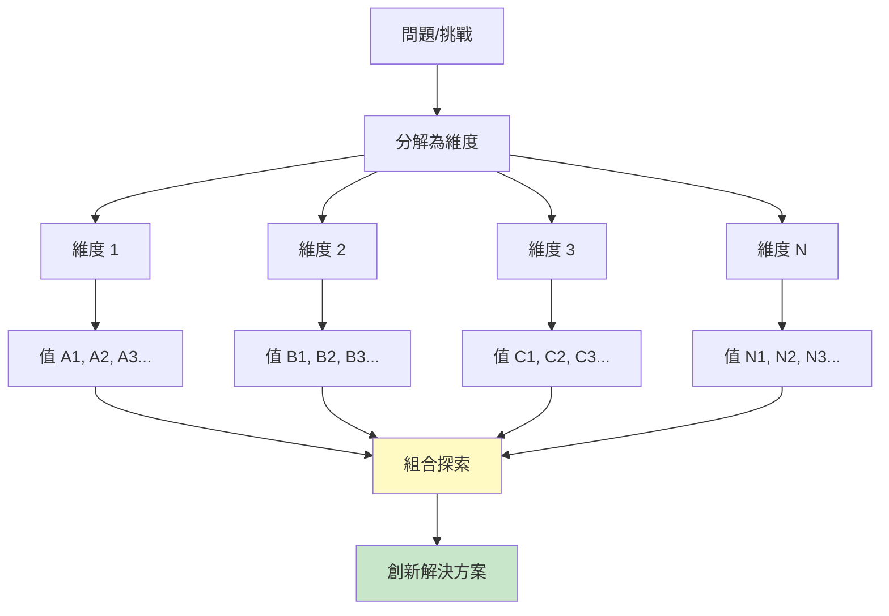
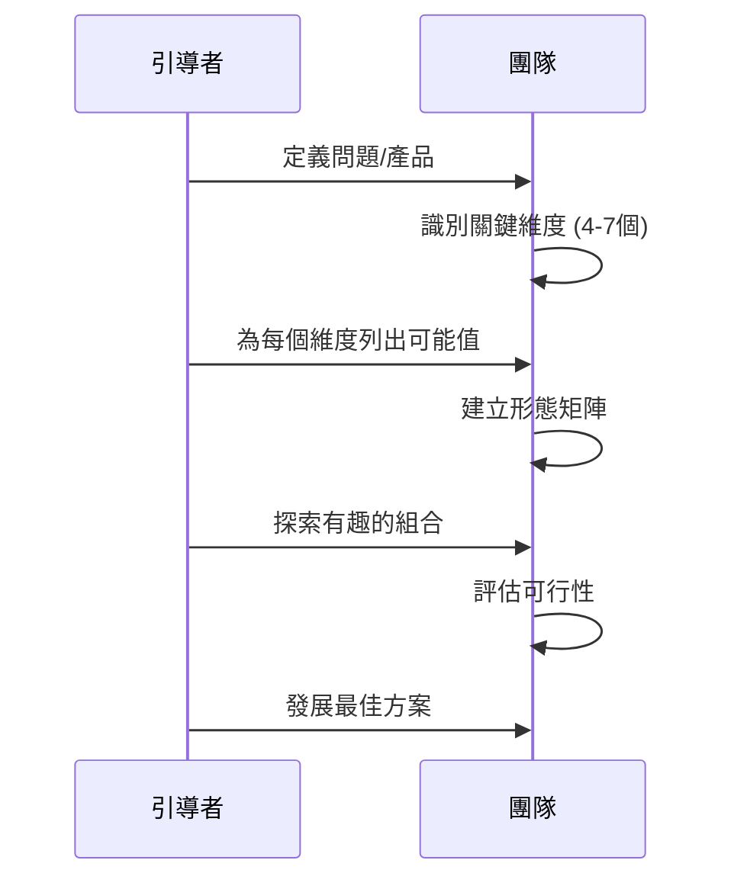
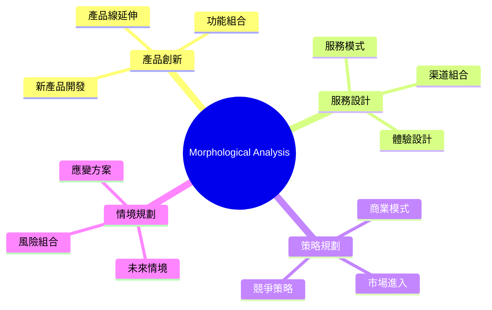
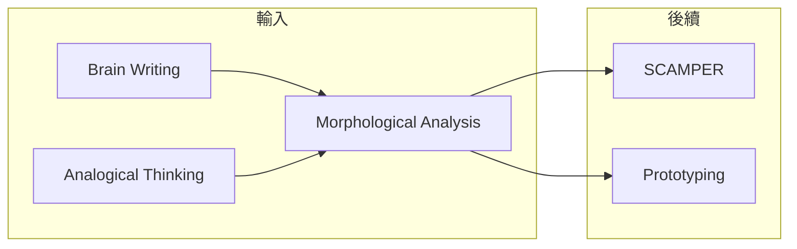

# Morphological Analysis

> 形態分析法 - 系統探索所有可能組合

## 基本資訊

| 屬性 | 值 |
|------|-----|
| 類別 | Deep |
| 能量等級 | 中 |
| 建議時長 | 45-90 分鐘 |
| 參與人數 | 2-8 人 |
| 難度 | 中-高 |

## 技術概述

**Morphological Analysis**（形態分析法）是由瑞士天文學家 Fritz Zwicky 於1940年代開發的系統化創意技術。透過將問題分解為獨立維度，並列出每個維度的所有可能值，然後系統性地探索各種組合，產生大量創新方案。



## 歷史背景

Fritz Zwicky 是發現暗物質的天才天文學家，也是噴射推進和火箭技術的先驅。他發明形態分析法來系統化地探索所有可能的解決方案空間，避免遺漏創新機會。這個方法後來被廣泛應用於產品創新、政策分析和未來學研究。

## 核心原理

### 形態矩陣（Zwicky Box）

```
┌─────────────┬─────────────┬─────────────┬─────────────┐
│   維度 1    │   維度 2    │   維度 3    │   維度 4    │
├─────────────┼─────────────┼─────────────┼─────────────┤
│    值 A1    │    值 B1    │    值 C1    │    值 D1    │
│    值 A2    │    值 B2    │    值 C2    │    值 D2    │
│    值 A3    │    值 B3    │    值 C3    │    值 D3    │
│    值 A4    │    值 B4    │    值 C4    │    值 D4    │
│    值 A5    │    值 B5    │    值 C5    │    值 D5    │
└─────────────┴─────────────┴─────────────┴─────────────┘

組合數 = 5 × 5 × 5 × 5 = 625 種可能
```

### 關鍵原則

1. **完整覆蓋**：系統性列出所有可能
2. **強制組合**：創造意想不到的配對
3. **結構思考**：將模糊問題結構化

## 執行步驟



### 詳細步驟

#### 步驟 1：定義問題（10分鐘）
- 明確要解決的問題或要創新的產品

#### 步驟 2：識別維度（15分鐘）
- 問：「這個問題/產品的關鍵面向是什麼？」
- 選擇 4-7 個獨立維度
- 維度應該相互獨立

#### 步驟 3：列出值（20分鐘）
- 為每個維度列出 3-7 個可能的值
- 包括常規和非常規選項
- 不要自我審查

#### 步驟 4：建立矩陣（5分鐘）
- 將維度和值組織成表格

#### 步驟 5：探索組合（30分鐘）
**方法一：系統掃描**
- 逐一檢視所有可能組合

**方法二：隨機組合**
- 從每個維度隨機選一個值

**方法三：有趣組合**
- 選擇看起來有潛力的組合

#### 步驟 6：評估發展（20分鐘）
- 評估可行性和創新性
- 發展最有潛力的組合

## 範例演練

### 案例：設計新型咖啡店

| 維度 | 可能值 |
|------|--------|
| 飲品類型 | 咖啡、茶、果汁、酒精、植物奶 |
| 空間設計 | 傳統、極簡、工業風、自然、未來 |
| 服務模式 | 全服務、自助、外帶、訂閱、會員 |
| 附加體驗 | 閱讀、工作、藝術、音樂、冥想 |
| 價格定位 | 經濟、中等、高端、奢華、免費 |

**有趣組合範例：**

| 組合 | 創新概念 |
|------|----------|
| 植物奶 + 極簡 + 訂閱 + 冥想 + 高端 | 健康冥想咖啡訂閱俱樂部 |
| 酒精 + 工業風 + 會員 + 音樂 + 中等 | 夜間爵士咖啡酒吧 |
| 咖啡 + 自然 + 自助 + 工作 + 經濟 | 植物園共享工作咖啡空間 |

## 引導提示

### 識別維度

| 問題 | 目的 |
|------|------|
| 這個產品/服務的核心組成是什麼？ | 找出核心維度 |
| 客戶在意哪些方面？ | 客戶導向維度 |
| 可以有哪些不同的「如何」？ | 方法維度 |
| 什麼是可以變化的？ | 可變維度 |

### 列出值

| 問題 | 目的 |
|------|------|
| 這個維度的極端選項是什麼？ | 探索邊界 |
| 有什麼非常規的選項？ | 突破常規 |
| 其他產業如何處理這個維度？ | 跨界借鏡 |

## 適用場景



## 注意事項

### Do's（應該做）
- 選擇獨立的維度
- 包含非常規選項
- 系統性探索組合
- 記錄有潛力的組合

### Don'ts（不應該做）
- 維度過多（保持 4-7 個）
- 遺漏極端選項
- 太快否定組合
- 只看「合理」的組合

## 變體技術

### 1. 簡化版（3×3 矩陣）
- 只用 3 個維度，每個 3 個值
- 27 種組合，快速探索

### 2. 加權形態分析
- 為每個值加上可行性評分
- 組合分數 = 各值分數之積

### 3. 交叉影響矩陣
- 分析維度間的相互影響
- 排除不相容的組合

## 與其他技術的結合



## 計算組合數

| 維度數 | 每維度值數 | 總組合數 |
|--------|------------|----------|
| 4 | 3 | 81 |
| 4 | 5 | 625 |
| 5 | 5 | 3,125 |
| 6 | 5 | 15,625 |
| 7 | 5 | 78,125 |

## 參考資源

- [Toolshero: Morphological Analysis Fritz Zwicky](https://www.toolshero.com/creativity/morphological-analysis-fritz-zwicky/)
- [Ness Labs: The Zwicky Box](https://nesslabs.com/zwicky-box)
- [4strat: Morphological Analysis](https://www.4strat.com/analysis/morphological-analysis/)
- [Swedish Morphological Society](https://www.swemorph.com/)

---

## 設計模式對照

| 模式名稱 | 應用位置 | 核心價值 |
|----------|----------|----------|
| **Zwicky Box** | Fritz Zwicky 方法 | 系統化窮盡所有組合 |
| **Systematic Innovation** | TRIZ 關聯 | 有結構的創新探索 |
| **Combinatorial Explosion** | 組合數學 | 理解組合空間的規模 |
| **Cross-Consistency Matrix** | 過濾方法 | 排除不相容的組合 |

**核心洞察**：Morphological Analysis 的威力在於它讓「窮盡所有可能」成為可能。當你有 5 個維度、每個維度 4 個選項時，你有 1024 種組合——這超出了直覺能處理的範圍。Zwicky Box 強迫你系統化地考慮每一種組合，而不是只考慮「明顯」的那幾種。很多創新藏在我們直覺認為「不可能」的組合中。

---

*返回 [Deep 類別](./index.md) | [技術總覽](../index.md)*
