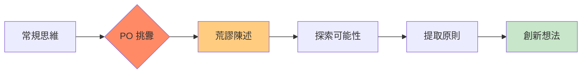
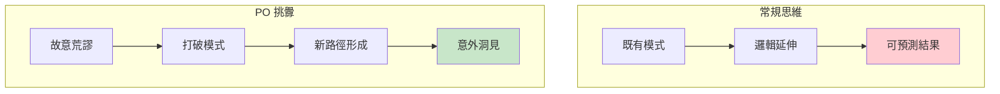
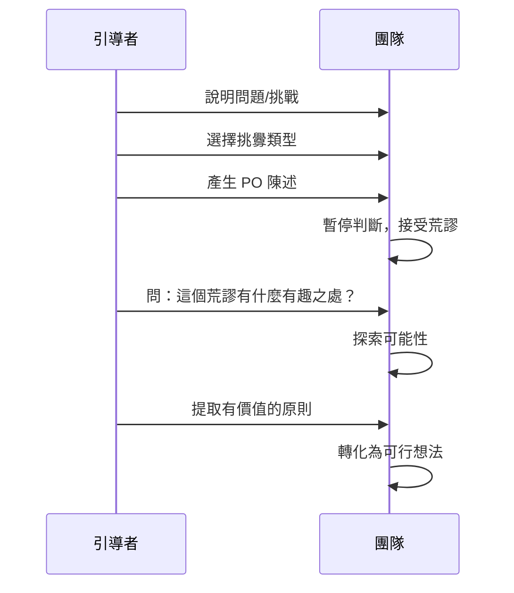
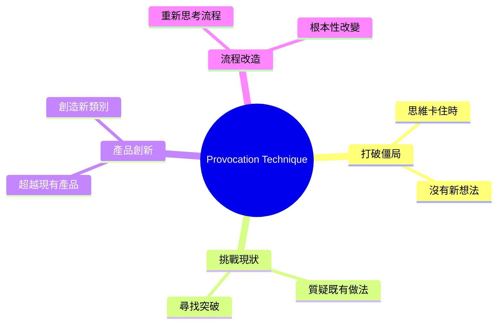
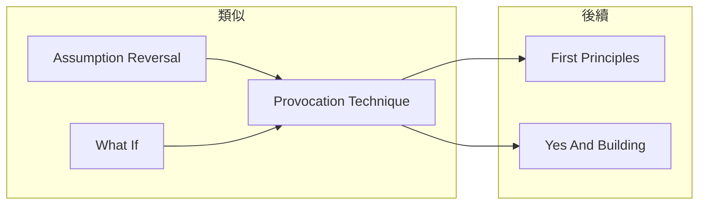

# Provocation Technique

> 挑釁技術 - 用荒謬刺激打破思維定勢

## 基本資訊

| 屬性 | 值 |
|------|-----|
| 類別 | Deep |
| 能量等級 | 低-中 |
| 建議時長 | 20-30 分鐘 |
| 參與人數 | 1-8 人 |
| 難度 | 中 |

## 技術概述

**Provocation Technique**（挑釁技術）是 Edward de Bono 水平思考法的核心工具。透過提出故意荒謬、違反邏輯的陳述（PO - Provocative Operation），強迫大腦跳出常規思維，然後從這些荒謬中提取有價值的洞見。

## 核心原理

### PO 的作用

### 關鍵原則

**PO 的含義**：
- PO = Provocative Operation（挑釁操作）
- 不是判斷真假，而是用來刺激思考
- 「PO」標記告訴大腦這不需要合邏輯

## 挑釁類型

| 類型 | 方法 | 範例 |
|------|------|------|
| 逃脫 | 移除正常元素 | PO：汽車沒有輪子 |
| 反轉 | 顛倒正常情況 | PO：客戶付錢給我們送禮物 |
| 誇大 | 極端放大 | PO：一個員工做全公司的工作 |
| 扭曲 | 改變正常關係 | PO：工廠在產品裡面 |
| 許願 | 理想化陳述 | PO：產品永不損壞 |

## 執行步驟

### 詳細步驟

#### 步驟 1：選擇焦點（3分鐘）
- 確定要探索的問題或領域

#### 步驟 2：產生挑釁（5分鐘）
- 選擇一種挑釁類型
- 產生 3-5 個 PO 陳述

#### 步驟 3：探索挑釁（15分鐘）
對每個 PO 陳述問：
- 這會帶來什麼有趣的情況？
- 如果這是真的，會發生什麼？
- 這讓我想到什麼？

#### 步驟 4：提取洞見（10分鐘）
- 從荒謬中提取有用的原則
- 轉化為實際可行的想法

## 範例演練

### 問題：如何改善餐廳服務？

**PO 陳述與探索：**

| PO 陳述 | 探索 | 洞見 | 實際想法 |
|---------|------|------|----------|
| PO：客人自己做菜 | 有趣：參與感 | 參與=滿意 | DIY 料理體驗區 |
| PO：食物免費 | 有趣：什麼收費？ | 價值多元 | 體驗收費模式 |
| PO：沒有菜單 | 有趣：如何點餐？ | 個人化 | 廚師根據喜好定制 |
| PO：服務生是機器人 | 有趣：一致性 | 標準化 | AI 點餐系統 |

### De Bono 經典案例：河流污染

**PO：工廠在河流的下游而非上游**

- 常規：工廠在上游，污染流向下游居民
- PO 反轉：工廠在下游
- 洞見：如果工廠要用自己排出的水，就會注意污染
- 解決方案：立法要求工廠進水口必須在排水口下游

## 引導提示

### 產生 PO 的問題

| 問題 | 挑釁類型 |
|------|----------|
| 如果移除 X 會怎樣？ | 逃脫 |
| 如果做相反的事？ | 反轉 |
| 如果放大 100 倍？ | 誇大 |
| 如果 A 和 B 交換？ | 扭曲 |
| 如果這是完美的？ | 許願 |

### 探索 PO 的問題

| 問題 | 目的 |
|------|------|
| 這有什麼有趣之處？ | 尋找價值 |
| 這會創造什麼情況？ | 探索結果 |
| 這背後的原則是什麼？ | 提取洞見 |
| 如何讓部分變成現實？ | 轉化想法 |

## 適用場景

## 注意事項

### Do's（應該做）
- 接受荒謬，暫停判斷
- 認真探索每個 PO
- 尋找「有趣」而非「正確」
- 從荒謬中提取原則

### Don'ts（不應該做）
- 立即否定 PO
- 只產生「合理」的 PO
- 跳過探索直接否定
- 要求 PO 合邏輯

## 變體技術

### 1. 隨機 PO
- 隨機選擇詞彙產生 PO
- 更高的意外性

### 2. 連續 PO
- 對探索結果再產生 PO
- 深入挖掘

### 3. 群體 PO
- 每人產生一個 PO
- 共同探索

## 與其他技術的結合

## 參考資源

- Edward de Bono《Serious Creativity》
- Edward de Bono《Lateral Thinking》
- [De Bono Thinking Systems](https://www.debono.com/)

---

*返回 [Deep 類別](./index.md) | [技術總覽](../index.md)*
