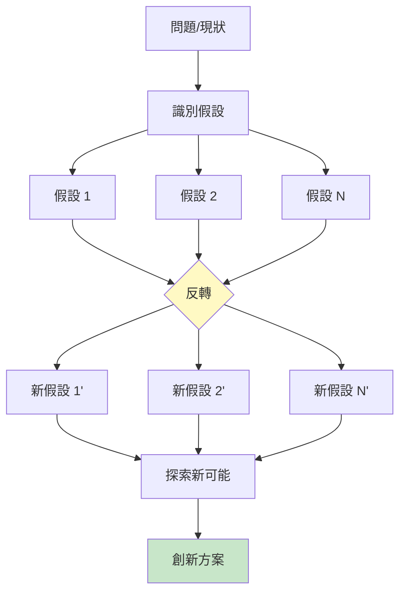
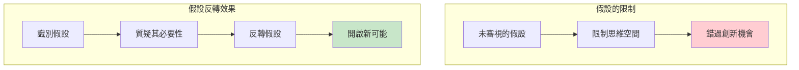
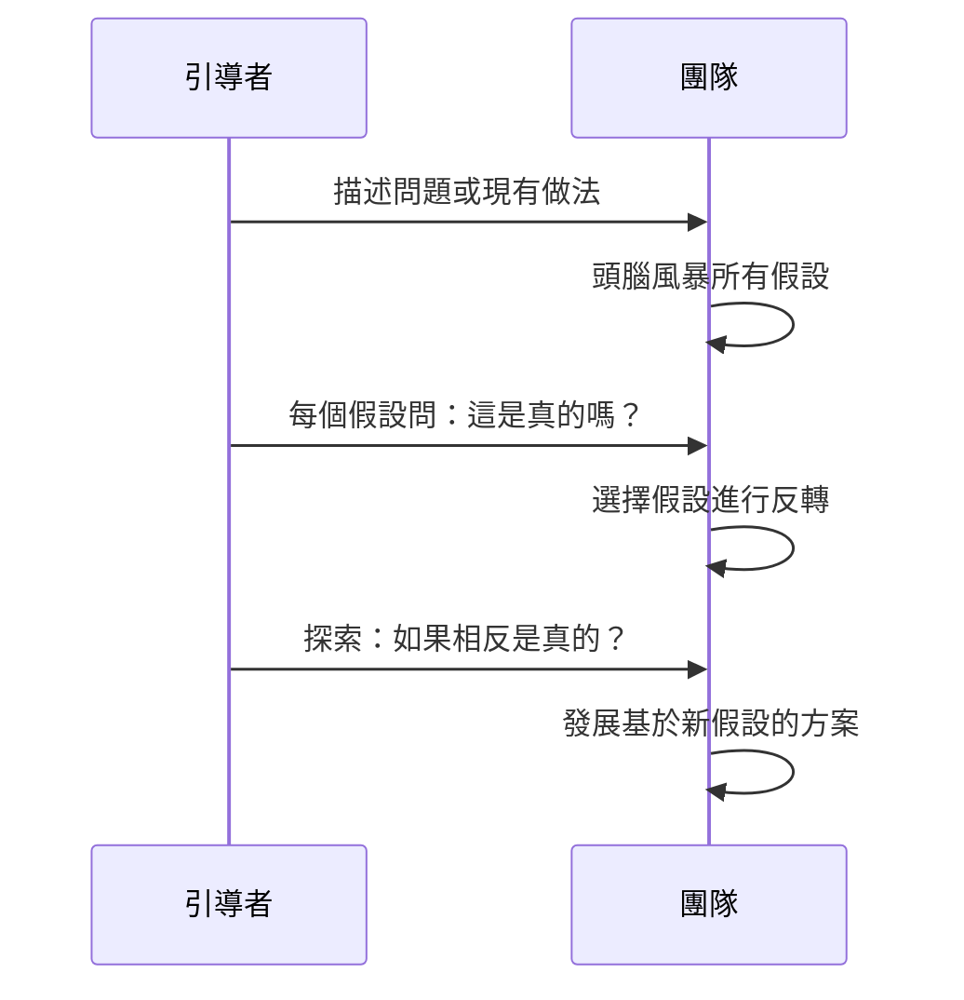
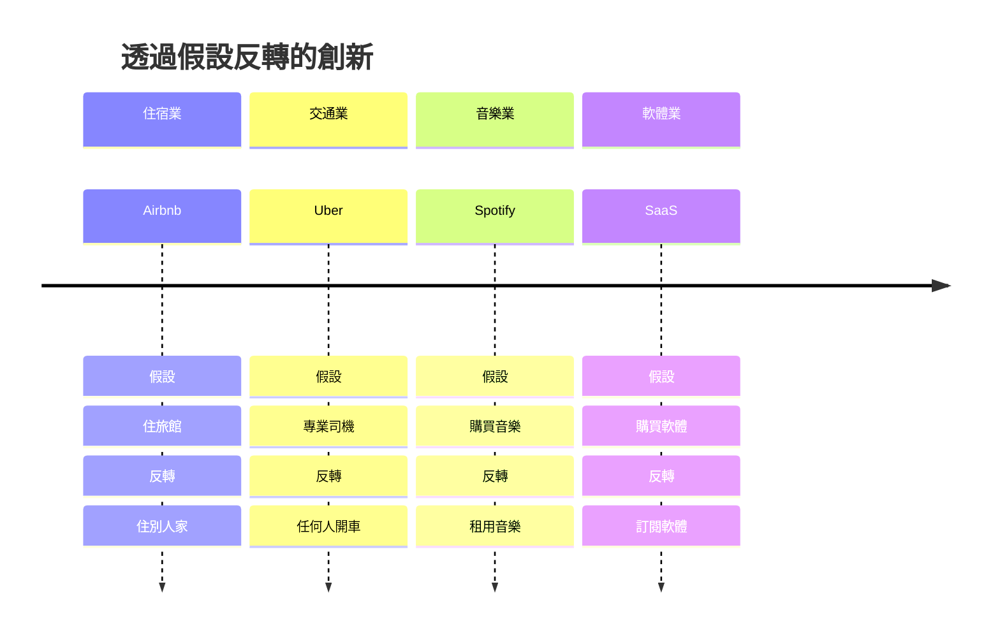
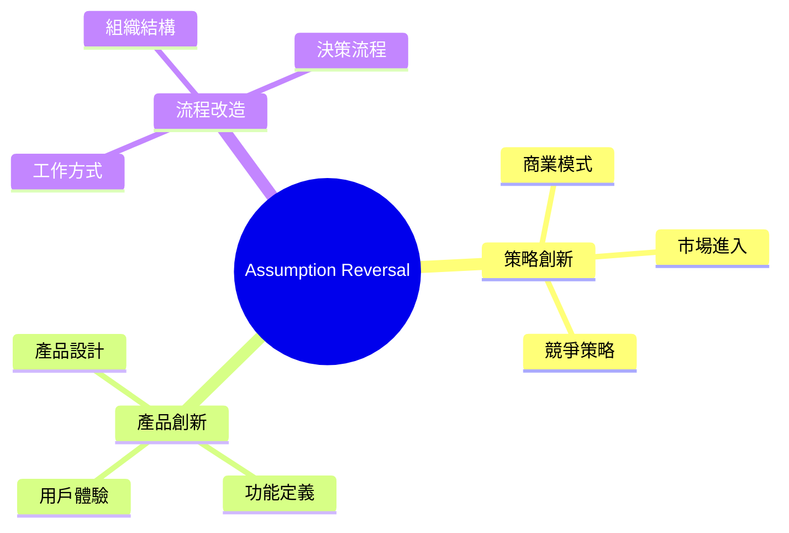
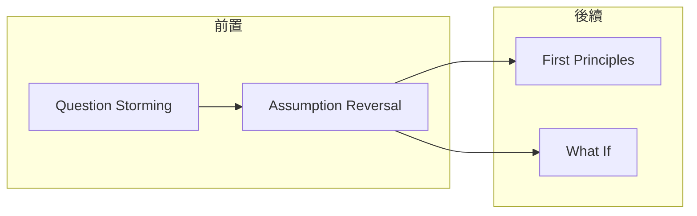

# Assumption Reversal

> 假設反轉 - 質疑並翻轉核心信念

## 基本資訊

| 屬性 | 值 |
|------|-----|
| 類別 | Deep |
| 能量等級 | 低-中 |
| 建議時長 | 30-45 分鐘 |
| 參與人數 | 2-8 人 |
| 難度 | 中 |

## 技術概述

**Assumption Reversal**（假設反轉）是一種系統性識別、挑戰並翻轉核心假設的技術。我們的思維常受到未經審視的假設限制，反轉這些假設可以開啟全新的可能性空間，實現範式轉移。



## 核心原理

### 假設的隱藏力量



### 假設類型

| 類型 | 說明 | 範例 |
|------|------|------|
| 行業假設 | 行業普遍接受的 | 銀行需要實體分行 |
| 功能假設 | 關於產品功能 | 相機需要膠卷 |
| 用戶假設 | 關於用戶行為 | 用戶不會信任陌生人 |
| 商業假設 | 關於商業模式 | 需要擁有資產 |
| 技術假設 | 關於技術限制 | 這技術太貴 |

## 執行步驟



### 詳細步驟

#### 步驟 1：識別假設（15分鐘）

**激發假設的問題：**
- 我們在假設什麼？
- 什麼是「理所當然」的？
- 行業內什麼是「必須」的？
- 我們認為什麼是「不可能」的？

#### 步驟 2：質疑假設（10分鐘）

對每個假設問：
- 這真的是真的嗎？
- 有證據嗎？
- 有反例嗎？
- 這是事實還是信念？

#### 步驟 3：反轉假設（5分鐘）

- 將假設轉為相反陳述
- 例：「用戶需要擁有商品」→「用戶不需要擁有商品」

#### 步驟 4：探索新世界（15分鐘）

在反轉後的世界中探索：
- 這會創造什麼可能性？
- 如何讓這成為現實？
- 有什麼例子嗎？

## 範例演練

### 案例：傳統零售業

| 原假設 | 反轉假設 | 創新案例 |
|--------|----------|----------|
| 需要實體店面 | 不需要店面 | Amazon 純電商 |
| 商品需要定價 | 商品不需要定價 | Pay What You Want |
| 客戶來店購買 | 商品去找客戶 | 外送/訂閱服務 |
| 需要大量庫存 | 不需要庫存 | Dropshipping |
| 需要雇用員工 | 不需要員工 | 自助商店 |

### 創新案例分析



## 引導提示

### 識別假設

| 問題 | 目的 |
|------|------|
| 這個行業都怎麼做？ | 找出行業慣例 |
| 什麼是「必須」的？ | 找出必要性假設 |
| 為什麼不能那樣做？ | 找出限制性假設 |
| 我們在害怕什麼？ | 找出恐懼假設 |

### 反轉探索

| 問題 | 目的 |
|------|------|
| 如果相反是真的呢？ | 啟動反轉 |
| 有誰這麼做了嗎？ | 尋找先例 |
| 如何讓這可行？ | 發展可能性 |

## 適用場景



## 注意事項

### Do's（應該做）
- 列出所有假設，即使看似無關
- 質疑「顯而易見」的假設
- 尋找已經反轉假設的案例
- 探索部分反轉的可能性

### Don'ts（不應該做）
- 只列出容易挑戰的假設
- 認為核心假設不可動搖
- 忽略反轉後的可能性
- 太快評判可行性

## 假設識別工作表

```
┌─────────────────────────────────────────────────────────────┐
│            ASSUMPTION REVERSAL WORKSHEET                     │
├─────────────────────────────────────────────────────────────┤
│ 主題/問題: ____________________________________________       │
│                                                              │
│ 假設識別:                                                    │
│ ┌────────────────────────────────┬─────────────────────────┐│
│ │ 假設                           │ 這真的是真的嗎？       ││
│ ├────────────────────────────────┼─────────────────────────┤│
│ │ 1. ___________________________ │ □是 □否 □不確定        ││
│ │ 2. ___________________________ │ □是 □否 □不確定        ││
│ │ 3. ___________________________ │ □是 □否 □不確定        ││
│ └────────────────────────────────┴─────────────────────────┘│
│                                                              │
│ 選擇反轉的假設: _________________________________________    │
│                                                              │
│ 反轉後: _________________________________________________    │
│                                                              │
│ 如果反轉是真的，會創造什麼可能性？                          │
│ __________________________________________________________   │
│                                                              │
│ 如何讓這成為現實？                                          │
│ __________________________________________________________   │
└─────────────────────────────────────────────────────────────┘
```

## 與其他技術的結合



---

## 設計模式對照

| 模式名稱 | 應用位置 | 核心價值 |
|----------|----------|----------|
| **Paradigm Shift** | 整體效果 | 從舊框架跳到新框架 |
| **Frame Breaking** | 操作方式 | 打破既有思維框架 |
| **Hidden Assumption** | 發現目標 | 讓隱藏假設浮出水面 |
| **Sacred Cow Challenge** | 文化面向 | 質疑「不可質疑」的假設 |

**核心洞察**：最難發現的假設是你認為是「事實」的假設。「銀行需要實體分行」曾經是事實，直到網路銀行證明不是。「手機需要鍵盤」曾經是事實，直到 iPhone。Assumption Reversal 強迫你問：「如果我們最根本的假設是錯的會怎樣？」這個問題不舒服，但革命性創新往往就藏在這裡。

---

*返回 [Deep 類別](./index.md) | [技術總覽](../index.md)*
