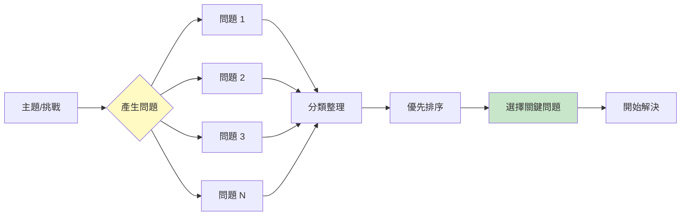
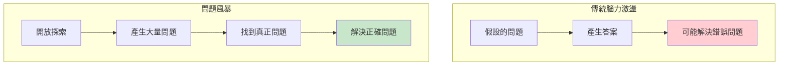
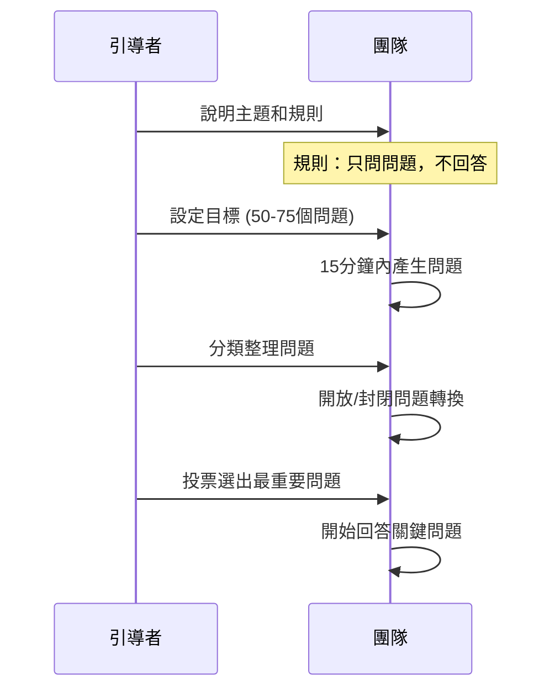
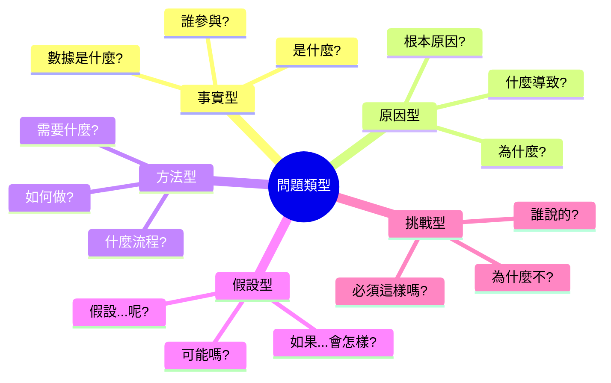
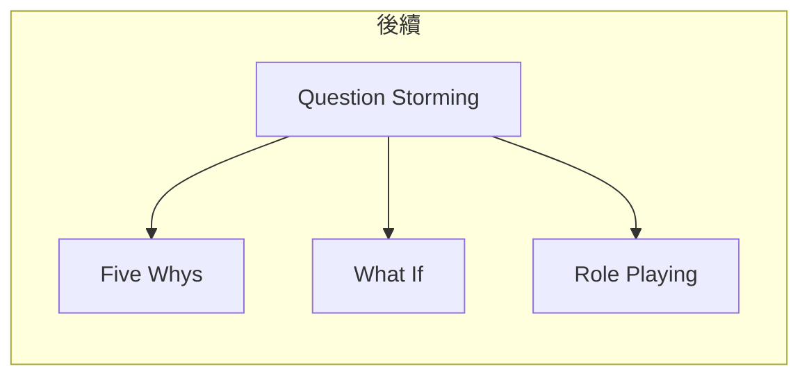

# Question Storming

> 問題風暴 - 先問對問題，再找對答案

## 基本資訊

| 屬性 | 值 |
|------|-----|
| 類別 | Deep |
| 能量等級 | 中 |
| 建議時長 | 25-40 分鐘 |
| 參與人數 | 3-12 人 |
| 難度 | 低-中 |

## 技術概述

**Question Storming**（問題風暴）是一種在尋找解決方案之前先大量產生問題的技術。與傳統腦力激盪產生「答案」不同，問題風暴專注於產生「問題」。這種方法幫助團隊更深入理解問題空間，避免過早跳入錯誤的解決方向。

## 核心原理

### 為什麼先問問題？

### 關鍵原則

1. **問題揭示假設**
   - 問問題時會自然挑戰假設
   - 發現之前未注意的面向

2. **問題沒有「對錯」**
   - 產生問題時壓力較小
   - 更容易參與和開口

3. **問題定義問題**
   - 正確的問題是成功的一半
   - 避免解決錯誤的問題

## 執行步驟

### 詳細步驟

#### 步驟 1：設定情境（3分鐘）

**核心規則：**
- 只產生問題，不回答
- 不評判問題的好壞
- 追求數量（目標 50-75 個）

#### 步驟 2：產生問題（15分鐘）

- 快速產生大量問題
- 任何類型的問題都可以
- 記錄在便利貼或白板上

**激發問題的提示：**
- 關於「是什麼」的問題
- 關於「為什麼」的問題
- 關於「如何」的問題
- 關於「誰」的問題
- 關於「什麼時候」的問題
- 關於「在哪裡」的問題

#### 步驟 3：轉換問題（10分鐘）

使用 Right Question Institute 的技巧：
- **開放問題 → 封閉問題**
- **封閉問題 → 開放問題**

| 原始問題 | 轉換後 |
|----------|--------|
| 客戶滿意嗎？（封閉）| 客戶滿意的原因是什麼？（開放）|
| 為什麼銷量下降？（開放）| 銷量是否因為價格下降？（封閉）|

#### 步驟 4：分類排序（10分鐘）

- 將問題分組（主題、緊急度等）
- 投票選出最重要的 3-5 個
- 確定優先順序

#### 步驟 5：深入回答（後續）

- 對選出的問題進行深入探討
- 可能需要研究或數據

## 問題類型指南

## 範例演練

### 主題：如何提高產品轉換率？

**產生的問題（部分）：**

| # | 問題 |
|---|------|
| 1 | 目前轉換率是多少？ |
| 2 | 行業標準是什麼？ |
| 3 | 用戶在哪個步驟流失最多？ |
| 4 | 為什麼用戶放棄購物車？ |
| 5 | 移動端和桌面端轉換率有差異嗎？ |
| 6 | 競爭對手的轉換率是多少？ |
| 7 | 什麼促使用戶完成購買？ |
| 8 | 價格是主要障礙嗎？ |
| 9 | 用戶信任我們嗎？ |
| 10 | 我們的價值主張清楚嗎？ |
| ... | ... |

**分類後：**
- **數據相關**：1, 2, 5, 6
- **用戶行為**：3, 4, 7
- **信任/價值**：8, 9, 10

## 引導提示

### 激發更多問題

| 提示 | 目的 |
|------|------|
| 我們還不知道什麼？ | 識別盲點 |
| 什麼假設可能是錯的？ | 挑戰假設 |
| 誰可能有不同看法？ | 多元視角 |
| 如果這失敗了，會是為什麼？ | 風險識別 |
| 一年後回看，我們會問什麼？ | 長期視角 |

## 適用場景

| 場景 | 適合度 | 原因 |
|------|--------|------|
| 專案啟動 | ★★★★★ | 避免解決錯誤問題 |
| 問題模糊時 | ★★★★★ | 幫助定義問題 |
| 策略規劃 | ★★★★☆ | 確保考慮周全 |
| 產品開發 | ★★★★☆ | 發現用戶需求 |
| 快速決策 | ★★☆☆☆ | 需要更快的方法 |

## 注意事項

### Do's（應該做）
- 追求數量（50+ 問題）
- 堅持「只問不答」規則
- 記錄所有問題
- 允許「愚蠢」的問題

### Don'ts（不應該做）
- 太快開始回答
- 批評問題
- 只問「安全」的問題
- 一個人主導

## 變體技術

### 1. 問題接龍
- 每個人基於上一個問題提出新問題
- 形成問題鏈

### 2. 角色問題
- 從不同角色視角提問
- 客戶會問什麼？工程師會問什麼？

### 3. 時間軸問題
- 過去：發生了什麼？
- 現在：正在發生什麼？
- 未來：將會發生什麼？

## 與其他技術的結合

## 參考資源

- [Fast Company: How Brainstorming Questions Sparks Creativity](https://www.fastcompany.com/3060573/how-brainstorming-questions-not-ideas-sparks-creativity)
- [MIT Sloan: Question Bursts](https://mitsloan.mit.edu/ideas-made-to-matter/heres-how-question-bursts-make-better-brainstorms)
- [Right Question Institute](https://rightquestion.org/)
- Warren Berger《A More Beautiful Question》

---

*返回 [Deep 類別](./index.md) | [技術總覽](../index.md)*
