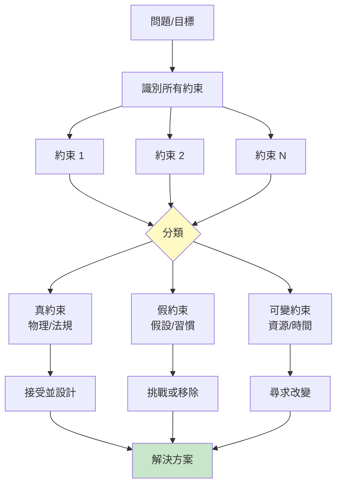
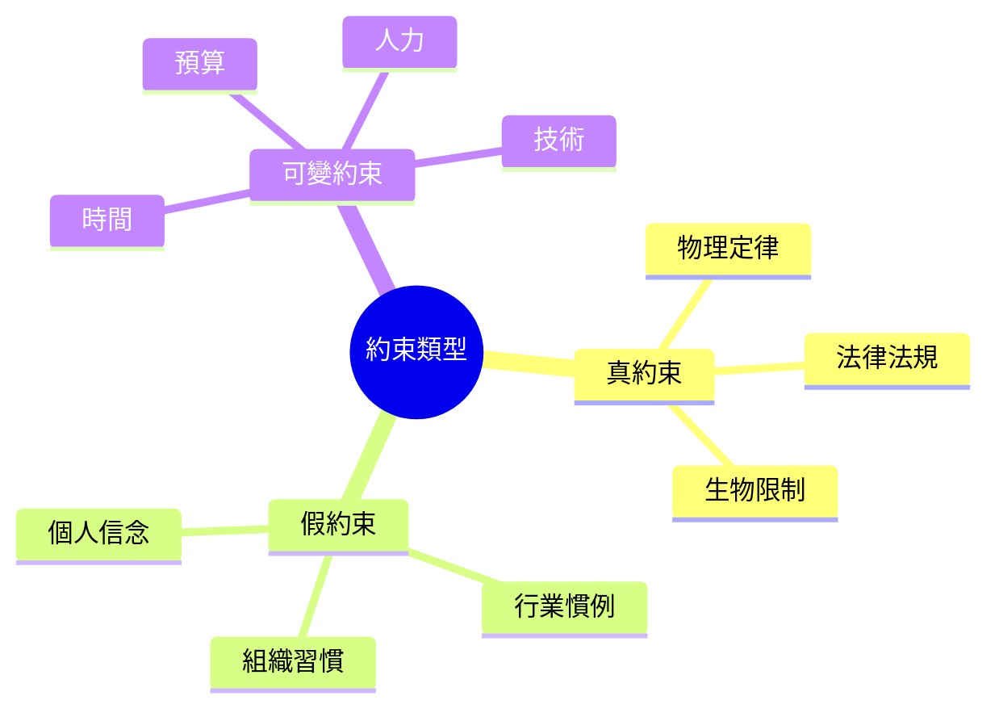
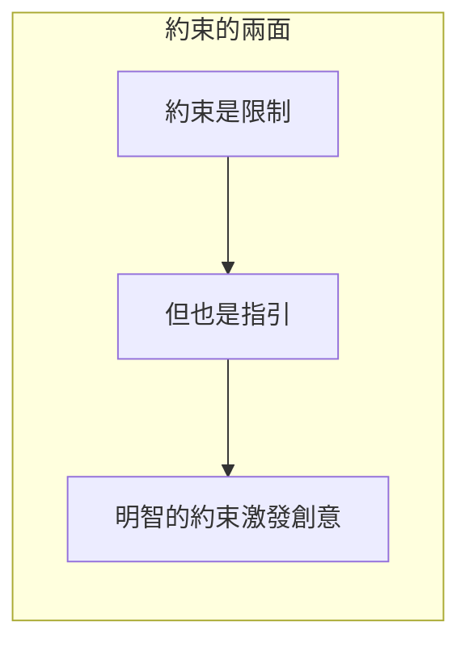
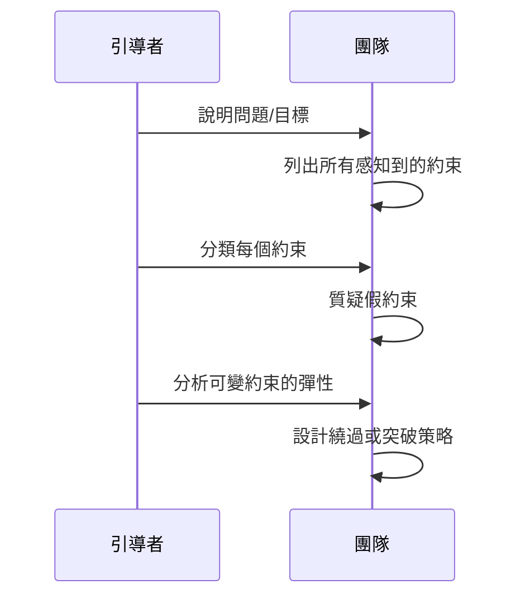
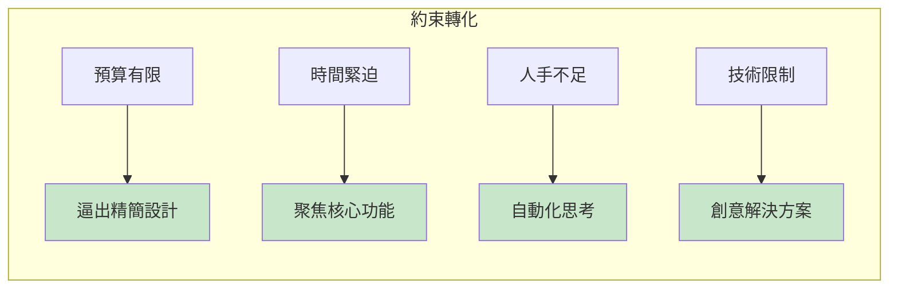
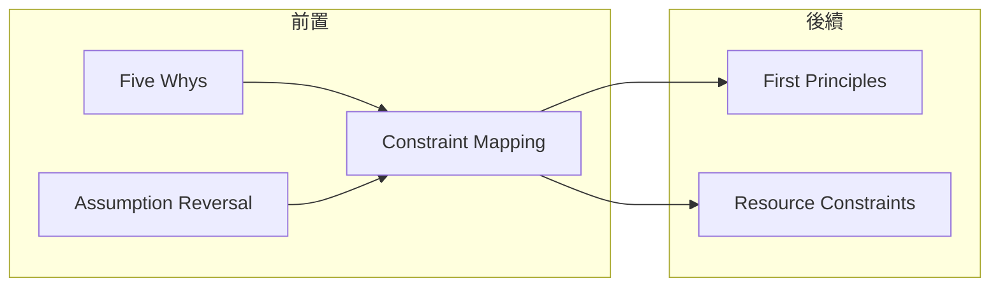

# Constraint Mapping

> 約束映射 - 看清限制，找到突破口

## 基本資訊

| 屬性 | 值 |
|------|-----|
| 類別 | Deep |
| 能量等級 | 中-低 |
| 建議時長 | 25-40 分鐘 |
| 參與人數 | 2-8 人 |
| 難度 | 中 |

## 技術概述

**Constraint Mapping**（約束映射）是一種系統性識別、分類和分析所有約束條件的技術。透過視覺化所有限制，區分真約束和假約束，找到可以突破或繞過的路徑。



## 核心原理

### 約束的分類



### 約束 ≠ 壞事



## 執行步驟



### 詳細步驟

#### 步驟 1：識別約束（15分鐘）

**激發問題：**
- 什麼阻止我們達成目標？
- 有哪些限制條件？
- 什麼是「不能做」的？
- 有哪些資源限制？

#### 步驟 2：分類約束（10分鐘）

| 類別 | 特徵 | 處理方式 |
|------|------|----------|
| 真約束 | 無法改變 | 接受並設計 |
| 假約束 | 可以挑戰 | 質疑或移除 |
| 可變約束 | 有彈性 | 尋求改變 |

#### 步驟 3：分析策略（15分鐘）

**對每個約束問：**
- 這真的是約束嗎？
- 有辦法繞過嗎？
- 可以轉化為優勢嗎？
- 誰可以移除這個約束？

## 約束分析矩陣

```
┌─────────────┬─────────────┬─────────────┬─────────────┐
│    約束     │    類型     │    彈性     │    策略     │
├─────────────┼─────────────┼─────────────┼─────────────┤
│ 預算有限    │   可變      │    中       │ 分階段投入 │
│ 法規限制    │   真        │    低       │ 合規設計   │
│ 技術不成熟  │   可變      │    高       │ 技術合作   │
│ 一直這樣做  │   假        │    高       │ 直接挑戰   │
└─────────────┴─────────────┴─────────────┴─────────────┘
```

## 範例演練

### 案例：開發新產品

**約束清單與分析：**

| 約束 | 類型 | 質疑 | 策略 |
|------|------|------|------|
| 預算只有10萬 | 可變 | 可以分階段嗎？ | MVP優先 |
| 團隊只有3人 | 可變 | 可以外包嗎？ | 核心自做+外包 |
| 6個月內上市 | 可變 | 必須嗎？為什麼？ | 重新談判 |
| 必須用現有技術 | 假 | 誰說的？ | 評估新技術 |
| 客戶不會付費 | 假 | 有證據嗎？ | 測試驗證 |
| 物理定律 | 真 | 無法改變 | 接受 |

## 約束轉化為優勢



## 引導提示

### 識別約束

| 問題 | 類型 |
|------|------|
| 有什麼資源限制？ | 可變約束 |
| 有什麼法規限制？ | 真約束 |
| 有什麼「一直都是這樣」的？ | 假約束 |
| 什麼讓我們感到害怕？ | 可能是假約束 |

### 分析約束

| 問題 | 目的 |
|------|------|
| 這真的是限制嗎？ | 區分真假 |
| 有辦法繞過嗎？ | 尋找路徑 |
| 誰可以改變這個？ | 找到槓桿 |
| 可以變成優勢嗎？ | 轉化思維 |

## 適用場景

| 場景 | 適合度 | 原因 |
|------|--------|------|
| 專案規劃 | ★★★★★ | 釐清可行空間 |
| 創新受阻 | ★★★★★ | 找到突破口 |
| 資源有限 | ★★★★☆ | 優化配置 |
| 策略規劃 | ★★★★☆ | 識別真正限制 |

## 注意事項

### Do's（應該做）
- 列出所有感知的約束
- 質疑每一個約束
- 尋找約束的彈性空間
- 考慮約束的轉化可能

### Don'ts（不應該做）
- 假設約束不可改變
- 只看負面不看正面
- 忽略隱藏的假約束
- 太快接受限制

## 與其他技術的結合



---

*返回 [Deep 類別](./index.md) | [技術總覽](../index.md)*
