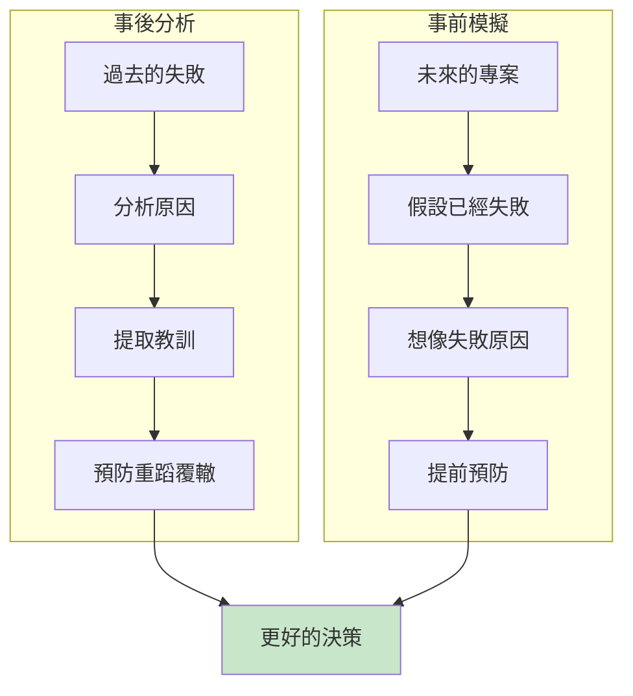
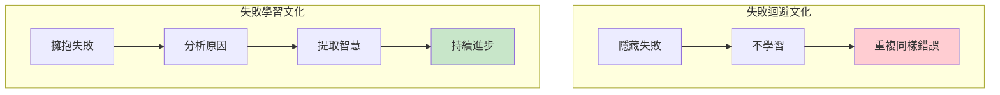
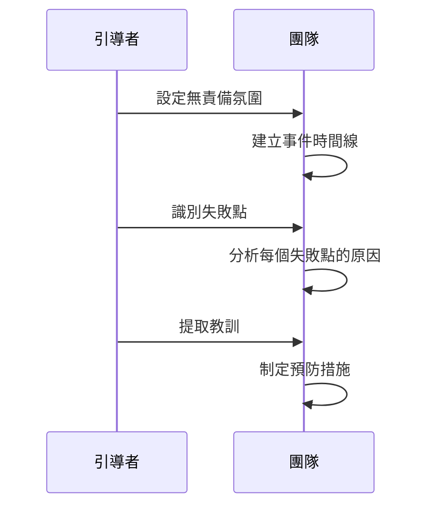
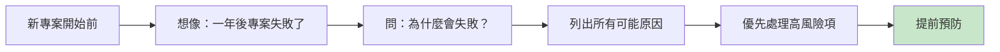
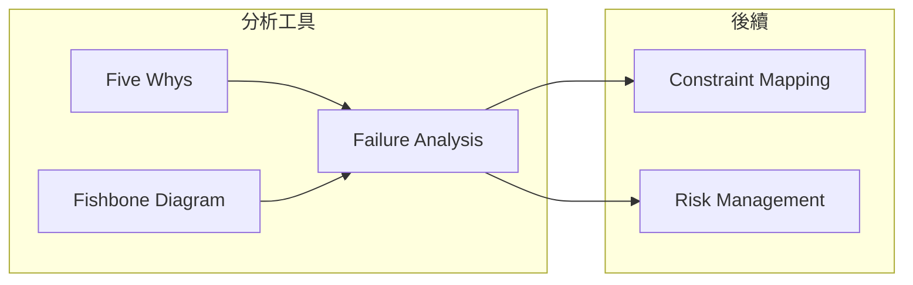

# Failure Analysis

> 失敗分析 - 從錯誤中提煉智慧

## 基本資訊

| 屬性 | 值 |
|------|-----|
| 類別 | Deep |
| 能量等級 | 中-低 |
| 建議時長 | 30-45 分鐘 |
| 參與人數 | 3-10 人 |
| 難度 | 中 |

## 技術概述

**Failure Analysis**（失敗分析）是一種系統性研究過去失敗經驗以提取有價值洞見的技術。包括事後分析（Post-mortem）和事前模擬（Pre-mortem）。失敗往往比成功更有教育意義。



## 核心原理

### 失敗的價值



## 技術一：事後分析（Post-mortem）

### 執行步驟



### 關鍵原則

1. **無責備文化**
   - 重點是學習，不是責怪
   - 追問系統原因，非個人原因

2. **事實為基礎**
   - 收集數據和證據
   - 避免假設和推測

3. **可行動的結論**
   - 產出具體的改進措施
   - 分配責任人和時間表

## 技術二：事前模擬（Pre-mortem）

### Gary Klein 的 Pre-mortem 方法



### 執行步驟

1. **設定情境**（2分鐘）
   - 「想像一年後，這個專案徹底失敗了」

2. **獨立寫下原因**（10分鐘）
   - 每人寫出所有可能的失敗原因
   - 不討論，避免群體思維

3. **分享和分類**（15分鐘）
   - 輪流分享
   - 分類相似項目

4. **風險評估**（10分鐘）
   - 評估每項的可能性和影響
   - 優先排序

5. **預防措施**（15分鐘）
   - 針對高風險項制定預防計畫

## 引導提示

### 事後分析問題

| 問題 | 目的 |
|------|------|
| 發生了什麼？按時間順序 | 建立事實 |
| 在哪個點開始出問題？ | 識別關鍵點 |
| 有什麼早期警訊被忽略？ | 提高警覺 |
| 系統/流程有什麼問題？ | 找系統原因 |
| 如何確保不再發生？ | 制定措施 |

### Pre-mortem 問題

| 問題 | 目的 |
|------|------|
| 如果失敗，最可能的原因是什麼？ | 識別風險 |
| 什麼會讓團隊崩潰？ | 人員風險 |
| 外部環境可能如何變化？ | 外部風險 |
| 我們最擔心什麼？ | 隱藏焦慮 |

## 範例演練

### Pre-mortem 案例：新產品發布

**假設情境**：「一年後，這個產品發布失敗了」

| 可能失敗原因 | 可能性 | 影響 | 預防措施 |
|--------------|--------|------|----------|
| 技術債務累積 | 高 | 高 | 每月技術審查 |
| 市場需求變化 | 中 | 高 | 持續用戶研究 |
| 關鍵人員離職 | 中 | 高 | 知識文檔化 |
| 預算超支 | 中 | 中 | 月度預算審查 |
| 競爭對手搶先 | 低 | 高 | 競品監控 |

## 失敗分析框架

### 5W1H 分析

```
┌─────────────────────────────────────────────────────────────┐
│                   FAILURE ANALYSIS FRAMEWORK                 │
├─────────────────────────────────────────────────────────────┤
│ What: 發生了什麼？                                           │
│ ___________________________________________________________  │
│                                                              │
│ When: 什麼時候發生？                                         │
│ ___________________________________________________________  │
│                                                              │
│ Where: 在哪個環節發生？                                      │
│ ___________________________________________________________  │
│                                                              │
│ Who: 涉及誰？（非責備，是了解）                              │
│ ___________________________________________________________  │
│                                                              │
│ Why: 為什麼發生？（使用 Five Whys）                          │
│ ___________________________________________________________  │
│                                                              │
│ How: 如何預防再次發生？                                      │
│ ___________________________________________________________  │
└─────────────────────────────────────────────────────────────┘
```

## 適用場景

| 場景 | 技術 | 時機 |
|------|------|------|
| 專案結束後 | Post-mortem | 專案結束立即 |
| 專案開始前 | Pre-mortem | 規劃階段 |
| 重大事故後 | Post-mortem | 事故穩定後 |
| 重要決策前 | Pre-mortem | 決策前 |

## 注意事項

### Do's（應該做）
- 創造心理安全環境
- 追問系統原因
- 記錄並追蹤改進
- 慶祝「有價值的失敗」

### Don'ts（不應該做）
- 責怪個人
- 防禦性回應
- 過於表面的分析
- 遺忘教訓

## 與其他技術的結合



## 參考資源

- Gary Klein《The Power of Intuition》
- [Harvard Business Review: Pre-mortem](https://hbr.org/)
- Lean 和 Agile 回顧會議實踐

---

## 設計模式對照

| 模式名稱 | 應用位置 | 核心價值 |
|----------|----------|----------|
| **Post-mortem** | 事後分析 | 從已發生的失敗學習 |
| **Pre-mortem** | 事前分析 | 想像失敗以預防 |
| **Blameless Culture** | 組織文化 | 無責怪的學習環境 |
| **Fail Fast** | 敏捷原則 | 快速失敗、快速學習 |

**核心洞察**：失敗是最昂貴的老師，但只有當你從中學習時。Pre-mortem 的天才在於它讓你在付出代價之前獲得失敗的教訓——問「如果一年後這個專案徹底失敗，最可能是什麼原因」比問「有什麼風險」更能激發誠實的答案。人們更容易描述一個「已發生」的假設性失敗，而不是承認他們擔心的事情。

---

*返回 [Deep 類別](./index.md) | [技術總覽](../index.md)*
