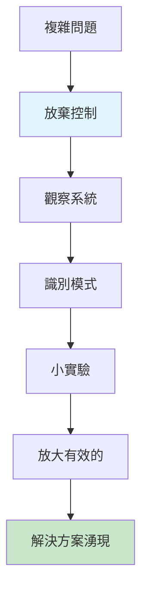
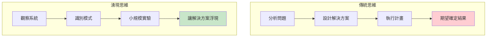
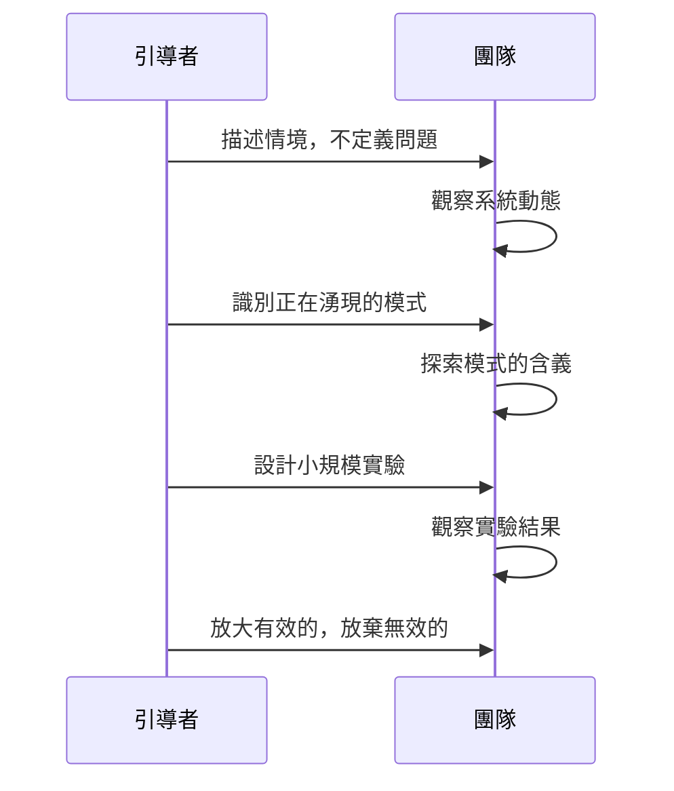
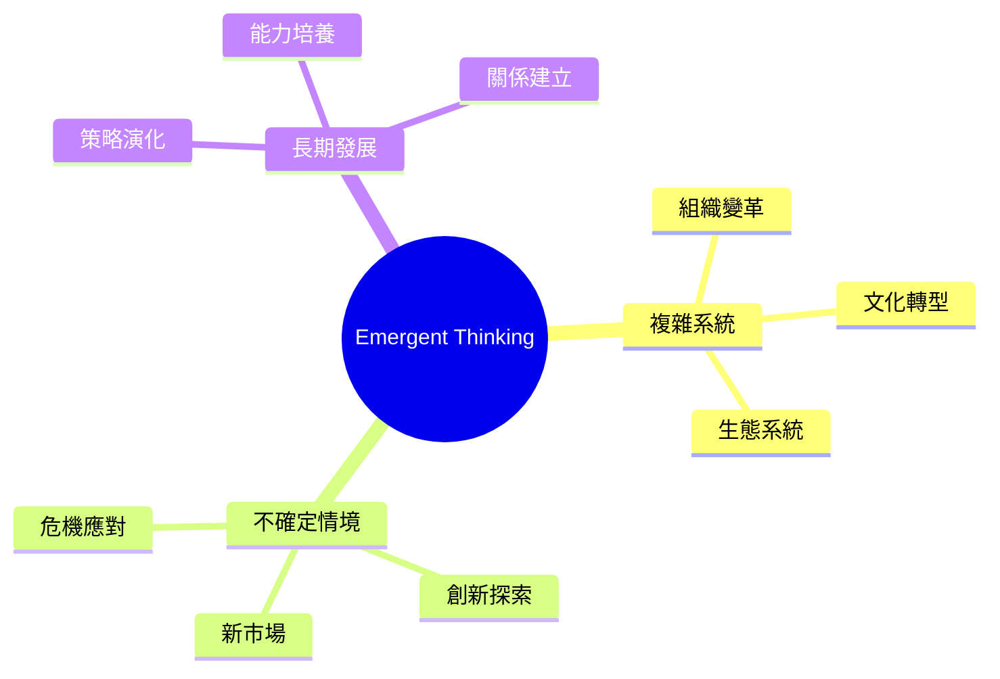
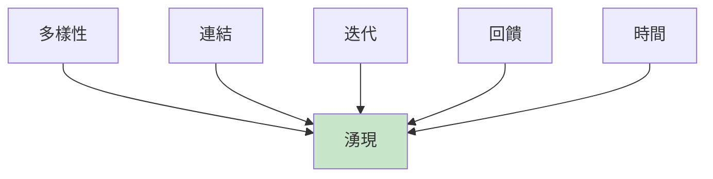
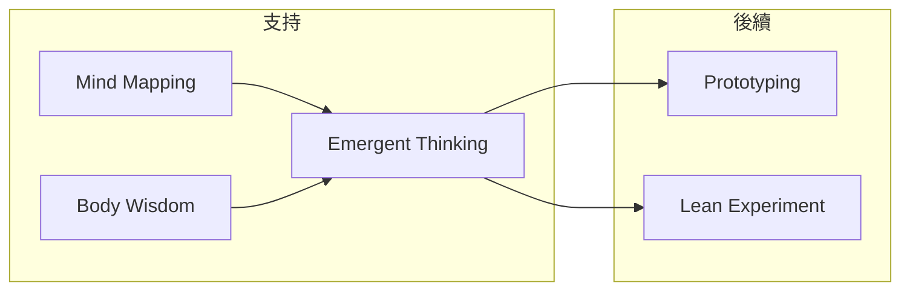

# Emergent Thinking

> 湧現思維 - 讓解決方案自然浮現

## 基本資訊

| 屬性 | 值 |
|------|-----|
| 類別 | Deep |
| 能量等級 | 低 |
| 建議時長 | 30-60 分鐘 |
| 參與人數 | 1-6 人 |
| 難度 | 中-高 |

## 技術概述

**Emergent Thinking**（湧現思維）是一種允許解決方案有機發展而非強制線性推進的思維方法。受複雜系統理論啟發，接受不確定性，觀察模式的自然湧現，而非試圖控制結果。

## 核心原理

### 湧現的概念

### 複雜系統特性

| 特性 | 說明 | 應對 |
|------|------|------|
| 非線性 | 小變化可能大影響 | 觀察和實驗 |
| 湧現性 | 整體超越部分之和 | 允許自然發展 |
| 適應性 | 系統會自我調整 | 創造條件 |
| 不可預測 | 結果難以精確預測 | 擁抱不確定 |

## 執行步驟

### 關鍵步驟

#### 步驟 1：觀察而非分析（15分鐘）
- 觀察系統的自然狀態
- 注意正在發生什麼
- 不急於解釋或判斷

**觀察問題：**
- 什麼正在發生？
- 有什麼模式？
- 什麼想要發生？

#### 步驟 2：識別湧現模式（10分鐘）
- 注意重複出現的模式
- 觀察自然形成的結構
- 識別系統的傾向

#### 步驟 3：小規模實驗（持續）
- 設計低成本的實驗
- 觀察系統反應
- 快速學習和調整

#### 步驟 4：放大有效的（持續）
- 發現什麼有效後，擴大它
- 讓有效的模式自然擴散
- 減少對無效模式的投入

## 引導提示

### 觀察階段

| 問題 | 目的 |
|------|------|
| 什麼正在自然發生？ | 觀察現狀 |
| 有什麼模式重複出現？ | 識別模式 |
| 系統想要朝哪個方向發展？ | 感知傾向 |
| 什麼在嘗試湧現？ | 識別萌芽 |

### 實驗階段

| 問題 | 目的 |
|------|------|
| 最小的實驗是什麼？ | 低成本測試 |
| 如何創造有利條件？ | 環境設計 |
| 什麼信號表示成功？ | 觀察指標 |

## 適用場景

### 何時使用

| 情境 | 適合度 | 原因 |
|------|--------|------|
| 問題複雜多變 | ★★★★★ | 傳統分析難以應對 |
| 系統涉及人 | ★★★★★ | 人的行為難預測 |
| 需要創新 | ★★★★☆ | 允許意外發現 |
| 問題簡單明確 | ★★☆☆☆ | 直接方法更有效 |

## 湧現 vs 計畫

| 面向 | 計畫式思維 | 湧現式思維 |
|------|------------|------------|
| 目標 | 明確預設 | 大致方向 |
| 路徑 | 預先規劃 | 邊走邊發現 |
| 控制 | 試圖控制 | 創造條件 |
| 失敗 | 是問題 | 是學習 |
| 結果 | 符合計畫 | 可能更好 |

## 實踐原則

### 創造湧現的條件

1. **多樣性**：不同視角和想法
2. **連結**：想法之間的交流
3. **迭代**：反覆嘗試和調整
4. **回饋**：觀察並回應結果
5. **時間**：給予足夠的耐心

## 注意事項

### Do's（應該做）
- 保持開放和好奇
- 觀察而非控制
- 從小處開始
- 放大有效的

### Don'ts（不應該做）
- 急於定義問題
- 強制預設結果
- 忽略意外發現
- 太快放棄實驗

## 變體應用

### 1. 開放空間技術
- 讓參與者自組織討論
- 觀察湧現的主題

### 2. 精益創業
- 快速實驗
- 觀察市場反應
- 讓產品-市場契合湧現

### 3. 敏捷開發
- 迭代發展
- 回應變化
- 讓需求和解決方案共同湧現

## 與其他技術的結合

## 參考資源

- Dave Snowden《Cynefin Framework》
- Peter Senge《The Fifth Discipline》
- Margaret Wheatley《Leadership and the New Science》

---

## 設計模式對照

| 模式名稱 | 應用位置 | 核心價值 |
|----------|----------|----------|
| **Emergence** | 複雜系統理論 | 整體大於部分之和 |
| **Open Space Technology** | 會議設計 | 讓結構自組織湧現 |
| **Lean Startup** | 創業方法 | 讓產品-市場契合湧現 |
| **Observe > Plan** | 行動順序 | 先觀察後規劃 |

**核心洞察**：Emergent Thinking 挑戰了「先規劃後執行」的傳統智慧。有些最好的解決方案不是設計出來的，而是從混沌中自然浮現的——就像城市裡最有活力的街區往往不是規劃出來的一樣。這種思維需要勇氣：放棄控制的幻覺，相信如果你創造正確的條件，答案會自己出現。

---

*返回 [Deep 類別](./index.md) | [技術總覽](../index.md)*
