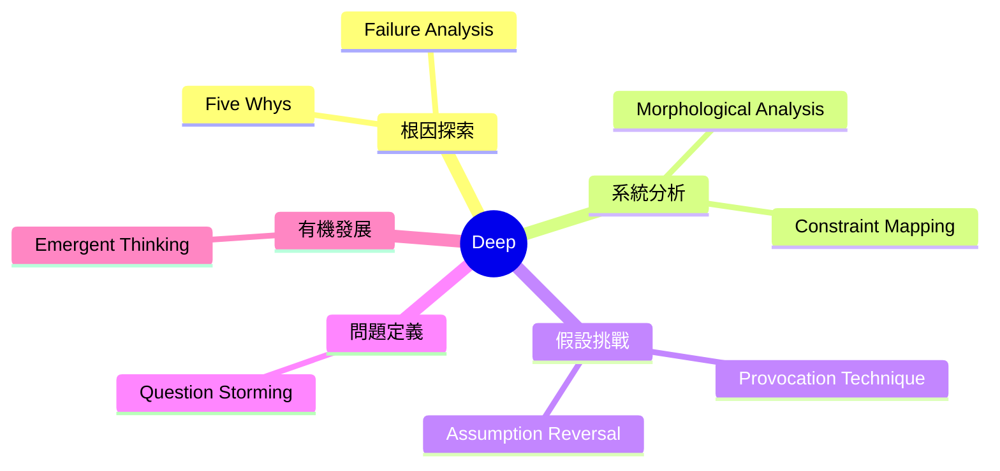
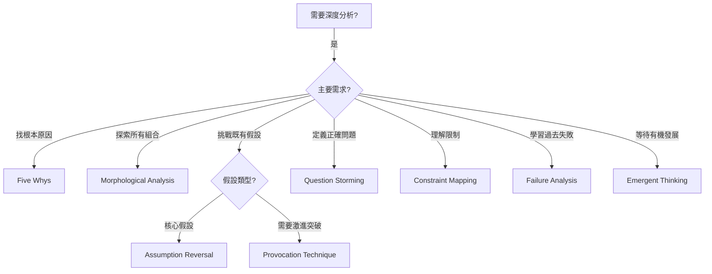
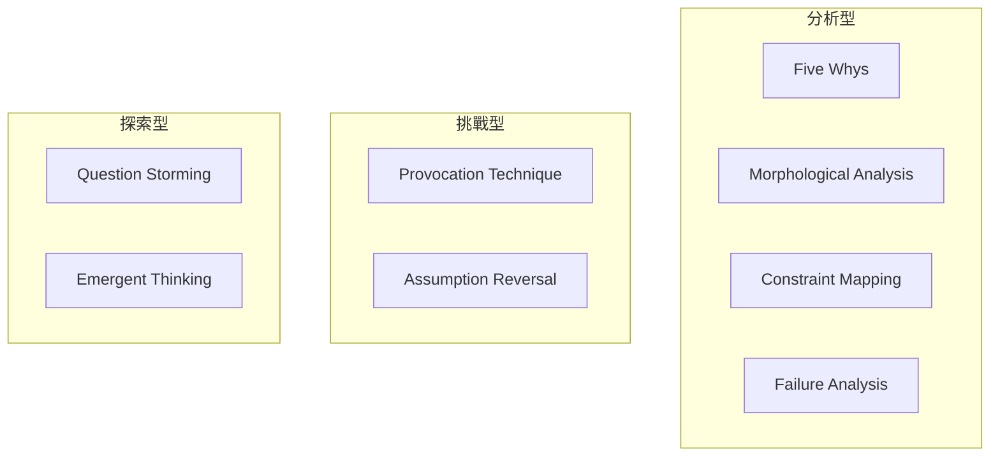

# Deep Brainstorming Techniques

> 深度類腦力激盪技術 - 深入分析、直擊根因

## 類別概述

深度類技術專注於問題的深層探索，不滿足於表面解決方案，而是追求對問題根源、隱藏假設和系統結構的深刻理解。這些技術適合需要收斂思維和分析性探索的情境。

## 核心特性

| 特性 | 說明 |
|------|------|
| 深度優先 | 追求對問題的深層理解 |
| 分析導向 | 結構化的分析過程 |
| 假設挑戰 | 質疑既有信念和約束 |
| 收斂思維 | 從廣泛可能性中聚焦 |

## 技術列表

| # | 技術名稱 | 核心概念 | 適用情境 |
|---|----------|----------|----------|
| 1 | [Five Whys](./01-five-whys.md) | 五個為什麼 | 根因分析 |
| 2 | [Morphological Analysis](./02-morphological-analysis.md) | 形態分析 | 系統組合探索 |
| 3 | [Provocation Technique](./03-provocation-technique.md) | 挑釁技術 | 荒謬啟發 |
| 4 | [Assumption Reversal](./04-assumption-reversal.md) | 假設反轉 | 範式轉移 |
| 5 | [Question Storming](./05-question-storming.md) | 問題風暴 | 正確問題定義 |
| 6 | [Constraint Mapping](./06-constraint-mapping.md) | 約束映射 | 限制突破 |
| 7 | [Failure Analysis](./07-failure-analysis.md) | 失敗分析 | 學習經驗 |
| 8 | [Emergent Thinking](./08-emergent-thinking.md) | 湧現思維 | 有機發展 |

## 技術選擇流程

## 能量等級

| 能量 | 技術 |
|------|------|
| 中 | Morphological Analysis, Question Storming |
| 中-低 | Five Whys, Constraint Mapping, Failure Analysis |
| 低 | Provocation Technique, Assumption Reversal, Emergent Thinking |

## 思維模式對照

## 與其他類別的搭配

| Deep 技術 | 推薦搭配 | 搭配效果 |
|-----------|----------|----------|
| Five Whys | Reverse Brainstorming | 問題+解決 |
| Morphological Analysis | SCAMPER | 系統化創新 |
| Question Storming | What If Scenarios | 問題+假設 |
| Constraint Mapping | First Principles | 限制+根本 |

---

## 設計模式與方法論對照

| 技術 | 相關模式/方法論 | 核心價值 |
|------|-----------------|----------|
| **Five Whys** | Root Cause Analysis, Toyota Production | 追問直到觸及根因 |
| **Morphological Analysis** | Zwicky Box, Systematic Innovation | 窮盡所有組合可能 |
| **Provocation Technique** | PO (Provocative Operation), de Bono | 用荒謬啟發思考 |
| **Assumption Reversal** | Paradigm Shift, Frame Breaking | 顛覆核心假設 |
| **Question Storming** | Inquiry-Based Learning | 對的問題比答案重要 |
| **Constraint Mapping** | Theory of Constraints, TOC | 識別和突破瓶頸 |

**核心洞察**：深度類技術的共同特徵是「不滿足於第一個答案」。當你問「為什麼顧客流失」，第一個答案可能是「價格太高」，但這只是表面。Five Whys 追問到第五層，你可能發現真正的原因是「我們不理解顧客的價值定義」。這種深度探索需要耐心和紀律，但它避免了解決錯誤問題的代價。

---

*返回 [技術總覽](../index.md)*
