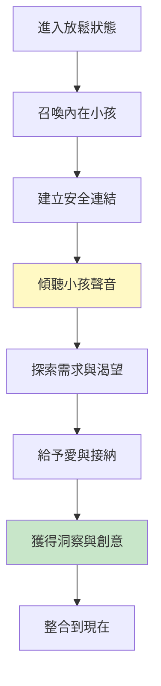
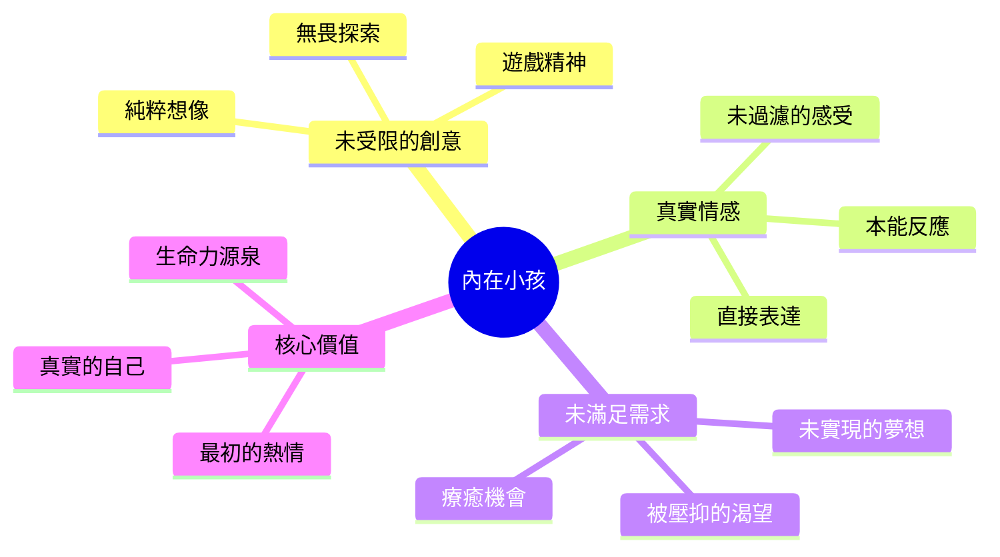
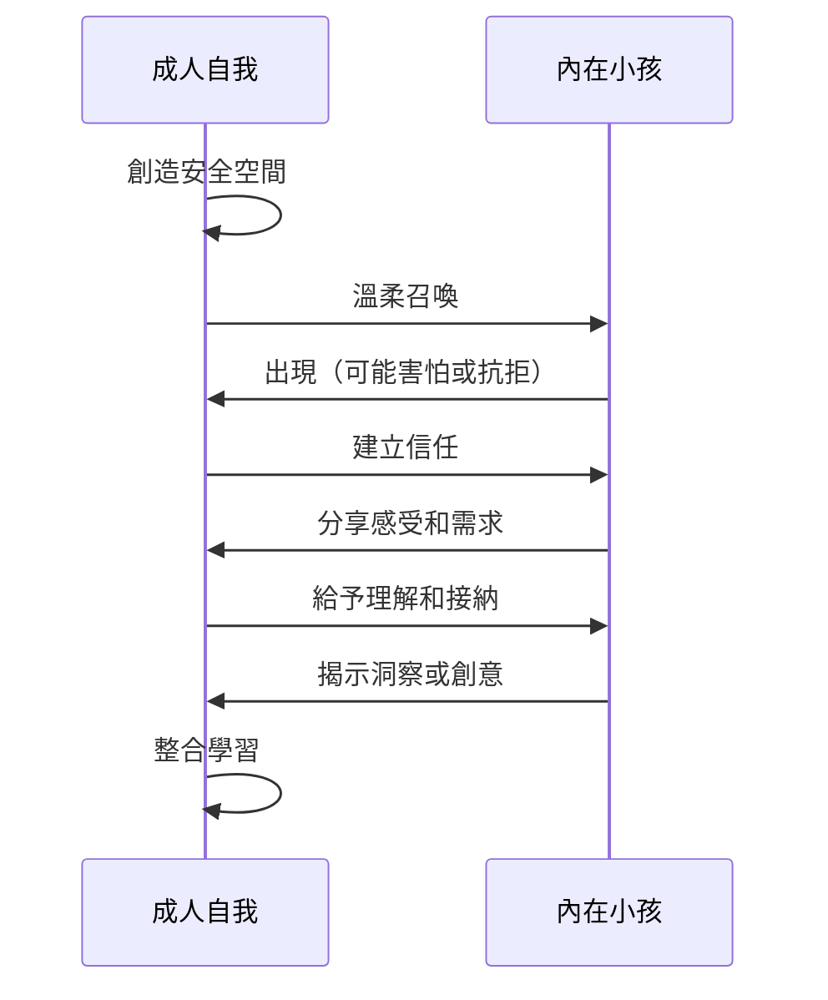
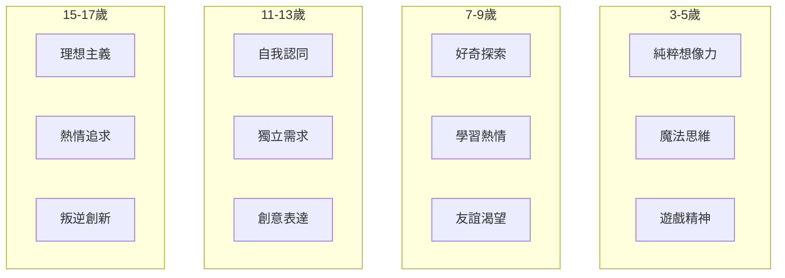
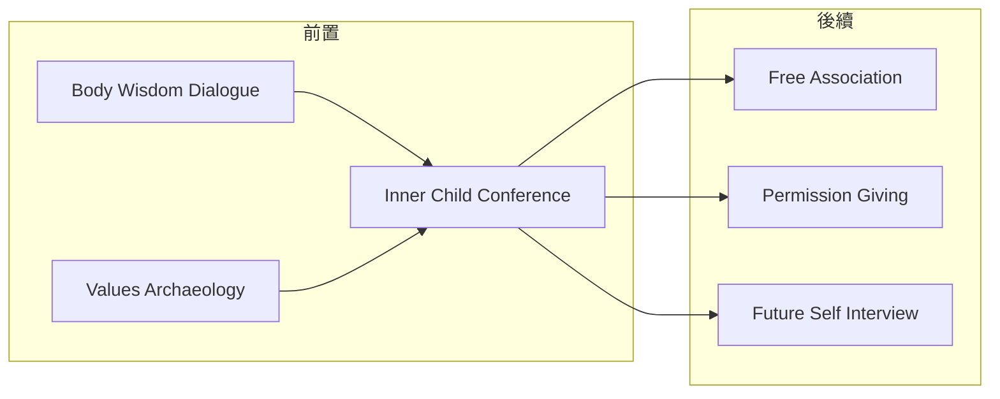

# Inner Child Conference

> 內在小孩會議 - 與童年自我對話，釋放創意與療癒

## 基本資訊

| 屬性 | 值 |
|------|-----|
| 類別 | Introspective Delight |
| 能量等級 | 低 |
| 建議時長 | 30-45 分鐘 |
| 參與人數 | 1 人（個人練習） |
| 難度 | 中 |

## 技術概述

**Inner Child Conference**（內在小孩會議）是一種深度自我對話技術，透過與不同年齡階段的內在小孩對話，重新連結童年的創意、好奇心和未被滿足的需求。這項技術結合了心理治療中的內在小孩工作（Inner Child Work）和創意寫作中的角色對話。



## 歷史背景

內在小孩概念源於榮格心理學的「兒童原型」，在1980年代由約翰·布雷蕭（John Bradshaw）的著作《回家：拯救內在小孩》推廣。這項技術將心理治療概念轉化為創意探索工具，幫助人們重新獲得童年的創造力和直覺智慧。

## 核心原理

### 內在小孩的智慧



### 為什麼有效？

1. **繞過成人防衛**：成人的理性防衛機制阻礙創意，透過內在小孩繞過這些障礙
2. **重拾好奇心**：童年的好奇心和探索精神是創意的源泉
3. **情感療癒**：處理未解決的童年議題釋放被困住的能量
4. **真實自我**：小孩代表最真實、未社會化的自我

## 執行步驟



### 詳細步驟

#### 步驟 1：創造安全空間（5分鐘）
- 找到安靜、私密的地方
- 舒適坐下或躺下
- 深呼吸，進入放鬆狀態
- 設定意圖：「我準備好與內在小孩連結」

#### 步驟 2：召喚內在小孩（5分鐘）
- 閉上眼睛，想像童年的自己
- 選擇一個特定年齡（3-5歲、7-9歲、11-13歲等）
- 看見那個小孩在哪裡、在做什麼
- 溫柔地接近他/她

#### 步驟 3：建立連結（10分鐘）
- 問：「你好嗎？」
- 觀察小孩的反應（可能害羞、生氣、興奮）
- 表達：「我是未來的你，我來聽你說話」
- 給予時間和空間

#### 步驟 4：深度對話（15分鐘）
詢問以下問題（不必全部問）：
- 你現在最想要什麼？
- 什麼讓你快樂？
- 什麼讓你害怕或難過？
- 你想玩什麼？
- 如果可以做任何事，你想做什麼？
- 你想告訴成人的我什麼？

#### 步驟 5：給予與接收（5-10分鐘）
- 問小孩：「我能為你做什麼？」
- 給予擁抱、認可、許可
- 問：「你有什麼禮物或智慧要給我？」
- 接收洞察或創意

#### 步驟 6：整合與記錄（5分鐘）
- 感謝內在小孩
- 承諾會再回來
- 慢慢回到當下
- 記錄重要洞察

## 引導提示

### 召喚提示

```
「閉上眼睛，深呼吸三次...
現在，想像你回到童年，你是__歲...
你看到小小的自己，在某個地方...
注意他/她在做什麼，穿什麼，臉上是什麼表情...
慢慢走近他/她，溫柔地說：『嗨，我是未來的你...』」
```

### 對話提示

| 引導語 | 目的 |
|--------|------|
| 「告訴我，你現在感覺如何？」 | 打開情感 |
| 「什麼讓你真正快樂？」 | 發現熱情 |
| 「如果沒有人會生氣，你想做什麼？」 | 釋放被壓抑的渴望 |
| 「你害怕什麼？」 | 識別恐懼源頭 |
| 「你想玩什麼遊戲？」 | 激發創意 |
| 「你需要什麼才能感到安全？」 | 療癒需求 |

### 不同年齡的內在小孩



## 適用場景

### 創意突破
- 當感覺創意被束縛時
- 需要新鮮視角
- 過度理性思考阻礙

### 情感療癒
- 處理童年創傷
- 釋放被壓抑的情感
- 重建自我價值

### 生涯探索
- 找回最初的熱情
- 重新連結真實渴望
- 突破「應該」的限制

### 決策困難
- 理性分析無法決定時
- 需要直覺指引
- 發現真正想要的

## 注意事項

### Do's（應該做）
- 創造真正安全、不被打擾的空間
- 以尊重、溫柔的態度對待內在小孩
- 允許任何情緒浮現，不評判
- 記錄洞察和感受
- 如遇到強烈情緒，給自己時間處理

### Don'ts（不應該做）
- 強迫內在小孩說話或出現
- 批評或否定小孩的感受
- 在不安全的環境進行
- 用來逃避現實責任
- 期待立即的戲劇性改變

### 可能的情緒反應

| 反應 | 處理方法 |
|------|----------|
| 內在小孩不出現 | 尊重，改天再試 |
| 小孩生氣或傷心 | 傾聽，給予空間表達 |
| 強烈悲傷湧現 | 允許哭泣，必要時尋求專業協助 |
| 小孩很頑皮 | 享受遊戲，允許創意奔放 |
| 感到抗拒 | 檢查是否準備好，可能需要建立更多安全感 |

## 深化練習

### 1. 多重年齡對話
與不同年齡的內在小孩對話，了解不同發展階段的需求

### 2. 內在小孩日記
定期寫信給內在小孩，或讓小孩寫信給你

### 3. 視覺對話
畫出內在小孩，用非慣用手繪畫增強連結

### 4. 實現小孩願望
在現實中做一件童年渴望但未實現的事（買想要的玩具、去想去的地方）

### 5. 內在小孩創意日
花一整天用小孩的眼光看世界、玩耍、創作

## 與其他技術的結合



## 範例演練

### 案例：創意工作者的突破

**情境**：一位設計師感覺創意枯竭，作品都很安全但缺乏靈魂。

**對話片段**：
```
成人：「你在做什麼？」
7歲的我：「在畫畫，我畫了一隻紫色的恐龍！」
成人：「好棒！為什麼是紫色？」
小孩：「因為我喜歡！老師說恐龍應該是綠色或灰色，但我不管！」
成人：「你為什麼不管？」
小孩：「因為這樣更好玩，而且紫色恐龍可以有魔法！」

【洞察】：我什麼時候開始只做「應該」的設計，而不是「好玩」的設計？
【行動】：下個專案中，先做「紫色恐龍」版本，再考慮客戶期待。
```

## 參考資源

- [Inner Bonding: Meet Your Inner Child](https://www.innerbonding.com/show-article/300/meet-your-inner-child.html)
- [Psychology Today: The Inner Child](https://www.psychologytoday.com/us/blog/the-many-faces-of-addiction/201006/the-inner-child)
- [Healthline: Inner Child Work](https://www.healthline.com/health/mental-health/inner-child-work)
- [Chopra: How to Heal Your Inner Child](https://chopra.com/articles/how-to-heal-your-inner-child)
- John Bradshaw - "Homecoming: Reclaiming and Healing Your Inner Child"
- Robert Bly - "A Little Book on the Human Shadow"

---

*返回 [Introspective Delight 類別](./index.md) | [技術總覽](../index.md)*
