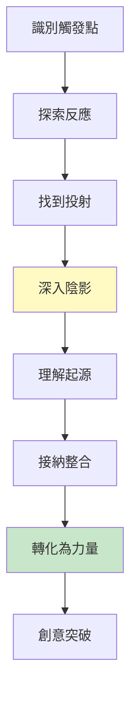
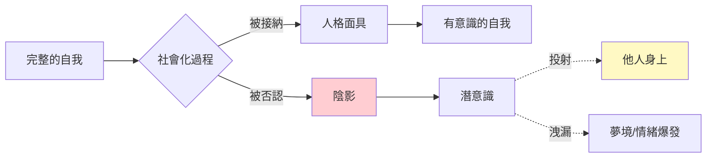
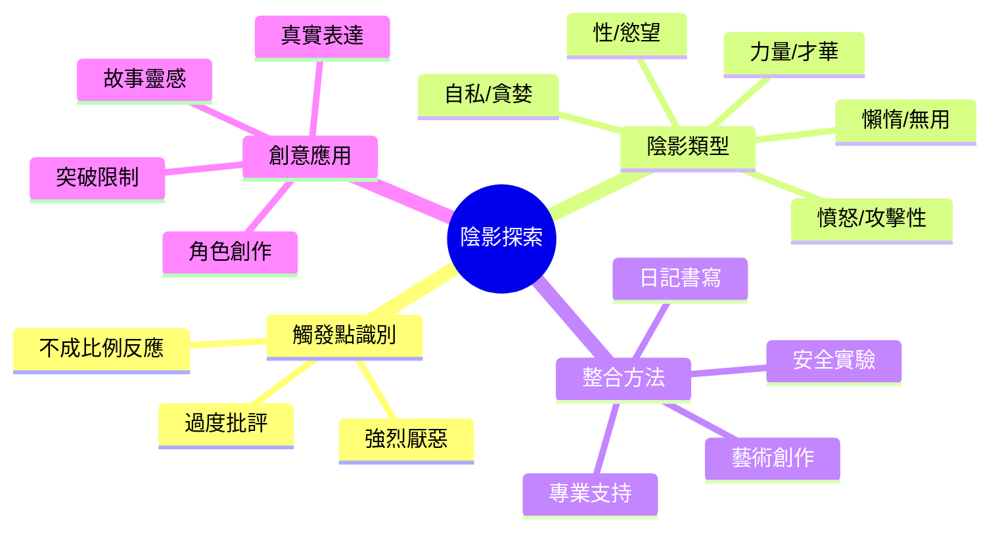
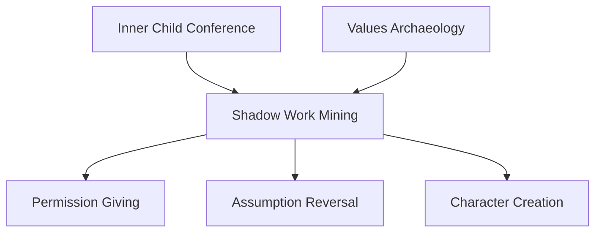

# Shadow Work Mining

> 陰影工作挖掘 - 整合被否認的自我，釋放隱藏的力量

## 基本資訊

| 屬性 | 值 |
|------|-----|
| 類別 | Introspective Delight |
| 能量等級 | 低 |
| 建議時長 | 45-60 分鐘 |
| 參與人數 | 1 人（個人練習） |
| 難度 | 高 |

## 技術概述

**Shadow Work Mining**（陰影工作挖掘）是一種深度心理探索技術，透過識別、面對和整合被壓抑或否認的自我面向（「陰影」），將其轉化為創意和力量的源泉。這項技術基於榮格心理學的陰影概念，將心理治療工具轉化為創意突破方法。



## 歷史背景

卡爾·榮格（Carl Jung）在20世紀初提出「陰影」概念，指人格中被壓抑到潛意識的部分。這些通常是我們否認、不喜歡或認為「不好」的特質。詩人羅伯特·布萊（Robert Bly）的《A Little Book on the Human Shadow》將這個概念普及化，近年來被整合到創意探索和個人發展領域。

## 核心原理

### 陰影的形成



### 陰影的類型

| 陰影類型 | 描述 | 例子 |
|----------|------|------|
| 負面陰影 | 被壓抑的「不好」特質 | 憤怒、自私、懶惰 |
| 正面陰影 | 被否認的「太好」特質 | 力量、才華、美麗 |
| 集體陰影 | 文化壓抑的特質 | 性、攻擊性、脆弱 |
| 原型陰影 | 普遍人性的黑暗面 | 破壞者、騙子、暴君 |

### 為什麼對創意有用？

1. **能量釋放**：壓抑陰影需要大量心理能量，整合後能量可用於創意
2. **完整視角**：陰影包含被忽視的真相和洞察
3. **突破限制**：許多創意限制來自對陰影的恐懼
4. **真實表達**：整合陰影後能更真實、有深度地表達

## 執行步驟

### 詳細步驟

#### 步驟 1：識別觸發點（10分鐘）
記錄最近的強烈情緒反應：
- 誰或什麼讓你強烈反感或憤怒？
- 你對別人的哪些特質特別批評？
- 什麼讓你不成比例地防衛或羞愧？

**原則**：如果反應過度強烈，很可能是陰影投射。

#### 步驟 2：探索投射（10分鐘）
選擇一個觸發點，問自己：
- 我批評這個人的什麼特質？
- 如果我也有這個特質，會是什麼樣子？
- 我害怕成為這樣嗎？還是秘密羨慕？

**技巧**：完成句子「我無法忍受____的人」，那個空白就是你的陰影。

#### 步驟 3：深入對話（15分鐘）
想像你的陰影是一個角色，與它對話：
```
你：「你是誰？」
陰影：「我是你壓抑的憤怒/自私/力量...」
你：「為什麼你在這裡？」
陰影：「因為你需要我，但你不承認...」
```

#### 步驟 4：追溯起源（10分鐘）
回憶童年：
- 什麼時候第一次學會這個特質是「不好的」？
- 誰告訴你的？
- 當時發生了什麼？

#### 步驟 5：重新框架（10分鐘）
找到陰影特質的正面價值：
- 這個特質的健康表達是什麼？
- 在什麼情況下，這個特質是有用的？
- 如何以建設性方式整合它？

#### 步驟 6：創意整合（5-10分鐘）
- 透過藝術表達陰影（畫畫、寫詩、舞蹈）
- 想像一個創意計畫，允許這個陰影特質表達
- 給自己許可，在安全的方式中體驗這個特質

## 引導提示

### 識別陰影的問題

| 問題 | 探索方向 |
|------|----------|
| 「我最討厭別人的什麼特質？」 | 負面陰影投射 |
| 「我覺得自己永遠做不到什麼？」 | 正面陰影（被否認的才華） |
| 「什麼會讓我感到深深的羞愧？」 | 核心陰影 |
| 「我秘密羨慕什麼？」 | 被壓抑的渴望 |
| 「我允許別人但不允許自己做什麼？」 | 雙重標準背後的陰影 |

### 陰影對話腳本

```
第一部分：召喚陰影
「閉上眼睛，想像你內在有一個黑暗的房間...
在那裡住著你不願承認的部分...
邀請它出現，它可能是一個形象、聲音或感覺...」

第二部分：建立連結
「問它：『你為什麼被放在這裡？』
『你想要什麼？』
『你有什麼禮物給我？』」

第三部分：整合
「謝謝它的出現...
問：『我如何以健康的方式給你空間？』」
```

## 陰影挖掘地圖



## 適用場景

### 創意突破
- 作品感覺「太乖」、缺乏深度
- 無法創作「黑暗」或「複雜」角色
- 自我審查阻礙表達
- 需要更真實、有力的聲音

### 個人發展
- 重複的人際衝突模式
- 對自己或他人過度批判
- 感覺人格「不完整」
- 想要更完整的自我接納

### 問題解決
- 卡在非黑即白的思維
- 無法理解對立觀點
- 創意被「正確性」束縛

## 注意事項

### Do's（應該做）
- 在安全、私密的環境進行
- 以好奇心而非批判態度探索
- 記錄洞察，慢慢整合
- 必要時尋求專業協助
- 從小的陰影開始練習

### Don'ts（不應該做）
- 用來合理化傷害行為
- 認為「陰影工作」就是放縱黑暗面
- 在情緒不穩定時深挖
- 獨自處理創傷性陰影
- 期待一次就完全整合

### 安全考量

| 警示訊號 | 建議行動 |
|----------|----------|
| 觸及創傷記憶 | 暫停，尋求專業治療師 |
| 壓倒性情緒 | 回到當下，接地練習 |
| 自我傷害念頭 | 立即尋求專業協助 |
| 持續數天的低落 | 諮詢心理專業人員 |

**重要**：陰影工作不應取代專業心理治療。如果你有創傷史或心理健康問題，請在專業人員指導下進行。

## 陰影整合練習

### 1. 陰影日記
每週寫一篇：
- 本週誰觸發了我？
- 這反映了我的什麼陰影？
- 如何以健康方式表達？

### 2. 3-2-1 陰影過程（Ken Wilber）
- **面對它**（第三人稱）：描述觸發你的人/事
- **對話**（第二人稱）：與陰影對話
- **成為它**（第一人稱）：「我是___」，體驗陰影

### 3. 陰影角色創作
- 創作一個體現你陰影的角色
- 寫它的故事
- 探索它的動機和需求

### 4. 反向日
花一天允許自己（以不傷害自己或他人的方式）：
- 說「不」（如果你的陰影是取悅他人）
- 展現力量（如果你的陰影是能力）
- 玩耍（如果你的陰影是輕鬆）

## 與其他技術的結合



## 範例演練

### 案例：完美主義作家

**觸發**：看到一位作家發表「不完美」的作品卻很成功，感到憤怒。

**探索**：
```
問：我批評什麼？
答：她太隨便，作品粗糙，不夠努力。

問：如果我也「隨便」，會怎樣？
答：（情緒湧現）我會被批評、被拒絕、被認為不夠好。

問：我的陰影是什麼？
答：「隨便」=「不完美」=我壓抑的自由。

起源：小時候只有完美的作業才被稱讚，學會了「夠好」=「不夠好」。

重新框架：
- 「隨便」的健康版本=「自發」、「真實」、「勇敢發表」
- 完美主義保護我免於批評，但也阻止我創作
```

**整合**：
- 創作「草稿藝術」項目，故意發表未拋光作品
- 給自己許可：「B+的作品發表出去，比A+的作品永遠在抽屜好」

**創意突破**：發表頻率增加，作品更真實，讀者反應更好。

## 陰影智慧

### 常見陰影及其禮物

| 被壓抑的陰影 | 恐懼 | 整合後的禮物 |
|-------------|------|-------------|
| 憤怒 | 失控、傷害他人 | 界限、力量、改變的動力 |
| 自私 | 被討厭 | 自我照顧、清晰優先順序 |
| 懶惰 | 無用 | 休息、接受、順其自然 |
| 脆弱 | 軟弱 | 真實連結、情感深度 |
| 權力慾 | 腐敗 | 領導力、影響力、自信 |
| 性慾 | 不道德 | 創造力、熱情、生命力 |

## 設計模式與方法論對照

| 相關模式/方法論 | 連結點 | 應用價值 |
|----------------|--------|----------|
| **Jung Shadow Integration** | 陰影概念起源 | 整合被壓抑部分以達到人格完整 |
| **3-2-1 Shadow Process (Wilber)** | 結構化陰影工作 | 面對→對話→成為的漸進過程 |
| **Projection Mapping** | 投射識別 | 在他人身上看到自己否認的部分 |
| **Golden Shadow Work** | 正面陰影 | 整合被否認的才華和力量 |
| **Active Imagination (積極想像)** | 與潛意識對話 | 榮格的潛意識探索技術 |

**核心洞察**：你最批評別人的特質，往往是你最需要的特質——只是你不允許自己擁有它。一個永遠「好脾氣」的人可能最討厭「自私」的人，但他真正需要的正是學會說「不」的能力。陰影不是你的敵人，而是被鎖在地下室的盟友。每一個被壓抑的特質都有其健康版本：憤怒的健康版是界限，自私的健康版是自我照顧，混亂的健康版是創造力。挖掘陰影不是釋放怪物，而是解放資源。

---

## 參考資源

- [Jung Platform: Shadow Work](https://jungplatform.com/topics/shadow-work)
- [Scott Jeffrey: Shadow Work Guide](https://scottjeffrey.com/shadow-work/)
- [Psyche: How to Integrate Your Shadow](https://psyche.co/guides/how-to-integrate-your-shadow-to-become-a-fuller-person)
- Robert Bly - "A Little Book on the Human Shadow"
- Carl Jung - "Aion: Researches into the Phenomenology of the Self"
- Debbie Ford - "The Dark Side of the Light Chasers"
- Connie Zweig & Steve Wolf - "Romancing the Shadow"

---

*返回 [Introspective Delight 類別](./index.md) | [技術總覽](../index.md)*
