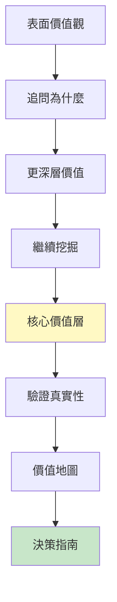
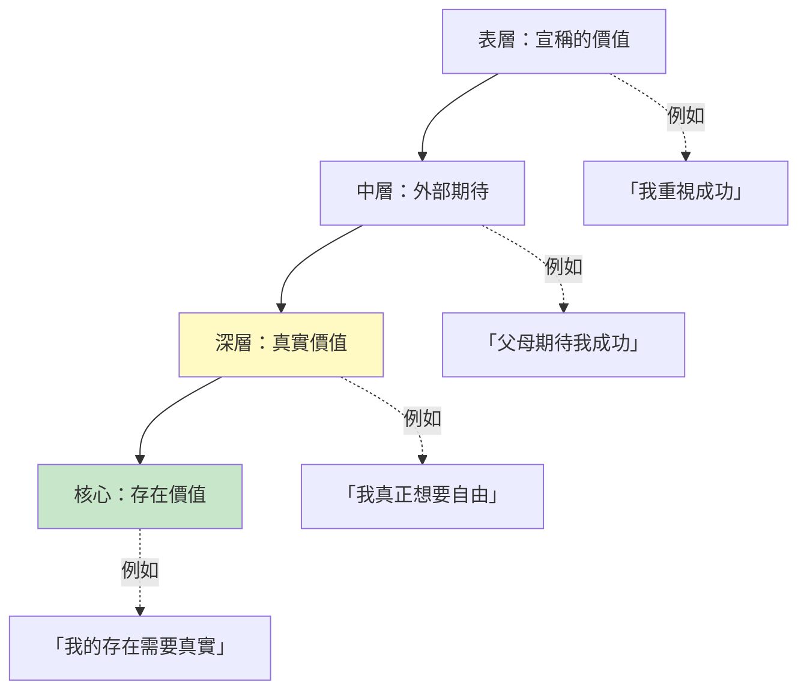
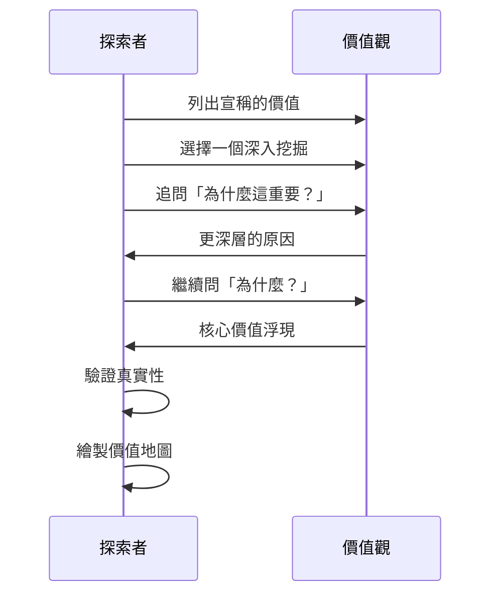
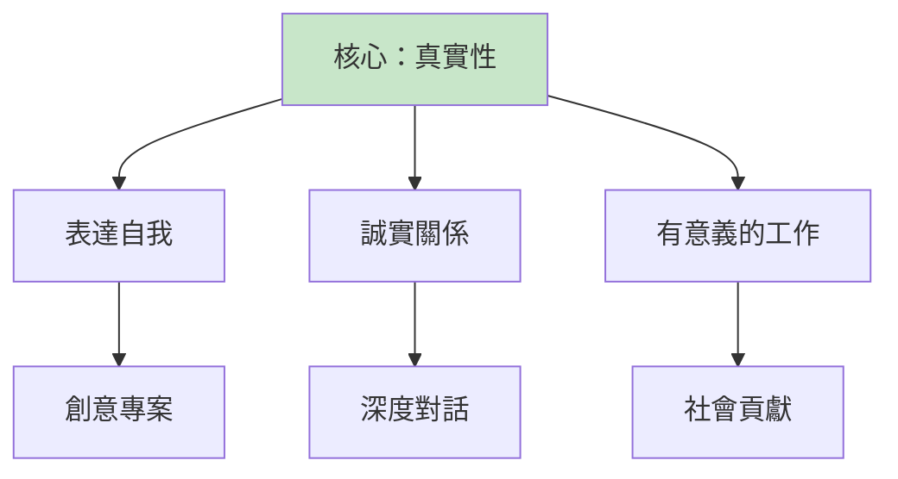
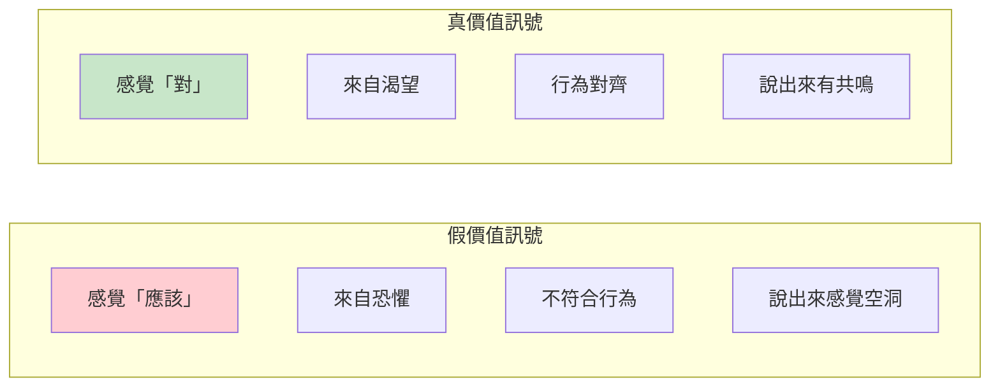
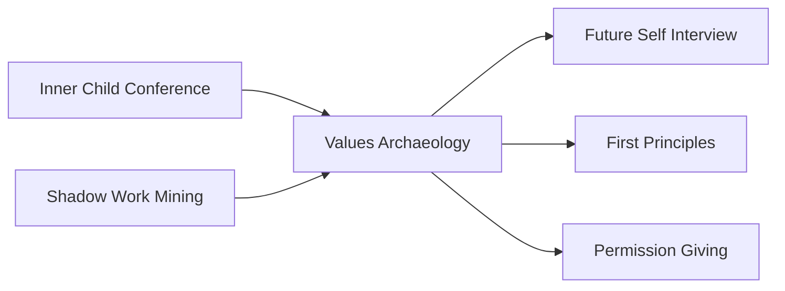

# Values Archaeology

> 價值考古 - 挖掘核心價值，發現真實方向

## 基本資訊

| 屬性 | 值 |
|------|-----|
| 類別 | Introspective Delight |
| 能量等級 | 低-中 |
| 建議時長 | 45-60 分鐘 |
| 參與人數 | 1 人（個人練習） |
| 難度 | 中 |

## 技術概述

**Values Archaeology**（價值考古）是一種系統化的自我探索技術，透過層層挖掘表面價值觀，找到深埋的核心價值。就像考古學家從地層中發掘文物，這項技術幫助你從生活經驗中挖掘真正驅動你的價值觀，區分「應該」的價值和「真實」的價值。



## 歷史背景

價值澄清（Values Clarification）運動始於1960年代，由路易斯·拉斯（Louis Raths）等教育學家發展。「考古」隱喻強調價值觀是被「埋藏」的，需要有意識的挖掘，而非表面的清單列舉。這項技術整合了價值澄清、動機訪談和存在主義心理學的概念。

## 核心原理

### 價值的地層結構



### 價值的來源

| 價值來源 | 描述 | 識別方式 |
|----------|------|----------|
| 內化的外部價值 | 社會、家庭、文化告訴你「應該」的 | 問「這真的是我的嗎？」 |
| 防衛性價值 | 為了保護自己而發展的 | 問「我為什麼需要這個？」 |
| 真實核心價值 | 來自深層自我的真實需求 | 感覺「對」、有能量 |
| 存在價值 | 關於你是誰、為何存在 | 觸及時有深刻共鳴 |

### 為什麼需要挖掘？

1. **區分真假**：我們宣稱的價值觀常不是真正的價值觀
2. **解決衝突**：當價值觀衝突，通常是表層價值 vs 深層價值
3. **真實決策**：基於真實價值的決策帶來滿足感
4. **創意對齊**：創意工作與核心價值對齊時最有力量

## 執行步驟



### 詳細步驟

#### 步驟 1：表層清單（10分鐘）
列出你宣稱重視的事物（不思考，快速寫下）：
- 我重視___（例如：家庭、事業、創意、自由、安全...）
- 選出 3-5 個「最重要」的

**提示**：第一直覺往往是社會期待，這沒關係，這就是起點。

#### 步驟 2：挑選一個深挖（5分鐘）
- 選擇一個引起你好奇或懷疑的價值
- 問自己：「這真的是我的嗎？還是我覺得應該重視的？」

#### 步驟 3：考古挖掘（20-25分鐘）
使用「價值階梯」技術：

```
層級 0：我重視「成功」
↓ 為什麼這重要？
層級 1：因為我想被認可
↓ 為什麼被認可重要？
層級 2：因為我想感覺自己有價值
↓ 為什麼感覺有價值重要？
層級 3：因為我需要知道我的存在有意義
↓ 這告訴我什麼核心價值？
核心：真實性、意義、被看見
```

每層追問 3-5 次，直到：
- 感覺「觸底」了
- 答案開始重複
- 情緒反應強烈（通常是接近核心的訊號）

#### 步驟 4：驗證真實性（10分鐘）
對挖掘出的核心價值進行測試：

| 驗證問題 | 真實價值的訊號 |
|----------|---------------|
| 「想到這個價值，我身體有什麼感覺？」 | 溫暖、擴張、能量 |
| 「過去一週我真正遵循這個價值了嗎？」 | 實際行為對齊 |
| 「如果違背這個價值，我會怎樣？」 | 真正的不適，非僅是社會焦慮 |
| 「我願意為這個價值犧牲什麼？」 | 有真實的取捨願意 |

#### 步驟 5：繪製價值地圖（10-15分鐘）
視覺化你的價值結構：



#### 步驟 6：整合應用（5-10分鐘）
- 檢視當前生活：哪些活動對齊核心價值？哪些不？
- 識別價值衝突：問題是否來自表層價值 vs 核心價值的衝突？
- 創意對齊：下一個創意計畫如何表達核心價值？

## 引導提示

### 挖掘問題序列

#### 第一層：表面動機
- 「為什麼這對你重要？」
- 「這給你什麼？」
- 「如果沒有這個，會怎樣？」

#### 第二層：情感需求
- 「這讓你感覺如何？」
- 「你追求的是什麼感受？」
- 「這滿足了什麼需求？」

#### 第三層：存在意義
- 「這與你是誰有什麼關係？」
- 「這觸及你存在的什麼部分？」
- 「如果用一個字描述這個深層需求，是什麼？」

### 區分真假價值的線索



## 價值考古工具包

### 1. 高峰經驗分析
回憶人生中感覺「完全活著」的時刻：
- 發生了什麼？
- 什麼價值被實現了？
- 這揭示了什麼核心價值？

### 2. 憤怒/悲傷地圖
什麼讓你真正憤怒或悲傷？
- 這通常指向被侵犯的核心價值
- 「我對___憤怒，因為我真正重視___」

### 3. 羨慕探測
你羨慕誰？為什麼？
- 羨慕揭示未滿足的價值
- 「我羨慕她的___，因為我真正想要___」

### 4. 遺憾審視
你後悔什麼？
- 遺憾來自違背核心價值
- 「我後悔___，因為這違背了我對___的重視」

### 5. 墓碑測試
你希望墓碑上寫什麼？
- 這揭示最終極的價值
- 去除社會期待，什麼是真正重要的？

## 適用場景

### 生涯轉換
- 不確定該選擇哪條路
- 職業成功但感覺空虛
- 想要有意義的工作

### 關係困境
- 重複的關係模式
- 說不出的「不對勁」感
- 需要設定界限

### 創意方向
- 作品缺乏個人聲音
- 不確定創作什麼
- 想要更真實的表達

### 決策困難
- 理性分析無法決定
- 選項都「有道理」但都不對
- 需要內在指南針

## 注意事項

### Do's（應該做）
- 誠實面對「應該」vs「真正想要」
- 允許核心價值與期待不同
- 接受價值觀可能隨時間演變
- 用發現代替評判

### Don'ts（不應該做）
- 假設第一個答案就是真實的
- 被「正確」的價值觀束縛
- 忽視身體和情緒訊號
- 孤立地看待價值（它們是系統）

### 常見發現

| 表面價值 | 挖掘後的核心價值 |
|----------|-----------------|
| 「成功」 | → 自由、自主、被看見 |
| 「幫助他人」 | → 連結、意義、療癒自己 |
| 「安全」 | → 控制、可預測、避免痛苦 |
| 「家庭」 | → 歸屬、被愛、根源 |
| 「創意」 | → 表達、探索、成為 |

## 深化練習

### 1. 30天價值日記
每天記錄：
- 今天什麼時刻感覺「對」？什麼價值被實現？
- 什麼時刻感覺「不對」？什麼價值被侵犯？

### 2. 價值衝突地圖
當你感到內在衝突：
```
情境：我想辭職旅行，但也想要穩定收入
表面：自由 vs 安全
深挖：探索/成長 vs 被照顧/控制
核心：可能兩者都重要，需要創意整合而非二選一
```

### 3. 價值表達專案
選擇一個核心價值，創作一個完全表達它的作品（藝術、寫作、專案）

### 4. 價值傳記
寫一個故事：「我是一個重視___的人，這是我的旅程...」

## 與其他技術的結合



## 範例演練

### 案例：「成功」的挖掘

```
表面：我重視「在40歲前成為副總」
↓ 為什麼？
因為這代表成功
↓ 為什麼成功重要？
因為我想證明自己
↓ 為什麼要證明自己？
因為我想讓父母驕傲
↓ 為什麼父母驕傲重要？
因為... （停頓，情緒）...因為我想被看見
↓ 被看見是什麼意思？
（哭泣）我想感覺我的存在有價值，我是重要的
↓ 核心價值：
被看見、價值感、重要性

驗證：
- 身體：胸口溫暖，眼淚（觸及真實）
- 行為檢查：我常做「被注意」的事，即使不是「副總」
- 犧牲測試：我會為了被真正看見而放棄表面成功嗎？（是的）

整合：
- 副總可能是一種方式，但不是唯一方式
- 問：還有什麼方式能滿足「被看見」？
- 創意工作發表、教學、深度關係...
- 解放：不需要遵循單一路徑

決策影響：
- 可能選擇讓我被看見的角色，即使不是最高職位
- 可能選擇創意工作而非管理工作
- 關鍵是：這個選擇讓我被真正看見嗎？
```

## 參考資源

- [Values Clarification: A Handbook](https://www.amazon.com/Values-Clarification-Handbook-Strategies-Teachers/dp/0446671762)
- [MindTools: Understanding Your Values](https://www.mindtools.com/pages/article/newTED_85.htm)
- [Psychology Today: Know Your Values](https://www.psychologytoday.com/us/blog/click-here-happiness/201904/know-your-values-know-yourself)
- [PositivePsychology: Core Values](https://positivepsychology.com/core-values/)
- Brené Brown - "Dare to Lead" (Values section)
- Viktor Frankl - "Man's Search for Meaning"
- Russ Harris - "The Confidence Gap" (ACT values work)

---

*返回 [Introspective Delight 類別](./index.md) | [技術總覽](../index.md)*
