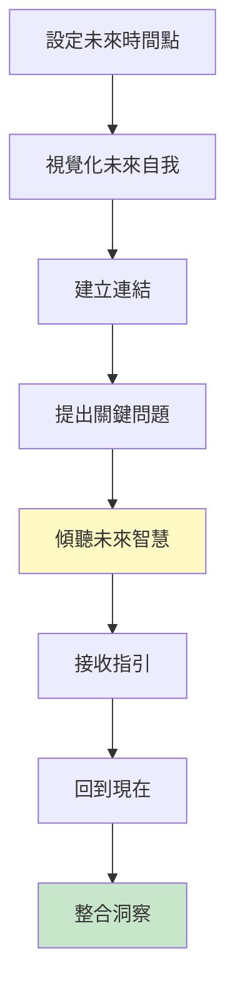
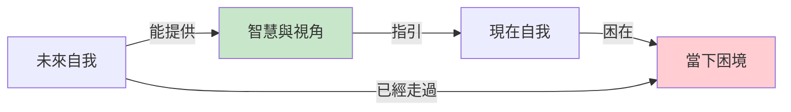
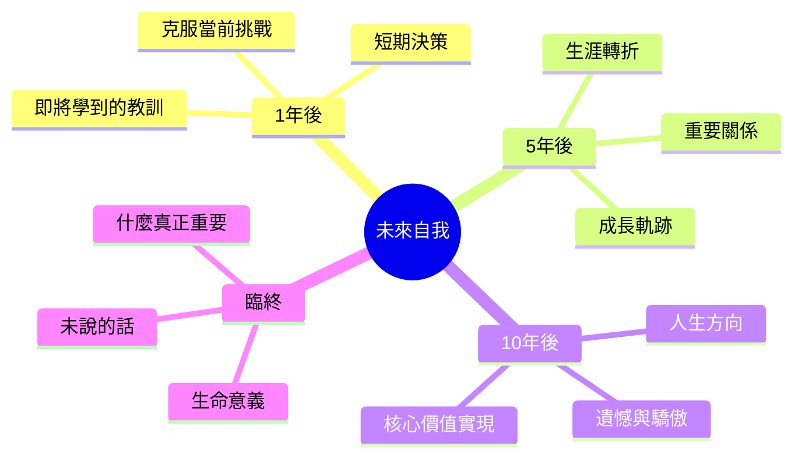
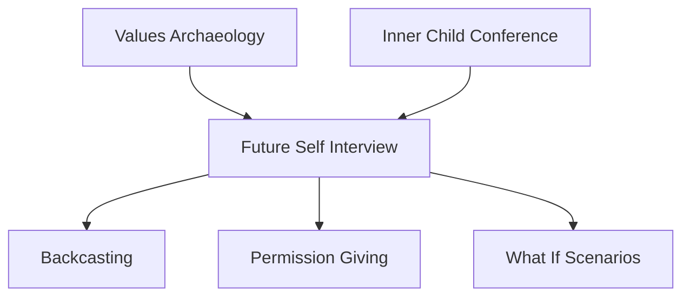

# Future Self Interview

> 未來自我訪談 - 從未來的智慧中獲得今日的指引

## 基本資訊

| 屬性 | 值 |
|------|-----|
| 類別 | Introspective Delight |
| 能量等級 | 低 |
| 建議時長 | 30-45 分鐘 |
| 參與人數 | 1 人（個人練習） |
| 難度 | 中 |

## 技術概述

**Future Self Interview**（未來自我訪談）是一種時間旅行式的自我探索技術，透過想像並訪談未來的自己（通常是5年、10年或臨終前的自己），獲得洞察、智慧和方向指引。這項技術結合了視覺化、角色扮演和深度反思，幫助你從更高視角看待當前的選擇和挑戰。



## 歷史背景

這項技術融合了多種傳統：
- **時間旅行視覺化**：源自引導冥想和薩滿傳統
- **生命回顧**：老年心理學中的重要技術
- **臨終視角**：史蒂芬·柯維（Stephen Covey）的「以終為始」概念
- **未來自我理論**：行為經濟學研究顯示，與未來自我連結能改善決策

## 核心原理

### 時間視角的力量



### 為什麼有效？

| 機制 | 效果 |
|------|------|
| 時間距離 | 減少情緒反應，增加清晰度 |
| 已實現視角 | 看到可能性而非障礙 |
| 智慧投射 | 我們知道自己需要聽什麼 |
| 價值澄清 | 從終點看清什麼真正重要 |
| 心理時間旅行 | 大腦把想像的未來當成部分真實 |

### 不同時間點的智慧



## 執行步驟

### 詳細步驟

#### 步驟 1：準備（5分鐘）
- 找到安靜、不被打擾的空間
- 準備紙筆或錄音設備
- 深呼吸，進入放鬆狀態
- 設定意圖：「我準備好聆聽未來自我的智慧」

#### 步驟 2：選擇時間點（2-3分鐘）
根據需求選擇：
- **1年後**：當前決策和挑戰
- **5年後**：中期願景和方向
- **10年後**：長期人生軌跡
- **20年後**：成熟智慧
- **臨終**：終極意義和遺憾

**提示**：第一次練習建議從5年後開始。

#### 步驟 3：視覺化未來自我（10分鐘）
閉上眼睛，想像：
- 那是什麼年份？
- 你在哪裡？（環境、地點）
- 你看起來如何？（年齡、樣貌、穿著）
- 你在做什麼？
- 周圍有誰？
- 你的能量和氛圍如何？

**重要**：不要「計劃」這個畫面，讓它自然浮現。

#### 步驟 4：建立連結（5分鐘）
- 走近未來的自己
- 說：「我是過去的你，從[現在年份]來訪」
- 觀察未來自我的反應
- 感受連結建立

#### 步驟 5：訪談（15-20分鐘）
提出核心問題（不必全問，選擇共鳴的）：

**關於現在的挑戰**：
- 「回顧我現在面對的[具體挑戰]，你會給我什麼建議？」
- 「這個挑戰最終如何解決的？」
- 「我現在最需要知道什麼？」

**關於決策**：
- 「關於[具體決策]，我應該選擇哪條路？」
- 「你後悔什麼選擇？」
- 「你慶幸做了什麼？」

**關於優先順序**：
- 「什麼真正重要？」
- 「我現在把時間花在什麼上是對的？」
- 「我應該放下什麼？」

**關於成長**：
- 「我需要學習什麼？」
- 「我需要成為什麼樣的人？」
- 「旅程中最重要的轉折點是什麼？」

**關於愛與關係**：
- 「我應該對誰說什麼？」
- 「什麼關係值得投資？」

#### 步驟 6：接收禮物（5分鐘）
- 問：「你有什麼禮物要給我？」
- 可能是一個物件（象徵性的）、一句話、一個擁抱
- 接收並感謝

#### 步驟 7：回到現在（5分鐘）
- 感謝未來自我
- 慢慢回到當下
- 睜開眼睛
- 立即記錄（記憶會快速消退）

## 引導提示

### 視覺化引導腳本

```
「閉上眼睛，深呼吸三次...

現在是[未來年份]，你已經[X]歲了...
注意你在哪裡...是室內還是室外？
你看起來如何？穿什麼？
你的臉上是什麼表情？
你在做什麼？

你注意到有人來了...
是年輕的你，從[現在年份]來的...
你感覺如何？你想對年輕的自己說什麼？」
```

### 深度問題庫

#### 生命意義類
| 問題 | 探索方向 |
|------|----------|
| 「你的生命是關於什麼的？」 | 核心使命 |
| 「什麼讓你感到驕傲？」 | 真實成就 |
| 「你希望被如何記得？」 | 遺產與影響 |

#### 遺憾與智慧類
| 問題 | 探索方向 |
|------|----------|
| 「你最大的遺憾是什麼？」 | 應避免的路 |
| 「你希望年輕時知道什麼？」 | 關鍵洞察 |
| 「你希望自己早點做什麼？」 | 行動指引 |

#### 關係類
| 問題 | 探索方向 |
|------|----------|
| 「誰對你最重要？」 | 關係優先順序 |
| 「你希望對誰說什麼但沒說？」 | 未表達的愛 |
| 「誰真正理解你？」 | 深度連結 |

## 不同版本

### 1. 臨終版本（最強力）

最深刻但也最具挑戰性的版本：

```
想像你在生命的最後一天...
身體虛弱，但心智清晰...
你回顧整個人生...

對現在的你，你想說什麼？
什麼是你真正珍惜的？
你遺憾什麼？慶幸什麼？
如果能重來，你會如何活？
```

**力量**：消除所有不重要的事，直達核心。

### 2. 多重未來版本

訪談三個可能的未來自我：
- **最佳情境未來**：一切順利
- **最糟情境未來**：最怕的發生了
- **最真實未來**：最可能的路

每個都有不同智慧。

### 3. 特定領域版本

針對特定領域的未來自我：
- 未來的創意家自我
- 未來的父母自我
- 未來的領導者自我

### 4. 過去-未來對話

內在小孩（過去）+ 未來自我 + 現在的你，三方對話。

## 適用場景

### 重大決策
- 生涯轉換
- 關係承諾
- 地理搬遷
- 創業 vs 穩定工作

### 困境迷茫
- 不知道方向
- 多個選項都可以但都不確定
- 感覺迷失

### 價值澄清
- 什麼真正重要？
- 被外部期待淹沒
- 需要重新對齊

### 創意項目
- 長期創意計畫的方向
- 應該投入哪個項目
- 完成 vs 放棄的決定

## 注意事項

### Do's（應該做）
- 信任第一個浮現的畫面和答案
- 記錄所有細節（即使看似不重要）
- 允許情緒流動（可能會哭）
- 多次練習（每次都有新洞察）

### Don'ts（不應該做）
- 「計劃」或控制未來自我說什麼
- 忽視不想聽的答案
- 用來逃避當下行動
- 期待具體預測（這不是算命）

### 常見體驗

| 體驗 | 意義 |
|------|------|
| 未來自我很模糊 | 你對未來不確定（這沒關係） |
| 未來自我很清晰具體 | 潛意識已經知道方向 |
| 聽到意外的答案 | 深層智慧浮現 |
| 強烈情緒反應 | 觸及真實的東西 |
| 未來自我給擁抱 | 自我接納和愛 |

## 深化練習

### 1. 未來自我信件
未來自我寫信給現在的你：
```
親愛的[你的名字]：

我是2035年的你...
我想告訴你...
```

### 2. 未來自我日記
從未來自我的視角寫日記，描述今天（現在）發生的事。

### 3. 定期訪談
每季度訪談一次，看智慧如何演變。

### 4. 時間膠囊
- 未來自我給你一個禮物/象徵物
- 在現實中找到或創造這個物件
- 放在看得見的地方提醒自己

### 5. 逆向工程
從未來自我的建議，逆推現在需要採取的步驟。

## 與其他技術的結合



### 強力組合：三重時間對話

1. **內在小孩**（過去）：你的本質和未滿足需求
2. **現在自我**：當下的挑戰和選擇
3. **未來自我**：智慧和方向

讓三者對話，整合時間線。

## 範例演練

### 案例：職涯轉換的困惑

**情境**：35歲軟體工程師，考慮轉行做藝術，但害怕財務不穩定。

**訪談片段**：
```
我（現在35歲）：我在考慮離開科技業去做藝術，但很害怕...

未來我（50歲，視覺化中出現在畫室裡）：
（微笑）我知道你很害怕。我當時也是。

我：所以你做了嗎？轉行了？

未來我：是的。花了2年過渡，最難的是前3年。
但你知道嗎？現在回看，我唯一後悔的是沒有早點開始。

我：但是財務呢？

未來我：前5年很緊，不騙你。
但你學會了創意地賺錢，而且你需要的比你想像的少。
更重要的是...（指著牆上的畫）...看到這些了嗎？
這些是你的靈魂。在辦公室裡那部分是死的。

我：我應該怎麼開始？

未來我：不要全有或全無。開始建立作品集，週末創作。
當你有6個月生活費和第一個客戶時，再跳。
但最重要的是：現在就開始創作。不要等「完美時機」。

我：你有什麼禮物給我？

未來我：（拿出一支畫筆）這是你的第一支專業畫筆。
它提醒你：你已經是藝術家了，只是還沒全職而已。
```

**洞察**：
- 不是「現在跳或永不」，而是漸進過渡
- 財務困難是真實的但可克服的
- 靈魂需求比安全感更關鍵
- 現在就開始小步驟

**行動**：
- 買第一支專業畫筆
- 設立週末創作時間
- 開始建立作品集網站
- 計算6個月生活費目標

## 科學支持

研究顯示：
- **時間折扣**：與未來自我連結減少衝動決策
- **視覺化效果**：大腦把生動想像部分當成真實經驗
- **臨終視角**：增加親社會行為和有意義的選擇
- **自我連續性**：感覺與未來自我連結的人做更好的長期決策

## 設計模式與方法論對照

| 相關模式/方法論 | 連結點 | 應用價值 |
|----------------|--------|----------|
| **Temporal Self Theory (時間自我理論)** | 未來自我連結 | Hershfield研究：連結未來自我改善決策 |
| **Backcasting (回推法)** | 從未來回推 | 先定義終點，再逆推路徑 |
| **Begin with End in Mind** | Covey的第二習慣 | 用終點指引當下選擇 |
| **Regret Minimization Framework** | Bezos決策法 | 80歲回看，最小化遺憾 |
| **Prospective Hindsight (前瞻性後見)** | 預演未來視角 | 研究顯示能提高預測準確度30% |

**核心洞察**：大腦把「未來的我」當成陌生人——神經影像研究發現，想到10年後的自己，激活的腦區和想到陌生人是一樣的。這就是為什麼我們會做傷害未來自我的決定（不存錢、不運動、不追求夢想），因為那感覺像是在傷害別人。未來自我訪談的魔力在於：透過生動的視覺化和對話，讓未來自我從「陌生人」變成「我認識的人」，甚至是「我愛的人」。當你真正「見過」80歲的自己，為他/她做決定就不再那麼困難。

---

## 參考資源

- [Harvard Business Review: A Simple Way to Stay Grounded in Stressful Moments](https://hbr.org/2019/01/a-simple-way-to-stay-grounded-in-stressful-moments)
- [The Future Self: Psychology and Neuroscience](https://www.psychologytoday.com/us/blog/the-empowerment-diary/202108/the-future-self)
- [Greater Good: How to Build a Relationship With Your Future Self](https://greatergood.berkeley.edu/article/item/how_to_build_a_relationship_with_your_future_self)
- Hal Hershfield - Research on Future Self
- Bronnie Ware - "The Top Five Regrets of the Dying"
- Stephen Covey - "The 7 Habits of Highly Effective People" (Begin with the End in Mind)

---

*返回 [Introspective Delight 類別](./index.md) | [技術總覽](../index.md)*
