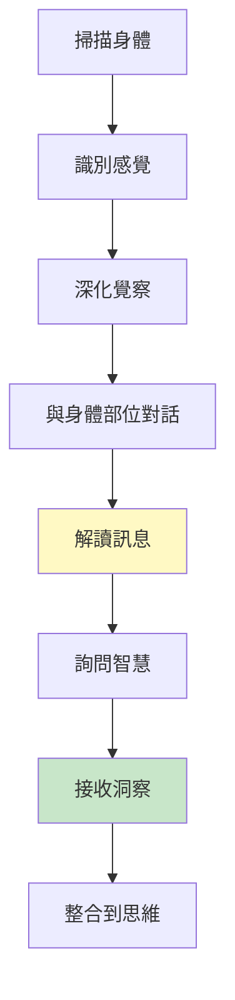
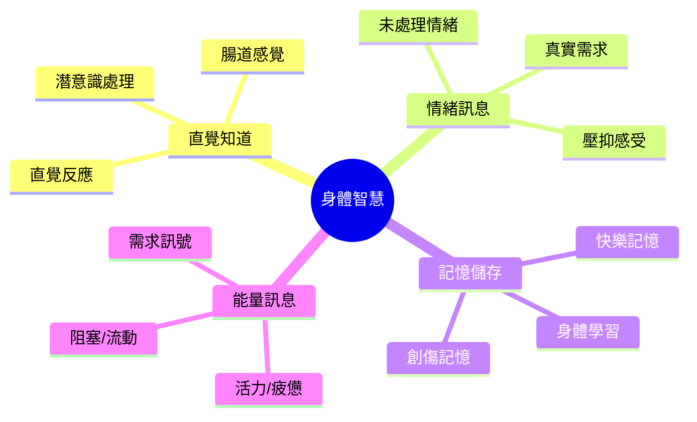
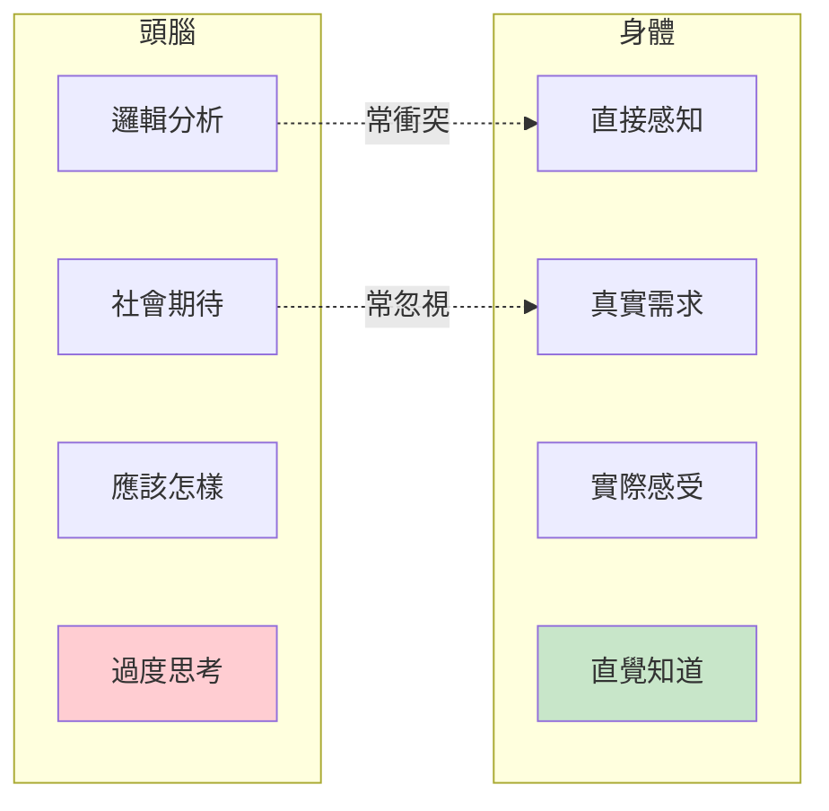
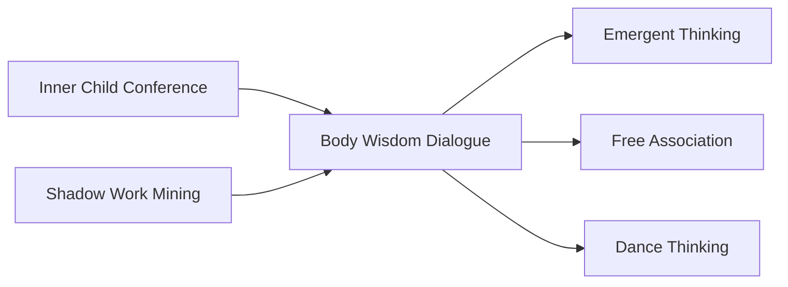

# Body Wisdom Dialogue

> 身體智慧對話 - 傾聽身體的直覺與洞察

## 基本資訊

| 屬性 | 值 |
|------|-----|
| 類別 | Introspective Delight |
| 能量等級 | 低-中 |
| 建議時長 | 20-40 分鐘 |
| 參與人數 | 1 人（個人練習） |
| 難度 | 中 |

## 技術概述

**Body Wisdom Dialogue**（身體智慧對話）是一種具身認知（embodied cognition）技術，透過與身體對話和傾聽身體訊號，獲得頭腦思考無法觸及的洞察和創意。基於「身體知道」的理念，這項技術幫助你解讀身體的語言，將體感轉化為可用的智慧。



## 歷史背景

這項技術整合了多種傳統：
- **身體掃描**：源於內觀禪修（Vipassana）
- **聚焦（Focusing）**：尤金·簡德林（Eugene Gendlin）於1960年代發展
- **體感療法**：彼得·萊文（Peter Levine）的創傷療癒工作
- **具身認知**：現代神經科學證實身體在思考中的角色
- **東方智慧**：氣功、瑜伽中的身體智慧傳統

## 核心原理

### 身體作為智慧來源



### 為什麼身體知道？

| 機制 | 說明 |
|------|------|
| 腸道神經系統 | 「第二大腦」，有獨立智慧 |
| 體感標記 | 情緒和決策儲存在身體感覺中 |
| 潛意識處理 | 身體處理頭腦未注意的資訊 |
| 進化智慧 | 身體保留原始生存直覺 |
| 能量感知 | 身體感知環境微妙能量 |

### 身體vs頭腦



## 執行步驟

### 詳細步驟

#### 步驟 1：準備與接地（5分鐘）
- 找到舒適的坐姿或躺姿
- 閉上眼睛或柔和凝視
- 深呼吸5次，感覺身體重量
- 設定意圖：「我準備好傾聽身體的智慧」

#### 步驟 2：身體掃描（5-10分鐘）
從頭到腳慢慢掃描：
- 頭部和臉
- 脖子和肩膀
- 胸部和心臟區域
- 腹部和腸道
- 骨盆和下腹
- 腿和腳

**問**：哪裡有感覺？緊張、溫暖、疼痛、空虛、能量？

#### 步驟 3：選擇焦點（2-3分鐘）
- 哪個身體部位「呼喊」你的注意？
- 或：哪裡與你的問題/挑戰相關？
- 將注意力溫柔地放在那裡

#### 步驟 4：深化感覺（5分鐘）
不要改變或修正，只是觀察：
- 這個感覺是什麼？（緊、沉重、刺痛、空...）
- 有多大？（拳頭大？籃球大？）
- 有形狀或顏色嗎？
- 有溫度嗎？
- 會移動嗎？

**技巧**：用比喻描述（「像一個結」「像冰塊」「像溫暖的光」）

#### 步驟 5：開始對話（10-15分鐘）

##### 方法一：直接提問
對那個身體部位/感覺說話：
- 「你好，我注意到你了」
- 「你想告訴我什麼？」
- 「你為什麼在這裡？」
- 「你需要什麼？」
- 「關於[具體問題]，你知道什麼？」

##### 方法二：讓它說話
想像那個部位可以說話：
- 它會用什麼聲音？
- 它會說什麼？
- 它的情緒是什麼？

##### 方法三：意象對話
那個感覺如果是一個形象/角色，它是什麼？
- 與這個形象對話
- 問它的故事

#### 步驟 6：傾聽回應（5-10分鐘）
回應可能以不同形式出現：
- **文字**：一句話、一個詞浮現
- **圖像**：一個畫面或記憶
- **感覺變化**：感覺轉移、放鬆或強化
- **直覺知道**：突然「就知道」
- **情緒釋放**：眼淚、笑聲、嘆息

**重要**：接受第一個浮現的，不要評判或改寫。

#### 步驟 7：詢問智慧（5分鐘）
- 「關於我的問題/情況，你有什麼智慧？」
- 「我需要做什麼？」
- 「我需要成為什麼？」
- 「有什麼禮物給我？」

#### 步驟 8：感謝與整合（3-5分鐘）
- 感謝身體部位分享
- 問：「你需要我做什麼才能照顧你？」
- 慢慢回到當下
- 記錄洞察

## 引導提示

### 身體掃描引導腳本

```
「將注意力帶到頭頂...注意任何感覺...
移到額頭...眉毛...眼睛...
注意哪裡緊張，哪裡放鬆...
不需要改變，只是注意...

移到臉頰...下巴...注意是否緊繃...
脖子...肩膀...這裡常常藏著壓力...
只是說『我看見你了』...

胸部...心臟區域...這裡有什麼感覺？
溫暖？緊縮？空虛？開放？
呼吸到這裡，打個招呼...

腹部...腸道...你的『第二大腦』...
這裡知道很多事...注意感覺...
緊張、蝴蝶、溫暖、空虛？

繼續往下...骨盆...腿...腳...
然後問：身體的哪個部分最想被聽見？」
```

### 對話提示

| 問題 | 用途 |
|------|------|
| 「你想告訴我什麼？」 | 打開對話 |
| 「你為什麼在這裡？」 | 理解目的 |
| 「你需要什麼？」 | 發現需求 |
| 「你害怕什麼？」 | 揭示恐懼 |
| 「你保護我免於什麼？」 | 理解防衛 |
| 「如果你能完全表達，你會做什麼？」 | 釋放壓抑 |
| 「你記得什麼？」 | 存取記憶 |

## 身體部位的常見訊息

### 解讀指南（參考，非絕對）

| 身體部位 | 常見關聯 | 可能訊息 |
|----------|----------|----------|
| 頭部/頭痛 | 過度思考 | 「停止分析，感受吧」 |
| 下巴緊繃 | 未說的話 | 「有話需要說出」 |
| 喉嚨 | 表達 | 「真相想被說出」 |
| 肩膀 | 責任、負擔 | 「你扛太多了」 |
| 心臟區域 | 愛、悲傷、開放 | 情感需要處理 |
| 太陽神經叢 | 力量、恐懼 | 「回收你的力量」 |
| 腸道 | 直覺、消化經驗 | 「相信直覺」 |
| 下背部 | 支持、財務焦慮 | 「你需要支持」 |
| 骨盆 | 性、創造力、根基 | 創意或性能量 |
| 腿/腳 | 行動、接地 | 「採取行動」或「扎根」 |

**重要**：這些只是常見關聯，你的身體可能有獨特語言。

## 適用場景

### 決策困難
- 頭腦想不清楚
- 選項都有道理但都感覺不對
- 需要「腸道檢查」（gut check）

### 情緒困擾
- 說不出的感覺
- 壓抑的情緒
- 未處理的創傷（溫和接觸）

### 創意阻塞
- 想破頭沒靈感
- 需要新視角
- 過度理性思考

### 身體症狀
- 慢性疼痛或緊繃
- 無醫學解釋的症狀
- 心身症狀

### 真實檢查
- 檢驗一個想法是否真實
- 確認價值觀對齊
- 察覺不真實的動機

## 注意事項

### Do's（應該做）
- 以好奇心接近，非評判
- 信任第一個浮現的訊息
- 允許任何感覺和回應
- 溫柔、耐心、尊重身體
- 如果不舒服，可以停止

### Don'ts（不應該做）
- 強迫或催促身體回應
- 忽視不想聽的訊息
- 用頭腦「改正」身體的訊息
- 獨自處理創傷性感覺（尋求專業協助）
- 期待立即的清晰答案

### 安全注意

| 情況 | 處理 |
|------|------|
| 壓倒性情緒湧現 | 睜開眼睛，接地（感覺腳踩地板） |
| 觸及創傷記憶 | 暫停，尋求專業治療師 |
| 強烈身體不適 | 溫柔退出，必要時看醫生 |
| 解離感（disconnection） | 回到呼吸，感覺身體重量 |

**創傷敏感**：如果有嚴重創傷史，建議在專業治療師指導下進行。

## 深化練習

### 1. 日常身體檢查
每天問身體：
- 早上：「今天你需要什麼？」
- 晚上：「今天你學到了什麼？」

### 2. 決策身體測試
對每個選項：
- 說「我選擇A」，注意身體反應
- 說「我選擇B」，注意身體反應
- 哪個讓身體擴張？哪個讓身體收縮？

### 3. 身體意象日記
畫出或描述身體感覺的形狀、顏色、意象。

### 4. 移動對話
- 讓身體部位透過移動表達
- 如果肩膀能動，它會怎麼動？
- 跟隨這個動作，看它帶你去哪裡

### 5. 身體智慧寫作
- 讓身體部位寫信給你
- 或你寫信給身體部位

### 6. 簡德林聚焦（進階）
學習Eugene Gendlin的完整聚焦技術，特別是「felt sense」概念。

## 與其他技術的結合



### 特別搭配：身體+未來自我
先做身體對話，然後訪談未來自我，整合身體智慧和時間智慧。

## 範例演練

### 案例：職業倦怠的胸口重壓

**情境**：感覺工作壓力大，但說不清具體是什麼。

**對話**：
```
[身體掃描發現胸口有沉重壓迫感]

我：你好，胸口的重量，我注意到你了。
感覺：（沉默，但壓力增加）

我：你想告訴我什麼？
感覺：「我承受太多了...」

我：你承受什麼？
感覺：（圖像浮現：裝滿石頭的袋子）

我：這些石頭是什麼？
感覺：「每個都是一個『應該』...應該成功、應該賺錢、應該讓人驕傲...」

我：這些是誰的『應該』？
感覺：（情緒湧現）「不是我的...是他們的...」

我：你需要什麼？
感覺：「放下一些...不是全部，但一些...」

我：哪些可以放下？
感覺：（一顆石頭變亮）「這個...『應該有豪宅』...我不在乎這個...」
（另一顆）「這個...『應該每年升職』...這不是我的節奏...」

我：如果放下這些，你會怎樣？
感覺：（重量減輕，呼吸變深）「更輕...能呼吸...」

我：你有什麼智慧給我？
感覺：「不是所有重量都該扛。選擇真正屬於你的重量。」
```

**洞察**：
- 壓力來源是外部期待，非真實價值
- 不需要放棄一切，只需放下不屬於自己的
- 身體知道哪些是「不屬於我的」

**行動**：
- 列出所有「應該」，標記「真正是我的」vs「他人的」
- 給自己許可放下2-3個外部期待
- 每週做身體檢查，確認負荷

## 身體智慧的科學

研究支持：
- **腸道-大腦軸**：腸道神經系統影響決策和情緒
- **體感標記假說**：安東尼奧·達馬西奧證實情緒決策儲存在身體
- **創傷儲存**：貝塞爾·范德寇克的研究顯示創傷存在身體中
- **具身認知**：姿勢、動作影響思考和情緒
- **迷走神經理論**：身體狀態影響心理安全感和社交能力

## 參考資源

- Eugene Gendlin - "Focusing" (聚焦技術經典)
- Bessel van der Kolk - "The Body Keeps the Score" (身體記住創傷)
- Peter Levine - "Waking the Tiger" (體感療法)
- Antonio Damasio - "Descartes' Error" (體感標記理論)
- [The Focusing Institute](https://focusing.org/)
- [Somatic Experiencing](https://traumahealing.org/)
- Gabor Maté - "When the Body Says No" (身體說不的時候)

---

*返回 [Introspective Delight 類別](./index.md) | [技術總覽](../index.md)*
