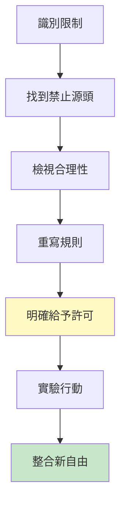
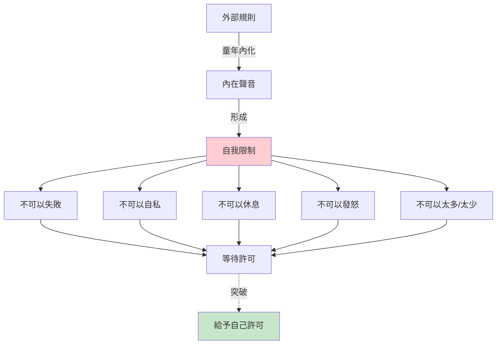
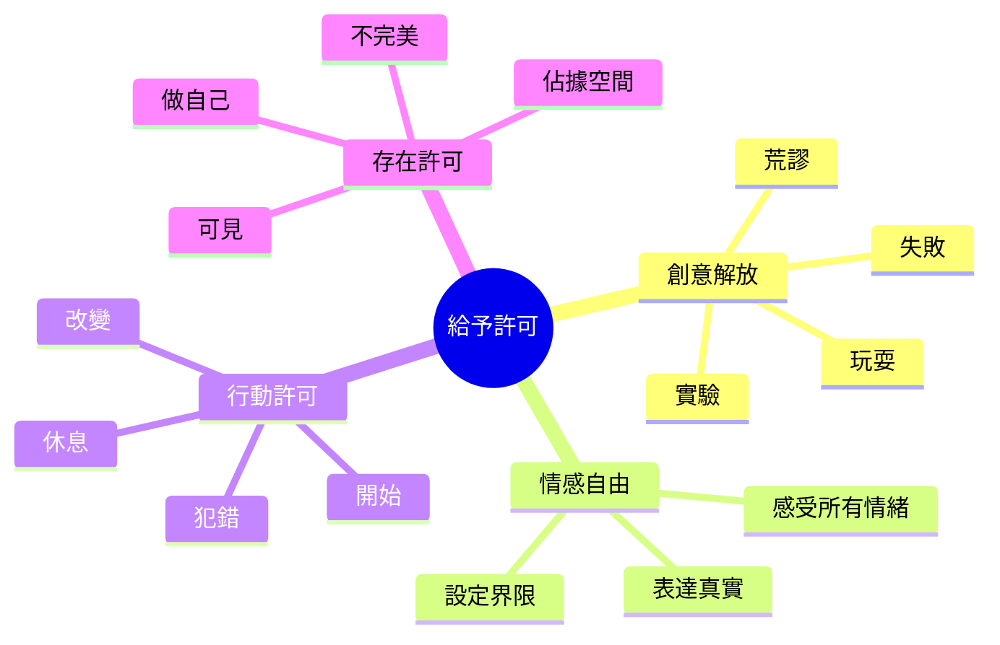
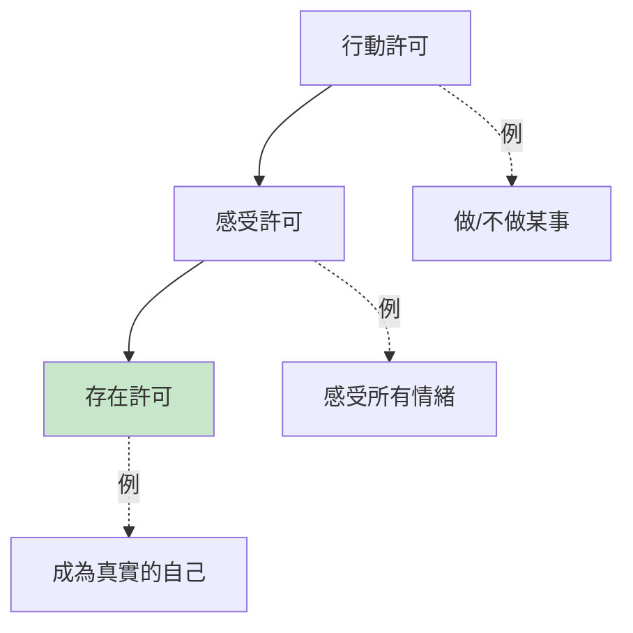
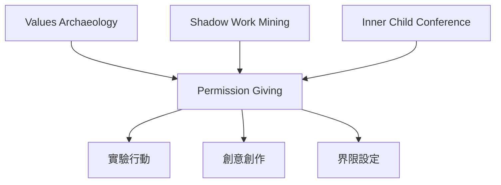

# Permission Giving

> 許可給予 - 釋放自我限制，允許真實表達

## 基本資訊

| 屬性 | 值 |
|------|-----|
| 類別 | Introspective Delight |
| 能量等級 | 中 |
| 建議時長 | 20-30 分鐘 |
| 參與人數 | 1 人（個人練習）或 2 人（夥伴） |
| 難度 | 中-低 |

## 技術概述

**Permission Giving**（許可給予）是一種自我解放技術，透過明確、有意識地給予自己許可，突破內在限制、「應該」和恐懼。這項技術認識到我們常常在等待外部許可去做、感受或成為某些東西，而實際上我們可以給自己這個許可。



## 歷史背景

許可給予概念來自多個傳統：
- **溝通分析（TA）**：艾瑞克·伯恩（Eric Berne）的「父母訊息」與「許可」概念
- **人本心理學**：卡爾·羅傑斯的無條件正向關注
- **女性主義療法**：挑戰父權內化的「不可以」
- **創意解放運動**：茱莉亞·卡麥隆（Julia Cameron）的藝術家之路

這項技術特別針對創意工作者、完美主義者和過度自我審查的人。

## 核心原理

### 內在限制的結構



### 為什麼我們需要許可？

| 來源 | 限制訊息 | 影響 |
|------|----------|------|
| 童年訊息 | 「不要自私」「要完美」 | 等待外部認可 |
| 社會期待 | 性別、年齡、角色規範 | 自我審查 |
| 創傷經驗 | 「不安全去...」 | 防衛性限制 |
| 完美主義 | 「不夠好」 | 拖延、不行動 |
| 內化批評 | 父母、老師、文化聲音 | 內在批評者 |

### 許可的力量



## 執行步驟

### 詳細步驟

#### 步驟 1：識別「不可以」（5-10分鐘）

列出你的內在禁令：
```
我不可以___：
- 失敗
- 讓人失望
- 休息（工作未完成時）
- 發怒
- 要求太多
- 比別人成功
- 不夠好就發表
- ...
```

**技巧**：完成這些句子
- 「我想___，但我不可以」
- 「如果我___，會發生可怕的事」
- 「我應該___，但我真正想要___」

#### 步驟 2：追溯源頭（5分鐘）

選擇一個最強烈的「不可以」，問：
- 誰第一次告訴我這個？
- 什麼事件讓我學會這個規則？
- 這個規則曾經保護我免於什麼？

**例子**：
```
不可以：「我不可以犯錯」
源頭：父親總是批評我的錯誤
保護：避免被羞辱、被認為愚蠢
```

#### 步驟 3：檢視現在的合理性（5分鐘）

問關鍵問題：
- 這個規則現在還有用嗎？
- 它保護我還是限制我？
- 如果違反，真正的後果是什麼？
- 我付出什麼代價來遵守這個規則？

**現實檢查**：
```
童年：犯錯 → 被羞辱 → 真實危險
現在：犯錯 → 學習 → 實際上更安全
```

#### 步驟 4：重寫規則（5分鐘）

將「不可以」轉化為「我允許自己」：

| 舊規則 | 新許可 |
|--------|--------|
| 我不可以失敗 | → 我允許自己實驗和學習 |
| 我不可以自私 | → 我允許自己照顧我的需求 |
| 我不可以休息 | → 我允許自己休息以恢復 |
| 我不可以發怒 | → 我允許自己感受和表達憤怒 |
| 我不可以不完美就發表 | → 我允許自己分享進行中的作品 |

#### 步驟 5：正式儀式（5-10分鐘）

**方法一：許可證書**
寫下並簽名：
```
┌─────────────────────────────────────┐
│          許可證書                    │
├─────────────────────────────────────┤
│ 我，[你的名字]，給予自己完全許可：    │
│                                     │
│ ☑ 犯錯並從中學習                    │
│ ☑ 在不完美時仍然分享                │
│ ☑ 感受所有情緒                      │
│ ☑ 說「不」而不內疚                  │
│ ☑ 休息而不羞愧                      │
│ ☑ [你的特定許可]                    │
│                                     │
│ 簽名：__________ 日期：__________   │
└─────────────────────────────────────┘
```

**方法二：宣言儀式**
站起來，大聲說（或對鏡子說）：
```
「我給予自己許可去___」
「我允許自己___」
「從今天起，我可以___」
```

**方法三：象徵行動**
- 寫下舊規則，燒掉或撕掉
- 做一個象徵「突破」的動作
- 創作象徵新自由的藝術品

#### 步驟 6：小步實驗（當天或隔天）

立即採取一個小行動實踐新許可：
```
新許可：「我允許自己不完美就發表」
小實驗：發表一篇短文/畫作，不過度修改
```

**原則**：從安全、小的步驟開始。

#### 步驟 7：處理抵抗（持續）

當內在批評者出現時：
- 承認：「我聽見你想保護我」
- 感謝：「謝謝你的關心」
- 重申：「但我現在有不同的選擇」
- 重讀許可：回到你的許可證書

## 引導提示

### 識別隱藏的「不可以」

| 提示問題 | 揭示領域 |
|----------|----------|
| 「我想做但從未做的是？」 | 被壓抑的渴望 |
| 「我羨慕別人可以___」 | 不允許自己的事 |
| 「我批評自己___」 | 內在禁令 |
| 「如果沒人會知道，我會___」 | 社會禁令 |
| 「我害怕被認為___」 | 核心恐懼 |

### 常見的內在禁令

#### 創意類
- 不可以浪費時間玩耍
- 不可以創作「沒用」的東西
- 不可以失敗/犯錯
- 不可以不完美就發表
- 不可以比（父母/導師）更成功

#### 情感類
- 不可以憤怒
- 不可以悲傷
- 不可以需要別人
- 不可以太快樂（別人會嫉妒）
- 不可以表達脆弱

#### 行動類
- 不可以休息
- 不可以說不
- 不可以佔據空間
- 不可以要求我需要的
- 不可以改變主意

#### 存在類
- 不可以做自己
- 不可以與眾不同
- 不可以太多/太少
- 不可以可見
- 不可以有需求

## 許可給予的層級

### 第一層：行動許可
「我允許自己做___」
- 最容易開始
- 具體可測試
- 例：「我允許自己每天寫20分鐘」

### 第二層：感受許可
「我允許自己感覺___」
- 接納情緒
- 不評判感受
- 例：「我允許自己對這個情況憤怒」

### 第三層：存在許可
「我允許自己是___」
- 最深層的自我接納
- 關於身份認同
- 例：「我允許自己是一個藝術家」「我允許自己不完美」



## 適用場景

### 創意阻塞
- 完美主義癱瘓
- 害怕批評不敢發表
- 感覺「不夠資格」
- 自我審查過度

### 關係困境
- 無法設定界限
- 過度取悅他人
- 害怕說真話
- 壓抑真實需求

### 生涯轉換
- 想改變但感覺「不可以」
- 被「應該」束縛
- 害怕追求夢想
- 等待外部認可

### 自我發展
- 想突破舒適區
- 消除限制性信念
- 增加自我慈悲
- 活得更真實

## 注意事項

### Do's（應該做）
- 從小、安全的許可開始
- 寫下並重讀你的許可
- 慶祝每次實踐許可的行動
- 對抵抗保持耐心
- 必要時尋求支持

### Don'ts（不應該做）
- 用許可合理化傷害他人
- 忽視真實的安全考量
- 期待內在批評者立即消失
- 一次挑戰太多限制
- 孤立地與強大的內在禁令作戰

### 許可 vs 放縱

| 真實許可 | 防衛性放縱 |
|----------|------------|
| 來自自我關愛 | 來自反叛或自我破壞 |
| 考慮真實後果 | 忽視後果 |
| 增加自由和成長 | 導致更多問題 |
| 對自己和他人負責 | 傷害自己或他人 |
| 例：允許自己休息 | 例：報復性拖延 |

## 深化練習

### 1. 每日許可練習
每天早上給自己一個當日許可：
```
今天，我允許自己___
```

### 2. 許可日記
記錄：
- 今天什麼時候我拒絕了自己？
- 如果我給自己許可，會怎樣？
- 我實際給了自己什麼許可？

### 3. 許可夥伴
與朋友互相：
- 分享想要的許可
- 見證對方的宣言
- 互相提醒許可

### 4. 許可創作
創作表達你的許可的作品：
- 詩：「我允許自己的詩」
- 畫：畫出突破限制的意象
- 舞：跳出新自由

### 5. 父母/權威對話
（高級）與內在的批評聲音對話：
```
你：「我想給自己許可去___」
內在批評：「不行，因為___」
你：「我理解你想保護我，但___」
```

### 6. 100個許可清單
列出100個你想給自己的許可，看模式浮現。

## 與其他技術的結合



### 強力組合：陰影+許可
1. 識別你的陰影（被壓抑的部分）
2. 給自己許可整合它
3. 小步實驗表達

## 範例演練

### 案例：藝術家的「不完美」恐懼

**背景**：有才華的畫家，從不發表作品，總覺得「還不夠好」。

**過程**：
```
第一步：識別
「我不可以發表不完美的作品」

第二步：源頭
童年：美術老師嚴厲批評「草率」的作品
學到：只有完美才值得被看見

第三步：現實檢查
問：現在發表「不完美」作品，真正的後果？
答：可能有人不喜歡...但也可能有人喜歡
　　我會學習和成長
　　我的作品會被看見而非藏在抽屜
問：遵守「完美」規則的代價？
答：10年沒發表任何作品
　　感覺自己不是「真正」的藝術家
　　創意枯竭（沒有反饋迴路）

第四步：重寫
舊：「我不可以不完美就發表」
新：「我允許自己分享進行中、不完美的作品」

第五步：許可證書
[寫下、簽名、貼在畫室牆上]

「我，[名字]，給予自己完全許可：
☑ 創作並發表不完美的作品
☑ 從反饋中學習而非躲避
☑ 展現過程而非只有成品
☑ 成為一個『持續創作』而非『等待完美』的藝術家

這個許可從今天開始，永久有效。」

第六步：小實驗
今天：發表一張素描到Instagram，標記「進行中」
本週：參加線上藝術社群，分享週練習
本月：投稿一件「80%滿意」的作品到展覽
```

**抵抗處理**：
當內在聲音說「這不夠好」時：
```
我：「謝謝你想保護我免於批評」
　　「但我現在選擇成長而非躲藏」
　　「我允許這個作品不完美存在」
```

**6個月後**：
- 發表了50+作品
- 收到正面反饋（也有建設性批評）
- 技巧進步（因為持續練習+反饋）
- 找到了自己的觀眾
- 重拾創作喜悅

## 集體許可

### 給予他人許可
當你給自己許可，你也給別人許可：
- 「你允許自己不完美，我也可以」
- 「你設定界限，我也可以」
- 這創造了許可的漣漪效應

### 許可圈
小組練習：
1. 圍成圓圈
2. 每人說：「我給自己許可___」
3. 其他人回應：「我見證你的許可」
4. 感受集體支持的力量

## 參考資源

- Julia Cameron - "The Artist's Way" (藝術家之路，許可創作)
- Brené Brown - "The Gifts of Imperfection" (不完美的禮物)
- Tara Brach - "Radical Acceptance" (根本接納)
- Eric Berne - "Games People Play" (溝通分析，父母訊息)
- [Permission Slips](https://brenebrown.com/articles/2019/02/12/permission-slips/) - Brené Brown
- Gay Hendricks - "The Big Leap" (上限問題與許可)
- Steven Pressfield - "The War of Art" (對抗阻力)

---

*返回 [Introspective Delight 類別](./index.md) | [技術總覽](../index.md)*
