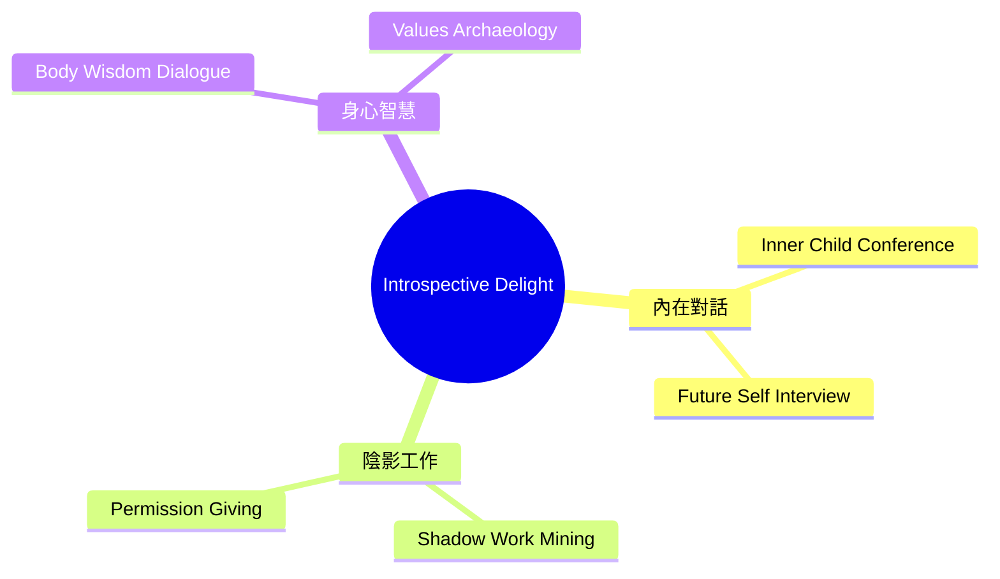
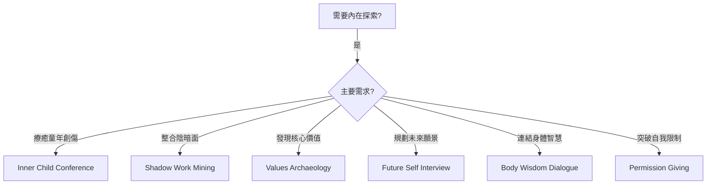
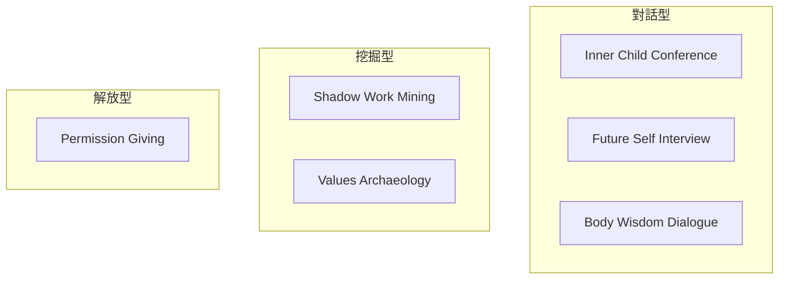

# Introspective Delight Brainstorming Techniques

> 內省喜悅類腦力激盪技術 - 內在探索、價值澄清、直覺智慧

## 類別概述

內省喜悅類技術專注於個人內在世界的探索，透過與內在自我對話、價值澄清和直覺挖掘，找到深層的洞察和創意。這些技術適合個人發展、生涯規劃、創意突破等需要深度自我了解的情境。

## 核心特性

| 特性 | 說明 |
|------|------|
| 個人化 | 專注於個人內在經驗 |
| 情感導向 | 重視感受和直覺 |
| 價值澄清 | 發現核心價值和信念 |
| 深度自省 | 探索潛意識和內在智慧 |

## 技術列表

| # | 技術名稱 | 核心概念 | 適用情境 |
|---|----------|----------|----------|
| 1 | [Inner Child Conference](./01-inner-child-conference.md) | 內在小孩會議 | 情感療癒、創意解放 |
| 2 | [Shadow Work Mining](./02-shadow-work-mining.md) | 陰影工作挖掘 | 整合陰暗面、突破限制 |
| 3 | [Values Archaeology](./03-values-archaeology.md) | 價值考古 | 核心價值發現 |
| 4 | [Future Self Interview](./04-future-self-interview.md) | 未來自我訪談 | 願景規劃、目標設定 |
| 5 | [Body Wisdom Dialogue](./05-body-wisdom-dialogue.md) | 身體智慧對話 | 身體直覺、體感智慧 |
| 6 | [Permission Giving](./06-permission-giving.md) | 許可給予 | 突破自我限制 |

## 技術選擇流程

## 能量等級

| 能量 | 技術 |
|------|------|
| 低 | Inner Child Conference, Shadow Work Mining, Future Self Interview |
| 低-中 | Values Archaeology, Body Wisdom Dialogue |
| 中 | Permission Giving |

## 思維模式對照

## 與其他類別的搭配

| Introspective Delight 技術 | 推薦搭配 | 搭配效果 |
|---------------------------|----------|----------|
| Inner Child Conference | Free Association | 內在+自由聯想 |
| Shadow Work Mining | Assumption Reversal | 陰影+假設挑戰 |
| Values Archaeology | First Principles | 價值+第一原理 |
| Future Self Interview | What If Scenarios | 未來+情境探索 |
| Body Wisdom Dialogue | Emergent Thinking | 身體+湧現思維 |
| Permission Giving | Constraint Mapping | 許可+限制突破 |

## 使用建議

### 適合對象
- 個人發展工作者
- 創意工作者尋求突破
- 生涯轉換期的探索者
- 心理治療輔助工具使用者

### 環境建議
- 安靜、私密的空間
- 舒適的座位或躺臥空間
- 柔和的燈光或自然光
- 可準備日記本或錄音設備

### 注意事項
- 這些技術可能觸及深層情緒
- 建議在安全、支持的環境中進行
- 如遇到強烈情緒反應，建議尋求專業協助
- 不應取代專業心理治療

---

## 設計模式與方法論對照

| 技術 | 相關模式/方法論 | 核心價值 |
|------|-----------------|----------|
| **Inner Child Conference** | Parts Work, IFS (Internal Family Systems) | 與內在聲音對話 |
| **Shadow Work Mining** | Jung Shadow Integration | 整合被壓抑的部分 |
| **Values Archaeology** | Values Clarification, ACT | 發現核心價值 |
| **Future Self Interview** | Temporal Self Theory | 從未來視角看現在 |
| **Body Wisdom Dialogue** | Embodied Cognition, Somatic | 身體是智慧的載體 |
| **Permission Giving** | Limiting Beliefs Work | 打破自我設限 |

**核心洞察**：內省類技術的前提是：你內心已經知道答案，只是需要正確的方式來提取它。這些技術不是要給你新的資訊，而是幫你聆聽你一直忽略的聲音——無論是內在小孩的恐懼、身體的直覺、還是未來自己的智慧。最深刻的創意往往來自最深刻的自我了解。

---

*返回 [技術總覽](../index.md)*
