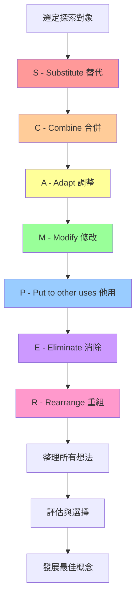

# SCAMPER七鏡頭系統創意技術

## 基本資訊

| 項目 | 內容 |
|------|------|
| **技術名稱** | SCAMPER Method（SCAMPER七鏡頭系統） |
| **創始人** | Bob Eberle（基於Alex Osborn的創意檢查清單） |
| **年代** | 1971年 |
| **類型** | 結構化創意技術 |
| **難度** | ⭐⭐ 中等 |
| **人數** | 1-20人（個人或團隊均可） |
| **時間** | 45-90分鐘 |
| **適用階段** | 概念發展、產品改進、流程優化 |
| **核心價值** | 系統性探索改進可能性 |

## 技術概述

SCAMPER是一個強大的創意檢查清單，通過七個不同的鏡頭（S-C-A-M-P-E-R）系統性地檢視產品、服務或流程，激發改進和創新的想法。這個技術將創意過程結構化，確保不遺漏任何創新可能性。

### SCAMPER縮寫含義

- **S**ubstitute - 替代：用什麼可以替換？
- **C**ombine - 合併：可以結合什麼？
- **A**dapt - 調整：可以調整什麼以適應新用途？
- **M**odify/Magnify/Minify - 修改/放大/縮小：可以改變什麼？
- **P**ut to other uses - 用作他途：還能用在哪裡？
- **E**liminate - 消除：可以移除什麼？
- **R**earrange/Reverse - 重組/反轉：可以重新排列或顛倒什麼？

## 核心流程圖

## 核心原理

### 理論基礎

1. **系統性思考**
   - 創意不是隨機的，而是可以系統性引導的
   - 通過結構化問題激發不同角度的思考

2. **強制連結**
   - 迫使大腦建立新的神經連結
   - 突破既有思考模式的限制

3. **完整性保證**
   - 七個鏡頭涵蓋大部分創新可能性
   - 降低遺漏重要創新方向的風險

4. **認知框架**
   - 提供思考的腳手架
   - 降低創意過程的認知負荷

### 為什麼有效？

- **降低創意門檻**：不需要「天生的創意」，只需回答問題
- **激發多樣性**：七個鏡頭確保探索多個方向
- **易於執行**：清晰的結構適合團隊協作
- **可重複使用**：同一對象可以多次應用，深入挖掘

## 執行步驟

### 準備階段（10分鐘）

1. **明確探索對象**
   - 可以是產品、服務、流程、體驗等
   - 清楚描述當前狀態
   - 準備相關背景資料

2. **設定目標**
   - 想要達成什麼改進？
   - 有什麼限制條件？
   - 成功的標準是什麼？

3. **準備工具**
   - 白板或大型便利貼牆
   - 七個區域標示S-C-A-M-P-E-R
   - 便利貼和筆

### 執行階段（60-75分鐘）

#### 第一輪：快速探索（35分鐘，每個鏡頭5分鐘）

**S - Substitute 替代**（5分鐘）
- 用引導問題激發想法
- 快速記錄所有可能性
- 不評判、不過濾

**C - Combine 合併**（5分鐘）
- 探索結合的可能性
- 考慮不同層面的合併
- 尋找協同效應

**A - Adapt 調整**（5分鐘）
- 尋找可借鑒的對象
- 思考如何調整適配
- 探索類比和比喻

**M - Modify 修改**（5分鐘）
- 考慮改變的可能性
- 探索放大和縮小
- 想像極端情況

**P - Put to other uses 他用**（5分鐘）
- 想像新的應用場景
- 探索意外的用途
- 思考轉化的可能

**E - Eliminate 消除**（5分鐘）
- 辨識可移除的元素
- 探索簡化的機會
- 思考「沒有會怎樣」

**R - Rearrange 重組**（5分鐘）
- 考慮重新排列
- 探索反轉的可能
- 想像不同的順序

#### 第二輪：深入發展（20分鐘）

1. **快速檢視**（5分鐘）
   - 瀏覽所有產生的想法
   - 辨識特別有趣的方向
   - 標記需要深入的想法

2. **組合探索**（15分鐘）
   - 結合不同鏡頭的想法
   - 發展混合概念
   - 創造新的可能性

### 收斂階段（15分鐘）

1. **分類整理**（5分鐘）
   - 將相似想法分組
   - 識別主題和模式
   - 移除重複項目

2. **評估篩選**（5分鐘）
   - 使用評估標準
   - 選出最有潛力的想法
   - 考慮可行性和影響力

3. **下一步規劃**（5分鐘）
   - 決定深入發展的方向
   - 分配後續行動
   - 設定時間表

## 引導提示/問題模板

### S - Substitute 替代

**材料/成分**
- 可以用什麼材料替代？
- 哪些成分可以改變？
- 能用更便宜/更好的替代品嗎？

**人員/角色**
- 可以由誰來執行？
- 能改變使用者是誰嗎？
- 可以換個角色定位嗎？

**地點/時間**
- 可以在哪裡進行？
- 什麼時候做會更好？
- 能改變順序嗎？

**流程/方法**
- 可以用什麼方法取代？
- 能改變作業方式嗎？
- 有其他途徑達成目標嗎？

### C - Combine 合併

**功能結合**
- 可以整合哪些功能？
- 能結合不同產品嗎？
- 可以共用什麼元素？

**概念混合**
- 可以融合什麼想法？
- 能結合不同的方法嗎？
- 可以整合不同的觀點嗎？

**協作整合**
- 可以與誰合作？
- 能結合哪些資源？
- 可以共創什麼價值？

### A - Adapt 調整

**類比借鑒**
- 其他產業怎麼做？
- 自然界有什麼啟發？
- 歷史上有類似案例嗎？

**情境調整**
- 如何適應不同環境？
- 能為不同用戶調整嗎？
- 可以因應不同需求改變嗎？

**靈感轉化**
- 可以模仿什麼？
- 能借用什麼概念？
- 可以轉化什麼想法？

### M - Modify/Magnify/Minify 修改

**改變形態**
- 可以改變形狀嗎？
- 能調整顏色嗎？
- 可以改變質地嗎？

**放大強化**
- 可以加大嗎？
- 能增加什麼？
- 可以誇大什麼特點？
- 能延長時間嗎？

**縮小簡化**
- 可以縮小嗎？
- 能減少什麼？
- 可以濃縮嗎？
- 能縮短流程嗎？

**改變屬性**
- 可以改變意義嗎？
- 能調整價值嗎？
- 可以改變感知嗎？

### P - Put to other uses 用作他途

**新用途**
- 還能用來做什麼？
- 能服務其他市場嗎？
- 可以解決其他問題嗎？

**再利用**
- 廢棄物能再利用嗎？
- 副產品有價值嗎？
- 能循環使用嗎？

**新市場**
- 誰還會需要這個？
- 能開拓新領域嗎？
- 可以跨界應用嗎？

### E - Eliminate 消除

**移除元素**
- 可以拿掉什麼？
- 哪些是不必要的？
- 能簡化什麼？

**減法思考**
- 沒有會怎樣？
- 能做得更簡單嗎？
- 可以省略什麼步驟？

**精簡優化**
- 核心是什麼？
- 能回歸本質嗎？
- 可以做減法嗎？

### R - Rearrange/Reverse 重組/反轉

**重新排列**
- 可以改變順序嗎？
- 能調整配置嗎？
- 可以重新組織嗎？

**反轉顛倒**
- 顛倒過來會怎樣？
- 能反向操作嗎？
- 可以調換角色嗎？

**改變邏輯**
- 可以用相反的方式嗎？
- 能逆向思考嗎？
- 可以改變因果關係嗎？

## 實際案例

### 案例1：改進咖啡杯

**探索對象**：傳統紙杯咖啡

**S - Substitute 替代**
- 用可食用材料替代紙杯（餅乾杯）
- 用可摺疊矽膠杯替代一次性杯
- 用押金制玻璃杯替代

**C - Combine 合併**
- 結合杯子和攪拌棒
- 整合溫度顯示功能
- 合併杯子和零食容器

**A - Adapt 調整**
- 借鑒紅酒杯的優雅設計
- 學習保溫瓶的保溫技術
- 模仿嬰兒奶瓶的防漏設計

**M - Modify 修改**
- 放大：超大份量版本
- 縮小：濃縮咖啡專用小杯
- 改變形狀：方形更易堆疊

**P - Put to other uses 他用**
- 喝完後變成種植盆（內含種子）
- 可以當作臨時手機架
- 回收後製作筆筒

**E - Eliminate 消除**
- 去除杯蓋（開放式設計）
- 移除杯套（雙層設計）
- 消除品牌標示（極簡主義）

**R - Rearrange 重組**
- 杯口在底部（反轉設計）
- 可拆解組合的模組化設計
- 內外層可互換

**結果**：發展出多個創新概念，最後選擇「可食用餅乾杯」和「可摺疊矽膠杯」進行原型開發。

### 案例2：優化線上會議體驗

**探索對象**：視訊會議軟體

**重點想法**：
- **Substitute**：用AI虛擬替身代替真人出席
- **Combine**：整合會議與任務管理
- **Adapt**：借鑒遊戲的互動機制
- **Modify**：縮小視窗，放大協作空間
- **Put to other uses**：會議錄影轉為培訓教材
- **Eliminate**：移除視訊，純音訊+協作
- **Rearrange**：反轉主持與參與者角色

**結果**：設計出更互動、更專注於協作的會議新模式。

## 適用場景

### 最適合的情境

1. **產品創新**
   - 改進現有產品
   - 開發新產品概念
   - 尋找產品差異化

2. **流程優化**
   - 改善工作流程
   - 提升服務體驗
   - 優化作業程序

3. **問題解決**
   - 尋找多種解決方案
   - 突破既有限制
   - 創新思考方式

4. **策略規劃**
   - 探索商業模式
   - 開拓新市場
   - 重新定位品牌

### 不太適合的情境

- 完全沒有參考對象的全新創造
- 需要極度原創的藝術創作
- 高度抽象的哲學思考
- 純粹的情感表達需求

## 注意事項

### 執行要點

1. **每個鏡頭都要充分探索**
   - 不要跳過任何一個鏡頭
   - 給每個鏡頭足夠時間
   - 即使覺得某個鏡頭不適用，也要嘗試

2. **先發散再收斂**
   - 探索階段不要評判
   - 鼓勵瘋狂的想法
   - 數量優於質量

3. **結合多個鏡頭**
   - 最好的想法常來自組合
   - 鼓勵跨鏡頭連結
   - 建立想法之間的關係

4. **保持開放心態**
   - 不要過早否定想法
   - 挑戰假設和限制
   - 允許意外的方向

### 常見陷阱

1. **過早收斂**
   - 問題：太快評判想法的可行性
   - 解決：嚴格區分發散和收斂階段

2. **鏡頭偏好**
   - 問題：只專注某些鏡頭
   - 解決：設定每個鏡頭的最低想法數量

3. **表面思考**
   - 問題：只停留在顯而易見的答案
   - 解決：每個鏡頭追問「還有嗎？」

4. **忽略組合**
   - 問題：只看單一鏡頭的結果
   - 解決：專門設計組合探索時間

5. **缺乏記錄**
   - 問題：想法流失
   - 解決：指定專人記錄，使用視覺化工具

## 變體與延伸

### SCAMPER+

在原有七個鏡頭基礎上增加：

- **D**uplicate - 複製：可以複製什麼？
- **I**nvert - 反轉：可以反轉什麼？
- **T**ransform - 轉化：可以轉化成什麼？

### 數位SCAMPER

使用數位工具增強執行：
- Miro/Mural模板
- 線上協作白板
- AI輔助問題生成
- 自動化想法分類

### SCAMPER快速版

時間壓縮版本（30分鐘）：
- 每個鏡頭3分鐘
- 重點只探索3-5個鏡頭
- 快速收斂和決策

### SCAMPER馬拉松

深度探索版本（半天）：
- 每個鏡頭30分鐘
- 多輪迭代
- 深入原型製作

## 參考資源

### 核心書籍

1. **"Scamper: Creative Games and Activities for Imagination Development"**
   - 作者：Bob Eberle
   - 出版：1997
   - 內容：SCAMPER技術的官方指南

2. **"Thinkertoys: A Handbook of Creative-Thinking Techniques"**
   - 作者：Michael Michalko
   - 出版：2006
   - 內容：包含SCAMPER在內的多種創意技術

3. **"Creative Thinkering: Putting Your Imagination to Work"**
   - 作者：Michael Michalko
   - 出版：2011
   - 內容：SCAMPER的進階應用

### 線上資源

- **Mind Tools**：SCAMPER詳細指南和模板
- **Innovation Games**：線上SCAMPER工作坊
- **Miro Templates**：SCAMPER協作模板
- **Design Thinking Tools**：SCAMPER與設計思考整合

### 學術研究

- Eberle, B. (1996). "SCAMPER: Games for Imagination Development"
- Michalko, M. (2006). "Thinkpak: A Brainstorming Card Deck"
- 多項關於SCAMPER在教育和創新中應用的研究

### 工具與模板

- **SCAMPER工作表**：問題清單檢查表
- **SCAMPER海報**：視覺化提示工具
- **SCAMPER卡片**：隨機抽取激發思考
- **數位模板**：Miro、Mural、Figma

## 實施檢查清單

### 會前準備
- [ ] 明確定義探索對象
- [ ] 準備背景資料和當前狀態描述
- [ ] 設定創新目標和成功標準
- [ ] 準備SCAMPER問題清單
- [ ] 佈置七個區域的工作空間
- [ ] 準備記錄工具（便利貼、白板等）

### 會議執行
- [ ] 說明SCAMPER方法和規則
- [ ] 依序執行七個鏡頭
- [ ] 每個鏡頭產生至少5個想法
- [ ] 記錄所有想法，不評判
- [ ] 鼓勵跨鏡頭連結
- [ ] 定時提醒和引導

### 會後跟進
- [ ] 整理和分類所有想法
- [ ] 評估想法的可行性和影響力
- [ ] 選擇發展方向
- [ ] 分配後續行動
- [ ] 設定原型製作計畫
- [ ] 安排追蹤會議

---

**技術難度**：⭐⭐ 中等
**建議場景**：產品創新、流程優化、問題解決
**最佳團隊**：5-10人
**推薦頻率**：每月1-2次

**相關技術**：
- [六頂思考帽](./02-six-thinking-hats.md) - 互補的系統性思考方法
- [心智圖技術](./03-mind-mapping.md) - 可視覺化SCAMPER結果
- [解決方案矩陣](./06-solution-matrix.md) - 評估SCAMPER產生的想法

**標籤**：#結構化 #創意檢查清單 #產品創新 #系統性思考
