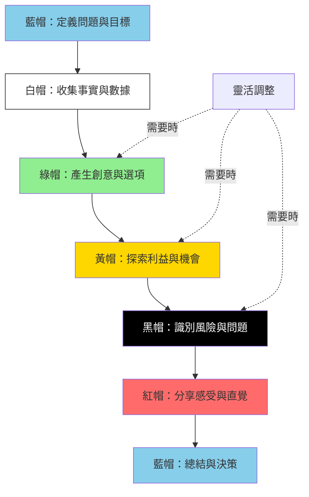

# 六頂思考帽技術 (Six Thinking Hats)

## 基本資訊

| 項目 | 內容 |
|------|------|
| **技術名稱** | Six Thinking Hats（六頂思考帽） |
| **創始人** | Edward de Bono |
| **年代** | 1985年 |
| **類型** | 結構化思考、平行思考 |
| **難度** | ⭐⭐ 中等 |
| **人數** | 3-30人（小組或大型團隊） |
| **時間** | 60-120分鐘 |
| **適用階段** | 決策制定、問題分析、計畫評估 |
| **核心價值** | 全面性思考、減少衝突 |

## 技術概述

六頂思考帽是Edward de Bono博士開發的平行思考工具，通過讓所有人同時戴上同一頂「思考帽」，以相同的思考模式探索問題。這個方法將思考過程分為六個不同的方向，每個方向用一種顏色的帽子代表，幫助團隊避免混亂的討論，實現更高效、更全面的思考。

### 六頂帽子

1. **白帽（White Hat）** - 事實與數據
2. **紅帽（Red Hat）** - 情感與直覺
3. **黑帽（Black Hat）** - 謹慎與風險
4. **黃帽（Yellow Hat）** - 樂觀與利益
5. **綠帽（Green Hat）** - 創意與可能
6. **藍帽（Blue Hat）** - 控制與組織

### 核心概念

**平行思考**：所有人同時使用相同的思考模式，避免對抗性辯論，提升協作效率。

**角色扮演**：暫時放下個人立場，以特定角色思考，減少自我防衛和衝突。

**系統性覆蓋**：六個方向確保問題得到全面探索，不遺漏重要面向。

## 核心流程圖

## 六頂帽子詳解

### 白帽（White Hat）- 事實與數據

**象徵**：中立、客觀、數據導向

**思考焦點**：
- 我們知道什麼？
- 我們需要知道什麼？
- 我們如何獲得資訊？

**關鍵問題**：
- 現有哪些事實和數據？
- 數據的來源和可靠性如何？
- 缺少什麼資訊？
- 有什麼客觀證據？
- 數字告訴我們什麼？

**注意事項**：
- 只陳述事實，不做詮釋
- 區分「已證實的事實」和「相信的事實」
- 避免混入意見和判斷
- 承認資訊的不完整性

**典型產出**：
- 市場數據和統計資料
- 技術規格和性能數據
- 歷史記錄和趨勢
- 資源盤點清單

### 紅帽（Red Hat）- 情感與直覺

**象徵**：情緒、感覺、直覺

**思考焦點**：
- 我的直覺是什麼？
- 我對此有何感受？
- 情緒反應如何？

**關鍵問題**：
- 此刻的感覺是什麼？
- 直覺告訴你什麼？
- 有什麼擔憂或興奮？
- 情緒上的第一反應？
- 潛意識的警訊？

**注意事項**：
- 不需要解釋感受
- 允許情緒表達，無需合理化
- 時間限制（通常1-2分鐘）
- 誠實表達，不批判他人感受

**典型產出**：
- 團隊成員的直覺判斷
- 情緒上的顧慮
- 興奮和熱情的領域
- 不安和警訊

### 黑帽（Black Hat）- 謹慎與風險

**象徵**：謹慎、批判、風險識別

**思考焦點**：
- 有什麼風險？
- 可能出什麼問題？
- 為什麼可能不可行？

**關鍵問題**：
- 潛在風險有哪些？
- 可能的問題是什麼？
- 弱點在哪裡？
- 為什麼可能失敗？
- 有什麼限制？
- 違反什麼原則或規定？

**注意事項**：
- 這是合理的批判，不是悲觀
- 必須有邏輯依據
- 避免過度使用（會扼殺創意）
- 建設性地指出問題

**典型產出**：
- 風險清單
- 潛在障礙
- 合規性問題
- 資源限制
- 技術挑戰

### 黃帽（Yellow Hat）- 樂觀與利益

**象徵**：樂觀、利益、價值

**思考焦點**：
- 有什麼好處？
- 為什麼會成功？
- 價值在哪裡？

**關鍵問題**：
- 潛在利益是什麼？
- 為什麼這是個好主意？
- 有什麼優勢？
- 可能的最佳結果？
- 長期價值何在？
- 機會在哪裡？

**注意事項**：
- 必須有邏輯依據（不是盲目樂觀）
- 探索實際可行的好處
- 積極但理性
- 尋找隱藏價值

**典型產出**：
- 利益清單
- 成功因素
- 價值主張
- 機會識別
- 正面影響

### 綠帽（Green Hat）- 創意與可能

**象徵**：創造力、新想法、可能性

**思考焦點**：
- 還有什麼可能？
- 可以如何創新？
- 替代方案是什麼？

**關鍵問題**：
- 有什麼新想法？
- 可以如何改進？
- 替代方法有哪些？
- 如果...會怎樣？
- 可以組合什麼？
- 創新的可能性？

**注意事項**：
- 鼓勵大膽想法
- 暫停批判
- 探索多種可能性
- 使用創意技巧

**典型產出**：
- 新概念和想法
- 替代方案
- 創新解決方案
- 改進建議
- 可能性探索

### 藍帽（Blue Hat）- 控制與組織

**象徵**：控制、組織、流程管理

**思考焦點**：
- 思考流程如何？
- 下一步是什麼？
- 需要什麼思考？

**關鍵問題**：
- 議程是什麼？
- 需要哪些帽子？
- 順序如何安排？
- 已經覆蓋什麼？
- 下一步思考方向？
- 如何總結和決策？

**注意事項**：
- 通常由引導者或會議主持人戴
- 開始和結束必須使用
- 監控思考流程
- 決定何時切換帽子

**典型產出**：
- 會議議程
- 思考流程規劃
- 階段總結
- 行動計畫
- 決策記錄

## 執行步驟

### 準備階段（10分鐘）

1. **明確問題或主題**
   - 清楚陳述要探討的議題
   - 設定目標和期望產出
   - 準備相關背景資料

2. **介紹方法**
   - 解釋六頂帽子的含義
   - 說明平行思考的原則
   - 強調規則和注意事項

3. **規劃帽子順序**
   - 根據議題設計順序
   - 分配每頂帽子的時間
   - 準備引導問題

### 典型執行流程（90分鐘）

#### 第一階段：框架與事實（20分鐘）

**藍帽開場**（5分鐘）
- 說明議題和目標
- 介紹帽子使用順序
- 設定規則和時間框架

**白帽：事實收集**（15分鐘）
- 收集已知事實和數據
- 識別資訊缺口
- 釐清客觀現狀

#### 第二階段：發散探索（30分鐘）

**綠帽：創意發想**（15分鐘）
- 產生新想法和可能性
- 探索替代方案
- 鼓勵創新思維

**黃帽：利益探索**（15分鐘）
- 識別每個選項的好處
- 探索成功因素
- 發現機會和價值

#### 第三階段：批判評估（30分鐘）

**黑帽：風險分析**（15分鐘）
- 識別潛在問題
- 評估風險和障礙
- 檢視限制條件

**紅帽：直覺檢視**（5分鐘）
- 快速分享感受
- 表達直覺判斷
- 情緒反應檢查

**白帽：補充資訊**（10分鐘，如需要）
- 針對新發現的需求收集額外資訊
- 驗證假設
- 填補知識缺口

#### 第四階段：總結決策（10分鐘）

**藍帽：總結與決策**
- 整合所有觀點
- 做出決策或建議
- 規劃下一步行動

### 靈活調整

可根據需要：
- 重複某些帽子
- 調整順序
- 增減時間
- 分階段執行

## 引導提示/問題模板

### 標準引導語

**開場（藍帽）**
> "今天我們要討論【議題】。我們將使用六頂思考帽方法，依序戴上不同的帽子來思考。記住，當我們戴上某頂帽子時，每個人都要用那頂帽子的思考方式。現在讓我們開始..."

**白帽時刻**
> "現在我們戴上白帽。讓我們專注於事實和數據。我們知道什麼？有什麼客觀資訊？需要什麼額外數據？"

**紅帽時刻**
> "現在戴上紅帽。我想知道每個人的直覺和感受。不需要解釋，只需誠實分享。你對此的感覺如何？"

**黑帽時刻**
> "讓我們戴上黑帽，謹慎地思考。可能的風險是什麼？哪裡可能出問題？有什麼我們需要注意的隱憂？"

**黃帽時刻**
> "戴上黃帽，讓我們保持樂觀。這個想法的好處是什麼？為什麼它可能成功？有什麼機會？"

**綠帽時刻**
> "現在是綠帽時間。讓創意自由流動。還有什麼可能性？我們可以如何創新？有什麼替代方案？"

**結束（藍帽）**
> "讓我總結一下我們的討論。我們發現了【白帽】、探索了【綠帽】、看到機會【黃帽】、也識別了風險【黑帽】。考慮所有這些，我們的決定是..."

## 實際案例

### 案例1：新產品上市決策

**背景**：科技公司考慮是否提前三個月推出新產品

**白帽（事實）**：
- 產品測試完成度：85%
- 競爭對手預計6個月後推出類似產品
- 當前市場份額：15%
- 預算剩餘：充足

**綠帽（創意）**：
- Beta版先行計畫
- 分階段推出策略
- 獨家預購方案
- 與影響者合作搶先曝光

**黃帽（利益）**：
- 搶佔市場先機
- 建立創新者形象
- 提早回收投資
- 獲得真實用戶反饋

**黑帽（風險）**：
- 產品可能有未發現的bug
- 客服團隊準備不足
- 供應鏈可能跟不上
- 品牌聲譽風險

**紅帽（直覺）**：
- CEO：興奮但略有焦慮
- CTO：擔心技術穩定性
- CMO：充滿信心
- CFO：謹慎樂觀

**藍帽（決策）**：
決定採用分階段推出策略：
1. 先推出Beta版給忠實用戶
2. 收集反饋並修正
3. 兩個月後正式上市

### 案例2：團隊遠端工作政策

**背景**：公司考慮永久採用混合工作模式

**流程重點**：

**白帽**：疫情期間遠端效率數據、員工意願調查、辦公室成本分析

**綠帽**：靈活工時制度、衛星辦公室、數位協作工具升級

**黃帽**：員工滿意度提升、成本節省、人才招募範圍擴大

**黑帽**：團隊凝聚力下降、溝通效率問題、資安風險

**紅帽**：管理層擔憂監督問題、員工期待彈性、HR顧慮文化維護

**結果**：制定混合工作政策 - 每週至少兩天進辦公室，提供協作日，投資數位工具。

## 適用場景

### 最適合的情境

1. **決策制定**
   - 策略選擇
   - 投資決定
   - 政策制定
   - 優先順序排定

2. **問題解決**
   - 複雜問題分析
   - 衝突解決
   - 危機應對
   - 根因分析

3. **計畫評估**
   - 專案審查
   - 提案評估
   - 風險評估
   - 可行性研究

4. **團隊協作**
   - 減少會議衝突
   - 提升討論品質
   - 促進全面思考
   - 平衡不同觀點

### 不太適合的情境

- 需要快速決策的緊急情況
- 純粹的創意發想（綠帽單獨使用更好）
- 個人反思和內省
- 高度技術性的專業討論

## 注意事項

### 執行要點

1. **嚴格遵守帽子規則**
   - 同一時間所有人戴同一頂帽子
   - 不混用不同帽子的思考
   - 引導者要堅持紀律

2. **時間管理**
   - 為每頂帽子設定時限
   - 避免某些帽子占用過多時間
   - 黑帽特別容易超時，需要控制

3. **保持中立**
   - 不帶個人偏見
   - 真誠扮演每頂帽子的角色
   - 即使與個人觀點不同

4. **完整覆蓋**
   - 不要跳過任何帽子
   - 即使某些帽子看似不必要
   - 每頂帽子都有其價值

5. **藍帽掌控**
   - 清楚引導每個階段
   - 適時總結和轉換
   - 保持流程順暢

### 常見陷阱

1. **帽子混淆**
   - 問題：在白帽時表達意見
   - 解決：引導者及時提醒和糾正

2. **黑帽過度**
   - 問題：批判性思考佔據太多時間
   - 解決：嚴格限時，強調平衡

3. **紅帽理性化**
   - 問題：試圖解釋情緒反應
   - 解決：強調直覺，不需要合理化

4. **個人立場固守**
   - 問題：無法真誠扮演不同角色
   - 解決：強調這是思考工具，不是個人觀點

5. **順序僵化**
   - 問題：不根據情況調整
   - 解決：藍帽靈活決定需要的帽子

## 變體與延伸

### 簡化版（四帽）

針對簡單議題，只使用：
- 白帽（事實）
- 黑帽（風險）
- 黃帽（利益）
- 藍帽（控制）

### 數位版本

- 線上協作工具（Miro、Mural）
- 虛擬帽子切換
- 異步思考（分時段戴不同帽子）
- AI輔助引導

### 個人思考版

- 用於個人決策
- 書寫形式記錄
- 自我對話
- 日記式探索

### 快速版（30分鐘）

- 每頂帽子3-5分鐘
- 精簡版問題
- 快速決策導向

## 參考資源

### 核心書籍

1. **"Six Thinking Hats"**
   - 作者：Edward de Bono
   - 出版：1985（多次修訂）
   - 內容：六頂思考帽的官方權威著作

2. **"Serious Creativity"**
   - 作者：Edward de Bono
   - 出版：1992
   - 內容：擴展創意思考，包含六帽應用

3. **"Parallel Thinking"**
   - 作者：Edward de Bono
   - 出版：1994
   - 內容：平行思考的深入探討

### 線上資源

- **De Bono Thinking Systems**：官方網站和認證課程
- **Mind Tools**：六頂思考帽詳細指南
- **Harvard Business Review**：商業應用案例
- **MindTools**：免費模板和工作表

### 認證與培訓

- Edward de Bono認證講師課程
- 企業內訓課程
- 線上學習平台課程（Coursera、LinkedIn Learning）

### 工具與模板

- 六頂帽子會議模板
- 數位協作模板（Miro、Mural）
- 引導者指南
- 計時工具和提示卡

## 與其他技術的整合

### 與SCAMPER結合
- 綠帽階段使用SCAMPER激發創意
- 系統性探索改進方向

### 與心智圖結合
- 用心智圖記錄每頂帽子的想法
- 視覺化思考過程

### 與設計思考結合
- 同理心階段：紅帽+白帽
- 定義階段：藍帽
- 發想階段：綠帽
- 原型和測試：黃帽+黑帽

## 實施檢查清單

### 會前準備
- [ ] 明確定義討論議題
- [ ] 準備六頂帽子說明材料
- [ ] 規劃帽子使用順序
- [ ] 分配每頂帽子的時間
- [ ] 準備引導問題清單
- [ ] 設置記錄工具

### 會議執行
- [ ] 藍帽開場：說明目標和流程
- [ ] 白帽：收集事實和數據
- [ ] 依計畫順序執行各帽子
- [ ] 嚴格遵守時間限制
- [ ] 及時提醒和糾正帽子混淆
- [ ] 記錄所有重要觀點
- [ ] 藍帽總結：整合和決策

### 會後跟進
- [ ] 整理各帽子的主要發現
- [ ] 記錄決策和行動項目
- [ ] 分配責任和時間表
- [ ] 收集參與者反饋
- [ ] 評估方法效果
- [ ] 規劃後續會議

---

**技術難度**：⭐⭐ 中等
**建議場景**：決策制定、問題分析、計畫評估
**最佳團隊**：5-15人
**推薦頻率**：重大決策時使用

**相關技術**：
- [SCAMPER方法](./01-scamper-method.md) - 可在綠帽階段使用
- [決策樹映射](./05-decision-tree-mapping.md) - 決策分析補充
- [解決方案矩陣](./06-solution-matrix.md) - 評估各帽子產生的選項

**標籤**：#結構化 #平行思考 #決策制定 #團隊協作 #EdwardDeBono

---

## 設計模式與方法論對照

| 相關模式/方法論 | 連結點 | 應用價值 |
|----------------|--------|----------|
| **Parallel Thinking (平行思考)** | 核心概念 | de Bono發明的思考範式 |
| **Dialectical Thinking** | 正反合 | 但六帽是「同時看」而非「對抗」 |
| **PMI (Plus/Minus/Interesting)** | de Bono的另一工具 | 評估想法的簡化版 |
| **CoRT Thinking Program** | 教育應用 | de Bono在學校的思維訓練 |
| **Stakeholder Analysis** | 多視角整合 | 強制從不同立場思考 |

**核心洞察**：傳統會議的問題是——每個人同時戴著不同的帽子。A在分析事實，B在批評風險，C在提創意，D在表達情緒。結果是混亂的對話和無效的衝突。六頂思考帽的革命性在於「平行」——所有人同時戴同一頂帽子。當所有人同時批判時，沒有人需要防衛；當所有人同時創意時，沒有人害怕被批評。這不是壓制個性，而是把衝突從「人與人」轉移到「帽子與帽子」——你批評的是想法，不是我。
