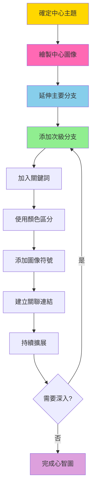

# 心智圖技術 (Mind Mapping)

## 基本資訊

| 項目 | 內容 |
|------|------|
| **技術名稱** | Mind Mapping（心智圖/思維導圖） |
| **創始人** | Tony Buzan |
| **年代** | 1970年代 |
| **類型** | 視覺化思考、結構化創意 |
| **難度** | ⭐ 簡單 |
| **人數** | 1-10人（個人或小組） |
| **時間** | 30-90分鐘 |
| **適用階段** | 創意發想、知識組織、計畫規劃 |
| **核心價值** | 視覺化思考、全腦思維 |

## 技術概述

心智圖是Tony Buzan在1970年代開發的視覺化思考工具，模仿大腦神經元的放射狀結構，以中心主題為核心，向外延伸分支來組織和擴展想法。這個技術結合了文字、圖像、顏色和結構，啟動左右腦協同工作，大幅提升創意產生和資訊記憶的效果。

### 核心特徵

- **放射狀結構**：從中心向外擴散
- **層級關係**：主分支、次分支、細節
- **視覺元素**：顏色、圖像、符號
- **關聯連結**：跨分支的關係線
- **關鍵詞導向**：精簡的詞彙而非長句

### 心智圖的科學基礎

**全腦思維**：
- 左腦：邏輯、結構、文字、順序
- 右腦：創意、視覺、顏色、空間

**放射狀思考**（Radiant Thinking）：
- 模仿神經元連結方式
- 一個想法自然引發多個想法
- 非線性、多維度的思考

**記憶增強**：
- 視覺圖像提升記憶
- 空間位置輔助回憶
- 關聯連結強化記憶

## 核心流程圖

## 核心原理

### 心智圖的法則

#### 1. 中心主題法則
- 使用強烈的中心圖像
- 至少使用三種顏色
- 圖像大小要顯著
- 要吸引注意力

#### 2. 分支法則
- 使用曲線而非直線（更自然）
- 主分支從中心放射出去
- 分支長度等於關鍵詞長度
- 連接要清晰明確

#### 3. 關鍵詞法則
- 每條線上一個關鍵詞
- 使用觸發性詞彙
- 名詞和動詞優先
- 精簡有力

#### 4. 圖像法則
- 盡可能使用圖像
- 圖像比文字更容易記憶
- 創意和個性化
- 簡單勝於複雜

#### 5. 顏色法則
- 至少使用三種顏色
- 用顏色區分主題
- 用顏色編碼資訊
- 創造視覺層次

#### 6. 層級法則
- 清楚的主次關係
- 從粗到細（主分支到細節）
- 邏輯性組織
- 視覺化層級

### 為什麼心智圖有效？

1. **符合大腦運作方式**
   - 非線性思考
   - 關聯性記憶
   - 視覺優先處理

2. **提升創意產生**
   - 每個分支都是新的起點
   - 鼓勵自由聯想
   - 降低自我審查

3. **增強記憶**
   - 視覺+空間+語言多重編碼
   - 獨特性增強記憶
   - 結構化便於提取

4. **提供全景視圖**
   - 一眼掌握全局
   - 看見關聯和模式
   - 發現缺口和機會

## 執行步驟

### 個人心智圖（30-60分鐘）

#### 準備工作（5分鐘）

1. **準備材料**
   - 白紙（橫向放置，A3或更大最佳）
   - 多色筆（至少3-5種顏色）
   - 空間要足夠

2. **準備心態**
   - 放鬆和開放
   - 不要自我審查
   - 允許混亂和意外

#### 創建流程（25-55分鐘）

**步驟1：中心主題**（5分鐘）
- 在紙張中心繪製代表主題的圖像
- 用至少3種顏色
- 讓圖像清楚且吸引人
- 可加上主題文字

**步驟2：主要分支**（10分鐘）
- 從中心向外延伸5-7個主分支
- 每個主分支用不同顏色
- 用曲線連接
- 在分支上寫關鍵詞（使用同色筆）

**步驟3：次級分支**（15分鐘）
- 從每個主分支延伸次分支
- 持續使用該分支的顏色
- 越遠離中心，分支越細
- 繼續添加關鍵詞

**步驟4：添加細節**（10分鐘）
- 加入第三、四層分支
- 添加小圖像和符號
- 用箭頭連結相關想法
- 圈出重要區域

**步驟5：美化和連結**（10分鐘）
- 加強重要連結
- 添加邊框和高光
- 標記優先順序
- 建立跨分支關聯

### 團隊心智圖（60-90分鐘）

#### 準備階段（10分鐘）
- 準備大型白板或海報紙
- 說明心智圖方法
- 分配角色（繪圖者、貢獻者）

#### 協作創建（50-70分鐘）

**方式A：輪流添加**
- 每人輪流添加一個分支或想法
- 其他人可以建議和討論
- 保持流動性

**方式B：分區負責**
- 每人負責一個主分支
- 個別發展後整合
- 最後建立跨分支連結

**方式C：同時貢獻**
- 使用便利貼先收集想法
- 共同組織成心智圖結構
- 討論和調整

#### 整合總結（10分鐘）
- 檢視完整心智圖
- 識別模式和洞察
- 標記行動項目

## 引導提示/問題模板

### 創建中心主題

**問題引導**：
- 這個主題讓你聯想到什麼圖像？
- 如果用一個符號代表，會是什麼？
- 什麼顏色最能代表這個主題？
- 這個主題的感覺是什麼？

### 發展主分支

**主要類別問題**：
- 這個主題有哪些主要面向？
- 可以分成哪些大類？
- 重要的構成元素是什麼？
- 需要考慮哪些角度？

**常用主分支框架**：

**5W1H框架**：
- Who（誰）
- What（什麼）
- When（何時）
- Where（哪裡）
- Why（為什麼）
- How（如何）

**商業策略框架**：
- 市場
- 產品
- 客戶
- 競爭
- 資源
- 風險

**專案規劃框架**：
- 目標
- 範圍
- 資源
- 時程
- 風險
- 關鍵人員

### 擴展次級分支

**深入問題**：
- 關於【主分支】，還有什麼細節？
- 這讓你想到什麼？
- 可以如何分解？
- 有什麼例子？
- 下一層是什麼？

### 建立關聯

**連結問題**：
- 這個想法與其他哪個想法相關？
- 有什麼共同點？
- 會互相影響嗎？
- 可以組合嗎？
- 有因果關係嗎？

## 實際案例

### 案例1：新產品開發心智圖

**中心主題**：智能水瓶（繪製水瓶圖像）

**主分支**：
1. **功能特色**（藍色）
   - 溫度顯示
   - 飲水提醒
   - 水質監測
   - APP連接

2. **目標用戶**（綠色）
   - 健身愛好者
   - 上班族
   - 老年人
   - 兒童

3. **技術需求**（紅色）
   - 感應器
   - 電池
   - 藍牙模組
   - 防水設計

4. **商業模式**（黃色）
   - 定價策略
   - 銷售通路
   - 訂閱服務
   - 合作夥伴

5. **行銷策略**（紫色）
   - 社群媒體
   - 影響者合作
   - 健康展覽
   - 企業團購

6. **挑戰風險**（橘色）
   - 成本控制
   - 競爭對手
   - 技術難題
   - 市場接受度

**跨分支連結**：
- 健身愛好者 ↔ 社群媒體（主要行銷管道）
- 溫度顯示 ↔ 技術難題（技術挑戰）
- 訂閱服務 ↔ APP連接（商業機會）

### 案例2：個人職涯規劃心智圖

**中心主題**：我的職涯（人物圖像）

**主分支**：
1. 現況評估
2. 技能發展
3. 目標設定
4. 行動計畫
5. 資源網絡
6. 時間規劃

**結果**：清晰的職涯發展路徑和具體行動步驟

### 案例3：會議筆記心智圖

**中心主題**：Q1策略會議

**即時記錄**：
- 邊聽邊畫
- 用關鍵詞捕捉重點
- 用顏色標示優先級
- 用符號標記行動項目

**優勢**：
- 一頁掌握全部內容
- 容易回顧和分享
- 結構清晰，關係明確

## 適用場景

### 最適合的情境

1. **創意發想**
   - 腦力激盪
   - 創意寫作
   - 設計發想
   - 問題解決

2. **學習和記憶**
   - 課程筆記
   - 書籍摘要
   - 知識整理
   - 考試準備

3. **規劃和組織**
   - 專案規劃
   - 活動策劃
   - 目標設定
   - 決策分析

4. **會議和簡報**
   - 會議記錄
   - 簡報準備
   - 討論引導
   - 總結整理

### 不太適合的情境

- 需要精確數字和計算
- 高度線性的流程
- 詳細的技術規格
- 法律文件等需要精確語言的情況

## 注意事項

### 執行要點

1. **紙張橫放**
   - 提供更多水平空間
   - 更符合視覺習慣
   - 更容易延伸分支

2. **從中心開始**
   - 永遠從中心主題開始
   - 不要從角落或邊緣開始
   - 確保有足夠擴展空間

3. **使用關鍵詞**
   - 不要寫長句子
   - 一條線一個詞
   - 使用觸發性詞彙

4. **圖像優先**
   - 盡可能用圖像
   - 簡單的塗鴉即可
   - 個性化和創意

5. **顏色編碼**
   - 有意義地使用顏色
   - 一致的顏色系統
   - 至少3種顏色

6. **曲線連接**
   - 使用有機的曲線
   - 避免直線和直角
   - 更自然、更容易記憶

### 常見陷阱

1. **過度整潔**
   - 問題：太在意美觀，限制創意
   - 解決：先關注內容，後美化

2. **寫太多字**
   - 問題：長句子降低效果
   - 解決：強迫自己只用關鍵詞

3. **單色使用**
   - 問題：缺乏視覺層次
   - 解決：準備多色筆，刻意使用

4. **缺乏圖像**
   - 問題：只有文字，失去視覺優勢
   - 解決：簡單塗鴉即可，不求完美

5. **線性思考**
   - 問題：像列清單一樣排列
   - 解決：提醒自己放射狀擴展

6. **預先規劃**
   - 問題：過度計畫限制流動性
   - 解決：允許有機發展，隨時調整

## 數位心智圖工具

### 專業心智圖軟體

**XMind**
- 功能強大，專業級
- 豐富的模板和主題
- 跨平台支援
- 免費和付費版本

**MindMeister**
- 線上協作心智圖
- 即時共同編輯
- 與其他工具整合
- 適合團隊使用

**iMindMap**
- Tony Buzan官方軟體
- 最接近手繪風格
- 3D視圖功能
- 簡報模式

**MindNode**
- Mac/iOS專用
- 簡潔優雅介面
- 快速同步
- 專注模式

### 通用協作工具

**Miro**
- 無限畫布
- 團隊協作
- 多種模板
- 整合工具豐富

**Notion**
- 可建立心智圖結構
- 連結筆記和任務
- 資料庫功能
- 靈活性高

**OneNote**
- 手繪心智圖
- 觸控筆支援
- Microsoft生態系
- 免費使用

### 選擇建議

**手繪 vs 數位**：

**手繪優勢**：
- 更自由、更個人化
- 啟動創意和記憶更有效
- 無學習曲線
- 不受工具限制

**數位優勢**：
- 易於編輯和調整
- 便於分享和協作
- 可以插入連結和附件
- 整潔和專業

**建議**：
- 個人創意發想：手繪
- 團隊協作：數位工具
- 正式簡報：數位工具
- 學習筆記：手繪

## 進階技巧

### 組心智圖（Group Mind Map）

多張心智圖的集合，探索複雜主題：
- 一個主心智圖
- 多個子心智圖深入各分支
- 相互連結

### 速記心智圖（Mini Mind Map）

快速捕捉想法：
- 5-10分鐘完成
- 只有1-2層分支
- 重點是快速記錄

### 逆向心智圖（Reverse Mind Map）

從現有資料創建心智圖：
- 閱讀書籍或文章後整理
- 提取關鍵概念
- 重新組織為心智圖結構

### 時間軸心智圖

結合時間序列：
- 中心是專案或事件
- 分支代表時間階段
- 顯示演進和發展

## 與其他技術的整合

### 心智圖 + SCAMPER
- 中心是要改進的對象
- 七個主分支對應SCAMPER
- 視覺化展示所有創意

### 心智圖 + 六頂思考帽
- 六個主分支對應六頂帽子
- 整合不同角度的思考
- 一目了然看到全面分析

### 心智圖 + 便利貼
- 先用便利貼收集想法
- 再組織成心智圖結構
- 結合兩者優勢

## 參考資源

### 核心書籍

1. **"The Mind Map Book"**
   - 作者：Tony Buzan & Barry Buzan
   - 出版：1993（多次修訂）
   - 內容：心智圖的權威指南

2. **"How to Mind Map"**
   - 作者：Tony Buzan
   - 出版：2002
   - 內容：實用的入門手冊

3. **"Use Your Head"**
   - 作者：Tony Buzan
   - 出版：1974
   - 內容：大腦使用手冊，介紹心智圖概念

### 線上資源

- **Tony Buzan官網**：官方資源和認證
- **Biggerplate**：心智圖範例庫
- **MindMaps Unleashed**：教學和模板
- **YouTube**：大量教學影片

### 學習路徑

**初學者**：
1. 觀看Tony Buzan的介紹影片
2. 手繪3-5張個人心智圖
3. 閱讀"How to Mind Map"

**進階者**：
1. 嘗試不同類型的心智圖
2. 學習數位工具
3. 應用於工作和學習

**專家級**：
1. 發展個人風格
2. 教導他人
3. 創新應用方式

## 實施檢查清單

### 個人心智圖
- [ ] 準備橫向放置的大紙張
- [ ] 準備至少3-5種顏色的筆
- [ ] 確保安靜、不受打擾的環境
- [ ] 明確中心主題
- [ ] 繪製吸引人的中心圖像
- [ ] 使用關鍵詞，避免長句
- [ ] 使用曲線連接
- [ ] 添加顏色和圖像
- [ ] 建立跨分支連結
- [ ] 檢視和美化

### 團隊心智圖
- [ ] 準備大型白板或海報紙
- [ ] 準備多種顏色的筆
- [ ] 說明心智圖方法和規則
- [ ] 確定協作方式（輪流/分區/同時）
- [ ] 指定繪圖者（或輪流）
- [ ] 鼓勵所有人參與
- [ ] 保持開放和接納
- [ ] 定期檢視全景
- [ ] 整合和連結
- [ ] 拍照記錄

---

**技術難度**：⭐ 簡單
**建議場景**：創意發想、知識整理、規劃組織
**最佳團隊**：1-10人
**推薦頻率**：日常使用

**相關技術**：
- [SCAMPER方法](./01-scamper-method.md) - 可用心智圖組織SCAMPER結果
- [六頂思考帽](./02-six-thinking-hats.md) - 可用心智圖整合六頂帽思考
- [決策樹映射](./05-decision-tree-mapping.md) - 類似的視覺化工具

**標籤**：#結構化 #視覺化 #全腦思維 #TonyBuzan #個人或團隊
