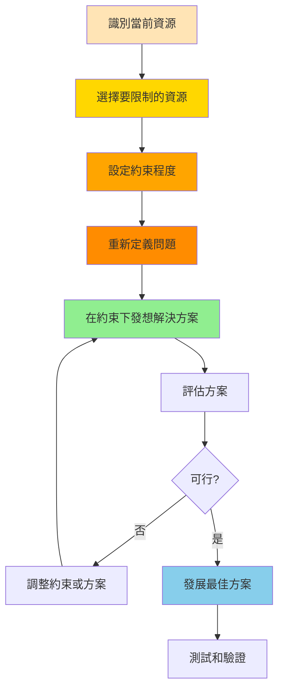

# 資源約束技術 (Resource Constraints)

## 基本資訊

| 項目 | 內容 |
|------|------|
| **技術名稱** | Resource Constraints（資源約束/限制激發創意） |
| **創始人** | 多位創新理論家（包括Adam Morgan、Mark Barden等） |
| **年代** | 概念源於1990年代，2010年代系統化 |
| **類型** | 結構化創意、逆向思考 |
| **難度** | ⭐⭐ 中等 |
| **人數** | 3-15人 |
| **時間** | 45-90分鐘 |
| **適用階段** | 創新突破、問題解決、資源優化 |
| **核心價值** | 化限制為優勢 |

## 技術概述

資源約束技術基於一個反直覺的洞察：**限制往往能激發更大的創造力**。當我們刻意限制資源（時間、金錢、材料、人力等），反而會被迫跳出慣性思維，尋找創新的解決方案。這個技術將限制從障礙轉化為創新的催化劑。

### 核心理念

**「美麗的限制」（Beautiful Constraint）**
- 限制不是障礙，而是機會
- 約束迫使我們質疑假設
- 資源匱乏激發創意思考
- 限制產生聚焦和優先順序

### 理論基礎

**心理學原理**：
- 豐富的資源容易導致思維惰性
- 限制迫使大腦尋找新路徑
- 約束提供明確的創意方向
- 稀缺性激發問題解決動機

**真實案例支持**：
- 西南航空（只用單一機型）
- Twitter（140字符限制）
- Dropbox（病毒式推薦解決行銷預算限制）
- IKEA（平板包裝解決運輸成本）

## 核心流程圖

## 核心原理

### 三種限制類型

#### 1. 資源限制（Resources）
限制物理或財務資源
- 預算減半
- 時間壓縮
- 人力精簡
- 材料限制
- 空間縮減

#### 2. 方法限制（Methods）
限制可使用的方法或工具
- 不能用特定技術
- 禁止某些作法
- 只能用指定工具
- 必須手工製作
- 不能外包

#### 3. 規則限制（Rules）
設定特殊規則或條件
- 必須可持續
- 零浪費
- 無需說明書
- 一個按鈕完成
- 兒童也能用

### 約束的五個層級

**層級1：微調** - 減少10-20%資源
- 溫和的挑戰
- 適合初學者
- 漸進式改進

**層級2：顯著限制** - 減少30-50%資源
- 需要重新思考方法
- 產生創新想法
- 實際可執行

**層級3：極端約束** - 減少70-90%資源
- 迫使根本性創新
- 挑戰基本假設
- 高風險高回報

**層級4：零資源** - 特定資源完全移除
- 最激進的挑戰
- 可能發現新模式
- 需要完全重新想像

**層級5：反轉約束** - 將限制變成要求
- 如：預算限制變成「必須用零預算」
- 問題變成特色
- 缺點變優勢

### 約束激發創意的機制

1. **打破假設**
   - 挑戰「我們一向如此」
   - 質疑「必須」和「不可能」
   - 重新審視核心需求

2. **聚焦核心**
   - 迫使優先排序
   - 識別真正重要的
   - 去除多餘的

3. **激發創造力**
   - 啟動問題解決模式
   - 尋找替代方案
   - 組合現有資源

4. **產生差異化**
   - 別人有資源，我沒有
   - 迫使走不同的路
   - 創造獨特性

## 執行步驟

### 準備階段（15分鐘）

1. **明確當前狀態**
   - 列出所有可用資源
   - 描述當前做法
   - 識別關鍵假設

2. **設定目標**
   - 想要達成什麼？
   - 為什麼需要創新？
   - 成功的標準是什麼？

3. **選擇約束類型**
   - 資源、方法還是規則？
   - 哪種限制最有挑戰性？
   - 哪種最符合目標？

### 執行階段（60-70分鐘）

#### 第一步：設定約束（10分鐘）

**單一約束練習**
選擇一個資源並設定限制：
- 「預算只有原本的10%」
- 「時間只有一半」
- 「不能用網路行銷」
- 「只能用可回收材料」

**多重約束練習**（進階）
同時設定2-3個限制：
- 「預算減半 + 時間減半」
- 「零行銷預算 + 必須病毒式傳播」

#### 第二步：重新框架問題（10分鐘）

在約束下重新定義問題：
- 原問題：「如何推廣新產品？」
- 約束：預算只有$1000
- 新問題：「如何用$1000創造轟動？」

**關鍵問句**：
- 在這個限制下，真正的問題是什麼？
- 我們必須達成什麼核心目標？
- 什麼變得更重要了？

#### 第三步：發想解決方案（30分鐘）

**技巧1：替代思考**（10分鐘）
- 可以用什麼替代缺少的資源？
- 有什麼免費或低成本的替代品？
- 可以用創意取代資金嗎？

**技巧2：槓桿放大**（10分鐘）
- 如何放大現有資源的效果？
- 可以借用或分享什麼？
- 如何用小資源創造大影響？

**技巧3：重新組合**（10分鐘）
- 可以如何重組現有元素？
- 能否改變順序或方法？
- 有什麼意外的組合？

#### 第四步：評估與精煉（15分鐘）

**評估標準**：
1. 確實在約束內可行？
2. 達成核心目標？
3. 有創新性？
4. 可以執行？
5. 帶來意外優勢？

**精煉方案**：
- 選出2-3個最佳方案
- 深入發展細節
- 識別潛在問題
- 調整優化

### 延伸挑戰（可選，15分鐘）

**加碼約束**：
- 在最佳方案上再加一個限制
- 看是否能激發更多創新
- 測試方案的韌性

## 引導提示/問題模板

### 設定約束階段

**資源約束問題**：
- 如果預算只有【原本的X%】會怎樣？
- 如果必須在【時間限制】內完成？
- 如果團隊只有【人數】人？
- 如果材料限制在【特定類型】？
- 如果沒有【某項技術/工具】？

**方法約束問題**：
- 如果不能用【慣用方法】？
- 如果必須【特殊方式】執行？
- 如果禁止【某種做法】？
- 如果只能用【指定工具】？

**規則約束問題**：
- 如果必須符合【特殊要求】？
- 如果要做到【極端標準】？
- 如果不能【某種行為】？
- 如果必須【特定條件】？

### 重新框架階段

**挑戰假設**：
- 我們為什麼認為需要【資源】？
- 這個【資源】真的必須嗎？
- 沒有它會怎樣？
- 有什麼是我們從未質疑的？

**識別核心**：
- 我們真正想達成的是什麼？
- 什麼是絕對必須的？
- 什麼是可以捨棄的？
- 最小可行版本是什麼？

### 發想解決方案階段

**替代思考**：
- 可以用什麼代替【缺少的資源】？
- 有什麼免費的替代方案？
- 能否用創意/時間/人脈替代金錢？
- 自然界/其他產業如何解決類似問題？

**槓桿放大**：
- 如何讓【現有資源】發揮10倍效果？
- 可以借用或共享什麼？
- 能否建立槓桿機制？
- 如何創造病毒式效應？

**重新組合**：
- 可以如何重新排列現有元素？
- 能否改變流程或順序？
- 有什麼意外的組合？
- 可以顛倒或反轉什麼？

### 評估階段

**可行性檢驗**：
- 這真的符合約束條件嗎？
- 是否還需要其他資源？
- 有沒有隱藏成本？
- 可以實際執行嗎？

**效果檢驗**：
- 這能達成目標嗎？
- 效果會比原方案好嗎？
- 有什麼意外好處？
- 長期是否可持續？

## 實際案例

### 案例1：Twitter的140字限制

**約束**：訊息長度限制在140字（後來擴展到280字）

**原因**：
- 技術限制（SMS簡訊限制）
- 資源約束（頻寬和儲存）

**創意結果**：
- 迫使用戶精簡表達
- 創造獨特的溝通風格
- 成為品牌識別特徵
- 激發創意表達（hashtag、縮寫等）

**影響**：
- 限制成為最大特色
- 差異化競爭優勢
- 改變全球溝通方式

### 案例2：Dropbox的成長駭客

**約束**：
- 行銷預算極少
- 與Google、Microsoft等巨頭競爭
- 需要快速增長

**創意解決方案**：
- 推薦獎勵計畫（推薦者和被推薦者都獲得免費空間）
- 用戶成為行銷者
- 產品本身具備分享機制

**結果**：
- 15個月內從100,000增長到4,000,000用戶
- 永久推薦帶來35%的流量
- 行銷成本幾乎為零

### 案例3：IKEA的平板包裝

**約束**：
- 高昂的運輸和儲存成本
- 需要降低價格以競爭
- 保持品質

**創意解決方案**：
- 平板包裝設計
- 客戶自行組裝
- 貨架直接拿貨模式

**結果**：
- 大幅降低物流成本
- 創造獨特的品牌體驗
- 成為核心競爭優勢
- 環保和效率兼具

### 案例4：西南航空的單一機型策略

**約束**：
- 預算有限的新創航空
- 需要降低成本
- 提高效率

**創意解決方案**：
- 只使用Boeing 737機型
- 簡化維修和訓練
- 標準化作業流程

**結果**：
- 降低維護成本
- 提高飛機使用率
- 快速轉機時間（20分鐘）
- 成為最賺錢的航空公司之一

### 案例5：Instagram的最小可行產品

**約束**：
- 小團隊（13人）
- 有限的開發資源
- 市場競爭激烈

**創意解決方案**：
- 從複雜的Burbn砍掉所有功能
- 只保留照片分享核心功能
- 專注做好一件事

**結果**：
- 首日獲得25,000用戶
- 兩個月破100萬用戶
- 最終以10億美元賣給Facebook

## 適用場景

### 最適合的情境

1. **資源受限情況**
   - 預算緊張
   - 時間壓力
   - 人力不足
   - 技術限制

2. **尋求創新突破**
   - 突破慣性思維
   - 尋找差異化
   - 創造競爭優勢
   - 開發新市場

3. **優化和改進**
   - 流程簡化
   - 成本削減
   - 效率提升
   - 永續發展

4. **教育和訓練**
   - 培養創意思維
   - 問題解決能力
   - 韌性和適應力
   - 資源管理

### 不太適合的情境

- 安全或健康相關領域（某些資源不能妥協）
- 需要精確規格的技術項目
- 法規嚴格的產業（限制已經很多）
- 品質是唯一考量的情況

## 注意事項

### 執行要點

1. **選對約束**
   - 選擇有意義的限制
   - 不要隨意限制
   - 考慮實際情境
   - 確保挑戰性但可行

2. **真實執行**
   - 真的遵守約束，不作弊
   - 不要輕易放寬限制
   - 體驗真實壓力
   - 激發真正創意

3. **保持開放**
   - 不預設解決方案
   - 接受意外的想法
   - 挑戰基本假設
   - 允許激進的概念

4. **安全邊界**
   - 不在關鍵領域妥協（安全、品質核心）
   - 設定不可跨越的底線
   - 保護核心價值

### 常見陷阱

1. **假約束**
   - 問題：設定約束但不真實執行
   - 解決：建立檢查機制，確保遵守

2. **過度約束**
   - 問題：限制太多導致無解
   - 解決：從單一約束開始，逐步增加

3. **錯誤領域**
   - 問題：在不該妥協的地方限制
   - 解決：明確區分核心和外圍

4. **過早放棄**
   - 問題：覺得困難就放寬限制
   - 解決：給予足夠時間，鼓勵堅持

5. **忽視可行性**
   - 問題：創意但無法執行
   - 解決：平衡創意和實用性

## 變體與延伸

### 時間盒約束（Time Boxing）

嚴格的時間限制：
- 5分鐘解決方案
- 1小時原型
- 1天MVP
- 1週上線

### 零預算挑戰

完全沒有金錢資源：
- 如何用零預算推出產品？
- 只能用免費資源
- 以物易物
- 創意交換價值

### 單一工具限制

只能使用一種工具或方法：
- 只用紙和筆
- 只用手機
- 只用開源軟體
- 只用回收材料

### 反轉約束

將問題變成特色：
- 「太重」→「有份量感」
- 「需要組裝」→「個人化樂趣」
- 「等待時間」→「期待感」

### 極限挑戰

推到極限：
- 1秒完成
- 1元成本
- 1人團隊
- 1步驟

## 參考資源

### 核心書籍

1. **"A Beautiful Constraint: How To Transform Your Limitations Into Advantages"**
   - 作者：Adam Morgan & Mark Barden
   - 出版：2015
   - 內容：限制激發創新的系統化方法

2. **"Jugaad Innovation: Think Frugal, Be Flexible, Generate Breakthrough Growth"**
   - 作者：Navi Radjou, Jaideep Prabhu, Simone Ahuja
   - 出版：2012
   - 內容：資源匱乏下的創新智慧

3. **"The Lean Startup"**
   - 作者：Eric Ries
   - 出版：2011
   - 內容：資源受限下的創業方法

4. **"Scarcity: Why Having Too Little Means So Much"**
   - 作者：Sendhil Mullainathan & Eldar Shafir
   - 出版：2013
   - 內容：稀缺性的心理學

### 線上資源

- **Beautiful Constraint官網**：案例研究和工具
- **Constraints Theory**：限制理論相關資源
- **Frugal Innovation Hub**：儉約創新研究
- **Resource Scarcity Blog**：實踐案例分享

### 案例庫

- **Twitter**：140字限制
- **Instagram**：簡化功能
- **Dropbox**：病毒式成長
- **IKEA**：平板包裝
- **西南航空**：單一機型

## 實施檢查清單

### 準備階段
- [ ] 列出當前所有可用資源
- [ ] 識別關鍵假設和慣性做法
- [ ] 設定明確的創新目標
- [ ] 選擇要限制的資源類型
- [ ] 確定約束程度（微調/顯著/極端）
- [ ] 設定不可妥協的底線

### 執行階段
- [ ] 清楚溝通約束條件
- [ ] 重新框架問題
- [ ] 挑戰基本假設
- [ ] 發想替代方案
- [ ] 探索槓桿機制
- [ ] 尋找重組可能
- [ ] 記錄所有想法
- [ ] 評估可行性和效果

### 驗證階段
- [ ] 確認符合約束條件
- [ ] 測試方案可行性
- [ ] 評估創新程度
- [ ] 檢視意外好處
- [ ] 識別潛在風險
- [ ] 規劃執行步驟
- [ ] 設定測試計畫

### 持續優化
- [ ] 監控執行效果
- [ ] 收集反饋
- [ ] 調整優化
- [ ] 記錄學習
- [ ] 分享經驗
- [ ] 尋找新約束機會

---

**技術難度**：⭐⭐ 中等
**建議場景**：資源受限、創新突破、成本優化
**最佳團隊**：5-10人
**推薦頻率**：季度創新挑戰

**相關技術**：
- [SCAMPER方法](./01-scamper-method.md) - 在約束下系統探索
- [六頂思考帽](./02-six-thinking-hats.md) - 全面評估約束方案
- [解決方案矩陣](./06-solution-matrix.md) - 比較不同約束方案

**標籤**：#結構化 #逆向思考 #創意約束 #資源優化 #創新突破

---

## 設計模式與方法論對照

| 相關模式/方法論 | 連結點 | 應用價值 |
|----------------|--------|----------|
| **Beautiful Constraint** | 核心著作 | Adam Morgan系統化的約束創新方法 |
| **Jugaad Innovation (儉約創新)** | 印度創新傳統 | 在資源匱乏中找到解決方案 |
| **Lean Startup** | 資源受限創業 | MVP和快速迭代 |
| **Theory of Constraints (TOC)** | 瓶頸理論 | Goldratt的系統約束管理 |
| **Design Under Constraint** | 設計教育 | 許多設計學院的核心方法 |

**核心洞察**：資源充裕是創意的敵人。當預算無限，你不需要思考；當時間充裕，你會拖延；當人力充足，責任會分散。Twitter的140字限制不是缺陷——它創造了一種新的溝通文化。Instagram從功能複雜的Burbn砍到只剩照片分享，反而成就了獨角獸。約束的魔力在於：它把「什麼都可以做」（癱瘓選擇）變成「在這個框框內什麼最好」（聚焦創意）。最好的約束是那些讓你問「如果不能用慣用方法，我該怎麼辦？」的約束。
