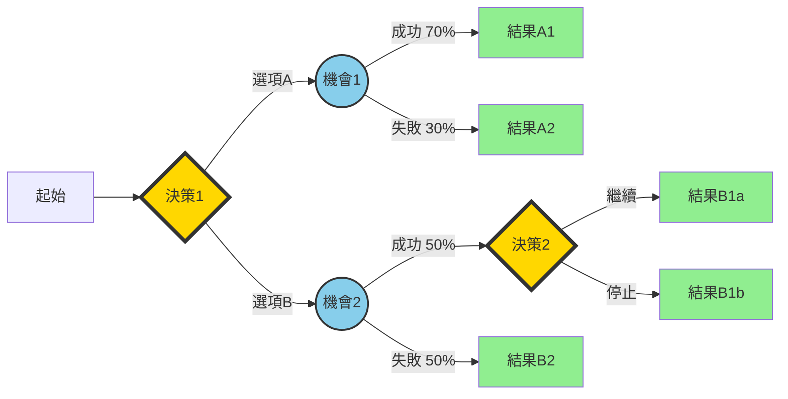

# 決策樹映射技術 (Decision Tree Mapping)

## 基本資訊

| 項目 | 內容 |
|------|------|
| **技術名稱** | Decision Tree Mapping（決策樹映射） |
| **創始人** | 源於決策理論，多位學者貢獻 |
| **年代** | 1960年代系統化 |
| **類型** | 結構化決策、視覺化分析 |
| **難度** | ⭐⭐ 中等 |
| **人數** | 2-10人 |
| **時間** | 60-120分鐘 |
| **適用階段** | 決策制定、風險評估、策略規劃 |
| **核心價值** | 系統化決策、可視化選擇 |

## 技術概述

決策樹映射是一種視覺化的決策分析工具，將複雜的決策過程轉化為樹狀結構圖。通過系統性地展示所有可能的決策路徑、結果和機率，幫助決策者理解每個選擇的後果，做出更明智的決定。

### 核心組成

**決策節點（Decision Node）**
- 方形節點
- 代表需要做出的選擇
- 由決策者控制

**機會節點（Chance Node）**
- 圓形節點
- 代表不確定的事件
- 受外部因素影響

**結果節點（Outcome Node）**
- 三角形或終點
- 代表最終結果
- 通常標註價值或效益

**分支（Branch）**
- 連接節點的線
- 代表可能的選項或事件
- 標註機率或成本

## 核心流程圖



## 核心原理

### 決策樹的構成元素

#### 1. 決策節點（方形 □）
- 代表需要做出的主動選擇
- 由決策者完全控制
- 分支代表可選方案
- 至少有兩個分支

**例子**：
- 是否投資新產品？
- 選擇哪個供應商？
- 進入哪個市場？

#### 2. 機會節點（圓形 ○）
- 代表不確定的外部事件
- 不受決策者控制
- 分支代表可能情況
- 需要標註機率

**例子**：
- 市場反應（好/中/差）
- 競爭對手行動（進入/不進入）
- 經濟狀況（成長/衰退）

#### 3. 終點/結果節點（三角形 △）
- 代表決策路徑的最終結果
- 標註預期價值或效益
- 可以是數字或定性描述

**例子**：
- 獲利 $500,000
- 市占率提升 15%
- 品牌價值提高

#### 4. 分支和機率
- 從決策節點延伸：代表選擇
- 從機會節點延伸：代表事件
- 機會節點的分支需標註機率
- 所有分支機率總和應為100%

### 決策樹分析的步驟邏輯

#### 正向建構（從左到右）
1. 從當前決策點開始
2. 展開所有可能的選擇
3. 對每個選擇，識別不確定因素
4. 繼續展開後續決策和事件
5. 直到所有路徑都到達終點

#### 反向分析（從右到左）
1. 計算每個終點的價值
2. 對機會節點，計算期望值（加權平均）
3. 對決策節點，選擇最佳選項
4. 一路回推到起點
5. 找出最優決策路徑

### 期望值計算

**期望值（Expected Value, EV）**：
```
EV = Σ (機率 × 結果價值)
```

**例子**：
- 成功機率70%，獲利$100萬
- 失敗機率30%，損失$20萬
- 期望值 = 0.7 × $1M + 0.3 × (-$0.2M) = $0.64M

## 執行步驟

### 準備階段（15分鐘）

1. **明確決策問題**
   - 需要做什麼決定？
   - 決策的時間點？
   - 相關的利益關係人？

2. **識別關鍵因素**
   - 有哪些可選方案？
   - 有什麼不確定因素？
   - 需要考慮哪些後果？

3. **準備工具和資料**
   - 白板或大型紙張
   - 不同形狀的便利貼（方形、圓形）
   - 相關數據和資料
   - 計算工具

### 建構階段（45-60分鐘）

#### 第一步：建立起點（5分鐘）

- 在左側建立第一個決策節點
- 清楚標示決策問題
- 確認這是正確的起點

#### 第二步：展開第一層選擇（10分鐘）

- 列出所有可行的選項
- 每個選項一個分支
- 清楚標示選項名稱
- 確保選項互斥且完整

#### 第三步：識別不確定因素（15分鐘）

- 對每個選項，識別關鍵不確定因素
- 加入機會節點
- 列出可能的情況
- 估計機率（如果可能）

**機率估計技巧**：
- 歷史數據
- 專家判斷
- 市場研究
- 情境分析

#### 第四步：繼續展開（20分鐘）

- 對每個分支，繼續展開
- 加入後續決策點
- 加入更多不確定因素
- 直到達到終點

**深度控制**：
- 通常3-5層即可
- 太深會過於複雜
- 聚焦關鍵決策點

#### 第五步：標註結果（10分鐘）

- 對每個終點，標註結果
- 盡可能量化（金額、百分比等）
- 如果無法量化，用描述性評分
- 確保可以比較

### 分析階段（30-45分鐘）

#### 第一步：計算期望值（15分鐘）

**從右到左**：
1. 計算每個終點的價值
2. 對每個機會節點：
   - 計算期望值
   - EV = Σ (機率 × 結果)
3. 將期望值寫在節點上

#### 第二步：選擇最優路徑（10分鐘）

**對每個決策節點**：
1. 比較所有選項的期望值
2. 選擇期望值最高的
3. 標記最優路徑（粗線或顏色）
4. 砍掉次優分支（或用虛線）

#### 第三步：敏感度分析（15分鐘）

**測試假設的穩健性**：
- 改變關鍵機率
- 改變結果估值
- 看最優決策是否改變
- 識別關鍵變數

**例子**：
- 如果成功機率從70%降到60%，決策會改變嗎？
- 如果成本增加20%，還是最優選擇嗎？

#### 第四步：風險評估（10分鐘）

- 識別高風險路徑
- 評估最壞情況
- 考慮風險承受能力
- 制定風險緩解策略

### 決策階段（10分鐘）

1. **做出決策**
   - 基於分析結果
   - 考慮非量化因素
   - 評估實施可行性

2. **規劃執行**
   - 制定行動計畫
   - 分配資源和責任
   - 設定里程碑

3. **設定監控點**
   - 在關鍵機會節點設置檢查點
   - 準備替代方案
   - 建立調整機制

## 引導提示/問題模板

### 建構決策樹

**起始問題**：
- 我們需要做什麼決定？
- 決策的時間點是什麼？
- 誰是決策者？
- 決策的目標是什麼？

**展開選項**：
- 有哪些可能的選擇？
- 還有其他替代方案嗎？
- 「什麼都不做」是選項嗎？
- 這些選項是否互斥？
- 是否涵蓋所有可能？

**識別不確定性**：
- 選擇這個選項後，會發生什麼？
- 有哪些我們無法控制的因素？
- 可能的情況有哪些？
- 每種情況的機率是多少？
- 基於什麼假設？

**深入展開**：
- 然後呢？下一步是什麼？
- 會有後續決策嗎？
- 還會遇到什麼不確定性？
- 這條路徑會到哪裡？
- 何時可以停止展開？

### 評估和分析

**量化結果**：
- 這個結果的價值是多少？
- 如何衡量成功？
- 有什麼成本？
- 有什麼收益？
- 時間框架是什麼？

**機率評估**：
- 這個事件發生的可能性有多大？
- 基於什麼證據？
- 歷史上發生過嗎？
- 專家怎麼看？
- 機率加總是否為100%？

**敏感度分析**：
- 如果這個假設錯了會怎樣？
- 哪些變數最關鍵？
- 需要多大的改變才會影響決策？
- 我們對這個估計有多確定？

**風險考量**：
- 最壞的情況是什麼？
- 我們能承受嗎？
- 如何降低風險？
- 需要備案嗎？
- 風險回報比如何？

## 實際案例

### 案例1：新產品上市決策

**背景**：科技公司考慮是否推出新產品

**決策樹結構**：

```
起點 → [決策] 是否推出新產品？
  ├─ 推出 → (機會) 市場反應
  │   ├─ 成功 (60%) → 獲利 $5M
  │   ├─ 中等 (30%) → [決策] 繼續或停止？
  │   │   ├─ 繼續 → 獲利 $1M
  │   │   └─ 停止 → 損失 $0.5M
  │   └─ 失敗 (10%) → 損失 $2M
  └─ 不推出 → 維持現狀 → $0
```

**分析**：
- 推出的期望值：
  - 0.6 × $5M + 0.3 × $0.5M + 0.1 × (-$2M) = $2.95M
- 不推出的期望值：$0
- **決策：推出新產品**

**敏感度分析**：
- 如果成功機率降到45%，期望值降為$1.9M，仍然值得
- 臨界點：成功機率約30%時，期望值為零

### 案例2：供應商選擇

**背景**：製造商需要選擇供應商

**決策樹**：

```
起點 → [決策] 選擇供應商
  ├─ 供應商A (低成本)
  │   └─ (機會) 品質表現
  │       ├─ 良好 (70%) → 成本節省 $200K
  │       └─ 不良 (30%) → 損失 $500K
  ├─ 供應商B (中等成本)
  │   └─ (機會) 品質表現
  │       ├─ 良好 (90%) → 成本節省 $100K
  │       └─ 不良 (10%) → 損失 $200K
  └─ 供應商C (高成本但可靠)
      └─ 確定結果 → 成本節省 $50K
```

**分析**：
- 供應商A期望值：0.7 × $200K + 0.3 × (-$500K) = -$10K
- 供應商B期望值：0.9 × $100K + 0.1 × (-$200K) = $70K
- 供應商C期望值：$50K
- **決策：選擇供應商B**

### 案例3：職涯決策

**背景**：個人面臨職涯選擇

**決策樹**：

```
起點 → [決策] 職涯選擇
  ├─ 留在現職
  │   └─ (機會) 升遷機會
  │       ├─ 1年內升遷 (40%) → 滿意度 8/10
  │       └─ 未升遷 (60%) → 滿意度 5/10
  ├─ 轉換公司
  │   └─ (機會) 適應狀況
  │       ├─ 適應良好 (60%) → 滿意度 9/10
  │       ├─ 普通 (30%) → 滿意度 6/10
  │       └─ 適應不良 (10%) → 滿意度 3/10
  └─ 創業
      └─ (機會) 事業發展
          ├─ 成功 (20%) → 滿意度 10/10
          ├─ 持平 (50%) → 滿意度 6/10
          └─ 失敗 (30%) → 滿意度 2/10
```

**分析**：
- 留在現職：0.4×8 + 0.6×5 = 6.2
- 轉換公司：0.6×9 + 0.3×6 + 0.1×3 = 7.5
- 創業：0.2×10 + 0.5×6 + 0.3×2 = 5.6
- **建議：轉換公司（但需考慮個人風險偏好）**

## 適用場景

### 最適合的情境

1. **策略決策**
   - 投資決策
   - 市場進入
   - 併購評估
   - 資源分配

2. **產品決策**
   - 新產品開發
   - 產品組合
   - 定價策略
   - 推出時機

3. **營運決策**
   - 供應商選擇
   - 產能擴張
   - 技術採用
   - 外包決策

4. **個人決策**
   - 職涯選擇
   - 教育投資
   - 重大採購
   - 生活規劃

### 不太適合的情境

- 選項和結果太多（過於複雜）
- 無法量化結果
- 機率完全未知
- 需要立即決策（沒時間分析）
- 純粹直覺或情感決策

## 注意事項

### 執行要點

1. **保持簡潔**
   - 不要過度複雜化
   - 聚焦關鍵決策點
   - 通常3-5層足夠

2. **機率要合理**
   - 基於數據或專家判斷
   - 檢查是否加總為100%
   - 記錄假設基礎

3. **結果要可比較**
   - 盡量量化
   - 使用一致的單位
   - 考慮時間價值

4. **持續更新**
   - 決策樹不是靜態的
   - 隨新資訊更新
   - 定期檢視假設

5. **考慮非量化因素**
   - 不是所有東西都能量化
   - 質性因素也重要
   - 期望值不是唯一考量

### 常見陷阱

1. **過度複雜**
   - 問題：樹太大，難以分析
   - 解決：剪枝，聚焦關鍵路徑

2. **機率不準確**
   - 問題：估計過於樂觀或悲觀
   - 解決：尋求多方意見，使用歷史數據

3. **忽視相依性**
   - 問題：假設事件獨立，但實際相關
   - 解決：識別相依關係，調整模型

4. **錨定偏誤**
   - 問題：第一個估計影響後續判斷
   - 解決：獨立估計，再討論調整

5. **忽視實施**
   - 問題：只做分析，不考慮執行
   - 解決：加入實施可行性考量

## 變體與延伸

### 簡化決策樹

只有2-3層的簡單版本：
- 快速決策
- 教學用途
- 初步評估

### 影響圖（Influence Diagram）

決策樹的簡化表示：
- 用節點和箭頭
- 顯示因果關係
- 更簡潔的視覺

### 蒙地卡羅模擬

結合機率模擬：
- 產生多種情境
- 統計分析結果
- 更精確的風險評估

### 多目標決策樹

考慮多個目標：
- 不只是財務
- 環境、社會影響
- 權重不同目標

### 動態決策樹

隨時間演進：
- 多階段決策
- 學習和適應
- 即時調整

## 數位工具

### 專業決策樹軟體

**TreeAge Pro**
- 專業級決策樹工具
- 詳細的統計分析
- 醫療和商業應用
- 付費軟體

**PrecisionTree**
- Excel插件
- 易於使用
- 整合試算表數據
- 付費軟體

**@RISK**
- 風險分析工具
- 蒙地卡羅模擬
- Excel整合
- 付費軟體

### 通用視覺化工具

**Lucidchart**
- 線上圖表工具
- 協作功能
- 模板豐富
- 免費和付費版本

**Draw.io (diagrams.net)**
- 免費開源
- 功能強大
- 多平台支援

**Miro/Mural**
- 協作白板
- 適合團隊討論
- 靈活調整

### 試算表

**Excel/Google Sheets**
- 最靈活
- 自己設計樹狀結構
- 容易計算期望值
- 免費（Google Sheets）

## 參考資源

### 核心書籍

1. **"Decision Analysis for Management Judgment"**
   - 作者：Paul Goodwin & George Wright
   - 出版：2014
   - 內容：決策分析完整指南

2. **"Smart Choices: A Practical Guide to Making Better Decisions"**
   - 作者：John S. Hammond等
   - 出版：1999
   - 內容：實用決策技巧

3. **"Decision Trees and Decision Theory"**
   - 作者：ACCA教材
   - 內容：商業決策樹應用

### 線上資源

- **Mind Tools**：決策樹教學
- **Decision Skills**：案例和工具
- **Harvard Business Review**：決策分析文章
- **YouTube**：決策樹教學影片

### 學術資源

- Decision Analysis Society
- Operations Research學會
- 多所大學的決策分析課程

## 實施檢查清單

### 準備階段
- [ ] 明確定義決策問題
- [ ] 識別所有可行選項
- [ ] 收集相關數據
- [ ] 識別關鍵不確定因素
- [ ] 準備繪圖工具
- [ ] 組織決策團隊

### 建構階段
- [ ] 建立起點決策節點
- [ ] 展開所有選項
- [ ] 加入機會節點
- [ ] 標註機率
- [ ] 繼續展開至終點
- [ ] 標註所有結果價值
- [ ] 檢查完整性

### 分析階段
- [ ] 計算所有期望值
- [ ] 識別最優路徑
- [ ] 進行敏感度分析
- [ ] 評估風險
- [ ] 考慮非量化因素
- [ ] 記錄關鍵假設

### 決策階段
- [ ] 做出最終決策
- [ ] 規劃執行計畫
- [ ] 設定監控點
- [ ] 準備應變方案
- [ ] 溝通決策和理由
- [ ] 設定檢討機制

---

**技術難度**：⭐⭐ 中等
**建議場景**：策略決策、風險評估、複雜選擇
**最佳團隊**：3-8人
**推薦頻率**：重大決策時使用

**相關技術**：
- [六頂思考帽](./02-six-thinking-hats.md) - 可用不同帽子評估各路徑
- [解決方案矩陣](./06-solution-matrix.md) - 互補的評估工具
- [心智圖技術](./03-mind-mapping.md) - 前期發想可用心智圖

**標籤**：#結構化 #決策分析 #視覺化 #風險評估 #系統思考

---

## 設計模式與方法論對照

| 相關模式/方法論 | 連結點 | 應用價值 |
|----------------|--------|----------|
| **Expected Value Theory** | 期望值計算 | 機率加權的結果評估 |
| **Game Theory** | 策略決策 | 考慮對手反應的決策 |
| **Monte Carlo Simulation** | 機率模擬 | 用模擬測試決策穩健性 |
| **Influence Diagrams** | 因果關係圖 | 決策樹的簡化版本 |
| **Scenario Planning** | 情境規劃 | 多未來情境的決策考量 |

**核心洞察**：決策樹最大的價值不是計算出「最優選擇」——而是逼迫你把模糊的「感覺」變成明確的「假設」。當你說「這個方案風險太高」，決策樹會問：「多高？30%還是70%？」當你說「成功會賺很多」，它會問：「多少？」這種「量化逼問」不是要你給出精確數字（沒人知道真正的機率），而是要你意識到自己的假設，並測試：如果這個假設錯了10%，結論會改變嗎？最好的決策樹使用者知道：答案不在數字裡，而在數字背後的討論裡。
