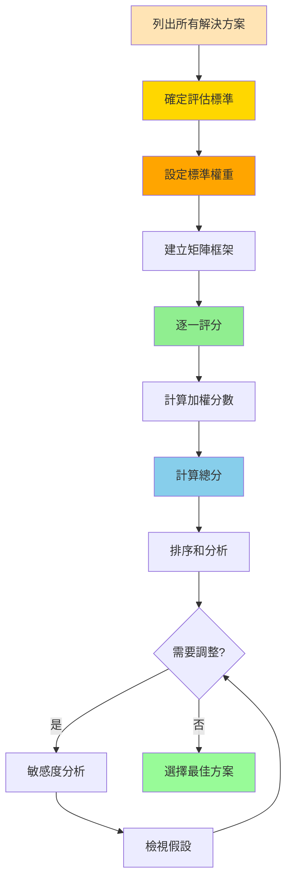

# 解決方案矩陣技術 (Solution Matrix)

## 基本資訊

| 項目 | 內容 |
|------|------|
| **技術名稱** | Solution Matrix（解決方案矩陣/決策矩陣） |
| **創始人** | 源於決策理論，多位學者發展 |
| **年代** | 1960-1970年代系統化 |
| **類型** | 結構化評估、多準則決策 |
| **難度** | ⭐⭐ 中等 |
| **人數** | 3-12人 |
| **時間** | 45-90分鐘 |
| **適用階段** | 方案評估、優先排序、決策制定 |
| **核心價值** | 客觀比較、系統評估 |

## 技術概述

解決方案矩陣是一種系統化的評估工具，將多個解決方案與多個評估標準交叉比較，通過量化打分和權重計算，客觀地選出最佳方案。這個技術特別適合當你有多個可行選項，需要基於多個準則做出決策的情況。

### 基本結構

```
           標準1  標準2  標準3  標準4  總分
權重        30%    25%    25%    20%   100%
─────────────────────────────────────────
方案A        7      8      6      9     7.4
方案B        9      6      8      7     7.6
方案C        6      9      7      8     7.4
方案D        8      7      9      6     7.5
```

### 核心組成

1. **解決方案（行）**：所有候選選項
2. **評估標準（列）**：評估的維度
3. **權重**：每個標準的重要性
4. **評分**：每個方案在每個標準上的表現
5. **加權總分**：綜合評估結果

## 核心流程圖



## 核心原理

### 多準則決策分析（MCDA）

解決方案矩陣基於多準則決策分析理論：

1. **結構化思考**
   - 將複雜決策分解為可管理的部分
   - 系統性地考慮所有因素
   - 避免遺漏重要面向

2. **量化評估**
   - 將主觀判斷轉化為數字
   - 便於比較和溝通
   - 增加決策透明度

3. **權重反映優先順序**
   - 不是所有標準同等重要
   - 明確價值取向
   - 符合組織目標

4. **綜合考量**
   - 沒有完美方案
   - 權衡取捨
   - 找到最平衡的選擇

### 評分系統

#### 常用評分尺度

**1-5分制**（簡單）
- 1 = 非常差
- 2 = 差
- 3 = 普通
- 4 = 好
- 5 = 非常好

**1-10分制**（精細）
- 1-2 = 非常差
- 3-4 = 差
- 5-6 = 普通
- 7-8 = 好
- 9-10 = 非常好

**1-3分制**（快速）
- 1 = 低
- 2 = 中
- 3 = 高

#### 權重設定方法

**百分比法**
- 總和為100%
- 直覺易懂
- 例：30%, 25%, 25%, 20%

**分數法**
- 總分配固定分數（如100分）
- 靈活分配
- 例：30, 25, 25, 20

**對比法**
- 兩兩比較標準重要性
- 更精確
- 需要更多時間

### 加權計算

**基本公式**：
```
方案總分 = Σ (標準權重 × 方案在該標準的分數)
```

**例子**：
```
方案A總分 = (0.3 × 7) + (0.25 × 8) + (0.25 × 6) + (0.2 × 9)
          = 2.1 + 2.0 + 1.5 + 1.8
          = 7.4
```

## 執行步驟

### 準備階段（15-20分鐘）

#### 第一步：列出解決方案（5分鐘）

**方法**：
- 腦力激盪收集所有選項
- 合併重複或相似方案
- 確保方案互斥
- 通常3-7個方案最適合

**檢查**：
- [ ] 選項是否清楚定義？
- [ ] 是否涵蓋主要可能性？
- [ ] 是否實際可行？
- [ ] 數量是否適中？

#### 第二步：確定評估標準（10分鐘）

**常見標準類別**：

**財務標準**
- 成本
- 投資回報率（ROI）
- 回收期
- 淨現值（NPV）

**時間標準**
- 實施時間
- 見效速度
- 持續時間
- 緊急性

**品質標準**
- 效果
- 可靠性
- 持久性
- 使用者滿意度

**風險標準**
- 實施風險
- 技術風險
- 市場風險
- 可逆性

**策略標準**
- 與目標一致性
- 長期價值
- 競爭優勢
- 品牌影響

**實施標準**
- 可行性
- 資源需求
- 組織準備度
- 利益關係人支持

**選擇標準的原則**：
- 相關性：與決策目標直接相關
- 獨立性：標準之間盡量不重疊
- 可衡量性：能夠評分
- 完整性：涵蓋所有重要面向
- 數量適中：通常4-8個標準

#### 第三步：設定權重（5分鐘）

**方法A：直接分配**
1. 分配100%給所有標準
2. 最重要的標準權重最高
3. 檢查總和是否為100%

**方法B：排序法**
1. 排列標準重要性順序
2. 根據順序分配權重
3. 調整到100%

**方法C：對比法**（更精確但耗時）
1. 兩兩比較標準
2. 記錄哪個更重要
3. 計算相對權重

**權重檢查**：
- [ ] 總和是否為100%？
- [ ] 是否反映真實優先順序？
- [ ] 有沒有某項過高或過低？
- [ ] 團隊是否有共識？

### 執行階段（30-45分鐘）

#### 第一步：建立矩陣（5分鐘）

**在白板或試算表上**：
- 行：列出所有方案
- 列：列出所有標準
- 頂端：標註權重
- 右側或底端：總分欄

#### 第二步：評分（25-35分鐘）

**方式A：逐列評分**（按標準）
- 選一個標準
- 評估所有方案在此標準的表現
- 移到下一個標準
- 優點：一致性高

**方式B：逐行評分**（按方案）
- 選一個方案
- 評估其在所有標準的表現
- 移到下一個方案
- 優點：全面了解每個方案

**評分技巧**：
1. **定義評分意義**
   - 對每個標準，明確1-5分代表什麼
   - 例如「成本」：1=很貴，5=很便宜

2. **使用參考點**
   - 先評最好和最差的
   - 其他相對評分
   - 保持一致性

3. **團隊共識**
   - 討論分歧
   - 使用數據支持
   - 必要時投票

4. **記錄理由**
   - 重要評分註記原因
   - 便於後續檢視
   - 增加可信度

#### 第三步：計算總分（5分鐘）

**手動計算**：
```
方案A總分 = Σ (權重 × 評分)
```

**試算表公式**：
```
=SUMPRODUCT(權重範圍, 評分範圍)
```

**檢查**：
- [ ] 計算是否正確？
- [ ] 所有方案都有總分？
- [ ] 分數範圍合理？

### 分析階段（15-25分鐘）

#### 第一步：排序和比較（5分鐘）

- 依總分排序
- 識別前三名
- 觀察分數差距
- 標記明顯優勝者

#### 第二步：深入分析（10分鐘）

**檢視模式**：
- 哪個方案得分最高？
- 差距明顯還是接近？
- 有方案在某些標準特別突出？
- 有方案在某些標準特別弱？

**風險評估**：
- 最高分方案的弱點在哪？
- 次高分方案有何優勢？
- 是否有「致命缺陷」？

#### 第三步：敏感度分析（10分鐘）

**測試穩健性**：

1. **改變權重**
   - 如果某標準權重+10%，結果會改變嗎？
   - 哪些標準最關鍵？

2. **改變評分**
   - 如果某方案某標準+1分，會超越其他嗎？
   - 需要多大改變才會影響排名？

3. **情境分析**
   - 樂觀情境：所有不確定因素往好的方向
   - 悲觀情境：往壞的方向
   - 排名是否仍穩定？

## 引導提示/問題模板

### 建立階段

**列出方案**：
- 我們有哪些可能的解決方案？
- 還有其他選項嗎？
- 「什麼都不做」也是選項嗎？
- 可以組合不同方案嗎？

**確定標準**：
- 評估這些方案時，什麼最重要？
- 我們最在意什麼？
- 有什麼不可妥協的？
- 利益關係人看重什麼？
- 還有遺漏的考量嗎？

**設定權重**：
- 如果只能選一個標準，是哪個？
- 【標準A】和【標準B】，哪個更重要？
- 這個權重分配反映我們的優先順序嗎？
- 所有人都同意嗎？

### 評分階段

**評估問題**：
- 這個方案在【標準】上表現如何？
- 與其他方案比較，哪個更好？
- 評分的依據是什麼？
- 有數據支持嗎？
- 我們對這個評分有多確定？

**共識建立**：
- 大家都同意這個分數嗎？
- 誰有不同看法？
- 可以分享你的理由嗎？
- 有額外資訊需要考慮嗎？

### 分析階段

**結果討論**：
- 這個結果符合預期嗎？
- 有什麼驚訝的發現？
- 最高分方案感覺對嗎？
- 有什麼疑慮嗎？

**敏感度測試**：
- 如果【權重】改變，結果會變嗎？
- 哪個標準最關鍵？
- 需要多大的改變才會影響決策？
- 我們對這些假設有多確定？

## 實際案例

### 案例1：CRM系統選擇

**背景**：中型企業選擇CRM系統

**方案**：
- Salesforce
- HubSpot
- Zoho CRM
- 自建系統

**評估標準和權重**：
- 功能完整性（30%）
- 成本（25%）
- 易用性（20%）
- 整合能力（15%）
- 供應商支持（10%）

**矩陣**：

|           | 功能30% | 成本25% | 易用20% | 整合15% | 支持10% | 總分 |
|-----------|---------|---------|---------|---------|---------|------|
| Salesforce|    9    |    3    |    7    |    9    |    9    | 7.1  |
| HubSpot   |    7    |    7    |    9    |    7    |    8    | 7.5  |
| Zoho CRM  |    6    |    9    |    8    |    6    |    7    | 7.2  |
| 自建系統  |    8    |    4    |    6    |    10   |    5    | 6.7  |

**計算範例（HubSpot）**：
```
總分 = 7×0.3 + 7×0.25 + 9×0.2 + 7×0.15 + 8×0.1
     = 2.1 + 1.75 + 1.8 + 1.05 + 0.8
     = 7.5
```

**決策**：選擇 HubSpot
- 最高總分
- 成本和易用性平衡
- 適合中型企業

**敏感度分析**：
- 如果「成本」權重降到15%，Salesforce會領先
- 但團隊認為成本控制很重要，維持25%權重

### 案例2：辦公室選址

**方案**：
- A區（市中心）
- B區（商業區）
- C區（郊區）
- 遠端辦公

**標準和權重**：
- 租金成本（35%）
- 通勤便利性（25%）
- 周邊設施（15%）
- 形象與客戶接近性（15%）
- 空間大小（10%）

**矩陣**：

|        | 租金35% | 通勤25% | 設施15% | 形象15% | 空間10% | 總分 |
|--------|---------|---------|---------|---------|---------|------|
| A區    |    3    |    9    |    9    |    9    |    5    | 6.4  |
| B區    |    6    |    7    |    7    |    7    |    7    | 6.7  |
| C區    |    9    |    4    |    5    |    4    |    9    | 6.6  |
| 遠端   |   10    |    8    |    6    |    3    |   10    | 7.8  |

**決策**：遠端辦公
- 在疫情後背景下得分最高
- 大幅節省成本
- 但需要考慮團隊文化影響（非量化因素）

**最終決定**：採用混合模式
- 在B區租小型辦公室
- 允許彈性遠端
- 平衡成本和團隊凝聚力

### 案例3：個人筆電選購

**方案**：
- MacBook Pro
- Dell XPS
- ThinkPad X1
- Surface Laptop

**標準**：
- 價格（30%）
- 性能（25%）
- 便攜性（20%）
- 電池續航（15%）
- 作業系統偏好（10%）

**結果**：根據個人需求和權重，選出最適合的筆電

## 適用場景

### 最適合的情境

1. **採購決策**
   - 供應商選擇
   - 設備採購
   - 軟體選型
   - 服務提供商

2. **策略選擇**
   - 市場進入策略
   - 產品組合
   - 投資項目
   - 合作夥伴

3. **專案評估**
   - 專案優先排序
   - 資源分配
   - 提案評選
   - 概念篩選

4. **個人決策**
   - 工作機會比較
   - 重大採購
   - 教育選擇
   - 居住地選擇

### 不太適合的情境

- 只有一兩個選項
- 標準很難量化
- 需要立即決策
- 選項差異極大（明顯優劣）
- 純粹情感或直覺決策

## 注意事項

### 執行要點

1. **標準要獨立**
   - 避免重複計算
   - 檢查相關性
   - 必要時合併

2. **評分要一致**
   - 統一評分尺度
   - 明確分數意義
   - 全程保持一致

3. **權重要反映價值**
   - 真實反映重要性
   - 徵詢利益關係人
   - 記錄設定理由

4. **保持客觀**
   - 基於事實和數據
   - 避免個人偏見
   - 團隊共同評分

5. **補充定性分析**
   - 數字不是全部
   - 考慮無形因素
   - 直覺和經驗也重要

### 常見陷阱

1. **標準太多**
   - 問題：超過10個標準，過於複雜
   - 解決：合併相關標準，聚焦關鍵

2. **權重不當**
   - 問題：所有標準權重相同
   - 解決：花時間討論真實重要性

3. **評分不客觀**
   - 問題：基於偏好而非事實
   - 解決：要求提供評分依據

4. **忽視敏感度**
   - 問題：沒檢驗結果穩健性
   - 解決：測試關鍵假設的影響

5. **機械式應用**
   - 問題：完全依賴數字，忽視判斷
   - 解決：數字輔助決策，不取代決策

6. **群體思維**
   - 問題：為了共識而妥協評分
   - 解決：鼓勵不同意見，記錄分歧

## 變體與延伸

### 優先順序矩陣

簡化版，只用2個標準：
- 橫軸：影響力
- 縱軸：可行性
- 四個象限分類方案

### Pugh矩陣

使用基準方案：
- 選一個方案作為基準（0分）
- 其他方案與之比較（+1, 0, -1）
- 計算相對優劣

### 加權評分模型（WSM）

更精細的數學模型：
- 標準化分數
- 更複雜的權重方法
- 統計分析

### 層級分析法（AHP）

多層級的決策矩陣：
- 標準可以有子標準
- 兩兩對比法設定權重
- 更嚴謹但更耗時

### 視覺化矩陣

用顏色和圖標：
- 紅黃綠表示高中低
- 更直覺易懂
- 適合簡報呈現

## 數位工具

### 試算表（推薦）

**Excel / Google Sheets**
- 最靈活和常用
- 容易計算和調整
- 可以做敏感度分析
- 免費（Google Sheets）

**模板功能**：
- 自動計算總分
- 條件格式化（顏色標示）
- 圖表視覺化
- 敏感度分析

### 專業決策工具

**1000Minds**
- 線上決策工具
- 互動式權重設定
- 協作功能

**Criterium DecisionPlus**
- 專業決策軟體
- AHP和其他方法
- 詳細報告

### 協作平台

**Airtable**
- 類似試算表但更強大
- 多視圖（表格、看板等）
- 協作友善

**Notion**
- 靈活的資料庫
- 可建立自訂矩陣
- 整合筆記和任務

### 視覺化工具

**Miro / Mural**
- 視覺化白板
- 適合工作坊
- 即時協作

## 參考資源

### 核心書籍

1. **"Decision Matrix Analysis"** - 各種商業書籍章節
2. **"Smart Choices"** - Hammond, Keeney, Raiffa（包含矩陣方法）
3. **"The Checklist Manifesto"** - Atul Gawande（結構化決策）

### 線上資源

- **Mind Tools**：決策矩陣詳細指南
- **ASQ**（美國品質學會）：Pugh矩陣教學
- **Harvard Business Review**：決策工具文章
- **YouTube**：大量教學影片和案例

### 模板資源

- Excel/Google Sheets模板庫
- Miro模板
- Notion模板
- Airtable基礎模板

## 實施檢查清單

### 準備階段
- [ ] 列出所有候選方案（3-7個）
- [ ] 確定評估標準（4-8個）
- [ ] 確保標準相互獨立
- [ ] 設定標準權重（總和100%）
- [ ] 團隊對權重達成共識
- [ ] 準備矩陣工具（試算表或白板）

### 評分階段
- [ ] 定義評分尺度（1-5或1-10）
- [ ] 明確每個標準的評分意義
- [ ] 逐一評估每個方案
- [ ] 要求提供評分依據
- [ ] 記錄重要假設和理由
- [ ] 團隊討論並達成共識

### 計算階段
- [ ] 計算每個方案的加權總分
- [ ] 檢查計算正確性
- [ ] 依總分排序方案
- [ ] 標示前三名
- [ ] 觀察分數差距

### 分析階段
- [ ] 檢視結果是否合理
- [ ] 進行敏感度分析
- [ ] 測試關鍵假設影響
- [ ] 識別最佳方案的弱點
- [ ] 考慮非量化因素
- [ ] 記錄分析洞察

### 決策階段
- [ ] 做出最終選擇
- [ ] 記錄決策理由
- [ ] 規劃實施計畫
- [ ] 溝通決策和依據
- [ ] 設定檢討機制
- [ ] 保存矩陣記錄供未來參考

---

**技術難度**：⭐⭐ 中等
**建議場景**：方案評估、優先排序、採購決策
**最佳團隊**：4-10人
**推薦頻率**：重要決策時使用

**相關技術**：
- [決策樹映射](./05-decision-tree-mapping.md) - 互補的決策分析工具
- [六頂思考帽](./02-six-thinking-hats.md) - 可用不同帽子評估標準
- [SCAMPER方法](./01-scamper-method.md) - 產生方案後用矩陣評估

**標籤**：#結構化 #多準則決策 #系統評估 #優先排序 #客觀比較
